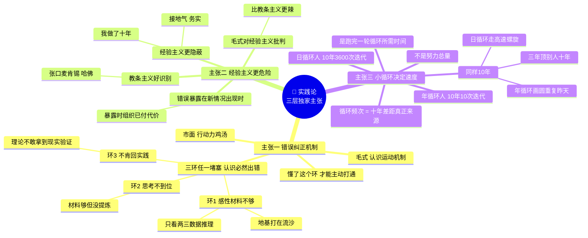
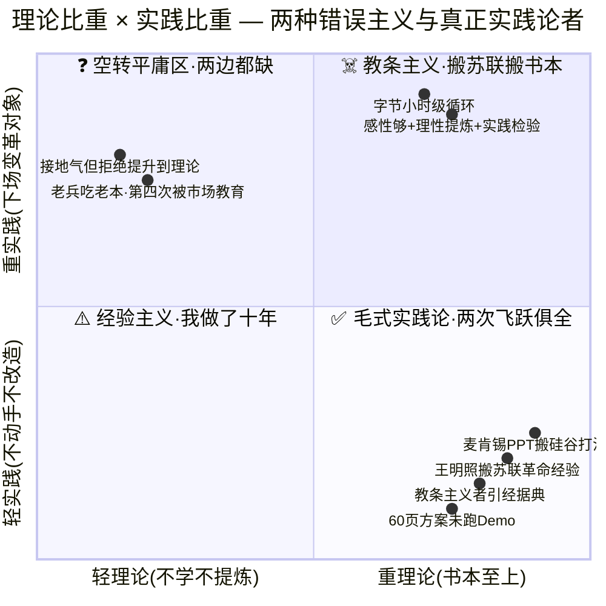
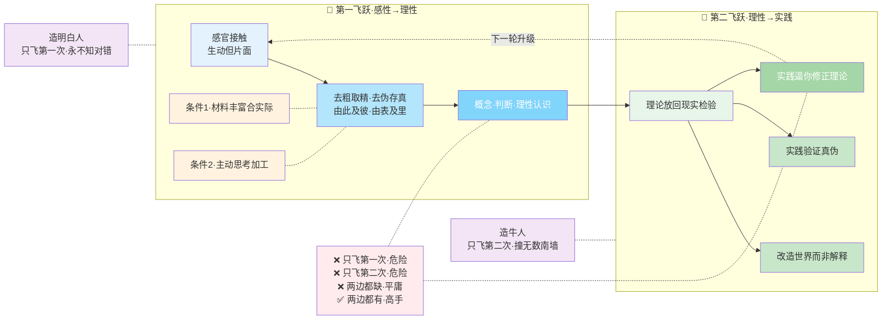
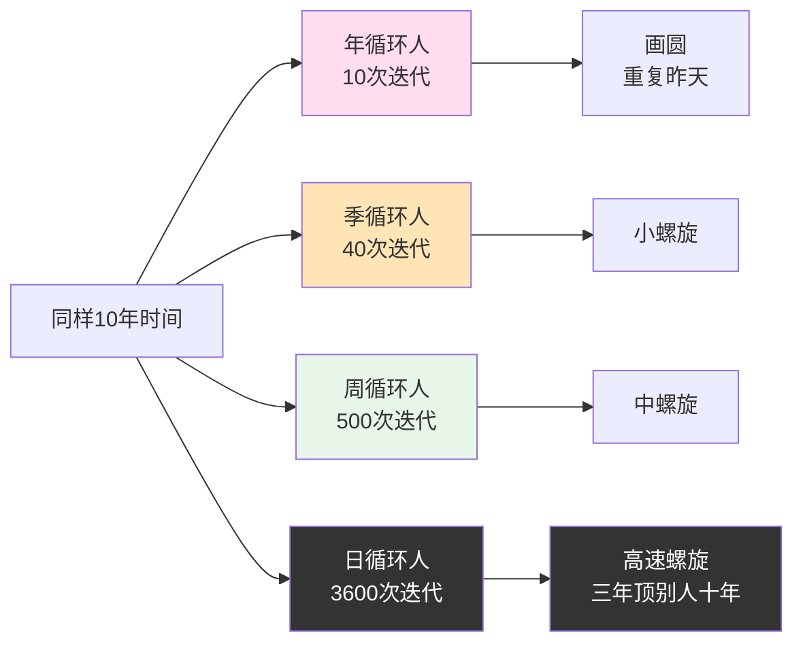
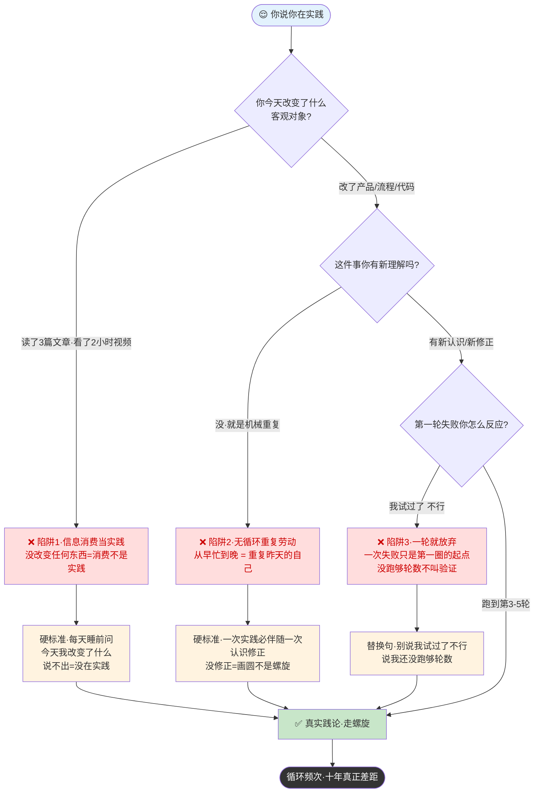
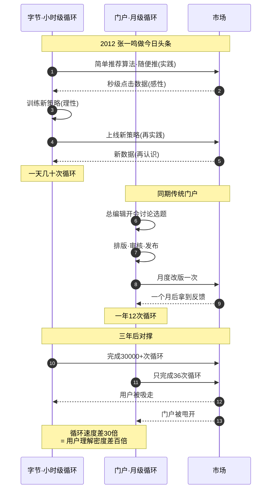

# 08.科学方法实践论

- 01.六十页方案稿
- 02.市面误读之辨
- 03.三层独家主张
- 04.一九三七现场
- 05.原文四维精读
- 06.实践第一性
- 07.两次飞跃辨析
- 08.第二飞跃为重
- 09.螺旋上升循环
- 10.两种主义批判
- 11.三个认知陷阱
- 12.一个商业切片
- 13.三年认知复利
- 14.收束三句金言

## 01.六十页方案稿

前年我负责一个技术中台项目，前三周只做一件事，写方案：Day1 画架构图，Day7 写 API 规范，Day21 方案文档 60 页、37 张图。我兴奋地给老板讲："这方案完美，上线后每天省 300 人时！"

老板只问了一句："你试过了吗？"我愣了，没试过。他说了一句话让我记了三年：**"没在代码里跑过一遍的方案，不算方案。"**

我硬着头皮写 Demo，两天后发现核心假设是错的，数据库根本不支持我设计的那种查询。60 页方案一夜作废。那周末翻开《实践论》，看到一句："**你要知道梨子的滋味，你就得变革梨子，亲口吃一吃。**"

我就是那个没吃过梨却写了 60 页梨子营销报告的人。认识要从感性到理性、再从理性回到实践，我跳过了"感性"环节，直接幻想一个理性结论，结论当然是空中楼阁。

从此立了条规矩：**任何方案写到 5 页之前，先跑一个最小 Demo。先尝一口梨子再说。**

## 02.市面误读之辨

市面上讲《实践论》的人，最爱引用的就是这一句："实践是检验真理的唯一标准。"然后配一段"所以我们要多动手、少空想"。这种讲法有两个硬伤：

**第一，它把实践论讲成了"行动力鸡汤"**。真正的《实践论》不是在鼓励你"多做事"，而是在回答一个更结构性的问题，**认识是怎么产生的？认识和行动之间的转换机制是什么？错误认识是怎么产生的、又怎么被纠正的？** 这是认识论，不是励志学。

**第二，它把"实践"二字讲成了"动手"**。实际上毛泽东讲的"实践"有严格的定义，**它是"变革对象"的行动，不是"接触对象"的行动**。你坐在办公室看 100 份用户调研报告，那不叫实践，那叫信息消费。你亲自去改一版产品、把它推到用户面前看反应，那才叫实践。**区别在于你有没有"改变"什么**。

为什么这种"行动力鸡汤"的解读最流行？因为它**最安全**。说"要多动手、少空想"不会得罪任何人，也不需要作者自己有过 60 页方案被推翻的体验。读者读完点头如捣蒜，第二天合上书继续在收藏夹里囤课。**这种"读了等于没读"的体验，是市面书的核心商业模式**，让你觉得自己懂了，但其实什么都没改变。

真正能改变行为的解读，必须做两件市面书不愿做的事：**第一，给出可操作的判断句**（如"我这个动作改变了什么"）；**第二，承认实践要付的心理代价**（推翻自己过去几个月的工作）。这两件事都让作者显得"不优雅"，所以市面书选择回避。

## 03.三层独家主张

这篇文章想讲的《实践论》完全不同。我想讲三层市面很少讲的东西：

实践论是一套"**错误如何产生与纠正**"的机制，它告诉你，人类犯错不是因为笨，是因为认识运动卡在了某一环；懂了这个环，你才能主动打通。

第一环是"感性材料不够"，你只看了两三个数据就开始推理，地基打在流沙上；第二环是"思考不到位"，感性材料够了但没经过加工提炼；第三环是"不肯回到实践"，理论已经长出来但你不敢拿到现实里去验证。**这三环只要一处堵了，认识就必然出错**。

实践论最狠的一刀不是砍向"空想家"，而是砍向"**经验主义者**"，就是那些自诩"我做了十年"的人。

毛泽东对经验主义的批判，比对教条主义更辣。原因很简单，**经验主义更隐蔽、更常见**。教条主义者你一眼就能看出来（他张口闭口"麦肯锡说""哈佛说"），而经验主义者表面上"接地气""务实"，他的错误要等到下一次新情况出现时才会暴露。但暴露的时候，组织已经付了代价。

实践论真正的应用不是"动手"，是"**小循环**"，一个完整的"感性→理性→实践→再认识"循环，越小越快越好。**决定你成长速度的，不是你努力的总量，是你跑完一轮循环所需的时间**。

三层独家主张思维图（错误纠正机制 · 经验主义更险 · 小循环最短）：

## 04.一九三七现场

《实践论》写于 1937 年 7 月，和《矛盾论》姊妹双生。表面上它是一篇哲学论文，实际上它是毛泽东向党内**两种致命思潮**宣战的檄文，**教条主义**（以王明为代表）和**经验主义**。

这两拨人当时正在党内各占一方。教条主义者搬苏联、搬书本、不看中国；经验主义者靠过去的零散战役经验、不愿提升到理论。**毛泽东意识到：如果不从哲学高度彻底清算这两种思潮，中国革命随时会被它们断送**。

很多人第一次读《实践论》会把它当成一篇"哲学论文"，读完点头说"很有道理"，然后合上书继续生活。**这是把它彻底读浅了**。《实践论》的真身不是学术，是作战。它回答的是：**在一个矛盾剧烈、信息残缺、对手强大的环境里，一个组织如何保证自己的判断不断修正、不断接近真相？**

**为什么这篇文章在企业战略圈这么吃香，不是因为它"哲学深刻"，是因为它给出了人类至今为止最硬的一套"在迷雾中决策"的操作系统**：先承认所有判断都不可信→拿到现场去跑→根据反馈修正→再跑→再修正，直到把"未知"变成"已知"。

读《实践论》最容易的错位就是把它当"道理"，**它不是道理，是动作清单**。每一段后面都有一个隐含的"具体怎么做"，读不出那个动作的人，等于没读。

读《实践论》的副标题是"**论认识和实践的关系，知和行的关系**"。这个副标题有两层用意。第一层，是向中国传统哲学宣战，从朱熹的"知先行后"到王阳明的"知行合一"，中国人吵了八百年"知行"问题，始终停留在道德修养层面。毛泽东把它拉到**认识论**层面：不是"怎么做君子"，而是"怎么认识世界"。第二层，是向党内投下一颗思想炸弹，**只有"知"没有"行"的是教条主义；只有"行"没有"知"的是经验主义；两者割裂开都会导致革命失败**。

## 05.原文四维精读

下面是《实践论》最硬核的四段原文，我从**根源、双飞、试金、螺旋**四个维度拆透。

**根源。** 一切这些知识，离开生产活动是不能得到的。毛泽东做了一个决绝判断：**所有知识根源都是人类的生产活动，没有例外。** 反共识：今天很多人相信读书可以代替实践，你读了一百本管理书没带过人，你就不懂管理。间接经验只有落到你自己的实践里才变成知识，否则只是信息。

**双飞。** 认识的能动作用，不但表现于从感性的认识到理性的认识之能动的飞跃，更重要的还须表现于从理性的认识到革命的实践这一个飞跃。两个飞跃中毛泽东特别强调**第二飞跃更重要**。反共识：大多数人把"我想明白了"当终点，但想明白只是半成品，没回到实践检验，你根本不知道自己是真明白了还是假明白了。第二飞跃是真伪的试金石。

**试金。** 要完全地解决这个问题，只有把理性的认识再回到社会实践中去，**看它是否能够达到预想的目的**。理论的真伪**在认识内部无法判断**，只能靠实践。反共识：**你多聪明、多博学，都不能保证判断是对的。** 你的聪明是有风险的，实践是唯一的风险对冲。

**螺旋。** 实践、认识、再实践、再认识，这种形式，循环往复以至无穷，而实践和认识之每一循环的内容，都比较地进到了高一级的程度。认识不是一次完成，是循环的、螺旋上升的。反共识：今天流行的"认知升级"话术让人错觉"升级一次就永远高维了"，**没有永久的高维，今天的认知放到新的实践里很可能被打脸。认知是动词，不是名词。**

四维原文与两次飞跃的关系，一图串起：

教条主义 vs 经验主义象限——两种错误认识的坐标：

## 06.实践第一性

**认识不是天上掉下来的，是从实践中长出来的。** 对新领域，过去所有经验都不算数，跨行业迁移难十倍，因为你迁移的只是理性认识，**底层感性认识不可迁移**，必须重新泡出来。

这直接砍向"唯理论"和"天才论"，两者都给懒于动手的人发了体面通行证："我不去现场不是懒惰，是我聪明、我能想清楚。"毛泽东一刀封喉：**所有真知都来自实践，没有例外。** 一个从不带团队的管理顾问不可能给出有效建议，一个闭门造车的产品经理不可能设计出用户热爱的产品。**这一刀砍掉了大半个咨询行业和绝大多数"知识网红"的根基。**

实战价值：**遇到口若悬河、引经据典的人，先问一句"这件事你自己干过几次？"** 干过 0 次的人讲得再漂亮也是二手知识；干过 10 次以上的人，讲得再笨拙都值得听完。加一个残酷版：**没干过的人不可能教会干的人**，学销售找一线老兵，学产品找跑过 PMF 的负责人，实践产生的知识只能由实践过的人传递，隔一手最多传给你 30%。

举个例子：你听过一百场"如何做用户增长"的分享，笔记记了厚厚一本。但你的产品 DAU 纹丝不动。不是分享的人讲错了，是**你没做过，你只是在消费他的实践结果，不是在做你自己的实践。** 直到你自己动手跑了第一个增长实验，你才知道"他在讲台上说'只要发个 push 就行'，是因为他的用户基数一千万，发 push 天然有效；而你的用户才两万，发 push 等于没发。"

"你要知道梨子的滋味，你就得变革梨子，亲口吃一吃。" 不是看梨子、不是读梨子的书，是**把梨子吃进嘴里消灭掉**。**实践 = 改变对象的行动。** 每天睡前问一句：**我今天改变了什么？** 没改变，就没在实践。

## 07.两次飞跃辨析

这是《实践论》的核心贡献：毛泽东将人类认识过程概括为两个能动的飞跃。

**第一飞跃：感性→理性。** 感官接触产生感觉印象（生动但片面），再对材料"去粗取精、去伪存真、由此及彼、由表及里"，提炼出概念和判断。两个条件：感性材料必须**十分丰富且合于实际**，再加**主动思考加工**。很多人只看两个数据就问三个人开始推理，地基打在流沙上。

**第二飞跃：理性→实践。** 把理论放回现实检验。毛泽东三条硬理由：认识的根本目的是改造世界而非解释；理论真伪只能实践验证；实践会逼你修正和发展理论。**第一飞跃让你想清楚，第二飞跃让你验证、迭代、长出真东西。** 前者造明白人，后者造牛人。

很多人把两次飞跃当两级台阶，爬完一级再爬一级。但毛泽东的原意是**两条互相依赖的腿**：理性依赖感性（否则无源之水），感性必须发展到理性（否则老兵不升级被淘汰），割裂任一端就是残废，只飞第一次停在半空想，永不知对错；只飞第二次蛮干瞎闯，撞无数南墙。**两边都缺是平庸，只缺一边是危险，两边都有才是高手。**

举个简洁的例子：你想验证"用户愿意为这个功能付费"。第一飞跃是发问卷、做访谈、看竞品，提炼出判断，"高收入用户愿意付费"。第二飞跃是把判断做成最小付费按钮推到用户面前，看点击率和转化。如果转化远低预期，不是结论错了，是你没跑第二飞跃之前**根本不知道自己对没对**。跑完，你对"用户付费"的理解才真正属于你。

**最终标准**：真高手能在两次飞跃之间反复横跳，动手积感性，思考炼理性，理性导动作，动作再修正理性。配合越紧密，迭代越快。这就是"循环往复以至无穷，每一循环都进到高一级的程度"。

两次飞跃——两条互相依赖的腿·缺一即残：

## 08.第二飞跃为重

这一节单独拿出来讲，因为**它是整个《实践论》最被忽视、也最有杀伤力的一段**。

**解释世界和改造世界，在人类所有智力活动里是两条分岔路**。

解释世界的人做的是"**闭环模型**"：把一个现象用一套自洽的理论圆上，圆上了就觉得自己懂了。这是大多数学者、分析师、评论员做的事。

改造世界的人做的是"**开环验证**"：把理论推到现实里，看能不能改变一个结果。改变了才算数，没改变就必须重来。

毛泽东选边站的是后者。他一生做的所有事，打仗、建党、治国，没有一件是"解释世界"，全是"改造世界"。这也是为什么他的哲学读起来特别"硬"，**它不是用来沉思的，是用来下场的**。

这句话的威力在于，**它把真理的裁判权从"权威"、"多数"、"逻辑"手里夺走，交给了现实**。

所以下一次你和别人争论某个判断的对错，不要再陷入"我的逻辑更完整"或"谁学历更高"这类争论。**正确的姿势是：这个判断如果对，现实里应该出现什么可观察的结果？让我们去跑一下**。这就是"证伪心态"，科学史上最革命的一种思维方式。

新情况、新问题不断出现。**今天正确的结论，明天可能就是谬误**。这一条是对"经验主义"的致命打击，**你过去的经验再牛，也不是现在判断的根据；它只是一个参考，必须在新的实践中重新被验证**。

## 09.螺旋上升循环

"实践、认识、再实践、再认识，这种形式，循环往复以至无穷，而实践和认识之每一循环的内容，都比较地进到了高一级的程度。"

这个"螺旋"比喻极为重要。**它告诉你：每一次循环都会回到一个类似的起点，但已经不在同一个高度**。

这解释了为什么很多人"重复做事"却一直进步，而另一些人"重复做事"却始终原地踏步，**前者是在走螺旋，后者是在画圆**。走螺旋的人每完成一次循环，都有复盘、都有修正、都有新认识；画圆的人只是在反复做昨天的事，没有积累。

这一点市面解读几乎没讲过：**一个人的成长速度，不取决于他工作了多少年，而取决于他跑完一轮"实践-认识"循环需要多久**。

一个年循环的人：一年一次迭代。一个季循环的人：一年四次迭代。一个周循环的人：一年五十次迭代。一个日循环的人：一年三百六十次迭代。**同样十年时间，有的人迭代十次，有的人迭代三千六百次**。这才是真正的"十年差距"的来源。

循环频次决定十年差距，一图看透：

任何真理都是相对的。**今天成功的经验，明天可能就会过时；此时正确的理论，彼时可能需要发展**。要求我们的思想紧跟变化的实际，**敢于否定过时的认识，勇于进行新的理论创造**。

## 10.两种主义批判

《实践论》一刀两刃，砍两种人：**光读书不做事的教条主义者**和**光做事不提升的经验主义者**。

教条主义者轻视实践，把书本当僵死教条，照搬"大厂方法论""硅谷打法"，不看自己语境，把团队搞死。**这是"知"的虚荣**，知道得越多越安全的错觉。

经验主义者轻视理论，把局部经验当普遍真理，"我做了十年电商我最懂"，然后第四次被市场教育。**这是"行"的傲慢**，做过就以为懂了的错觉。

**两者都割裂了"知"和"行"**。毛泽东推崇第三种人：在行动中形成理论，再用理论指导新行动，既不迷信书本，也不迷信经验，永远用现实校准自己。

## 11.三个认知陷阱

读了实践论的人很多，但大多数仍掉在三个陷阱里：

**陷阱一：把信息消费当实践。** 读文章、看视频、听播客，这些不是实践，是信息消费。真正的实践有一个硬标准：**你有没有改变任何客观对象？** 读了三篇产品文章没改任何东西是消费，根据读到的东西改了一版推给用户才是实践。每天睡前问自己："今天我改变了什么？"

**陷阱二：无循环的重复劳动。** 很多人从早忙到晚，自以为在实践，其实是在机械重复。一次实践必须伴随一次"认识修正"，你做了一件事，对这件事有没有新理解？没有，你只是在重复昨天的自己。

**陷阱三：一轮就放弃。** "我试过了，不行"是最具迷惑性的陷阱。毛泽东讲实践是循环的、螺旋上升的，一次失败不叫验证，只是第一圈的起点。至少跑三到五轮，**别说"我试过了不行"，应该说"我还没跑够轮数"**。

三个认知陷阱决策树——检验你是否走真的实践论：

## 12.一个商业切片

讲一个大家熟悉但很少从实践论角度拆的案例：**字节跳动早期的产品打法**。2012 年张一鸣做今日头条时，外界看不懂为什么不请总编辑而靠算法，这模式能跑通吗？

字节的打法就是一套**极短循环的"实践-认识"**：做最简推荐算法随便推（实践）→ 收集点击数据（感性材料）→ 训练新策略（理性认识）→ 再上线（再实践）→ 再验证（再认识）。这个循环被字节压缩到**日级甚至小时级**，传统门户是月级。**循环速度差 30 倍，三年后字节把所有门户甩开。**

这个案例的核心洞察不是"算法强"，而是"**循环速度强**"。反观被字节打败的公司，不是没做事没思考，而是循环太慢，每次改版三个月，每次决策十次会。大循环企业在小循环企业面前毫无招架之力。**毛泽东 1937 年在窑洞里讲的那个螺旋，八十年后成了最残酷的商业竞争规则。**

字节 vs 门户循环速度对撑时序图：

## 13.三年认知复利

老板那句"没在代码里跑过一遍的方案不算方案"成了我的座右铭。当周扔掉 60 页废稿，花一天写 100 行 Demo，跑通后再写方案只剩 12 页，每一页都是跑过的结论。最深的感受不是方案变短，而是**写起来不再心虚**：以前靠堆字数撑场面，这次每页都敢站着讲。**字数和底气是反比关系。**

一个月内，无论调研、设计还是合作，我都先跑最小循环。还给团队周会加了一行模板：**"本周每人交付一个最小验证"**。第一周一半人交不出，第三周只剩一两个，第六周大家发现**交验证比交 PPT 容易多了**。当方法被组织化后，就不再依赖个人，而成为团队的肌肉记忆。

半年后我对未经验证的结论形成职业洁癖，每个结论后必问："验证过吗？上次什么时候？条件还成立吗？"三年来，我判断一个人是否靠谱的标尺只有一个：**他的循环周期有多短**。大循环的人三年还是同一个人，小循环的人三年变成另一个人。

这个发现让我重新理解了"努力"，**努力的真相不是时长，是循环次数**。工作六年的人和工作三年的人，未必有六年和三年的差距；关键看他们各自跑了多少轮循环。

## 14.收束三句金言

**一句话核心**：**没吃过梨子别谈梨子**，认识必须从实践开始，再回到实践结束。

**你应该带走的三件事**：

**感性→理性→实践，循环往复**：任何判断必须走完完整小循环才有资格被信任。
**第二个飞跃更重要**：理论不回实践检验只是空想，能落到行动里的才属于你。
**决定你成长速度的是循环周期**：把"从想法到验证"压缩到最短，三年顶别人十年。

**一句留给你的反问**：你手头那个"我一直想做"的事，**跑完第一轮最小循环了吗**？没有的话现在就去跑。**你不缺思考，你缺的是第一次下水。**

