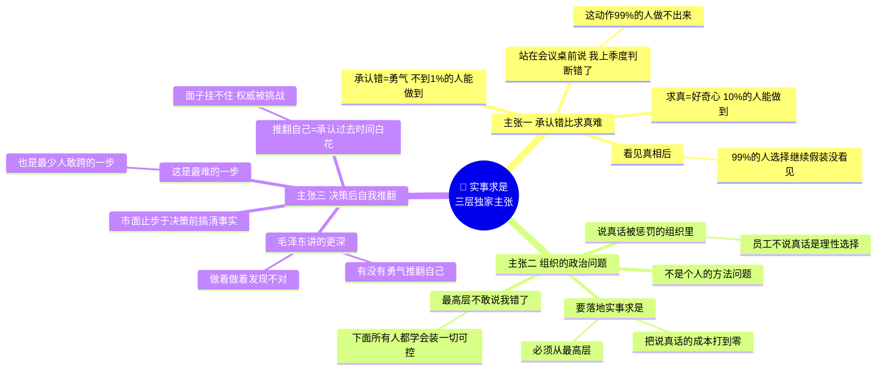
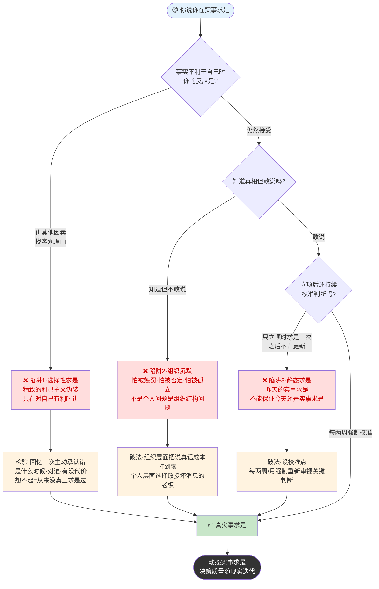
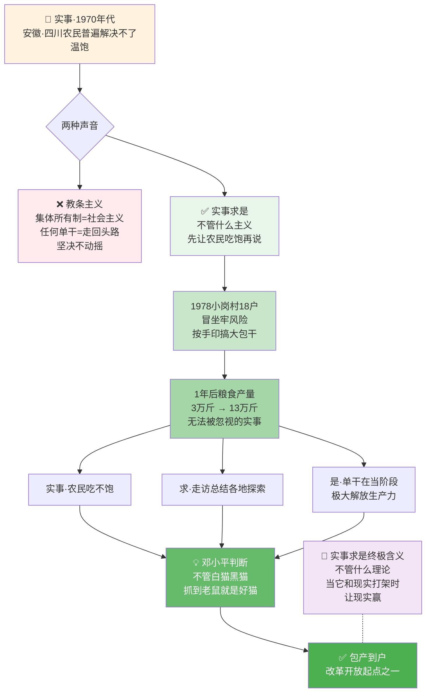

# 10.实事求是核心论

- 01.周报一切可控
- 02.市面误读之辨
- 03.三层独家主张
- 04.四字完整演化
- 05.实求是三段拆
- 06.经典原文精读
- 07.求是四重基石
- 08.反对从定义起
- 09.方法论与组织
- 10.三个认知陷阱
- 11.现实映射矩阵
- 12.一个历史切片
- 13.立场决定能否
- 14.三年认知复利
- 15.收束三句金言

## 01.周报一切可控

我在大厂第一次牵头跨团队项目时，落下个致命习惯：周报永远写“一切可控”。

项目头两周进展顺利，此后上游依赖方拖期、测试环境数据异常，问题接连浮现。我始终抱着“再扛扛就能赶上”的心态，靠加班硬补缺口，周报里始终粉饰太平，不敢把真实风险摆上台面。

第八周晨会上，老板直接甩出他自己拉的接口错误率、工期偏移量等真实数据，和我周报里的“顺利”完全相悖，反问我：“你的周报是写给我看的，还是写给你自己心里好受的？”

当晚复盘他没有指责，只发了《改造我们的学习》中关于“实事求是”的原文让我细读。读到第三遍我才惊醒：整整八周，我从未从客观事实出发写周报，始终被侥幸心理、畏难情绪牵着走，明知实情却不敢直面。

那之后半年，我把“实事求是”四个字贴在了工位上。下面就拆解这段曾点醒我的核心论述。

## 02.市面误读之辨

"实事求是"是毛选里被引用得最多的四个字。几乎每一份文件、每一个企业价值观、每一个培训课程都会出现它。但正因为它出现得太多，**它的锋芒已经被磨平到很少人再认真想它的含义**。

市面上的解读最普遍的一种是：**把"实事求是"讲成"求真态度"**，这是对的，但太温柔了。实事求是真正的杀伤力不在"求真"，而在 **"敢于承认过去错了"**。求真是好奇心，承认错了是勇气，**后者远比前者稀缺**。一个组织里，能求真的人有 10%，能承认过去错了的人不到 1%。

把它讲成"求真态度"，听起来人人都能做到，而它真正的样子是站在会议桌前说"我上个季度判断错了"，**这个动作 99% 的人做不出来**。

市面上还把它讲成"方法问题"，但它其实是组织里的"**政治问题**"。在一个真正实事求是的组织里，**坏消息能够被毫无代价地说出来**；在一个不实事求是的组织里，**报坏消息的人会先被惩罚**。所以实事求是本质上不是个人技能，是**组织结构和权力文化**，如果一个团队的上级无法接受坏消息，这个团队里再多个人再勤奋地"求是"，也活不下来。

## 03.三层独家主张

这篇文章想讲的"实事求是"，是三层在市面书里几乎看不到的东西，

第一层，**实事求是的核心不是"求真"，是"承认错"**。

求真很容易：好奇心驱动你就能去查、去问、去看数据。但**承认错很难**：它要求你接受过去几个月（甚至几年）的工作可能都是白做的，要求你在大家面前撕下"我一直对"的人设，要求你重新规划方向。**绝大多数人栽在这一步**，他们看见了真相，然后选择继续假装没看见。

第二层，**实事求是是组织的政治问题，不是个人的方法问题**。

一个最高层不敢说"我错了"的组织，下面所有人都会学会"装一切可控"。这不是道德问题，是生存策略，**说真话被惩罚的组织里，员工不说真话是理性选择**。所以要让实事求是真正落地，**必须从最高层开始把"说真话的成本"打到零**。

第三层，**实事求是不止于决策前的调研，更在于决策之后的自我推翻**。

市面上讲的实事求是都止步于"决策前要先搞清楚事实"。毛泽东讲的实事求是更深刻，**你做了一个决策，做着做着发现不对，你有没有勇气推翻自己？** 这是实事求是最难的一步，也是大多数人不敢跨的一步。因为推翻自己意味着承认过去花的时间是白费的，意味着面子挂不住，意味着权威被挑战。



## 04.四字完整演化

"实事求是"这个词不是毛泽东发明的，它的源头在《汉书·河间献王传》，"修学好古，实事求是"。但毛泽东把它从一个学术态度，改造成了一个**政党的思想路线**。

毛泽东首次在党的正式文件中使用"实事求是"一词是在 1938 年 10 月党的六届六中全会上："共产党员应是实事求是的模范，又是具有远见卓识的模范。因为只有实事求是，才能完成确定的任务；只有远见卓识，才能不失前进的方向。"

这里值得注意的是，**"实事求是"和"远见卓识"被并列**。这在告诉你，**实事求是不是关于当下琐碎的态度，它是战略层面的根基**。

在《新民主主义论》中："科学的态度是'实事求是'，'自以为是'和'好为人师'那样狂妄的态度是决不能解决问题的。"

这里毛泽东把"实事求是"的对立面亮出来了，**"自以为是"和"好为人师"**。这两个短语极其精准，"自以为是"是**对自己过度自信**，"好为人师"是**急于指导别人**。今天职场里 80% 的错误决策，都源于这两个东西的结合。

"实事求是"这一概念的集中阐述，出现在 1941 年 5 月毛泽东在延安干部会议上所作的《改造我们的学习》的报告中。这篇报告是实事求是思想的**理论定稿**。

从 1938 到 1941，"实事求是"从一个提法演化成了**完整的思想路线**。这条演化路径背后的历史语境是，**党正在经历抗日战争最艰苦的相持阶段，同时党内还残留着教条主义的问题**。实事求是这条思想路线，是毛泽东用来**清扫教条主义、校准全党判断力**的根本武器。

## 05.实求是三段拆

这三个字每一个都有极为精准的定义。市面上大多数人把它们当成一个整体读过，**但真正能用起来的人，是把这三个字拆开分别抓的人**。

先看毛泽东对这三个字的原文阐释。**"实事"**指的是"客观存在着的一切事物"，对应的哲学要求是**承认世界的客观性，坚持从实际出发**；**"求"**指的是"我们去研究"，对应的哲学要求是**发挥主观能动性，进行深入调查研究**；**"是"**指的是"客观事物的内部联系，即规律性"，对应的哲学要求是**探寻事物内在的、本质的、必然的联系**。三个字一字一层：一层是承认事实，一层是主动求索，一层是抽出规律，缺任何一环，"实事求是"都不成立。

"实事"最难的地方，是**把你对它的情绪剥掉**。

同样一件事：项目延期。情绪滤镜版："项目还有希望，只要加加班就能赶上"。实事版："项目已延期 12 天，按当前速度还将延期 18 天，赶上的概率约 15%"。**第一个是你希望的，第二个才是实事**。两者之间的差距不在智力，在勇气。

"求"这个动作里藏着一个陷阱，**很多人以为自己在"求"，其实在"找证据支持自己"**。

毛泽东反复强调，"求"要"**详细地占有材料**""**去粗取精、去伪存真、由此及彼、由表及里**"。这几句话的核心是：**你必须搜集所有材料，包括那些对你不利的**。如果你只搜集支持自己想法的材料，那不是"求"，那是**选择性拼贴**。

"是"是三个字里最难的。它要求你**不只看见事物在表面怎么动，还要看见它为什么这么动**。

举例：销量下滑。表面的"是"，市场大环境不好。次层的"是"，同类竞品降价压力大。本质的"是"，我们的产品核心功能在某个细分用户群上被替代了。**大多数人止步于第一层，自以为"求到是"了**。但第一层的"是"是假规律，按它做决策你只会越做越偏。

```mermaid
graph TB
    title "实—求—是"三字拆解一图带走
    A["实事求是"] --> S1["实事<br/>客观存在的一切事物"]
    A --> S2["求<br/>我们去研究"]
    A --> S3["是<br/>内部联系即规律性"]
    S1 --> D1["核心动作:剥情绪<br/>❌ 项目还有希望<br/>✅ 已延期12天<br/>剩余延18天<br/>赶上概率15%"]
    S2 --> D2["核心动作:占材料<br/>❌ 只搜集支持自己的<br/>✅ 详细到颗粒度<br/>包括对自己不利的"]
    S3 --> D3["核心动作:挖三层<br/>表层:大环境不好<br/>次层:竞品降价<br/>本质:核心功能被替代"]
    D1 -.-> R["有效决策<br/>缺任何一环全线崩塌"]
    D2 -.-> R
    D3 -.-> R
    style S1 fill:#e3f2fd
    style S2 fill:#fff3e0
    style S3 fill:#fce4ec
    style R fill:#333,color:#fff
```

## 06.经典原文精读

**原文（《改造我们的学习》，1941 年）**："'实事'就是客观存在着的一切事物，'是'就是客观事物的内部联系，即规律性，'求'就是我们去研究。我们要从国内外、省内外、县内外、区内的实际情况出发，从其中引出其固有的而不是臆造的规律性，即找出周围事变的内部联系，作为我们行动的向导。**而要这样做，就须不凭主观想象，不凭一时的热情，不凭死的书本，而凭客观存在的事实，详细地占有材料**，在马克思列宁主义一般原理的指导下，从这些材料中引出正确的结论。"

这段话太重要，值得逐层拆。反面是什么？不是"从理想出发"（主观想象）；不是"从情绪出发"（一时的热情）；不是"从书本出发"（死的书本）。

这三个"不是"极其精准地覆盖了人类做错误判断的三种主要姿势。**再读一遍，主观想象、一时热情、死的书本。你今天做的那个判断，是不是这三个之一？**

**"固有的"** = 事物内在本来就有的。**"臆造的"** = 你脑子里编出来的。**检验自己是不是"臆造"的办法**：你说的这个规律，能不能被另一个不认识你、没有立场的人独立地从相同的材料里得出来？如果不能，大概率是你自己编的。

"详细"有一个被忽略的含义，**颗粒度**。它不是简单指"很多"，而是**精细到能看见事物的每一个关节**。

一个极简的对比：粗略占有：销量下滑 15%。详细占有：销量下滑 15%，其中线下门店下滑 8%、电商下滑 25%；用户层面，老客户复购下滑 30%、新客获取下滑 5%；品类上，旗舰品下滑 8%，高端款下滑 40%。**同样的"占有材料"，详细度决定了你能看见多少真相**。

这句话今天很多人会掠过，觉得是时代话语。但它其实有一个普适价值，**"求是"不是盲目的经验主义，而是要有理论工具的**。翻译到今天就是：**真正的"实事求是"，是在一个有效的理论框架指导下去分析现实，而不是"纯粹地看现实"**。完全没有理论指引的"看现实"，会让你被现象淹没、找不到主线。

这也在提醒我们，**既反对教条主义，也反对纯经验主义**。正确的姿势是，**用理论框架做视角，但让结论从材料中长出来**。

## 07.求是四重基石

这一方法论建立在四块基石上：

**为民基础**：立场是为了人民、依靠人民；没有"我为谁做这件事"，实事求是就变成了纸上功夫。
**实践基础**：强调"没有调查，没有发言权"；实事求是的前提是真实地接触过事物。
**理论基础**：源自《实践论》《矛盾论》中发展的马克思主义认识论和方法论；实事求是有一套思想武器。
**文化基础**：对中国传统文化精华（如"知彼知己，百战不殆"）的批判性继承和创新性发展。

这四块基石里，**今天最容易被忽视的是第一条，"为民基础"**。有人会问，工作里讲"为民基础"是不是太大？其实不是，它翻译到今天就是**"你到底为谁服务"**。

一个产品经理如果他心里的用户是"老板"，他的实事求是就变成了"**怎么包装数据让老板满意**"。一个产品经理如果他心里的用户是"真实用户"，他的实事求是才会真正**从用户痛点出发**。**立场一错，方法再好也白搭**。

```mermaid
flowchart TB
    title 求是四重基石——四条腿的桌子缺一不稳
    A["🎯 实事求是<br/>=四重基石的桌子"] --> B1["🧭 为民基础<br/>为谁做这件事<br/>立场决定过滤器"]
    A --> B2["🔍 实践基础<br/>没有调查·没有发言权<br/>亲自接触过事物"]
    A --> B3["📖 理论基础<br/>实践论·矛盾论<br/>思想武器不裸奔"]
    A --> B4["🏛️ 文化基础<br/>知彼知己百战不殆<br/>批判继承+创新发展"]
    B1 --> C1["产品经理·心里用户是老板<br/>→ 求是变成怎么包装数据"]
    B1 --> C2["产品经理·心里用户是真实用户<br/>→ 从用户痛点出发"]
    C1 --> D["❌ 立场错<br/>方法再好也白搭"]
    C2 --> E["✅ 立场对<br/>基石稳固"]
    B2 --> E
    B3 --> E
    B4 --> E
    style A fill:#e8f5e9
    style B1 fill:#ffebee
    style B2 fill:#e3f2fd
    style B3 fill:#fff3e0
    style B4 fill:#f3e5f5
    style D fill:#ffcdd2
    style E fill:#c8e6c9
```

## 08.反对从定义起

**原文**："我们看问题不要从抽象的定义出发，而要从客观存在的事实出发，从分析这些事实中找出方针、政策、办法来。"

这是对教条主义最尖锐的批判，**把书本上的定义当作行动起点**。

今天职场里最常见的教条主义表现："用户画像就应该是 XX"（定义在先，用户在后）；"这种做法不符合 XX 理论"（理论在先，事实在后）；"这个模式大厂都在用"（模板在先，自身情况在后）。这三个姿势都是教条主义。它们的共同问题是，**把二手概念当一手判断**。

**从对客观事实的科学分析中"找出"来**。

注意毛泽东用的动词是"**找出**"，不是"推导"、不是"设计"、不是"想象"。"找出"意味着**方案是躲在事实里等你去发现的，不是你在空白页上写出来的**。

这个思维有一个当代名字叫"**涌现式策略**"（Emergent Strategy），**策略不是被规划出来的，是从大量事实和实验中涌现出来的**。明茨伯格在 1990 年代才系统地提出，而毛泽东在 1941 年已经讲清楚了。

那么理论还有用吗？有。**理论是透镜，不是起点**。错误的姿势：理论 → 推导 → 现实（教条主义）；正确的姿势：现实 → 理论作为透镜辅助看 → 找出规律 → 行动（实事求是）。换句话说，**理论的价值不是告诉你"答案是什么"，而是帮你更清楚地看见"问题是什么"**。

```mermaid
flowchart TB
    title 教条主义 vs 实事求是
    subgraph Wrong["❌ 教条主义 · 定义在先"]
        W1["书本定义/大厂模板<br/>『应该是XX』"] --> W2["推导"]
        W2 --> W3["套到现实上"]
        W3 --> W4["现实不配合<br/>→ 怪现实错了"]
    end
    subgraph Right["✅ 实事求是 · 现实在先"]
        R1["客观存在的事实"] --> R2["理论作为透镜<br/>辅助看"]
        R2 --> R3["从材料里找出规律<br/>『固有的』"]
        R3 --> R4["方案是从事实里<br/>涌现出来的"]
    end
    W4 -.对撑.-> R4
    style Wrong fill:#fde2e2,stroke:#c00
    style Right fill:#e2f5e2,stroke:#0a0
```

## 09.方法论与组织

毛泽东不仅阐释了概念，还提出了一系列践行实事求是的方法。

要了解"实事"，最基本的方法就是调查研究。毛泽东反对"仅仅根据一知半解，根据'想当然'，就在那里发号施令"的主观主义作风。

**为什么把"调查研究"放在方法论的第一位**，因为"实事求是"四个字里，最难的不是"求是"（求规律），是"实事"（搞清楚事实）。**绝大多数人决策出错，不是规律推理出错，是事实认知出错**，他们以为自己掌握的事实是真的，实际上掌握的是经过 N 层转述、N 层过滤、N 层美化之后剩下的"伪事实"。在伪事实上做的任何精彩推理，都是错的。

**调查研究的核心动作是什么**，是**亲自下到现场、亲自和一线对话、亲自记录、亲自验证**。这四个"亲自"缺一不可。让秘书去调查、让下属来汇报、让中层来转述，**每多一层中介，事实就被削减一次、被美化一次**。**毛主席之所以一辈子坚持"亲自下乡"，他不是作秀，他是在做"事实采集"这道决策的第一道工序**。

**今天最容易掉的坑**，以为看 dashboard、看报表、看周报就等于"做了调查"。**这是把"接收二手信息"当成"调查研究"**。dashboard 上的数字是被过滤过的、是被定义过的、是被聚合过的，它能告诉你"发生了什么"，但回答不了"为什么发生""背后的人怎么想""下一步会怎么走"。这三个问题的答案，**只有亲自下到现场、和真实的人聊出来才能拿到**。

调查观是实事求是的"事实层基石"，基石不结实，上面盖什么楼都会塌。本卷 **2.3 毛选中的调查观**整篇专门讲这件事：从"为什么必须自己去""怎么开调查会""怎么避免被骗""调查后怎么消化"完整 15 章，把"调查"这一道工序的每一寸细节都拆开，是与本节配套阅读的必读篇章。

学习理论不是为了好看，而是为了解决实际问题。毛泽东批评"抽象地无目的地去研究马克思列宁主义的理论"的人，主张**有目的地研究**，让理论和实际运动结合起来。这种态度就是"**有的放矢**"。

**今天的反面例子**：很多人学管理理论、学增长模型、学认知科学，学了一堆但从不用它解决实际问题。这不是学习，这是**知识囤积**。真正的学习必须以"解决一个具体问题"为锚点。

实事求是是一个**动态的过程**。认识是否正确，最终靠实践来检验。客观实际在变化，认识也要跟着变化，**要随时准备坚持真理，也要随时准备修正错误**。

这里"随时准备修正错误"是大多数人做不到的那一步。因为**修正错误意味着承认过去错了**，而承认过去错了是**人类天性最抵触的事情之一**。

## 10.三个认知陷阱

实事求是这四个字几乎所有人都会说，但真正做到的人极少。大多数人倒在这三个陷阱里：

**只在对自己有利的时候讲实事求是**，当事实支持自己，就高举"实事求是"的大旗；当事实不利于自己，就开始"讲其他因素"。

这是人性的常态，但它不是实事求是，是**精致的利己主义伪装**。

**检验方法**：回忆你上一次主动"承认自己错了"的场景，上一次是什么时候？对谁承认的？有没有代价？如果你想不起来，说明你从来没真正实事求是过。

这是组织里最普遍的陷阱，**你知道真相，但你不敢说**。

不敢说的原因有三：
怕被惩罚（坏消息的传递者被迁怒）；
怕被否定（承认问题会让自己看起来无能）；
怕被孤立（说出真相和其他人不一致）。

**这不是个人问题，是组织结构问题**。一个团队如果上级无法接受坏消息、一个组织如果文化奖励报喜藏忧、一个公司如果说真话的人被挤走，**再多个人再努力地"求是"也是徒劳**。

**这一层的解法不在个人，在于组织的"说真话成本"**，把说真话的成本降到零，实事求是才有生存空间。

很多人在项目立项时认真实事求是一次，然后**执行过程中就再也不更新了**。

**这是静态的实事求是，不是真正的实事求是**。真正的实事求是是**动态的**，每当现实出现新信号，就要重新校准判断。**昨天的实事求是，不能保证今天还是实事求是**。

**操作化的做法**：给自己设"校准点"，每两周、每个月强制重新审视一次关键判断。不设校准点，你会自然地滑进"用过去的判断解释现在"的惯性里。

三个认知陷阱决策树——检验你的实事求是是不是伪装：



## 11.现实映射矩阵

把"实事—求—是"三段拆放进五个真实维度看看。**个人周报**里，"实事"是真实进度、偏差、阻塞，"求"靠数据加同事反馈交叉印证，"是"指向项目真实风险。**产品决策**里，"实事"是用户真实行为和留存，"求"靠数据漏斗叠加访谈双通道，"是"指向真实增长瓶颈。**团队管理**里，"实事"是成员真实状态与瓶颈，"求"靠一对一沟通和一线蹲点，"是"指向协作的真实问题。**公司战略**里，"实事"是行业真实数据和用户真实需求，"求"靠行业摸底加用户走访，"是"指向行业本质趋势。**人生判断**里，"实事"是你自己真实的处境、能力和欲望，"求"靠长期复盘和"他人这面镜子"，"是"指向人生真正的主要矛盾。

**这张表的使用方式**，**挑你当前最害怕面对的那一列，从那里开始**。怕面对真实绩效的人，从周报开始；怕面对真实用户的人，从产品决策开始；怕面对真实自己的人，从人生判断开始。**实事求是永远从"你最不想看的地方"开始最有效**。

## 12.一个历史切片

讲一个毛选解读里很少被讲透的案例，**70 年代末的包产到户**。

1950 年代末开始，农村实行"人民公社"集体所有制。**从政策逻辑上说，这是最符合社会主义理想的安排**。但到 70 年代后期，一个残酷的"实事"摆在那里，**安徽、四川等地农民普遍温饱都解决不了**。

这时候全国有两种声音：

**一种是教条主义**：坚持集体所有制是社会主义道路，不能动摇。任何"单干"都是走回头路。
**一种是实事求是**：不管什么主义，先让农民吃饱饭再说。

1978 年小岗村 18 户农民冒着坐牢的风险，按手印搞了"大包干"。一年后，小岗村粮食产量从过去 3 万斤涨到 13 万斤。这个数字是一个"无法被忽视的实事"。

邓小平当时的关键判断，用的就是毛泽东讲的**实事求是**，**"实事"是农民吃不饱，"求"是走访总结各地自发探索，"是"是单干在当前阶段能极大地解放生产力**。他著名的那句"**不管白猫黑猫，抓到老鼠就是好猫**"，本质上就是一句极致实事求是的话，**别争论理论上合不合法，先看结果对不对**。

包产到户后来成为改革开放的起点之一。**这个案例的核心不是"集体化错了"，而是"不管什么理论，当它和现实打架时，让现实赢"**，这就是实事求是的终极含义。

**今天每个人都可以问自己**，**你现在坚持的某个"道理"，它和你的现实打架时，你让谁赢**？如果你总让"道理"赢，你可能正在一条错路上走得很远。

小岗村18户按手印——教条 vs 实事求是的极致对撞：



## 13.立场决定能否

讲完正面案例，单拎出来讲讲反面切片，为什么"实事求是"在大多数组织里都做不到。原因就一个：**立场**。

实事求是的前提是"看见实事"。但**人不是中立的摄像机**，你看见什么，取决于你想看见什么。

一个屁股坐在"我不能错"位置上的领导，他眼里的实事永远是"事情还有救"。
一个屁股坐在"业绩必须达标"位置上的销售，他眼里的实事永远是"用户都很满意"。
一个屁股坐在"我要升职"位置上的中层，他眼里的实事永远是"团队很团结"。

**立场决定了你的眼睛过滤掉什么**。所以毛泽东讲实事求是的"为民立场"，只有把屁股坐到"为人民"那一边，你才能看见那些被各种私利屏蔽掉的实事。

真正能做到实事求是的人，有一个共同特征，**他不太在乎自己的位子能否保住**。

为什么？因为实事求是必然意味着**承认自己之前的判断错了**，而这种承认会损伤自己的权威。**只有那些把"做对事"放在"保位子"之上的人，才有勇气说出真实**。

这也解释了为什么很多组织最高层做不到实事求是，**他们的位子是靠"一直对"维持的**，一旦承认一次错，整个权威基础都会松动。所以他们宁可让组织带病运行，也不愿在自己手上喊一次停。

判断一个组织是否健康，有一个非常硬的体检指标，**最高层多久公开承认一次错误**。

一年承认一次的：健康。
两年承认一次的：警示。
五年没承认过一次的：这个组织已经在重病期。

**最高层不承认错误，下面所有人都会学会"装一切可控"**，这就是 8 周写"一切可控"的真正根源。

## 14.三年认知复利

那周我做的第一件事，就是把当周周报模板里的"进展顺利，一切可控"删掉。我新设计了三栏：**事实（发生了什么）/ 风险（偏离多少）/ 求助（我需要谁怎么帮）**。第一次这么写周报的时候我手心冒汗，因为我第一次把"依赖方代码提交频率低于预期 40%"这种真实数据暴露出来。结果老板回我的只有一句："早说啊。"紧接着他直接拉了上游的 L4 给我帮忙。4 个月拖下来的项目，用 2 周补了回来。

那一个月我把"实事—求—是"这三个字贴在工位上，任何问题上来先问自己三遍：

**"实事"是什么？**，把情绪、立场、预设全部剥掉，只留客观现象和数据；
**"求"怎么求？**，我需要去哪几个一手现场、拉哪几个数据、问哪几个人；
**"是"是什么？**，这些事实背后的规律到底是什么？不是"我希望它是什么"。

一个月后我做决策的速度反而比以前快了，不是我变聪明了，是我不再浪费时间在自我安慰上。

半年后，老板给我调了一个更重要的项目。他在交接会上说了一句让我至今记得的话："我选你不是因为你能力最强，是因为**你现在周报里写的东西我敢信**。"那之后我带团队的第一条规矩就是，**所有汇报，先说坏消息，再说好消息，不允许"一切顺利"四个字出现**。有同学不适应，我就把那段"凭客观存在的事实、不凭主观想象"的原文发给他，三个月后他自己来跟我说："原来汇报真话，老板反而更愿意帮忙。"

三年之后我形成一个新的判断力，**面试一家公司时，我会专门观察：这家公司的人在会议上敢不敢承认"我错了"、敢不敢说"这个方向可能不对"**。

如果这家公司上上下下都是"大家都很顺利""方向非常正确"，我会警觉，**这是一个不允许实事求是的组织**。
如果这家公司有人敢在会上说"我上个季度那个判断是错的"，我会尊敬，**这是一个还能长期进化的组织**。

**一家组织能不能实事求是，不是看它墙上写了什么，是看它最高层敢不敢承认错误**。最高层不敢承认，下面所有人都会学会装"一切可控"，然后这家公司就开始腐烂。

这个认知让我后来选公司、选团队、选合作伙伴时，多了一条极硬的底线，**不和不敢承认错的人长期合作**。

三年认知复利甘特图——从"一切可控"到"看敢不敢认错"：

```mermaid
gantt
    title 三年实事求是复利时间线（个人亲历）
    dateFormat X
    axisFormat %s
    section 翻车期
    周报八周写一切可控·被老板甩数据打脸  :crit, done, 0, 56
    读改造我们的学习·实事求是原文       :milestone, 56, 0
    section 制度期(1个月)
    删除进展顺利·改事实/风险/求助三栏    :done, 56, 63
    实-求-是三字贴工位·任何问题问三遍   :done, 56, 86
    section 内化期(半年)
    团队新规·先说坏消息后说好消息       :done, 86, 240
    禁止一切顺利四字出现              :done, 86, 240
    老板交接会·你现在周报敢信         :milestone, 240, 0
    section 复利期(三年)
    面试观察·敢不敢在会上说我错了     :done, 240, 800
    择业硬底线·不与不敢认错的人合作   :done, 800, 1095
    看组织健康指标·最高层多久公开认错 :milestone, 1095, 0
```



## 15.收束三句金言

**一句话核心**：**从"我希望它是什么"出发的决策，都是给未来埋雷。**

**你应该带走的三件事**：

**拆开"实—求—是"**，写任何报告、做任何判断前，先问三句："实事是什么？我怎么求？是什么规律？"拆不开这三层，就别急着下结论。
**坏消息第一时间讲，用数据讲**，掩盖事实的成本，永远比暴露事实的成本高十倍。
**实事求是是动态的**，别死抱着某个"我当初的判断"不放；实践一旦证明你错，就大大方方改，这才是真正的实事求是。

**一句留给你的反问**：

> 你现在手头那份报告、那个判断、那条坚持，
> **如果剥掉你的情绪、立场、预设，它还站得住吗**？
> 如果答不上来，你今天做的不是决策，是**自我安慰**。

