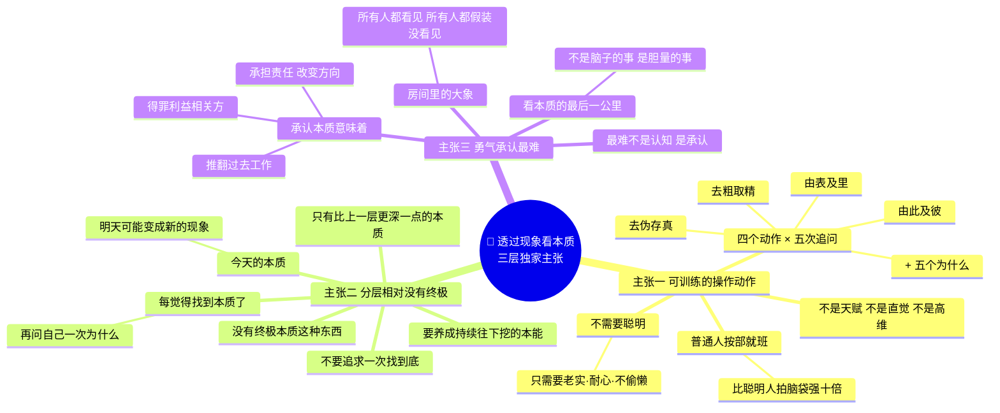
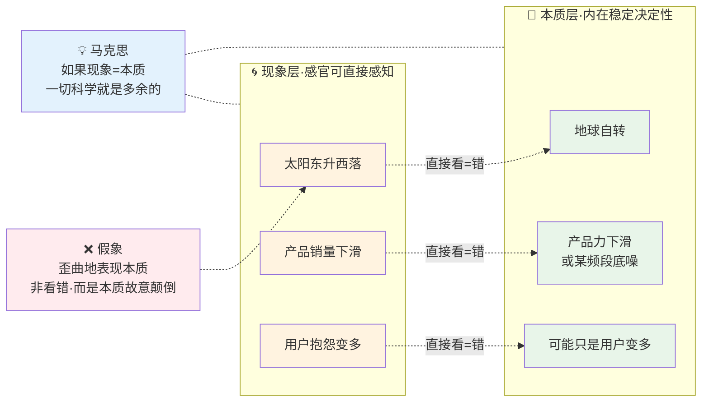
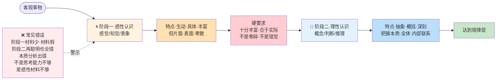
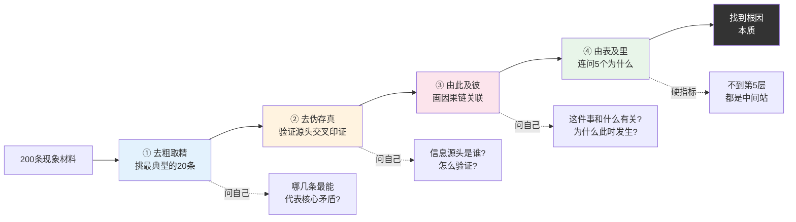
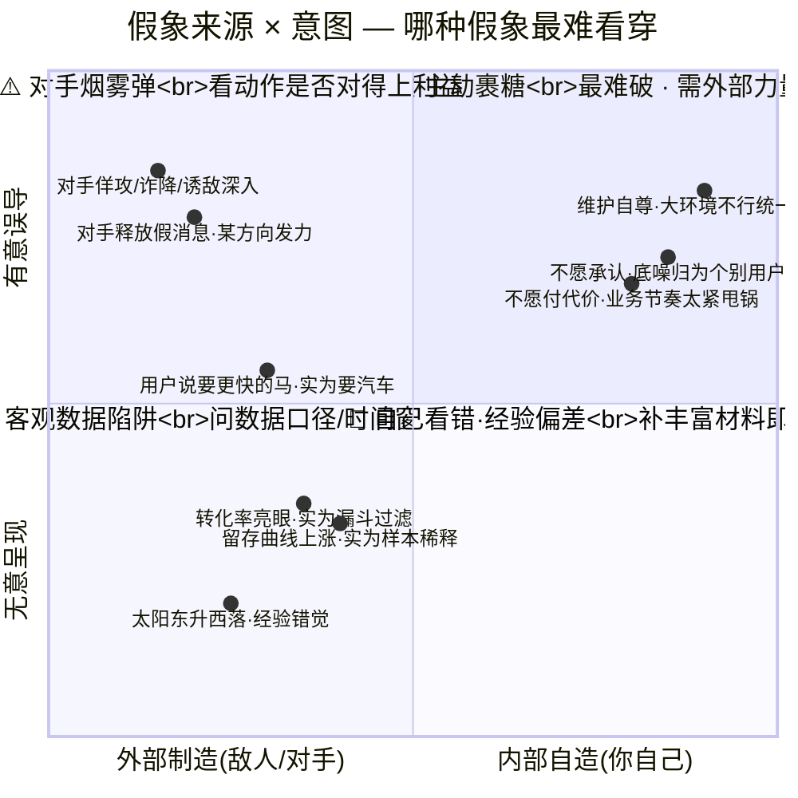
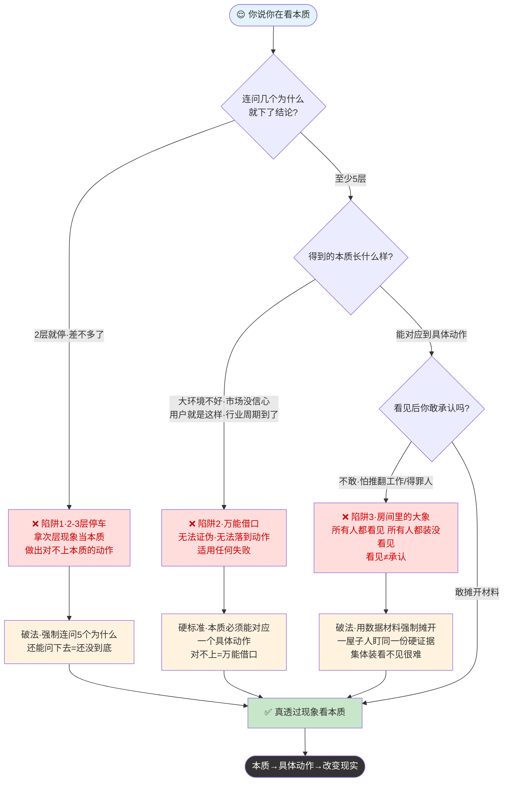
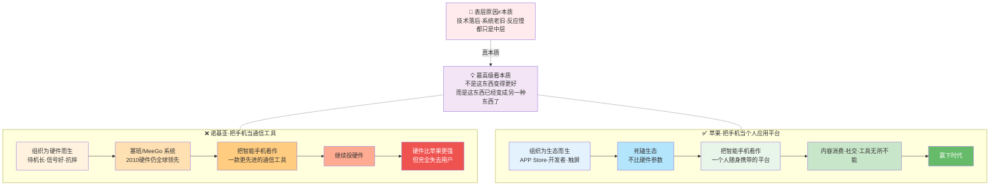

# 12.透过现象看本质

- 01.大环境的归因
- 02.市面误读之辨
- 03.三层独家主张
- 04.现象本质矛盾
- 05.认识两个阶段
- 06.深拆十六字诀
- 07.假象的欺骗性
- 08.自欺最难抵抗
- 09.持久战之示范
- 10.三个认知陷阱
- 11.现实映射矩阵
- 12.诺基亚的本质
- 13.立场决定能否
- 14.三年认知复利
- 15.收束三句金言

## 01.大环境的归因

我曾在一家硬件公司带过产品线。当时我们一个主推的蓝牙耳机产品，销量连续三个月下滑。我在月度复盘会上给老板的分析是：

市场大环境不好（现象一：整个行业在降速）；竞品价格战太猛（现象二：XX 品牌刚降了 50 块）；618 还没到，消费者在观望（现象三：电商流量进来了但转化率低）。

我把这三条整整齐齐列在 PPT 里，附了一堆图表，气势汹汹地说"**所以销量下滑不是我们的问题**"。老板听完只问了我一句："那为什么同价位的 A 品牌、B 品牌这个季度销量反而涨了？"

我卡住了。那天复盘会后，老板把我叫去办公室。他没有骂我，他只是慢慢说："你刚才说的全是'现象'，但销量下滑的本质，是我们的产品出了什么问题？**现象是你的入口，不是你的结论。**"

他随手从书架上抽了一本《矛盾论》，翻到夹着的那一页，指给我看："我们看事情必须要看它的实质，而把它的现象只看作入门的向导，一进了门就要抓住它的实质，这才是可靠的科学的分析方法。"

我回去闷头干了三天：翻了 200 条电商差评，做了 30 分钟的用户录音回听，把产品和 A、B 两个竞品放在一起做了逐项拆解。结果跳出来的"本质"让我冷汗直冒，**不是市场问题，是我们的降噪功能在某个高频段有一个稳定的底噪**。这个问题一年前就有用户反馈过，但被我们归到"个别用户"里了。从那天起我开始真懂了什么叫"透过现象看本质"。下面我把当时救了我的这套方法原原本本拆给你看。

## 02.市面误读之辨

"透过现象看本质"是今天所有读书博主最爱讲的一句话。但我越听越觉得，他们讲的不是方法，是口号。市面上的讲法有三个硬伤：

**第一，它把"看本质"讲成一种"天赋"或"直觉"**。——"有的人就是能看透""有的人就是高维"——好像这是一种与生俱来的能力。这是错的。**看本质不是天赋，是一套可以被训练的操作动作**。毛泽东在《实践论》里讲的"十六字诀"——**去粗取精、去伪存真、由此及彼、由表及里**——就是这套操作的精确描述，四步走下来每一个人都能走进门。

**第二，它把"本质"讲成一个"一次性答案"**。好像本质是个固定的真相，找到就完事了。**但真正的本质是分层的——一层之下还有一层，越挖越深**。大多数人挖到第二层就以为到底了，然后把第二层当本质。事实上所有"本质"都是相对的——你看到的本质只是比上一层的现象更深一点点而已。

**第三，它把"看本质"讲成"看见了就做得到"**。——仿佛看穿了真相就能自动解决问题。**错。看见本质是第一步，真正难的是"敢承认这是本质"以及"愿意为这个本质付出代价"**。我在文章开头的案例里，团队一年前就有人提过"底噪"——这个本质早就被人看见了。但整个团队"不敢把它当成本质"——因为承认了就意味着硬件方案要重做，要推翻过去一年的工作。**看到本质的人很多，敢把它当本质动手的人极少**。

## 03.三层独家主张

把上面三层硬伤翻过来，就是这篇文章独家的三个主张。这三句话也是后面所有内容展开的总纲，你可以把它们贴在墙上，反复对照。

不是天赋，不是直觉，更不是"高维"。它是**四个动作 × 五次追问**的工程，"去粗取精、去伪存真、由此及彼、由表及里"是四个动作，"五个为什么"是五次追问。这些动作不需要你聪明，只需要你**老实、耐心、不偷懒**。一个普通人按部就班走完，比一个聪明人凭直觉拍脑袋强十倍。

没有"终极本质"这种东西，只有**比上一层更深一点的本质**。你今天找到的本质，明天可能变成新的现象。所以**不要追求"一次找到底"，要养成"持续往下挖"的本能**。每当你觉得"我找到本质了"，就再问自己一次为什么，还能问下去，说明你还没到底。

最难的不是认知，是**承认**。承认本质往往意味着：要推翻过去的工作、得罪利益相关方、承担责任、改变方向。所以组织里经常出现"所有人都看见了大象，但所有人都假装没看见"，这就是"房间里的大象"。**看本质的最后一公里，从来不是脑子的事，是胆量的事**。

记住这三层：**操作动作、分层相对、勇气承认**。下面的章节，都是围绕这三句话展开的。

三层独家主张思维图（可训练的操作 · 分层相对 · 勇气承认）：

## 04.现象本质矛盾

要理解"透过现象看本质"，首先必须厘清什么是现象、什么是本质，以及它们之间错综复杂的关系。

**来看下原文1**："我们看事情必须要看它的实质，而把它的现象只看作入门的向导，一进了门就要抓住它的实质，这才是可靠的科学的分析方法。一切事物，它的现象同它的本质之间是有矛盾的。人们必须通过对现象的分析和研究，才能了解到事物的本质。"

**现象**是事物外部的、表面的、多变的联系，是我们可以通过感官直接感知到的。苹果落地、潮汐涨落、股价涨跌、社会热点事件，这些都是现象。它是我们认识事物的**起点和通道**。**没有现象，我们就无法接触任何事物**。这一点很重要，不要因为强调"看本质"就鄙视现象。**现象是入门的向导，没有向导你连门都进不去**。但**现象只是向导，不是终点**。停留在现象层面就会犯经验主义或形式主义错误。

**本质**是事物内在的、相对稳定的、决定性的矛盾联系，是事物存在的根据。它**决定了事物的性质和发展方向**。万有引力是苹果落地的本质；价值规律是价格波动的本质；一个公司的产品力或组织力是其兴衰的本质。**本质的特点**：**1.稳定性**：现象千变万化，本质长期不变；**2.内在性**：藏在事物内部，必须通过思考和分析才能把握；**3.决定性**：本质决定了现象会怎么走，而不是反过来。

**对立（矛盾）**：现象不等于本质，有时甚至**歪曲地表现本质**，这叫"假象"。

马克思说："**如果现象形态和事物的本质会直接合而为一，一切科学就都成为多余的了**。" 这句话很深，**如果现象直接等于本质，我们根本不需要科学，抬头看看就懂**。科学之所以存在，就是因为现象和本质之间存在距离、矛盾、甚至相反。

例如：太阳东升西落（现象）→ 地球自转（本质）；产品销量下滑（现象）→ 产品力下滑（本质）；用户抱怨多（现象）→ 可能是用户变多（本质）。

**统一**：本质总要通过现象表现出来，**没有不表现为现象的本质；现象也总是从特定方面表现着本质，没有无本质的现象**。二者相互依存。

**我们的任务**，从大量甚至矛盾的现象中，**剥离假象，找到真正反映本质的现象**，从而揭示内在规律。

现象层 vs 本质层——三对活例子的距离：

## 05.认识两个阶段

**来看下原文1**："认识的过程，第一步，是开始接触外界事情，属于感觉的阶段。第二步，是综合感觉的材料加以整理和改造，属于概念、判断和推理的阶段。"

通过感官直接获取关于事物的感觉、知觉和表象。其特点是**生动、具体、丰富，但也是片面、表面、零散的**。这个阶段我们收集到的是大量的"现象材料"。

**必须要求**：感性材料"**十分丰富（不是零碎不全）和合于实际（不是错觉）**"。通过对感性材料进行思考、加工，形成概念、判断、推理。其特点是**抽象、概括、深刻**，它把握了事物的**本质、全体和内部联系**。

**阶段一决定阶段二的天花板**，如果第一阶段材料少、材料假，第二阶段的理性分析全是错的。**很多人的"本质分析"之所以错，不是思考能力不够，是感性材料不够**。

**来看下原文2**："要完全地反映整个的事物，反映事物的本质，反映事物的内部规律性，就必须经过思考作用，将丰富的感觉材料加以**去粗取精、去伪存真、由此及彼、由表及里**的改造制作工夫。"

这十六个字，**去粗取精、去伪存真、由此及彼、由表及里**——就是一套完整的、可操作的"从现象到本质"的工序。下一章我们一个字一个字拆。

认识两阶段流程——阶段一决定阶段二的天花板：

## 06.深拆十六字诀

// TODO：帮我优化一下，让其紧凑点

**"去粗取精"**的核心是：**不是所有现象都值得分析**。你必须先筛掉那些次要的、边角的、噪音性的材料，留下最核心、最典型的材料。比如做用户调研收了 200 条反馈，不是每一条都要分析。**要挑出那 20 条最典型的、最能反映核心问题的**。常见的误区是很多人把"粗"当成"精"，看数据看总量，不分层不分群；看用户只看嗓门大的，不看沉默大多数。结果拿着假代表当真代表。具体做法是面对一堆材料，先问自己，**这些材料里，哪几个最能代表事物的核心矛盾**？把这几个挑出来，其余先放。

**"去伪存真"**的核心是，**排除错觉、虚假、污染的信息，确保材料的真实性**。主要是指在海量信息中辨别真伪、交叉验证、识别谎言、识别偏见。**常见错误**：把二手信息当一手，"我听说"，"据报道"，"传闻"；把样本偏差当全貌，只看自己圈子的反馈；把情绪表达当事实，用户骂得很凶不等于他们真正不用。面对每一条材料，问自己，**这条信息的源头是谁？我怎么验证？它有没有可能是个别人的片面表达**？

**"由此及彼"**的核心是，**不要孤立地看一件事，要把它和其他事联系起来看**。A 事件要和 B 事件联系起来看；历史要和现状联系起来看；内部要和外部联系起来看；局部要和全局联系起来看。

**常见错误**：
只看一件事的局部，不看它和其他事的因果；
只看今天，不看昨天和明天；
只看自己，不看对手；
只看表象，不看背后的链条。

**操作口诀**：面对一个现象，问自己——**这件事和什么有关？它为什么此时此地发生？它发生了会带动什么别的事**？把因果链画出来，你才能从孤立的点变成结构化的图。

**"由表及里"**的核心是——**穿透表面，层层深入，追问到最底层的那个矛盾**。

**最实用的工具**：**连问五个为什么**（5 Whys）——丰田生产方式里的经典方法。

**示例**（基于本文开头的案例）：

销量下滑 —— **为什么**？
因为电商转化率低 —— **为什么**？
因为差评集中在音质 —— **为什么**？
因为降噪功能某个频段有底噪 —— **为什么**？
因为硬件方案在某个元器件上做了妥协 —— **为什么**？
因为一年前为了降成本换了一个供应商。

**问到第五层，才摸到真正的"根因"**。大多数人死在第二三层就停了——因为第二三层已经给了一个看似合理的解释，足以搪塞自己和老板。

**操作口诀**：给任何结论前，先强制自己连问五次"为什么"。不到第五层，都只是中间站。

十六字诀四步 SOP 一图看透：

## 07.假象的欺骗性

**假象不是"看错了"，它是本质"故意"以歪曲方式表现出来的**。太阳东升西落这个现象真实存在，但它反映的"地球中心"是错的，地球围着太阳转才是本质，本质在日常经验里被颠倒地表现出来。

**今天的翻译**：用户的"明确需求"经常是假象，用户说"我想要一匹更快的马"，本质是"我想要更快到达目的地"（需要汽车）；用户说"我想要更多功能"，本质是"我要的不是功能，是问题被解决"。**你按用户的"明确需求"去做，会做出一个用户不要的东西，因为你执行的是假象**。

**战争中**，敌人会用佯攻、诈降、诱敌深入制造假象；**商业中**，对手也会释放烟雾弹——透露假消息、在某个方向发力误导你、做出看似在衰退的姿态。**破解方法只有一个**，不要只看对手做什么，看它的"动作"和"利益"之间对不对得上号。**如果对手做了一件对它长期利益没好处的动作，这个动作多半是假象**。

**最具迷惑性的假象，是看似客观的数据**，看似上涨的留存曲线可能只是因为新用户进来太少、样本被稀释；看似亮眼的转化率可能只是前置漏斗已过滤掉大部分目标用户；看似稳定的客单价可能掩盖着内部结构的剧烈变化（高客户流失、低客户补位）。

**数据本身没有立场，但选择哪些数据呈现、用哪种口径切片、用哪个时间窗对比，全都是立场**。看到一份数据报告，先别急着信结论，先问三个问题：**数据口径是怎么出来的？为什么是这个时间窗？为什么不是另一种切片**？

## 08.自欺最难抵抗

最具欺骗性的假象不是敌人造的，是**我们自己造的**，这一类假象叫**自我欺骗**，是看本质路上最大的拦路虎。

**三种典型自欺**：其一，**不愿承认**，怕承认某个本质，就告诉自己"不是这个本质"，开头案例里"底噪问题"被一年前归为"个别用户"就是典型；其二，**不愿付代价**，团队明知某个核心模块写得太烂，但谁都不愿意花一个季度重构，就互相默契地把它甩给"业务节奏太紧"；其三，**维护自尊**，把归因推向市场、对手、环境、时代，"不是我不行，是大环境不行"几乎成了所有失败者的统一台词。

**自欺有内在的奖励机制**，不承认本质，你今天就能舒服；不付代价，你今天就能少干活；推给外部，你今天就能保住自尊。每一次自我欺骗都给你**即时的情绪奖励**，而承认本质的代价是**长期的、抽象的、未来的**。**人类大脑天然偏向短期奖励**，这就是自我欺骗的生理基础。

光靠"我要诚实"是破不了自我欺骗的——因为骗你的就是你自己。**你需要外部力量介入**：找一个敢说真话的人（真朋友、直率下属、不怕得罪你的合作伙伴）定期 challenge 你的判断；把材料一份份摆在会议桌上，**当一屋子人盯着同一份硬证据，集体装看不见就很难了**；写下来公开承诺，**你最不敢欺骗的，是已经写下来的过去的自己**。**所以看本质最难的一步，从来不是认知能力，是自我欺骗的抵抗能力**。

假象四象限图——来源 × 意图，看穿哪种假象最难：

## 09.持久战之示范

理论的生命在于应用。毛泽东本人就是"透过现象看本质"的大师。我们以《论持久战》为例，做一次全景剖析。抗日战争初期，国内流行两种错误论调，**"亡国论"**：只看到敌强我弱的现象（日本军力强大，中国连失多地），得出悲观结论。**"速胜论"**：看到台儿庄大捷等个别胜利就盲目乐观，认为很快能赢。

这两种论调有一个共同特点，**都被表面现象迷惑了**。亡国论被"日本的强"迷惑，速胜论被"局部的胜"迷惑。**它们都没有看到中日战争的真实本质**。

毛泽东并非闭门造车，他全面分析了中日双方的各种现象：**日本方面**：军力、经济力、政治组织力强（强点），但**国度小、人力物力不足、战争的非正义性、失道寡助**（弱点）。**中国方面**：军力、经济力、政治组织力弱（弱点），但**国度大、地大物博、人多兵多、战争的正义性、得道多助**（强点）。

注意，毛泽东没有回避"中国弱"这一点，也没有夸大"日本弱"，他**全面地摊开了所有现象**，好的坏的都摆在桌上。**这是走到本质的必要前提**，你不能只选择性地看材料。

**去粗取精**：在众多因素中抓住四个基本特点，**敌强我弱、敌小我大、敌退步我进步、敌寡助我多助**。这四个是决定战争命运的主要矛盾，其余都是次要因素。

**去伪存真**：驳斥了"亡国论"只看到"敌强我弱"一个点、忽略其他三点；"速胜论"则只看到"我大、我进步"、忽略了"敌强"。**两种论调都是选择性看材料的产物**。

**由此及彼**：将四个特点联系起来，"敌强我弱"决定了中国不能速胜、战争是持久的；"敌小、我进步、我多助"决定了日本经不起长期消耗；**两者叠加**，战争会持久，但持久对中国有利。

**由表及里**：透过军事胜负的表象，深入到**战争性质、人心向背、国力潜力**等深层本质。

**最终得出**：抗日战争是持久的、最后胜利是中国的；三个阶段（战略防御、战略相持、战略反攻）；"防御中的进攻、持久中的速决、内线中的外线"等完整战略战术。**论断被历史完美验证**，它极大地鼓舞了全国军民的信心，为抗战胜利指明了方向。

**第一**：**看本质的前提是完整地收集现象**，敌强、敌弱、我强、我弱都要看，不能选择性收集；**第二**：**本质不是单一的，是一组相互作用的基本矛盾**，不要期待找到一个本质就完事，本质通常是"几个基本矛盾的组合"；**第三**：**真正的本质分析能预测未来**，它不只是解释过去，还能给出下一步的行动方向。如果你的"本质分析"只能解释昨天、不能预测明天，那它还不够深。

## 10.三个认知陷阱

// TODO，帮我优化一下，让其更加紧凑点

大多数人连问"为什么"——问到第二层就停了。

销量下滑 → 因为竞品太猛。到此结束。

这不是本质，只是一个**次层现象**。真正的本质在第四五层。**停在第二层就开始做决策的人，会做出一堆对不上本质的动作**。

**破解方法**：强制自己连问五个为什么。每次你觉得"找到本质了"，就再问一次为什么——**如果还能问下去，说明你只是到了一个中间站**。

"大环境不好""市场没信心""用户就是这样""行业周期到了"——这些是典型的**万能借口**。

它们的共同特征是——**无法被证伪、无法落到动作、适用于任何失败**。

**真正的本质有一个硬标准**：**它必须能对应出一个具体的动作**。
"市场不好"——对应什么动作？没有。
"产品降噪有问题"——对应"重做声学方案"。

**如果你得出的"本质"不能对应出一个具体动作，它就不是本质，只是万能借口**。

这一点最致命。

**看见本质和承认本质是两件事**。你可能已经看见了真相，但你不敢把它说出口，因为承认它意味着：
推翻过去的工作；
得罪利益相关方；
承担责任；
改变现有方向。

**所以组织里经常出现"所有人都看见了大象，但所有人都假装没看见"的场面**——这就是"房间里的大象"。

**破解方法**：**用数据和材料强制摊开**——当你把材料一份一份摆在会议桌上的时候，大家就很难继续装看不见了。一个人可以装看不见，一屋子人看着一堆明确的证据，很难集体装看不见。

三个认知陷阱决策树——检验你是"看本质"还是"糊本质"：

## 11.现实映射矩阵

从表层现象到本质，通常要穿三层。

**个人职业**上，表层是薪资不涨、跳槽不顺，中层原因是能力没升级，本质是**价值交换的底层筹码不够**。

**产品衰退**上，表层是销量下滑、留存走低，中层原因是竞品冲击，本质是**产品力或需求场景发生了变化**。

**团队低效**上，表层是加班多、产出低，中层原因是流程乱，本质是**战略不清或协作信任缺失**。

**婚姻破裂**上，表层是争吵多、冷战，中层原因是琐事不合，本质是**价值观差异或需求未被看见**。

**时代变迁**上，表层是行业衰退、社会焦虑，中层原因是需求结构变化，本质是**生产力和生产关系的错位**。

**这张表的使用方式**，**不要停在"表层现象"，也不要停在"中层原因"，一路问到最右列**。大多数人决策时停在第二列，所以动作永远错位。

## 12.诺基亚的本质

讲一个所有做产品的人都该反复看的案例，**诺基亚为什么垮了**？

主流解读有好几种：技术落后（现象），但诺基亚的硬件指标 2010 年还在全球领先；塞班系统老旧（中层原因），但诺基亚有 MeeGo 做备份；决策层反应慢（中层原因），但诺基亚转型意愿一直很强。这些都是**现象和中层原因**，不是本质。

真正的本质在哪里？**"手机"这个产品的**本质**从"通信工具"变成了"个人应用平台"**。诺基亚的整个组织是围绕"通信工具"构建的，硬件精良、待机长、信号好、抗摔；苹果的整个组织是围绕"个人应用平台"构建的，APP Store、开发者生态、触屏交互、内容消费。

**这是两个完全不同的物种**。诺基亚不是输给了苹果的"技术"，是输给了**对"手机到底是什么"这个本质判断的差距**。

当智能手机从 2007 年诞生，诺基亚把它当成"一款更先进的通信工具"，所以它继续投硬件。苹果把它当成"一个人随身携带的平台"，所以它死磕生态。**五年之后，诺基亚的手机比苹果的硬件更强，但已经完全失去了用户**。

**这个案例的核心启示**，**看本质最难的一步是看到"事物本身已经变成另一种东西了"**。你还在按原来的本质打磨产品，但这个"本质"已经过时了。**时代的大革命不是"这个东西变得更好"，而是"这个东西变成了另一个东西"**。能看到这一层的人，才是真正会看本质的人。

诺基亚 vs 苹果——同一个"手机"·两个完全不同的物种：

## 13.立场决定能否

**为什么有些人天生更容易"看到本质"，有些人怎么训练都看不到**？答案不在脑力，在**立场**。

**人看到的本质，跟他的位置高度相关**，老板能看到"组织的本质问题"，因为承担最终结果的是他；一线员工只能看到"自己工位附近的本质"，因为他没有更大的视野；既得利益者**永远看不到**"自己就是那个本质问题"，因为承认了就要砍自己。这不是道德问题，是**结构性盲区**。遇到一个本质问题，先别问"为什么大家都没看到"，先问"**谁在这件事里有利益，他天然就看不到哪一层**"。

最难的一种本质，**当你自己就是问题的一部分**。团队效率低，本质是你这个 leader 的方向不清；婚姻不睦，本质是你自己在用错的方式回应；管理层"听不进意见"，本质包括你自己也在用某种方式让别人不敢讲真话。**承认"自己也在本质里"，比承认"系统有问题"难一百倍**。但只有这一层承认了，你才能真的解决问题；否则你永远在外围打转，把自己摘出去，把所有问题归给别人。

破解立场盲区的简单办法——**强制自己换三个角度看同一件事**：如果我是最大受益者，我会怎么解读？如果我是最大受害者，我会怎么解读？如果我是完全无关的旁观者，我会怎么解读？三个角度对一遍，你大概率会发现——你以为的"本质"，只是你的位置允许你看到的那一层。

## 14.三年认知复利

从老板办公室出来那一周，我给自己立了一条规矩：**任何结论出来之前，先连问五个为什么**。销量下滑——>转化率低——>评论差——>音质投诉——>某频段底噪——>硬件方案有未闭环的 Bug。问到第五层才算摸到本质。那一周我把这套"五问法"发给团队，要求所有复盘必须走完五层才能下结论。

第二个月我把团队的周会复盘模板改了，不再是"进展 / 问题 / 计划"三段式，而是**去粗取精（本周最重要的 1 件事）/ 去伪存真（哪些以为的因果是假的）/ 由此及彼（这件事和上下游什么事相关）/ 由表及里（最根本的原因）**四段。一开始同学觉得别扭，两周后他们写出来的复盘比我之前写的还扎实。那个季度我们把那款耳机的底噪修掉，销量单月止跌并反弹 22%。

半年后我养成了一种新本能，**每次听到"市场不好""大环境不行""用户就是这样"我都会警觉**。真正的本质永远藏在一个用户的差评里、一条被忽略的数据里、一个团队没敢面对的问题里。这个习惯让我在后面两年极少再出大的方向错误。

三年之后我对"看本质"又有了新的理解，**最高阶的看本质，不是看事情为什么发生，而是看这件事情本身"有没有悄悄变成了另一件事情"**。

举个真实例子：我们做一款产品打了三年"性能"牌，但我观察到，新一代用户打开次数在降、停留时长在升、而且用户会用我们 App 干一些我们没设计过的事（比如社交互动）。我连问五个为什么，不是"为什么留存下滑"，而是"这些用户到底在我们 App 里干什么"。结论让我吓一跳，**我们以为在做"工具"，用户已经在把它当"社区"用了**。一年后我们完成了从工具到工具+社区的定位转向。不是因为预测市场，而是**看到了产品本身已经悄悄变成另一种东西**。

**看本质不是一次性的"抓住"，是终生的"持续盯着"**，因为事物本身就在变，你看见的本质会过期。

## 15.收束三句金言

**一句话核心**：**现象是入口，不是结论；别在门口就停下。**

**你应该带走的三件事**：

**1.养成"连问五个为什么"的本能**，不到第五层不下结论，大多数人都死在第二三层就停了。

**2.用十六字诀把"一堆现象"翻译成"一个本质"**，去粗取精、去伪存真、由此及彼、由表及里，四步走完再开口。

**3.永远警惕"大环境""市场不好""用户就是这样"这类万能借口**，它们 90% 都是让你逃避真正本质的麻醉剂。

**一句留给你的反问**：你最近得出的那个"判断"，**如果被要求连问五个为什么，你能答到第几层**？如果答不到第五层，你做的不是判断，是**躲避**。
