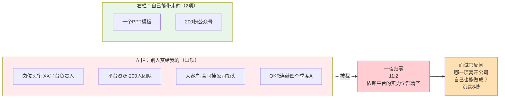
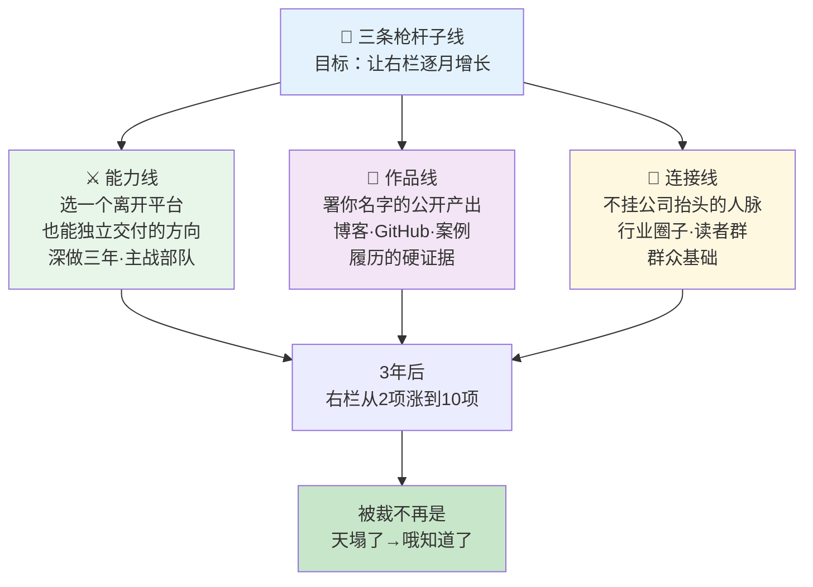
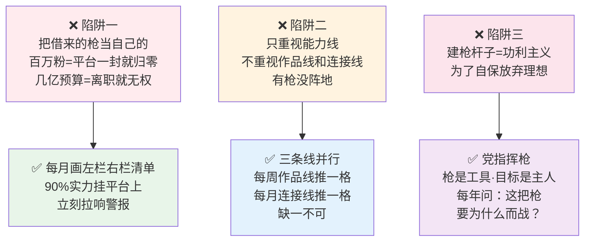

# 24.枪杆里面出政权

- 01.被裁那天归零
- 02.市面误读之辨
- 03.三层独家主张
- 04.一九二七现场
- 05.原文四维精读
- 06.左栏右栏清单
- 07.三条枪杆子线
- 08.三湾改编示范案
- 09.一个反面教材
- 10.三个认知陷阱
- 11.党指挥枪原则
- 12.三年认知复利
- 13.收束三句金言

## 01.被裁那天归零

去年春天，公司一轮业务收缩，我所在的业务线整条被砍。HR 找我谈话那天，我手上还拿着前一天外部会议的名牌，上面印着"XX 平台负责人，张某"。

我以为自己有筹码。过去三年，我带过 20 多人的团队、对接过大客户、在行业大会上做过分享、内部 OKR 连续四个季度 A。真到被裁那一周，我才发现一个让我脊背发凉的事实：我带过的 20 多人——属于公司不属于我；我对接过的大客户——合同挂在公司抬头，换东家就联系不上他们；我连续 A 的 OKR——出了这家公司没有任何人认这个评级。

我在白纸上写"卸掉岗位头衔之后还剩什么"，列出来只有四项：一个 PPT 模板、半本行业笔记、一张过期的证书、一个 200 粉的公众号。**那一刻我真正听懂了那句话——"政权是由枪杆子中取得的"**。我的话语权、议价权、安全感，过去全部由一个东西支撑：公司的组织架构图。组织架构图一改，我的"政权"一夜归零。

失业第一个月疯狂面试投了 60 多家，进终面只有 3 家。打击最大的不是没 offer，是一个面试官的反问——"你刚才讲的这些成绩，**哪一项是离开那家公司你自己一个人也能做成的？**"我愣了 8 秒，一个都答不上来。我所有"拿得出手"的履历，都是在"某平台乘以某资源乘以某团队"的前提下完成的。把前提抽掉，我就是一个没有独立作战能力的中层执行者。回家重读《战争和战略问题》——"枪杆子里面出一切东西。"我一直把"枪杆子"理解成硬实力，**那天突然听懂另一层——枪杆子是你自己能拿走、不依附任何平台、随时能开火的那把**。

一张纸画清——裁员的代价就是"左栏太长，右栏太短"：

## 02.市面误读之辨

讲到"枪杆子里出政权"，市面上最常见的三种解读每一种都偏到了沟里。

误读一：枪杆子等于暴力崇拜。很多人把这句话简化成"信奉武力"，把毛主席讲的辩证逻辑抠成一个口号。毛主席从来不是在歌颂暴力——**他是在揭示阶级社会政权更替的客观规律**，反动统治阶级用枪维护统治，被压迫阶级要解放就必须组织自己的武装。这是被逼出来的结论，不是一个偏好。

误读二：枪杆子等于硬实力。把"枪杆子"等同于硬技能——会一门技术、有学历、有证书就有枪杆子。错。技能学历能不能带得走、能不能独立开火？一个挂在公司平台上的"高级架构师"离开公司就没人认——**这不是真正的枪杆子，是借来的枪**。

误读三：枪杆子等于个人英雄。"靠自己的枪杆子"被解读成凡事单打独斗——不合作、不结盟、不依靠任何人。这完全忽略了毛主席的群众路线。毛主席讲枪杆子从来强调**"枪杆子的根在人民"**——离开群众基础，再硬的枪也是孤军作战弹尽粮绝。

## 03.三层独家主张

**第一，枪杆子的本质是"实有、自主、可调用"**。实有——这把枪在你手里、你数得清、你能调动。列得出"我能独立交付的能力"清单吗？每一项都不依赖某个公司/平台/老板？自主——调用这把枪的决策权在自己手里。如果必须过老板审批、依附系统，这把枪本质上是被托管的。可调用——关键时刻拿出来就能用。写在简历上的能力关键时刻能不能立刻调用？不可调用的只是装饰品。

**第二，枪杆子会被反向绑架——所以必须"党指挥枪"**。很多人有了一种能力就被反向定义——"有锤子看什么都是钉子"。毛主席画了红线：枪是工具，理想、纲领、组织才是主人。落到个人——能力指挥目标危险，目标指挥能力健康。在能力之上保留一层"我是谁、我要去哪"的清醒。

**第三，枪杆子的力量根源不在枪，在人**。没信念没纪律没群众基础的部队再多枪也是散沙，有信念的小米加步枪也能打败大炮飞机。**能力的力量根源不在能力本身，在能力背后的那个人**——你为什么而做？愿意为谁负责？根的问题想清楚能力才会越用越强。

## 04.一九二七现场

1927 年春，国共合作正进入"成果丰收期"。北伐军一路打到长江，共产党党员从 1000 人猛涨到近 6 万人。但大好的背后埋着一颗雷——**共产党几乎没有自己的武装力量**。当时的方针是"一切经过国民党"，军队政权全在国民党手里，共产党主要做民众运动、宣传工作。

1927 年 4 月 12 日，蒋介石在上海发动"四一二"反革命政变，机枪扫射工人纠察队。7 月 15 日，汪精卫在武汉发动"七一五"政变。从 1927 年 3 月到 1928 年上半年，被杀害的共产党员和革命群众达 31 万多人，党员从近 6 万人锐减到 1 万多人。就是在这个血淋淋的背景下，1927 年 8 月 7 日，中共中央在汉口召开八七会议。毛泽东发言说："**蒋、唐都是拿枪杆子起的，我们独不管。须知政权是由枪杆子中取得的。**"

四个变量同时作用——31 万死难者的鲜血（和平的、议会的路彻底走死了）、党内的书生气（当时主流是陈独秀的"一切经过国民党"路线）、毛泽东自身的实地考察（花了一个多月在湖南考察农民运动看到农民拿起梭镖建立武装）、国民党的实力对比（蒋有黄埔系、唐有湘军，共军实质性武装是零）。**这份诊断书的潜台词是——"我们这一年的失败，不是因为不够努力，是因为没枪。下一年再不武装，整个党就没了"**。

## 05.原文四维精读

"每个共产党员都应懂得这个真理：'枪杆子里面出政权'。我们的原则是党指挥枪，而决不容许枪指挥党。但是有了枪确实又可以造党，八路军在华北就造了一个大党。还可以造干部，造学校，造文化，造民众运动。延安的一切就是枪杆子造出来的。枪杆子里面出一切东西。"

字眼一"枪杆子"——毛主席用的不是"军队"或"武装"，是一个非常具体、可触摸、可清点的物理对象。一支军队可以含糊，但多少枪杆子是数得清的。字眼二"出"——不是"赢得"、不是"换取"，是生长、孕育、从中诞生。政权不是枪杆子的奖励，是枪杆子的产物。字眼三"一切"——不是夸张是具体清单：党、干部、学校、文化、民众运动。枪杆子不仅是军事问题，是底层的力量来源。

1938 年抗战进入相持阶段，党内出现"服从大局、少搞武装、多搞统战"的声音（以王明为代表）。毛泽东这段话正是说给这种声音听的——1927 年专做民众运动不抓军事栽过一次跟头，今天抗战期要不要再栽一次？

最反共识的洞见是那个倒置——**不是有了纲领再去拿枪，是有了枪才能造党**（八路军造出华北大党）；不是有了文化运动再要枪，是有了枪才能造文化（延安一切是枪杆子造出来的）。落到职场——**很多人以为"先想清楚再找资源"，真实情况经常反过来——你有了独立能力，才有资格想象自己想做什么；没那把枪，连战场都进不去**。

## 06.左栏右栏清单

我失业那周做的第一件事——一张纸分两栏。**左栏"别人赏给我的"**：岗位头衔、平台资源、团队、客户合同、KPI、公司邮箱；**右栏"我自己能带走的"**：可独立交付的能力、署我名字的作品、属于我的客户/读者、不依赖平台的收入。

我那次的清单左栏 11 项，右栏 2 项——比 1:5 还悬殊。这一画的价值是把"模糊的不安"变成"具体的清单"——不安没法解决，清单可以一条条收拾。标准是——右栏少于 3 项，就是在给别人的政权打工。每月重新列一次，目标是右栏每月至少增加一项。这不是一个数字游戏——右栏每增加一项，你对平台的依赖就降低一分，你的议价权就增加一分。当右栏从 2 项逐渐涨到 10 项的时候，你会发现你对裁员通知的反应从"天塌了"变成"哦，知道了，正好换个地方"。

每做一件事前强制问："**做完产出进左栏还是右栏？**"进左栏的事归公司离职带不走，进右栏的事归自己永远跟着我。进左栏尽量压缩，进右栏尽量放大。现实中不可能 100% 进右栏（要拿工资），关键是确保**右栏增量大于等于左栏增量**，三年下来右栏逐渐接近、超过左栏，独立性就建立起来了。

## 07.三条枪杆子线

知道右栏要填，怎么填？三条线并行。

建枪杆子的三条线——必须并行，缺一不可：

**能力线**（核心硬技能）——选一个别人抢不走、离开平台也能独立交付的方向深做三年。这是"主战部队"。**作品线**（公开可验证的产出）——把有价值的事情以你自己的名字沉淀下来：博客、GitHub、文章、案例、产品。这是履历的硬证据——即使公司经历被抹，这些还在公网上任谁都能验证。**连接线**（自己名下的人脉）——建一个只属于你个人、不挂公司抬头的行业圈子/读者群/客户关系。这是"群众基础"——换工作一发就有人接住。

三条缺一不可——没作品是纸上谈兵（有枪没子弹），没连接是孤军作战（有枪没队伍）。每周至少给作品线推一格（博客/commit/案例），每月至少给连接线推一格（行业交流/认识新人）。年底做三张表盘点——右栏新增清单、左栏依赖清单、三条线进度表。某年三条线都没动就是警报——你只是在原地消耗没在长枪，表面上的稳定其实是最大的不稳定。

## 08.三湾改编示范案

1927 年 9 月秋收起义失败后，部队从 5000 锐减到不足 1000。毛泽东在三湾做了三件改革——支部建在连上（党的组织延伸到最基层，把军队从军官私军变成党的部队）、建立士兵委员会（官兵平等、不打骂、经济公开，把军阀习气从根拔掉）、缩编精干（不足千人缩编为一个团，人不在多在精）。

三件改完枪杆子才真正变成"党的枪杆子"，不再是某个军官某个山头的枪杆子。"党指挥枪"这条原则的诞生意义远超军队管理——它确立了**枪是工具、理想纲领组织是主人**的根本秩序。落到个人同样锋利——能力要服从目标，不能让能力绑架目标。很多人学新技术就到处找地方用，看钉子也用、看螺丝也用——这就是"枪指挥党"。真正的"党指挥枪"是反过来：先想清楚要解决什么问题、去哪里，再选合适的能力来用。**能力是工具不是目的**——把能力当目的的人一辈子都在追新技术、追新赛道、追热点，看起来很努力，本质上是被技术拖着走；把能力当工具的人只学解决当前目标必需的东西，看起来学得少，但每一样都能变成阵地。三湾改编最深的启示是：**先有"党"才有值得打的仗，先想清楚你为什么而战，你的枪才不会走火伤到自己**。

## 09.一个反面教材

老李 2003 年进入互联网，先后在三家头部公司做过 VP——某搜索业务 VP 五年、某电商增长 VP 四年、某金融科技商务 VP 三年。每段履历金光闪闪。2022 年被裁，找了 9 个月才落到二线公司当顾问，月薪从 8 万降到 3 万。

三个问题暴露——左栏全是借来的枪："几亿预算"是公司的预算不是他的客户，"200 人团队"是公司的架构他离职第二天联系不上一半人，"几十家头部客户"合同挂公司抬头。过去 12 年累积的所有实力全是借来的。作品线一片空白——12 年没一篇公开署名文章、没一个公开项目、没一份独立可验证案例，面试官无法独立验证他的能力只能凭"前公司 VP"头衔推断。连接线挂在平台上——他的人脉清一色是"过去合作过的乙方"，这些乙方的态度跟他过去甲方身份强相关，离开平台后人脉价值急剧衰减。

根本问题——**12 年把"借来的枪"擦得越来越亮，从没自己造一把枪**。所有产出全部进了左栏，右栏长期空。更可怕的是巅峰期（月入 50 万+）完全没有居安思危——因为太顺了以为借来的硬就是自己的硬。直到 51 岁突然发现——12 年累积的所有实力平台一拿走就什么都不剩。老李后来跟我复盘时说过一句让我印象特别深的话——**"我以为我在积累，其实我一直在消耗别人的资源来包装自己。"** 巅峰期越舒服的人越危险，因为舒服本身就是麻醉——你以为在成长，其实是被平台的红利抬着走。等平台不抬你了，你才发现自己一直在原地。

## 10.三个认知陷阱

三个认知陷阱：

陷阱一：把"挂在平台上的能力/资源/影响力"误当成"自己的"。百万粉大 V 平台一封号就归零，掌管几亿预算的总监离职第二天连签字权都没。这些都是借来的枪，平台一句话就能收回——但很多人拿着借来的枪会误以为是自己的实力开始膨胀。破解：每月做一次左栏右栏清单，发现 90% 实力都挂平台上就立刻拉响警报。

陷阱二：只重视能力线、不重视作品线和连接线。很多技术人一身硬功夫但作品没公开输出、行业没朋友、客户不认识——有枪没阵地关键时刻找不到战场。破解：三条线必须并行——每周至少给作品线推一格，每月至少给连接线推一格。

陷阱三：把"建枪杆子"理解成"功利主义"——以为追求独立能力就要放弃理想价值观整天为自保打转。把"枪杆子"和"党"对立了。党指挥枪——枪是工具，理想纲领意义是主人。没理想的枪杆子最终变成军阀——很多人有钱有名有能力却活得拧巴就是这种状态。**独立不是终点，独立之后你要打什么仗才是终点**——独立只是让你"有资格选择"，选择去打什么样的仗才决定你成为什么样的人。破解：每年问自己一次"**我建这把枪是为了什么？希望它去打什么仗？**"

## 11.党指挥枪原则

"党指挥枪"这个原则落到个人身上有具体翻译——**永远不要让能力定义你，而是你定义能力**。

很多技术人能力极强但客户伙伴人脉都弱，只能在某公司里打工；技术中等但客户群读者群行业关系深厚的人反而能跨越平台跨越周期长期变现——前者是没有人民的孤军，后者是有人民的部队。群众路线三动作——走到群众中去（真正接触用户客户读者了解真实问题）、从群众中来（产品内容服务的源头要来自真实需求）、为群众服务（用完让人觉得"这帮我"而非"这忽悠我"）。三件事做好的人周围会形成根据地群众——推荐他、复购、换工作时打招呼，**这是个人版人民战争底盘，比任何简历头衔都管用**。

最后一个洞见——**枪的真正力量不在枪本身，在拿枪的人为什么而战**。两把一模一样的枪，一把为涨工资而战，一把为"让这个行业变得更好"而战——五年后拿第一把枪的人还在打工，拿第二把枪的人已经成了行业里的标杆。不是因为第二把枪更好，是因为第二把枪背后的信念让人愿意押上更长的时间、更深的投入、更不可替代的价值。这就是为什么"党指挥枪"不是一句政治纪律，而是一句生存智慧——**你的枪必须服务于一个比你更大的东西，否则这把枪迟早会反过来奴役你**。

## 12.三年认知复利

第一周画左右栏清单——左栏 11 项右栏 2 项，把模糊不安变成具体清单。第一月立三条枪杆子线——能力线深耕一个方向、作品线用真名开独立博客每周更新、连接线经营不挂公司抬头的小圈子。三条线贴显示器边上，一年内不允许任何一条断掉。

半年盘点——能力线是否形成代表作？作品线是否积累 20-30 篇内容构成有逻辑的作品集？连接线他们遇事会主动想到你吗？半年最大的收获不是数据本身——是"我能掌控自己生长"的自信。

三年后枪杆子思维变成底层操作系统——新机会摆面前第一反应不再是"工资多少头衔多大"，而是"做完能往右栏加几项"。职业上不再是"某公司某总监"而是"行业里某某"名字就是品牌；收入上不再 100% 来自月薪，任一条断了其他还能撑；心态上看别人因裁员失眼看平台政策崩盘焦虑，你能淡定说"幸好之前建了"——**这种淡定就是最大的复利**。议价上 HR 客户合作方不再能轻易压价——因为能力作品连接线都是公开可验证不可替代的。三年下来"枪杆子里出政权"不再是道理，是你切身体会的现实——话语权、议价权、安全感，完全是手里那把自己的枪撑起来的。不是别人赏的，是你自己一枪一枪打下来的地盘。

## 13.收束三句金言

**可以加入平台、可以借力平台，但一定要有一把"拿得走、带得出门"的枪——否则你所有的政权都是别人赏的，平台一句话就能收回去。**

盘"左栏"和"右栏"——把"别人赏给你的"和"你自己能带走的"分两栏列出来。如果右栏不到 3 项，你就是在给别人的政权打工。建三条枪杆子线——能力线（深耕一个脱离平台也能立足的方向）、作品线（公开可验证署你名字的产出）、连接线（不挂公司抬头属于你自己的人脉）。每件事问归属——**这件事做完是进左栏还是进右栏？** 进左栏的事尽量压缩，进右栏的事尽量放大。三年下来右栏堆到左栏之上，你就从"给别人打工"变成"用自己的枪打自己的仗"了。

**如果你今天突然失去现在的岗位被裁被打回原形——抹掉公司抬头之后，你还能拿着什么去找下一份饭吃？** 答案清晰，你已经在造自己的枪；答案模糊，今晚就开始画那张左栏右栏清单。**枪杆子不是一夜之间造出来的，是一枪一枪打出来的**——每天一小步，三年后你手里那把枪，就是任何风浪都动不了的底盘。
