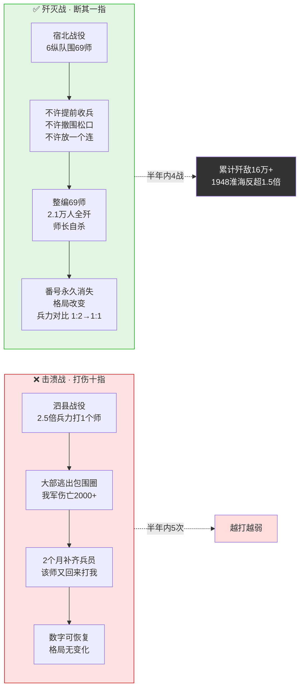
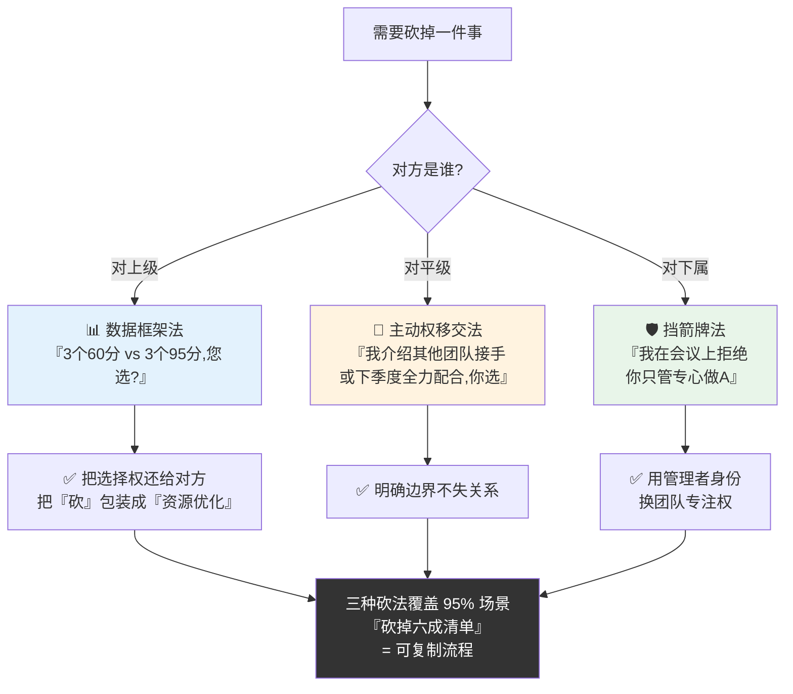
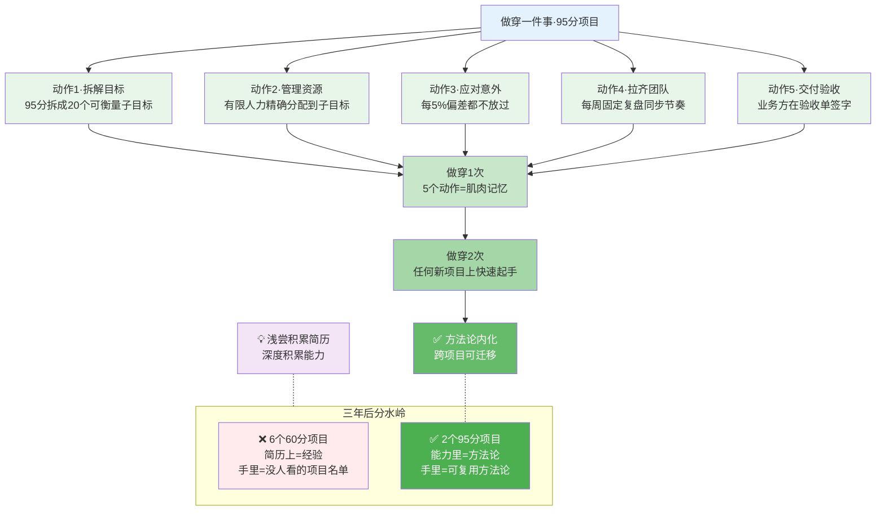

# 伤十指不如断一

- 01.六件半途而废
- 02.市面误读之辨
- 03.三层独家主张
- 04.一九四六血训
- 05.原文四维精读
- 06.彻底完成的意义
- 07.砍掉的勇气比加法
- 08.一事穿百事通
- 09.团队完成文化
- 10.一个商业切片
- 11.三个认知陷阱
- 12.三年认知复利
- 13.收束三句金言

## 01.六件半途而废

前年我带团队同时开了 6 个项目。季度初我信心满满地画了甘特图，人力分配、时间节点、交付标准，每条都在图上。季度末所有 6 个项目都"完成"了，但没有任何一个让业务方满意。不是没做完，是**没做穿**。

A 项目做了基础功能但性能优化没做，上线后用户嫌慢；B 项目做了主流程但异常处理没做，第三天就出了一个线上故障；C 项目交付了但文档没写，下一个接手的人花了两周才看懂代码。每一个都"差不多"，凑在一起就是六个"差不多"，等于**零个能用的成果**。

季度复盘会上我老板说了一段让我至今羞愧的话："**你做了 6 件事，每件都打到了 70 分。但如果你只做 2 件事，把那 6 件的人力全部压进去，那 2 件事应该能到 95 分。你的问题不是不努力，是你舍不得砍。**"

那天晚上我翻毛选，看到毛泽东在《中国革命战争的战略问题》里写的："**对于人，伤其十指不如断其一指；对于敌，击溃其十个师不如歼灭其一个师。**" 我突然懂了，我之前打仗的方式是"打伤十个敌人"，十个敌人都还在，他们回去包扎一下下周继续打我。真正有效的打法是**歼灭一个，打到一个敌人永远消失**。在项目管理上的翻译就是：与其六个全部半吊子，不如两个彻底做穿。

下个季度我把项目数从 6 砍到 2。人力不变，产出翻倍。不是因为效率变高了，是因为**切换成本归零了**。**上个季度团队每天平均在 5 个项目之间切换 12 次，每次切换预热 15 分钟，一天纯粹被切换消耗的时间接近 3 小时**。砍到 2 个项目之后每天切换 1-2 次，被切换偷走的时间归零，多出来的 3 小时全部用在深度打穿上，这就是"产出翻倍"背后的物理解释，不是玄学。

## 02.市面误读之辨

市面上讲"伤其十指不如断其一指"的人，最爱把它讲成"要专注"。这个讲法有两个问题：第一，它暗示专注是一种性格特质，好像有人天生专注、有人天生不专注。但实际上这不是性格问题，是**组织资源分配问题**。你不专注不是因为意志力不够，是因为你的组织允许了 6 个项目同时存在。

第二，"要专注"没有给判断标准，专注到什么程度才算完？大多数人以为做完就算专注了。但毛泽东给的标准是"**断其一指**"，不是打到对手撤退，是打到对手这个建制单位**永久消失**。"做完"和"做穿"之间的差距，就是"击溃"和"歼灭"之间的差距。

为什么"专注"这个版本最流行？因为它只要求你**改变自己**，不要求你**改变组织的运行逻辑**。而真正的"伤其十指不如断其一指"要求你把同时进行的项目砍掉三分之二，这会得罪所有项目的需求方。市面书不敢讲这一层。

## 03.三层独家主张

**第一层，深度就是壁垒**。十个 60 分的项目合在一起不等于一个 600 分的项目，它们等于十个可以被任何人替代的平庸产出。但一个 95 分的项目可以成为你在这个维度上三年的护城河。深度本身就是竞争门槛，因为深度需要时间，而时间是对手唯一偷不走的东西。

**第二层，砍掉比做到更需要勇气**。"伤其十指不如断其一指"最难的环节不是"怎么断"，是**怎么拒绝另外九个指头**。每一个被你砍掉的项目背后都有一个需求方、一个 KPI、一个排期承诺。你的第一次拒绝会收到愤怒，第二次收到无奈，第三次他们就会开始自己找别的方案。砍到第三次的时候，你的专注空间才真正被释放出来。

**第三层，完成一仗会改变团队的能量状态**。一个团队如果长期处于"什么都做、什么都差点"的状态，会陷入慢性低能量，每个人都觉得自己很忙，但没有人觉得自己做成了任何事。一旦这个团队尝过一次"彻底打穿一件事"的甜头，他们的信心和士气会发生质变。**胜利会催生下一个胜利**，而半吊子只会催生更多半吊子。

## 04.一九四六血训

1946 年 6 月全面内战爆发后，国民党军队在华东战场集中了 50 万兵力（**5 个整编军、17 个整编师**），采取"稳扎稳打、步步为营"的战术。解放军华东野战军在陈毅、粟裕指挥下，**总兵力约 27 万**，敌我兵力对比接近 1:2。一开始试图分兵多处阻击，结果是处处受制，伤亡惨重。

**7 月泗县战役**，粟裕集中 2.5 倍的兵力攻打国民党一个师，结果打成了击溃战：**该师大部逃出包围圈，我军伤亡 2000 余人，两个月后国民党补齐兵员重新上了前线**。战后粟裕彻夜未眠，翻着地图上一条一条的伤亡数据，第二天召开的军事会议上他讲了一句让所有人沉默的话：**"我们赢了战术，输了战略。因为我们打伤的这个师，两个月后又回来打我们了，我们等于什么都没做。"**

粟裕痛定思痛，在宿北战役前给各部下了死命令：**"不歼灭，不开枪。打就必须吃掉，吃掉一个是一个。"** 这句话在当时是极其反直觉的，因为战机往往稍纵即逝，"必须吃掉才动手"意味着放弃很多机会。但粟裕的逻辑是：**放弃 9 次浅打，换 1 次彻底吃掉，才是解放战争唯一的赢法**。

**12 月宿北战役**，华东野战军集中 6 个纵队的兵力（**约 15 万人**）围歼国民党的整编第 69 师。粟裕把命令写到了每一个团长手上：**不许任何部队提前收兵、不许撤围松口、不许放出一个成建制的连队**。最终整编 69 师 2.1 万余人被全歼，师长戴之奇自杀。**这是解放战争以来第一次真正意义上的歼灭战**，不是一个师被打散了重新募集，是**这个师的番号从此在国民党序列里消失**。

宿北战役之后半年内，华东野战军又打出了**鲁南战役（歼灭 5.3 万人）、莱芜战役（歼灭 5.6 万人）、孟良崮战役（歼灭整编第 74 师 3.2 万人）**，每一次都是"断其一指"的完整歼灭战。**从 1946 年 12 月到 1947 年 5 月，华东战场敌我兵力对比从 1:2 反转为 1:1，再到 1948 年淮海战役时华东野战军已经反过来 1.5 倍于对手**。这个反转不是靠打伤更多人，是靠**每一次都断一根手指**，每断一根，对手的可用手指就少一根，而且永久少一根。

粟裕后来说了一句极朴素的话："**伤十指不如断一指。击溃战中你赢了伤亡数字，歼灭战中你赢了力量对比。数字是可以恢复的，格局不能。**"

击溃战 vs 歼灭战的本质差异一图看透：

## 05.原文四维精读

> 原文："**对于人，伤其十指不如断其一指；对于敌，击溃其十个师不如歼灭其一个师。**"

请注意毛泽东用的人称，"对于人"和"对于敌"，这是两个完全不同的场景。伤其十指是**人力管理**上的原则，不要让团队在多件事上浅尝辄止；歼灭一个师是**竞争战略**上的原则，不要追求大范围压制，要追求在关键点上实现彻底突破。同一个原则在不同场景下的应用，被毛泽东用两个分号分得干干净净。

再看一个被忽略的词，**"断"**。不是"伤"，不是"打"，是"断"。断意味着**彻底分离、不可恢复**。你伤了对手一指，他一个月后能好；你断了他一指，这根手指此生不会再生。这个字的选择本身就决定了作战的意图，不是"占便宜"，是**永久改变力量格局**。

这段话最早的表述出现在 1936 年《中国革命战争的战略问题》。此时的红军刚刚经历了第五次反"围剿"的惨败和长征的九死一生，兵力从 30 万锐减到不到 3 万。毛泽东在总结教训时发现了一条残酷的规律：**之前所有"大规模歼敌"的计划都失败了，但那些"集中兵力歼灭敌人小股部队"的战术每次都成功了**。他从这条规律里提炼出了"伤十指不如断其一"的原则。

这段话内部有一个张力：**"断其一指"需要你放弃"打伤十指"的战绩快感**。打伤是即时反馈，你马上就能汇报"今天打退了五个进攻"；消灭绝是延迟反馈，你可能打了两天还没有可以汇报的战果。人类的天性是追求即时反馈的，而深度投入是反天性的。**能忍住"战绩快感"的人，才配得上"歼灭战"的结果**。这也是为什么大多数团队做不到"断其一指"，不是能力不够，是**心理承受力不够**，两周没战绩汇报，团队和上级都开始怀疑方向，然后被迫回到"多线程刷战绩"的舒适区。**真正的深度投入需要一个能挡住三个月没战绩汇报压力的领导者**，这个能力比任何战术能力都稀缺。

市面上把这句话翻译成"宁缺毋滥"。这是**彻底错的**。"宁缺毋滥"说的是标准，质量不好的不要。但毛泽东说的是一道**数学题**：你的人力是固定的。6 个项目各 10 人，每个项目 60 分。2 个项目各 30 人，每个项目 95 分。**资源恒定，分布决定产出**。这不是审美选择，是**资源配置学**。把资源配置学讲成品位修养，就是把最硬的工具包成了最软的枕头。

## 06.彻底完成的意义

一个被打穿的成果和十个浅尝的成果，在组织记忆里的留存时间完全不同。团队会记得那件"我们真正做穿了的事"，**那个项目是怎么打的、谁立了关键功劳、最后交付的那一刻是什么感觉**。这种记忆会成为团队的**信心储备**，下次遇到难事，他们会说"上次那个更难我们都打穿了"。

浅尝的项目不会产生这种记忆。它们只会产生一个模糊的印象，"我们好像很忙，但我记不清上次交付了什么"。这种记忆不是信心储备，是**疲劳储备**，每次回忆都在消耗能量。**一个团队三年之后的实力差距，本质上是"信心储备账户"的差距**，不是能力差距，是"记得住的胜利"数量的差距。

**打穿的另一个隐性收益是外部认知**。一个项目做到 95 分，业界会记住你的名字，因为 95 分是**可被讨论、可被引用、可被写进案例**的等级。一个项目做到 60 分，业界不会提到你，因为 60 分是**没有辨识度的平庸**。你花同样的时间，做穿一件事换来行业地位，做浅十件事换来简历上一行字，**深度产生溢价，广度只产生工资**。

## 07.砍掉的勇气比加法

每季度初列出所有要做的事，然后**强制砍掉至少一半**。砍的标准不是"这件事重不重要"，而是**"这件事不做穿，对核心目标有没有致命影响"**。绝大多数事情不做穿也没事，它们只是"做完了会更丰富"，但你缺的不是丰富，是深度。

砍掉最难的环节是面对需求方，每一个被砍的项目背后都有一个期待的人。技巧是**不是删除，是推迟**："这个项目我下季度做，这个季度我要先把核心的两件事打穿。"推迟让人感觉你是在"排期"，不是"拒绝"，虽然效果一样，但对方的接受度完全不同。

**具体的砍法有三种表达**：**第一种**（对上级）"我评估了一下，如果这季度同时做 A/B/C，每件事只能做到 60 分。如果只做 A，能做到 95 分，B/C 顺延到下季度，这样年底看您希望是 3 个 60 分还是 3 个 95 分？"，把选择权还给上级，同时用数据框架把"砍"包装成"资源优化"。**第二种**（对平级）"这季度我这边资源锁定在 A 上，B 我可以给你介绍其他团队接手，或者下季度我全力配合，你选。"，把主动权还给对方但明确边界。**第三种**（对下属）"这个季度我们的核心目标是 A，其余需求全部由我在会议上拒绝，你只管专心把 A 做好。"，用管理者的挡箭牌换取团队的专注权。**这三种砍法覆盖 95% 的场景**，用熟了之后，砍掉六成的清单就变成一个可复制的流程。

三种砍法一图对号入座：

## 08.一事穿百事通

打穿一件事之后，你会获得一个意外的副产品：**方法论的内化**。当你在一个项目上做到了 95 分，你不会只学会了那一个项目的技能，你学会的是**"怎样把一件事做到 95 分的方法"**。这个方法是跨项目可迁移的。

**具体来说**，做穿一件事的过程里你会遇到 5 个关键节点：**如何拆解目标（把 95 分拆成 20 个可衡量的子目标）、如何管理资源（把有限的人力精确分配到每个子目标）、如何应对意外（每一个 5% 的偏差都不放过）、如何拉齐团队（每周固定复盘同步节奏）、如何交付验收（不是自己说做完了，是让业务方在验收单上签字）**。这 5 个动作在任何一个 95 分项目里都会重复出现，做穿一次，5 个动作就成了你的肌肉记忆；做穿两次，你会发现自己已经能在任何新项目上快速起手。

对比一下：做了 6 个项目做到 60 分的人，只是"做了 6 个项目"；做了 2 个项目做到 95 分的人，学会了"怎么做好任何一个项目"。前者的简历上写的是"经验"，后者的能力里嵌的是"方法论"。**浅尝积累的是简历，深度积累的是能力**，三年之后，前者手里握的是一堆没人看的项目名单，后者手里握的是可以复用的方法论，这是简历和方法论最本质的分水岭。

一事穿百事通——五个动作的肌肉记忆生成路径：

## 09.团队完成文化

一个团队的"完成文化"不是靠喊口号建立的。是靠**打穿第一件事**建立的。团队第一次打穿一件事之后，他们自己会追着要打穿第二件事，因为他们尝过那种"真正完成了"的成就感。**那种感觉比"我做了很多事"的忙碌感，上瘾一百倍**。

Leader 的职责不是催进度，是**保护团队不被新加的事情打断**。每来一个新需求，Leader 要问的不是"我们能做吗"，而是"它比我们现在做的这件事更重要吗"。如果答案是不，拒绝它。**Leader 的拒绝能力比团队的开发能力更重要**，因为拒绝决定了资源分配，资源分配决定了深度。

**保护团队的具体动作有三个**：**第一，会议白名单**，只有和当前"打穿目标"相关的会议团队才需要参加，其余会议 Leader 一个人挡下来；**第二，需求单通道**，所有新需求必须走同一个入口（比如 Leader 邮箱或指定的 issue 系统），Leader 每周固定一个时段批量处理，团队不用被随时打断；**第三，Say No 记录本**，把每次拒绝的需求记下来（谁提的、原因、下季度是否重新评估），让团队知道 Leader 是在"系统地保护他们"，而不是"随机地推诿"。**这三个动作做好了，团队的深度专注时间可以从每周 10 小时提升到 30 小时**，这就是 3 倍产出的秘密，不是加班，是免打扰。

## 10.一个商业切片

> 2015 年微信支付和支付宝打移动支付战争。支付宝的策略是全面出击，线下扫码、线上电商、海外支付、信用体系、理财产品，所有战线同时推进。微信支付的策略完全不同，**只打一个点：社交红包**。
>
> 2015 年春晚微信支付发了 5 亿红包，一晚上绑卡 2 亿张。支付宝用了 10 年才积累到 3 亿用户，微信支付一个晚上追上了三分之二。张小龙后来在内部说："**我们不是赢了支付战争，我们只是在红包这一个点上打穿了。打穿之后，其他的自然来。**"
>
> 2016 年微信支付的市场份额从 10% 飙升到 37%。支付宝在十几个战场上和微信支付打得有来有回，但在红包这一个战场上被彻底打穿了。而红包打穿之后，用户绑了卡、设了密码、信任了微信，后面的线下支付、转账、理财全部水到渠成。

这个案例的核心洞察不是"红包很成功"，而是**打穿一个点之后会产生连锁反应**。你不需要在每一条战线上都赢，你只需要在一条线上赢到对手无法翻盘，赢的局面会自己扩散。

**再看一个反面**：同一时期某支付公司也想进入移动支付市场，选择的策略是"全面覆盖"，线下扫码、线上转账、海外结算、金融理财每一个战场都投入几十人的团队去打。**结果是每一个战场都做到 60 分但没有一个战场做到 95 分**，线下扫码打不过支付宝、线上转账打不过微信、海外结算打不过 PayPal、金融理财打不过陆金所。三年后这家公司烧了 20 亿现金流，最终被并购退出市场。**它输的不是资金，是战略**，把\"打伤十指\"的力气分成了 4 份，每一份都不足以\"断一指\"。**这就是撒胡椒面的最终结局**，广度看上去很勤奋，但没有任何一根手指真正被断掉。

## 11.三个认知陷阱

**陷阱一：把"在做事"当成"在做成事"**。周报里写了 10 件事，每件都在做，但没有任何一件真正交付。**忙碌感和完成感是两种完全不同的体验**，忙碌让你累，完成让你强。**识别方法**：看你上个月的周报，如果 10 项里没有一项能写出"已交付、业务方签字确认"这种确定性成果，说明你处于"在做事"状态而不是"在做成事"状态。破解动作：给每一项在做的事情设定一个"可验收标准"（谁来验收、验收什么、什么时候验收），验收不清的事情不算真的项目。

**陷阱二：不敢砍是因为"怕错过"**。"万一那个项目很重要呢"，这句话毁掉的专注力比任何外部干扰都多。**识别方法**：如果你的季度清单里有 5+ 项都是"以防万一"或"看看能不能"的项目，说明你被"怕错过"绑架了。破解动作：砍掉之后如果真的重要，你会在下个季度重新捡起来；**如果三个月都没人提，说明它根本不重要**，真正的重要事情不会被遗忘，会一直有人来催。用"三个月自动重启"机制来化解"怕错过"的恐惧。

**陷阱三：把"做穿"理解成"做到完美"**。做穿不是完美主义，是**在现有条件下做到对方无法复制**。**识别方法**：如果你打算把一个项目做到"每个细节都无懈可击"，你其实是在追求完美不是做穿，因为完美的标准是自我评价，做穿的标准是对手视角。破解动作：把"做到完美"改为"做到对手在三个月内追不上"，这才是可衡量的做穿标准。95 分是一个**战略判断**，不是美学追求，**够用就是天花板**。

## 12.三年认知复利

从 6 个项目砍到 2 个之后的第一季度，团队极度焦虑，他们习惯了多线程，突然单线程觉得"是不是不够忙"。**但第一个项目打穿之后，负责那个项目的团队在周会上说话的方式都变了**，不再是"我们在做"，而是**"我们做完了，这是数据"**。那种底气，我之前在任何一个半吊子项目的周报里都没见过。

**第一年的变化**：团队季度交付项目数从 6 项/季 降到 2 项/季，但业务方满意度从 60% 提升到 95%。**这不是数字游戏，是本质变化**，2 项打穿的价值远大于 6 项半吊子的总和。这一年团队还有一个反直觉的发现：**加班时间反而下降了**，因为切换成本归零之后，工作效率大幅提升，不需要靠加班补窟窿了。

**第二年的变化**：我把"每季度只打穿两件事"变成了团队的铁律。任何超过两件的新需求都自动排队。**团队不再需要在 6 件事之间来回切换，切换成本归零之后，交付速度反而翻了一倍**。这一年团队人数没变，但业务产出接近去年的 2.5 倍。**少打几根手指，多断一根手指，力是守恒的，你用在了深度上，就不会浪费在切换上**。

**第三年的变化**：我判断一个管理者是否成熟只有一条标准：**他敢不敢在季度初说"这个季度我们只做两件事"**。敢说的，要么是菜鸟不自量力，要么是真正理解了深度比广度重要一百倍，**实践会很快把菜鸟淘汰掉**。三年下来我招人时也开始用这条标准，问候选人"你上一份工作最后一个季度做了几件事"，答"6-8 件"的通常是执行者，答"1-2 件但打穿了"的通常是决策者。**这条问题成了我筛选团队核心成员的默认第一问**。

## 13.收束三句金言

**一句话核心**：**十个 60 分的项目不如两个 95 分的项目，深度本身就是壁垒，因为深度需要的时间你的对手没有**。**广度是没有护城河的，深度才是**，这就是这套方法论最本质的判断。

**你应该带走的三件事**：

**一，做穿比做完重要一百倍**：穿透标准是**"对手在这个维度上无法在三个月内追平"**。做完是自评标准，做穿是外评标准，只有做穿才产生真正的市场溢价。

**二，砍掉是勇气、推迟是技巧**：把"砍"包装成"排期到下季度"，降低对方的抗拒。**三种砍法**（对上级用数据框架、对平级用主动权移交、对下属用挡箭牌）覆盖 95% 的场景，用熟了砍掉六成清单就变成一个可复制的流程。

**三，打穿一件事会改变团队的能量**：信心的唯一来源是真正的胜利，而胜利只来自打穿。**保护团队三动作**（会议白名单、需求单通道、Say No 记录本），把团队的深度专注时间从每周 10 小时拉到 30 小时，这就是 3 倍产出的秘密。

**一句留给你的反问**：你手头在做的所有事情里，**哪一件是你决心在这个季度打穿的？** 如果你说不出来，你不是在做事，你是在撒胡椒面。先选一件，把其余全部推迟。**撒胡椒面的人不会饿死，但永远不会吃饱**，胡椒面撒得再均匀，也换不来一顿完整的饭。**做穿一件事就是把一顿完整的饭端上桌**，从今天起就练，先拒绝一个请求，再启动一个真正的打穿，你会发现，能真正吃饱一顿的人，走得比一直啃胡椒的人远得多，**深度是唯一能真正兑现成长期复利的东西，而广度只能兑现成简历上一行行冷冰冰的孤立无援的文字**。
