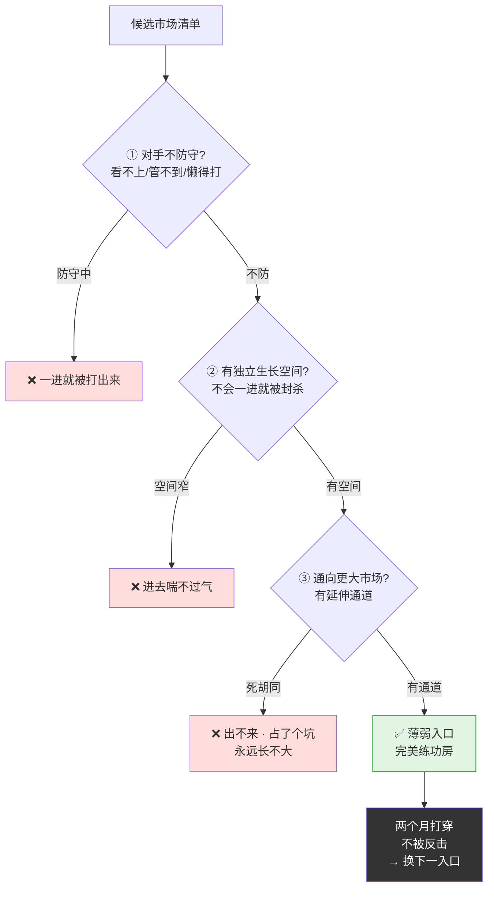
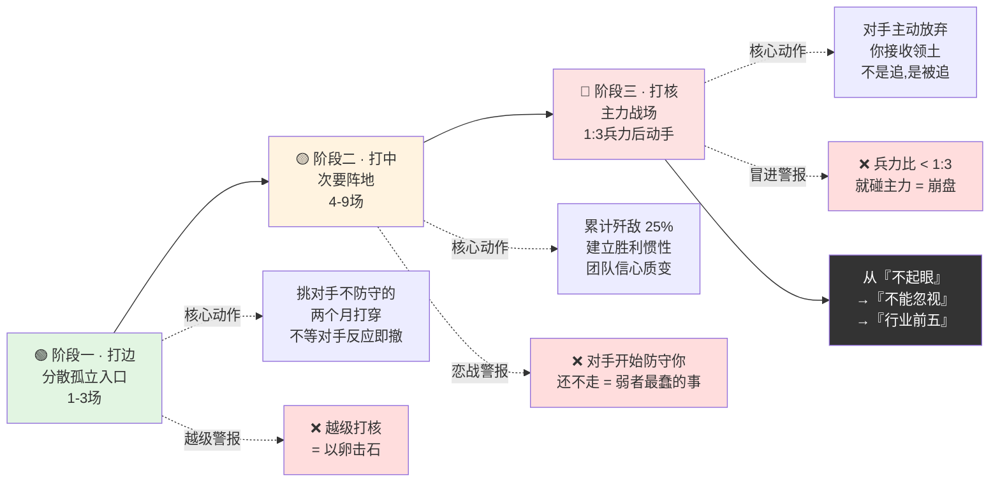

# 先打分散再歼灭

- 01.新市场无从下手
- 02.市面误读之辨
- 03.三层独家主张
- 04.一九四七鲁南
- 05.原文四维精读
- 06.识别薄弱入口
- 07.积小胜为大胜
- 08.不恋战不冒进
- 09.形成胜利惯性
- 10.一个商业切片
- 11.三个认知陷阱
- 12.三年认知复利
- 13.收束三句金言

## 01.新市场无从下手

前年我们想进入一个已经被六家大厂瓜分的企业服务市场。第一次战略会上，每个人都在讨论"我们怎么和这六家竞争"，市场部说要做品牌对标，产品部说要全功能覆盖，销售部说要低价抢客户。会开了三个小时，没有任何结论。

我让大家停下来，在黑板上画了一张竞争地图，只标注一个维度：**每家大厂在这个市场上投入的资源比例**。六家里，有四家把这个市场当成"顺便做的副线"，只有两家是真正的主力投入。我说："我们先不打那两家主力，先打那四家副线中最懈怠的一家。"

有人问："为什么挑最不起眼的打？"我说："因为**只有他们不会还手**。我们现在的体量经不起任何像样的反击。我们需要一场不被反击的胜利。"

我们选了那家大厂的边缘业务线，他们在这个细分场景上只驻了两个销售、产品三个月没更新、客户满意度全行业垫底。我们六个人花了两个月只做这一个细分场景，把客户满意度从垫底打到了行业前三。两个月后，那个大厂悄悄撤出了这个场景，他们觉得"不值得为这么小的市场跟我们纠缠"。

那一刻我突然明白，毛泽东那句"**先打分散和孤立之敌，后打集中和强大之敌**"不是一句军事原则，是一套**弱者生存法则**。弱者不能选"最有价值的战场"，只能选**"对手最不愿意防守的战场"**。在这个战场里赢，你不需要比对手强，你只需要比对手更在意这个战场。

## 02.市面误读之辨

市面上把"先打分散孤立"讲成两种东西。第一种是"柿子挑软的捏"，选最弱的对手打。这句话本身没错，但它暗示你是在**逃避挑战**。而毛泽东讲的不是逃避，是**从对手不防守的入口撕开战线**。你选的不一定是"最弱的对手"，而是**"对手最不愿意投入资源防守的阵地"**。这两者的差别在于：弱的对手可能只是体量小，但他可能在拼命防守你；懈怠的阵地可能属于大厂，但大厂根本不在乎这个阵地。

第二种误读是"渐进式扩张"，先做小市场再做中市场再做大市场。这种理解漏掉了最关键的一条：你从小市场切入不是为了"渐进的训练"，是为了**积累不被反击的胜利**。每一场不被反击的胜利都在做同一件事，**消耗对手的注意力但不消耗你自己的资源**。你在对手不在意的地方连赢三次，等对手反应过来的时候，你已经变成了他无法忽视的体量。这时候不是你在追他，是他在追你。

为什么这两种误读流行？因为它们把一条残酷的弱者生存法则，讲成了一种温和的成长路径。温和的东西好卖，但温和的东西在真实竞争里没有任何杀伤力。

## 03.三层独家主张

**第一层，选入口的标准不是"这个市场有多大"，是"对手会不会防守"**。大多数小公司死在了第一步：他们根据市场报告选了一个"最有潜力的市场"，结果选了之后发现大厂也在那个市场倾注主力。你不是在以小博大，你是在以卵击石。正确的入口是大厂**看不上、管不到、懒得打**的地方，它小、它不起眼、它在任何估值模型里都不值得专门配置资源。但偏偏是这种地方，是你的完美练功房。

**第二层，先打分散的目的不是"赢一次"，是"建立不被反击的胜利循环"**。弱者最怕的不是输，是**赢了一次之后被对手报复**。你不怕输，你早就输习惯了。但你怕赢了之后对手调动主力来围剿你，那时候你会比没赢之前死得更快。先打分散的终极目的，是让你在对手还没意识到你是威胁之前，连赢三到五次，把体量从"不起眼"涨到"不能忽视"。

**第三层，积小胜为大胜不是鸡汤，是数学**。你在五个分散战场上各赢一场，每个战场歼灭对手 5% 的兵力，五场下来你累积消灭了对手 25% 的兵力，而你的损失因为他们都没还手，总量不到 5%。这就是"先打分散"的数学优势：**你的每一次胜利成本都极低，对手的每一次损失都是不可逆的**。当力量对比从最初的 1:10 变成 25% 的此消彼长之后，你就有了打强敌的资格。

## 04.一九四七鲁南

1947 年 1 月鲁南战役，是解放战争中华东野战军第一次大规模歼灭战。战前局势是：国民党在华东集中了 50 万主力，包括整编第 26 师和第 1 快速纵队，这是蒋介石的五大王牌之一，全美械装备。

粟裕做了一个所有参谋都反对的兵力分配：不打第 1 快速纵队，先打分散在鲁南外围的整编第 51 师。51 师是东北军改编的杂牌军，装备差、士气低、和主力 26 师之间有 30 公里的空隙。粟裕用了 27 个团去打一个杂牌师，兵力比接近 3:1。

1 月 2 日发起攻击，仅用了 4 天，整编 51 师 1.3 万余人被全歼。吃掉 51 师之后，粟裕立刻掉头打 26 师。26 师失去了侧翼掩护，被华东野战军 24 个团包围在峄县到向城一带。1 月 11 日发起总攻，仅 3 天全歼 26 师和快速纵队共 2.4 万余人。

鲁南战役打了 18 天，歼敌 5.3 万。战后粟裕总结的第一条经验是："**先打分散孤立之敌，一则稳操胜券，二则使强敌失去羽翼。**"翻译过来就是：先吃掉最容易的那个，不是为了欺负弱小，是为了让强大的那个失去帮手。

## 05.原文四维精读

> 原文："**先打分散和孤立之敌，后打集中和强大之敌。先取小城市、中等城市和广大乡村，后取大城市。**"

请注意毛泽东用的两个"先"和两个"后"，这不是建议，是**严格的先后顺序**。他在用最朴素的句式传递一个最核心的战场规则：**不要越级打怪**。你没打过团级歼灭战之前，不要碰师级的；你没在边缘市场站稳之前，不要进核心市场。顺序错了，后面全错。

再看一个被忽略的词，**"分散和孤立"**。这不是一个概念，是**两个判断标准**。分散是物理距离，这支部队和它的友军之间有没有足够的空隙；孤立是支援能力，这支部队一旦被攻击，友军能不能在有效时间内赶到救援。两个标准合在一起才构成"可打"的判断。只分散不孤立的部队不能打，因为友军能赶来；只孤立不分散的部队也不能打，因为对方本身够强。

这段话出自 1947 年 12 月毛泽东的《目前形势和我们的任务》，是十大军事原则的第二条。此时解放战争从战略防御转入战略进攻，解放军从前两年的"选择不打"转向了"选择怎么打"。把这一条放在原则的第二位，紧排在"先打分散孤立"之后的是"先取小城市后取大城市"，两条原则共同构成了一个完整的弱者进阶路线图：**先打边 → 再打中 → 最后打核**。

这段话内部有一个张力：**你今天的胜利会影响你明天的对手**。你吃掉一个分散的敌人，这个战果会被其他敌人看在眼里。他们会产生两种反应：更分散（怕被你吃掉所以不敢孤军深入）或更集中（意识到你在逐个击破所以赶紧抱团）。你的策略在改变对手的行为，聪明的弱者会在吃掉两三个之后就预判对手的抱团行为，提前调整下一个攻打目标。**先打分散不是机械的步骤，是和对手之间的动态博弈**。

市面上把这句话翻译成"先易后难"。这是**彻底错的**。"先易后难"说的是难度排序，选择你个人能力范围内的优先做。但毛泽东讲的是**对手状态的排序**，选择"对手不防守的"优先打。一个对你来说容易的任务和一个对手不防守的任务，是完全不同的两个概念。前者是学生思维，后者是指挥员思维。

## 06.识别薄弱入口

薄弱入口需要同时满足三个条件：第一，对手不防守或防守极弱，他要么没看见这个入口的价值，要么看见了但不值得为此专门配置资源；第二，这个入口有独立的生长空间，你在里面不会一进就被封杀；第三，这个入口和更大的市场之间有通道，你在这个入口里积累的用户和口碑，有一天可以延伸到更大的市场。

三条缺一不可。缺第一条，你进不去就被打出来。缺第二条，你在里面喘不过气。缺第三条，你进去了但永远出不来，你只是占了一个死胡同。

薄弱入口三条件筛选表一图看透：

## 07.积小胜为大胜

连赢三场小仗之后，你的团队会发生一个心理变化，**他们开始相信自己能赢**。这不是鸡汤，是军事心理学里最被验证过的规律之一。一支部队第一次打仗最怕的不是敌人，是**自己不知道自己能不能打**。一旦他们在实战中确认了"我们能打"，整个部队的战斗意志会提升一个量级。

商业上同理。你的团队在边缘市场连赢三次之后，他们会自己推动你进入下一个市场，因为他们尝到了胜利的滋味。这种"胜利惯性"是用任何管理手段都换不来的，只有真实的战果才能产生真实的信心。

## 08.不恋战不冒进

在小战场上赢了之后，最容易犯两个错误。一个是恋战，在这个战场上一直打，打到对手终于调主力过来。你的原则是：**只要对手开始认真防守你，这个战场就已经结束了**。立刻撤出，换下一个不防守的入口。

另一个是冒进，赢了两个小战场就觉得"我们可以打主力了"。判断能不能打主力的标准只有一个：你的体量和对手在主力战场上的兵力比，有没有达到 1:3 以上。没达到之前，不碰主力。这不是怂，是数学。

## 09.形成胜利惯性

连胜五场分散之战以后，你会进入一个对手最害怕的状态，**他们不知道你下一场要打哪里**。因为你的每一场选择都不可预测，你挑的是他们防守最弱的地方。对手的资源是有限的，他不可能在所有分散的阵地上都布重兵。他会不断被你在最薄弱的地方撕开口子，然后不断被动堵漏。

而你在每一场胜利中都在积累，不仅是市场体量，更是团队的战斗经验、品牌认知、生态合作伙伴。当你连胜十场以后，对手会从他防守薄弱的阵地上主动撤退，因为他发现守不住。那时候你就不是打进边缘市场了，你是**在对手主动放弃的阵地上接收领土**。

弱者三阶段进阶路线一图带走（边 → 中 → 核）：

## 10.一个商业切片

> 2012 年，滴滴打车的程维面临一个选择：先打北京还是先打二三线城市。大多数创业公司选"先打核心城市"，北京拿下就全国辐射。程维选了完全相反的策略：**先打分散孤立**。
>
> 他第一个打的城市不是北京，是杭州，因为当时快的打车正在北京和滴滴死磕，但杭州的防守很弱。程维用了三个月在杭州做到市场份额 80%，然后打南京、打成都、打武汉，每一座城市都是挑对手防守最弱的时候进去。快的在北京盯着滴滴总部打阵地战，滴滴在全国各个分散的城市打歼灭战。
>
> 到 2014 年初，滴滴已经进入 200 个城市，快的还在 50 个城市挣扎。不是滴滴总兵力多，是滴滴的**每一场仗都打在了对手不防守的地方**。程维后来在采访里说过一句极朴素的话："我们打的每一座城，都不是因为那座城重要，是因为那座城对手防守最弱。"

## 11.三个认知陷阱

**陷阱一：把"先打分散"当成"只打分散"**。先打分散是阶段性的，你的终极目标仍然是主力战场。区别在于，笨人一上来就打主力，聪明人先练到够强再去打主力。

**陷阱二：在一个分散战场上打到对手援军来了还不走**。对手开始防你的时候，就是你要换战场的时候。恋战是弱者在强势区干的最蠢的事。

**陷阱三：连胜几场就以为自己和对手"差不多了"**。你和对手之间的差距，不是靠几场边缘胜利就能抹平的。那些胜利的意义是让你变强，不是让你变骄傲。

## 12.三年认知复利

在那个被大厂放弃的细分场景里打赢第一仗后，团队发生了肉眼可见的变化。他们的周报不再写"我们在努力"，而是**"这个月客户满意度超过了 X 厂"**。那种有具体对手、有具体数据、有具体战果的通报，比我之前所有激励手段加起来都有效。

半年后我们用同样的方法打进了第二个细分场景、第三个。每一次的打法都一模一样，找对手最不防守的入口、集中兵力、两个月打穿、不等对手反应就转到下一个入口。三年后我们从六个人的边缘团队变成了行业里份额前五的玩家，不是靠正面硬刚，是靠**先在分散的战场上把这六家大厂拖得精疲力竭**。

三年后的今天，我判断一个创业公司能不能活下来，只有一条标准：**它的第一个战场是不是大厂不防守的**。如果是，它至少有三年的安全成长期；如果不是，它活不过第一轮反击。

## 13.收束三句金言

**一句话核心**：**打的不是"最强的对手"，也不是"最弱的市场"，是"最能赢又不被反击的战场"**。

**你应该带走的三件事**：

**选战场的唯一标准是"对手防不防"**：大厂不防的战场 = 你的安全成长期。大厂开始防了 = 你的信号灯变黄了，该准备换战场了。
**连赢小仗建立胜利惯性**：团队信心最硬的来源不是管理，是战果。连续三个不被打的胜利，比你做十次团建都管用。
**不恋战、不冒进**：对手开始防守你就撤，自己和对手兵力比没到 1:3 之前不碰主力。

**一句留给你的反问**：你现在正要进的那个市场，**大厂在那个市场里投入了多少资源？它是在防着还是放着的？** 如果答案是"防着"，你准备好承受一次像样的反击了吗？如果没准备好，先找那个"放着"的入口，它不够大，但它够安全。在安全的战场上赢三次，你就有资格进危险的战场了。
