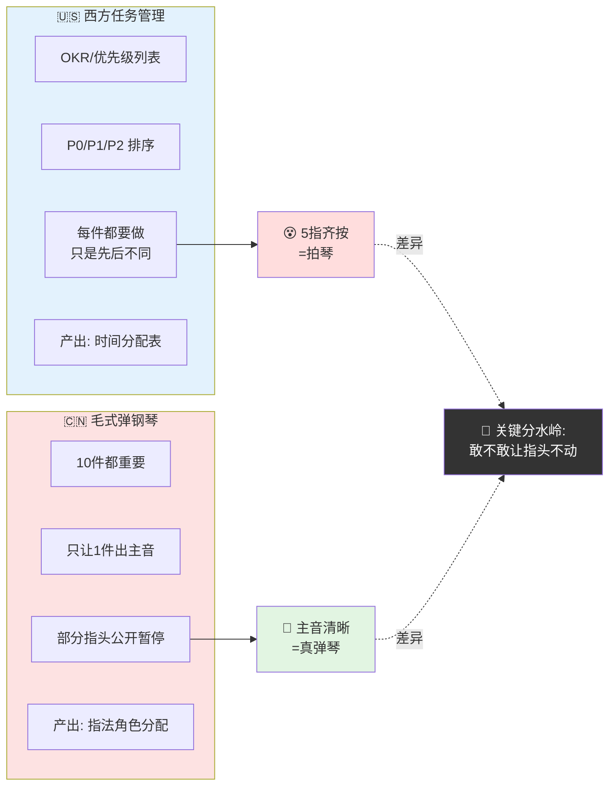
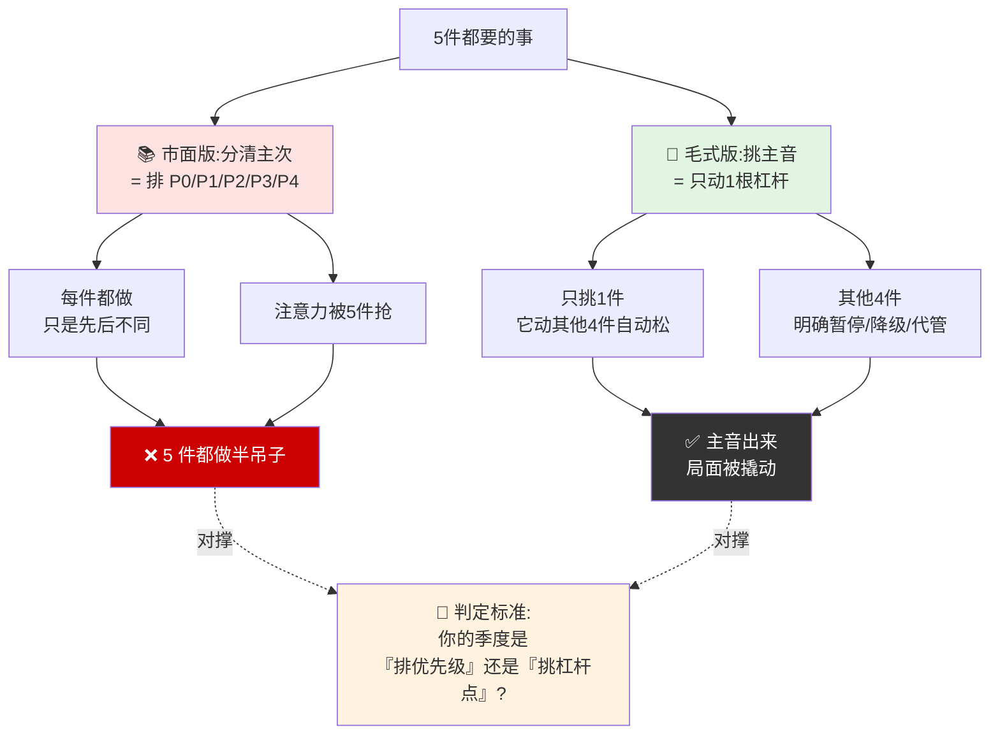
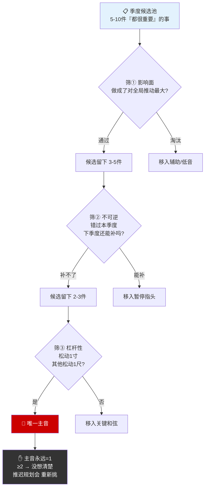
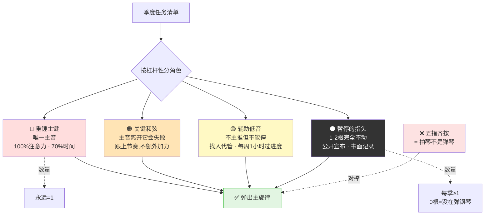
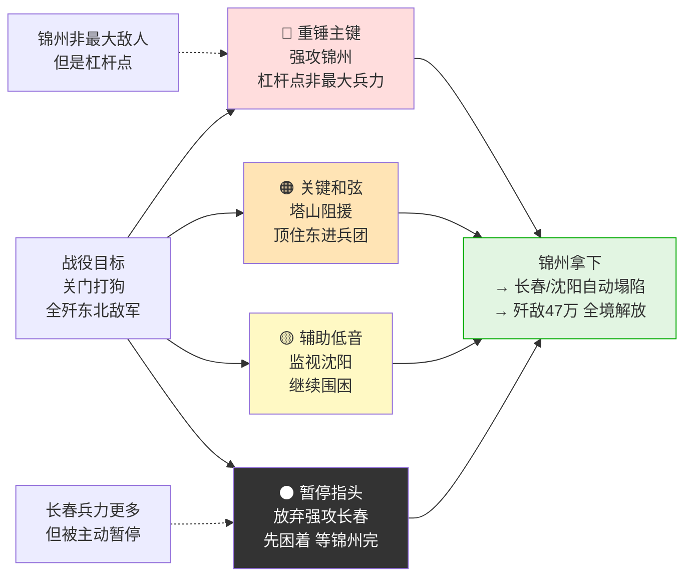
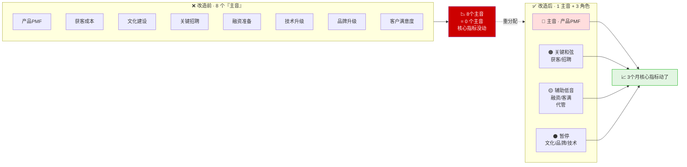
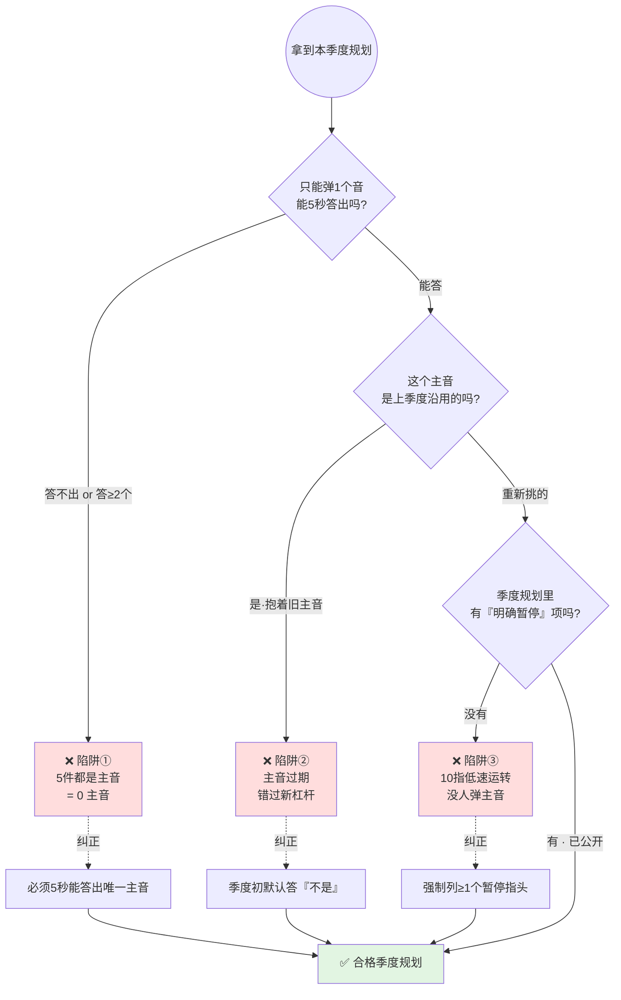

# 31.弹钢琴式协调法

- 01.五指齐按那一年
- 02.市面误读之辨
- 03.三层独家主张
- 04.七届二中现场
- 05.原文四维精读
- 06.主音只能一个
- 07.指头四种角色
- 08.辽沈战役示范
- 09.一个商业切片
- 10.三个认知陷阱
- 11.敢让指头不动
- 12.三年认知复利
- 13.收束三句金言

## 01.五指齐按那一年

那一年我刚升主管，手里同时压着五件"听起来都很重要"的事：核心系统稳定性治理（P0 级）、新业务模块一期交付（老板亲点）、团队招聘 6 个人（HR 在催）、技术栈升级（长期规划）、季度 OKR 汇报材料（全司要看）。

我每天到公司第一件事就是打开 5 个群轮流回复，上午开稳定性会、下午评审新业务、晚上面试、夜里改 OKR 材料。表面上看我每一项都在推进——但三个月后做季度复盘：稳定性治理还是那几个老问题没根治，新业务延期 40%，招聘只到 2 人，技术栈升级动都没动，OKR 材料写得很漂亮但汇报完被老板打回。**五个指头全部按下去了——结果一个音都没弹准**。

那次汇报结束，老板把我单独留下来问我："你这个季度，最重要的事只能挑一件，你挑哪一件？"我张口想说五件都重要，话到嘴边咽回去了。我沉默了整整 20 秒。老板又补了一句："你要是答不上来，不是我的问题，是你自己还没想明白这个季度**要弹什么曲子**。"

回到工位我翻出《党委会的工作方法》，看到那句老话："弹钢琴要十个指头都动作，不能有的动，有的不动。但是，十个指头同时都按下去，那也不成调子。"我第一次真正听懂这句话——**主旋律必须只有一个**。十个指头是用来配合主旋律的，不是用来和主旋律抢风头的。过去三个月我不是在"弹钢琴"，我是在"拍琴"。"拍琴"和"弹琴"的区别不在指头多少，**在你心里有没有那一个唯一的主音**。心里没主音，再勤奋的十指都是噪音；心里有主音，几根手指偶尔不动也是音乐。落到操作上有一个最朴素的检验：你能不能用一个名词、一句话告诉别人你这周最重要的那件事？不能就是没主音；能但是要想 30 秒，那是主音模糊；能 5 秒内脱口而出而且团队都同步——那就是合格的"弹琴"状态。

## 02.市面误读之辨

市面上对"弹钢琴"的解读，九成都在做同一件事——**把它翻译成"统筹兼顾"**：工作要统筹兼顾，要主次分明，要有节奏地推进。这些话都没错，但它们**是正确的废话**。它们让你点头，却不告诉你周一早上具体要按下哪根指头、哪根指头要主动放下。

为什么这种翻译反而最流行？因为它**最安全**。说"要统筹兼顾"既不得罪任何被砍的指头，也不得罪老板"全都重要"的期待。读者读完会觉得"很有道理"，然后合上书，第二天继续五指齐按。

真正能改变行为的解读，必须做两件市面书不愿做的事：**承认主音只能有一个**——这意味着要砍掉其他四五件"也很重要"的事；**承认有些指头要"完全不动"**——而且在公开承诺这件事时不能慌。这两种事情都让管理者显得"不够全面"，所以市面书选择回避。另一种误读是把"十指都要动"理解成"力气要均分"。这是把"弹钢琴"读成了"键盘节拍器"。毛主席原话里的关键是——**十个指头同时按下去也不成调子**。十指都动不等于用力均匀，真正的弹奏里主音指头按下去时其他指头是辅助、留白、停顿、衔接，不是和主音抢力气。把"弹钢琴"读成"五件事力气均分"，是对原话最常见也最致命的肢解。

## 03.三层独家主张

在我看来，毛主席"弹钢琴"比喻真正的威力在于三点。

**第一，弹钢琴是注意力分配算法，不是时间分配技巧**。市面把它读成"如何把时间均匀切给每件事"，毛主席讲的是**"如何让 80% 的注意力指向那个唯一的主音"**。注意力比时间稀缺得多——一件事即使你只花 1 小时，如果它占了你 80% 的注意力，它仍然是主音。

**第二，弹钢琴的核心不在"按"，在"敢于让指头不动"**。市面只讲"要协调"，不讲"要砍"。但任何一首真正的曲子里，都有大段的休止符——**敢让几根指头完全不按下去，主音才弹得出来**。这才是这一思想最锋利的地方。

**第三，主音必须每个季度重新挑一次**。市面把"主音"当成一个固定的"重点工作"，但毛主席的"中心工作"是随阶段、随形势动态变化的。今天的主音明天可能就是辅助音——**主音不是一次挑出来用一年，是每季度都要重新问一次**。这篇文字想讲的，就是这三层——**注意力算法、敢于停下来、主音动态化**。

## 04.七届二中现场

"弹钢琴"的比喻最集中、最经典的论述，出自毛泽东 1949 年 3 月在七届二中全会上的结论，后收入《毛泽东选集》第四卷《党委会的工作方法》。解放战争胜利在望，中国共产党的工作重心正经历一次历史性转折——从农村转向城市，从武装斗争转向全国范围内的建设和治理。面对即将到来的执政重任和千头万绪的复杂工作，党内急需一种科学的工作方法以避免顾此失彼。

这不是哲学比喻，是**治理学文件**。它解决的是一个具体问题：当一个组织从单一战场扩展到全国治理——财政、外交、工业、农业、文教同时铺开——领导者凭什么不被压垮？把"党"换成"公司"，把"治理"换成"业务"，问题完全成立。

"弹钢琴"不是西方"任务管理学"或"OKR"的中国版本。**它的特点是承认 10 件事都重要，但只让 1 件出"主音"**——这是西方任务管理工具几乎做不到的，西方工具更倾向"列优先级"，列完仍然每件都要做。毛主席的"弹钢琴"更狠——**它接受"有些事这一段就是不弹"，并要求你公开宣布**。这种"敢让指头不动"的勇气，是这件中国工具最锋利的地方。

弹钢琴 vs 西方任务管理 · 一图看清"列优先级" vs "挑主音"的世界观差异：

## 05.原文四维精读

"弹钢琴有人弹得好，有人弹得不好，这两种人弹出来的调子差别很大。"请注意这一句——市面解读基本忽略它，只讲前面"十指都动"。但毛主席为什么要在结尾加这一句？因为他要点破——**手里的指头是一样的，曲谱也都一样，差的不是"按下去的力气"，是知不知道什么时候该按、什么时候该停**。这一句的潜台词是——弹钢琴是一门技艺，需要长期练习，没有标准答案。10 个管理者拿到同样的 5 件事，只有少数人能弹出曲子，大多数人弹出的是噪音。**差距不在事情，在弹琴的人**。

这段话写在 1949 年 3 月七届二中全会，台下是即将进城接管全国的高级干部。毛主席不是在做哲学讲座，他是在告诉这些将要担任市长、部长、省委书记的人：你们以后管的不是一支队伍，是一个国家。所有事都重要，但你必须每一段时间挑出一个主音——否则你就被淹没在"什么都重要"里。

这段话内部有一个张力——"十指都要动"和"不能同时按下"是矛盾的。正常理解是：要么所有事都管，要么砍掉一些事。毛主席偏偏说**两者都不对**——你必须**让十指都动，但只让一根出主音，其他九根是辅助**。这是一个高度反直觉的指令，它要求你同时持有"什么都不放下"和"只主推一件"两种相反的姿态。市面上把这段话翻译成"工作要分清主次"——这是温吞的废话。它没说出最锋利的那一层——**主音不是"重要的事"，是"这一段时间里只要它推动了，其他都会自动跟着松动"的那一根杠杆**。"分清主次"让你给 5 件事排个 12345，但每件你还是会做；"挑主音"逼你只动那一根杠杆，其他 4 件主动放下、明确推迟。前一种是文艺腔，后一种是指挥员。

反直觉张力 · 一图看清"分清主次"和"挑主音"的行动分水岭：

## 06.主音只能一个

什么是主音？**主音是这一段时间里，只要它推动了，其他事会自动跟着松动的那一根杠杆**。这和"最重要的事"不一样。"最重要"是按价值排序，"主音"是按杠杆排序。一件事可以非常重要但不是主音，也可以看起来不重要但是主音——比如接口性能一动，开发效率、客户投诉、团队士气、招聘吸引力都跟着动。

我后来沉淀出三个标准：影响面——做成了对全局推动最大的是哪件；不可逆——错过了这个季度下个季度还能补上的划掉；杠杆性——它松动一寸，其他几件会不会自动跟着松动一尺。三条都过的才是主音。三条都过的事**永远只有一件**，如果你挑出两件，说明你还没真正想清楚。挑出 2 个主音等于没挑出主音。因为人的注意力是稀缺资源，当心里有两个主音，两者会一直在抢你的脑容量——开会时会切换、做决策时会犹豫、和团队对齐时会失去焦点。**挑不出唯一主音的季度，宁可推迟开季度规划会，挑出来再开**。

主音三级筛选漏斗 · 从5件事挑出唯一那一件：

## 07.指头四种角色

弹钢琴时除了主音之外，其他指头各有角色。我把它们分成四种。

**重锤主键**：唯一的主音指头。100% 注意力加 70% 时间投入，所有的决策、资源、可见度都向它倾斜。主音指头不是 leader 一个人按，必须把团队最强的资源也压在它上面。

**关键和弦**：不是主音，但主音离开它会失败的事。比如主音是接口性能，那运维稳定性就是它必须的和弦——主音没有它根本弹不响。定位是保证它跟上主音的节奏，但不必额外加力。

**辅助低音**：不主推但不能停的事——业务日常、招聘维持、汇报材料。这些事必须有人管，但管的人不必是 leader 自己。核心是找一个可托付的人代管，每周用 1 小时过一遍进度即可。

**暂停的指头**：这一段时间完全不动的事。**敢于明确"这件事这个季度不做"，是弹钢琴最难的动作**。它意味着你要承担"看起来在偷懒"的委屈。但只有暂停了几根指头，主音才弹得响。每季度至少要明确 1 到 2 根暂停的指头，一根都没暂停的季度说明你又在五指齐按。

四种指头角色的注意力分布一图看透：

## 08.辽沈战役示范

解放战争中的辽沈战役是军事上运用"弹钢琴"思想的典范。当时东北战场有长春、沈阳、锦州等多个敌军重兵集团。毛泽东果断决定先打锦州——因为锦州是连接东北与华北的咽喉要道，打下锦州就能关门打狗，全歼东北敌军。这就是整个战役的主旋律和中心工作。

请注意——**锦州不是最大的敌人，长春和沈阳的敌军兵力都比锦州多**。但锦州是杠杆点，打下它，长春、沈阳都会自动塌陷。这就是主音的真意：**不是最大、不是最显眼，是最有杠杆性的那一根**。

指法分配清晰到极致：重锤主键——东北野战军主力集中绝对优势兵力强攻锦州；关键和弦——派出精锐部队在塔山一带构筑防线，死死顶住国民党东进兵团的增援；辅助低音——其他部队继续围困长春、监视沈阳敌军；暂停的指头——主动放弃对长春的强攻，先困着，等锦州打完。四种角色清清楚楚，每根指头都有自己的位置。整个战役在统一的战略意图下，各部队任务明确、主次配合、节奏分明。辽沈战役歼敌 47 万，东北全境解放。**这一仗的意义不仅在于消灭多少敌人，更在于它证明了"主音加协同加暂停"这套指法在最高强度战场上的有效性**。

辽沈战役的四指分配一图对号入座（可直接映射到你的季度）：

## 09.一个商业切片

我 2023 年接触的一家创业公司，CEO 是个全面手——业务、产品、技术、市场、组织，每一件都管、每一件都开会。一年下来公司业绩没起色，团队疲态尽显。我去帮他们做组织复盘，问 CEO："你这一年最重要的一件事是什么？"他想了很久，给我列了 8 件——产品 PMF、获客成本下降、组织文化建设、关键岗位招聘、融资准备、技术架构升级、品牌升级、客户满意度。我问："如果你只能挑一件，挑哪个？"他说："都不能放。"我再问："这 8 件里，过去半年哪一件你的注意力分配最多？"他想了想说："好像每一件都差不多。"

这就是病根——**8 个主音等于 0 个主音**。CEO 的注意力是公司最稀缺的资源，平均分给 8 件事的结果是没有一件事真正得到推动。两个规律："全部都重要"是没想清楚的伪装，任何说全部都重要的管理者本质上是没敢承担砍掉某些事的责任；CEO 的日历是公司真实战略的影印件，CEO 的时间分配不平均公司的注意力才能聚焦。

后来 CEO 把 8 件砍到只剩 1 件主音——产品 PMF。其他 7 件按和弦、低音、暂停重新分配。三个月后这家公司核心指标终于动了——**不是因为他变能干了，是因为他终于敢只弹一个音**。

创业公司 CEO 8→1 的注意力重整 · 一图看清"8个主音=0"到"1个主音"的转折：

## 10.三个认知陷阱

最常见的坑——**"这五件都是主音"**。这是从根本上没听懂"主音只有一个"。它的潜在心理是舍不得放下任何一根指头，所以全标成"重点"。结果是 5 个重点等于 0 个重点。识别方法：问自己"如果我必须只能弹一个音，弹哪个"，答不出来或答的不止一个，说明还没挑出真正的主音。

第二个坑——**抓住一次主音后，以为它能用一年**。主音是动态的。今天的主音解决之后，新的主音会立刻出现。一直抱着旧主音弹会让你错过新的杠杆点。识别方法：每季度初强制重新问"上个季度的主音还是这个季度的主音吗"，默认答案应该是"不是"。

第三个坑——**没有任何指头敢明确暂停**。很多管理者不敢公开说"这件事我这个季度不做"——怕老板问、怕业务方告状、怕自己显得不够全面。结果就是 10 根指头都在低速运转，谁也弹不出主音。识别方法：每季度规划必须强制列一项暂停的指头。列不出来等于你的季度规划不合格。

三个认知陷阱识别决策树 · 一图排查自己踩在哪个坑：

## 11.敢让指头不动

这是从"弹钢琴"思想里能提炼出最锋利的一条——**敢让指头不动，比敢按下指头更难**。按下一个指头是"做事"，让一个指头不动是"放弃"。人的本能是积极追加，不是主动减少。

具体到管理者身上有三种心理障碍：怕老板问，怕业务方告状，怕错过机会。其实更危险的是 5 件都不专注地做，5 件都错过最佳时机。

我后来给自己立了三条铁规：每季度必须明确暂停 1 到 2 根指头，哪怕业务方再催也要硬挺住；暂停的事要书面记录、公开公布，不能藏着，要让所有相关方知道"这件事是有意推迟的，不是我忘了"；暂停期到了要主动复盘，不能让暂停变成无限期搁置。**这三条纪律是"敢让指头不动"的底层支撑**。没有纪律，"暂停"就会变成"逃避"。

## 12.三年认知复利

从老板办公室回到工位，我第一件事不是打开 Jira，而是关掉所有软件，拿出一张 A4 纸写一个问题：这个季度我只能挑一件事，挑哪一件？我挣扎了很久，按影响面和不可逆两个维度排序，最后只剩一件——核心系统稳定性治理。因为它是其他一切的地基：地基没打稳，新业务越大越崩；地基稳了，招聘、技术栈升级才有余力。

我在 A4 纸正中间写了四个字——"主音：稳定"。然后分配指头：重锤主键是我自己加两个高级工程师 100% 投入稳定性治理；关键和弦是新业务模块降级为只做关键路径 MVP；辅助低音是把招聘委托给一个 leader 代管我每周只花 2 小时过进度；暂停的指头是技术栈升级延期一个季度。整张纸贴在显示器边上，从那天起每做一个决定我先看这张纸。

每天早上开工前问自己三个问题：今天我做的事是在推进"稳定性"这个主旋律吗？剩下的 4 个指头今天要不要动、动多少？今天要不要切换节拍？刚开始每天要想 10 分钟才能填清楚，一周后变成 2 分钟，第三周已经变成本能。最重要的改变是——**我开始敢"不做事"了**。过去我每天群里一响就冲过去回，现在看一眼：这是主音的事吗？不是就丢进辅助指头队列，周五批量处理。

半年后我同时在管 3 条业务线，事情比那时多 3 倍，但我再也没有陷入过那种死循环。因为我固化了四件事：每个季度只有一个主音，不管同时压过来多少事主音永远只有一个；每个指头都有明确的角色，没有角色的事等于没立项；节奏由我定不是被事情推着走，每周一排一张本周节拍图；敢于让某几个指头这段时间完全不动。三年下来我形成了一个几乎条件反射——**任何说"我这个季度有 5 个重点"的人，我都会问他"挑一个"**。挑不出来的，所有"重点"都是空话。

## 13.收束三句金言

**主音只有一个，别的指头都是用来配合它的——敢让几根指头"不动"，你才弹得出曲子。** 敢让指头不动的人，是懂得节奏的人；不敢让指头不动的人，永远只在赶场，从来没有真正的作品。

每个季度只挑一件"主音"事：影响面最大交叉不可逆，两个维度交叉出来那一件。挑不出来之前，别启动任何其他项目。把其他所有事分配到四个角色里——重锤主键、关键和弦、辅助低音、暂停的指头。没被分配角色的事不叫工作叫"打扰"。每天早上三问——主音推进了吗？今天哪几个指头要动？用什么节拍？三问写在便利贴上贴在键盘边，一天一填。这张纸就是你的"指挥棒"。

**你这个季度的"主音"是哪一件？如果你想了 30 秒还说不出来，你这个季度根本没在弹钢琴，是在拍琴。** 拍琴的人靠力气，弹琴的人靠章法——力气再大也弹不出旋律，章法一到十根手指就有了灵魂。
