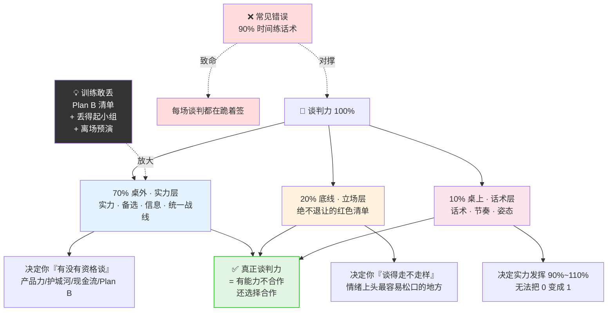
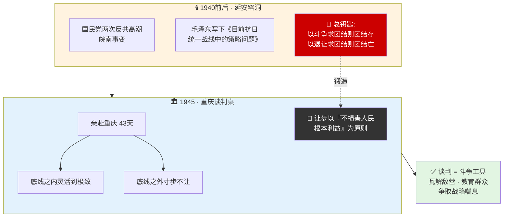
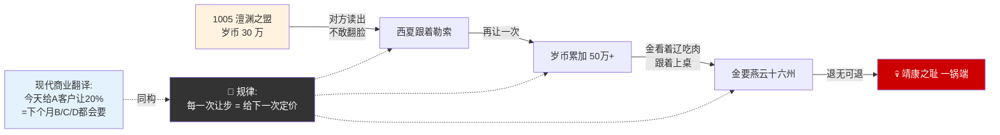
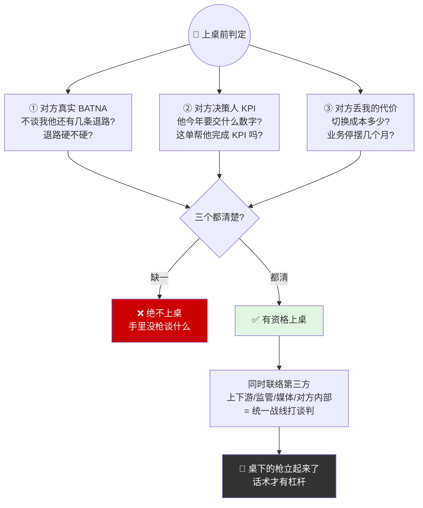
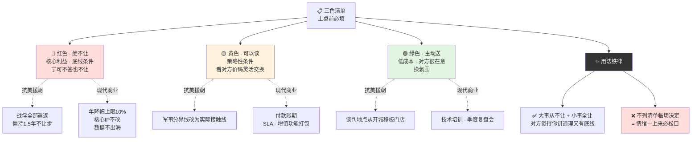
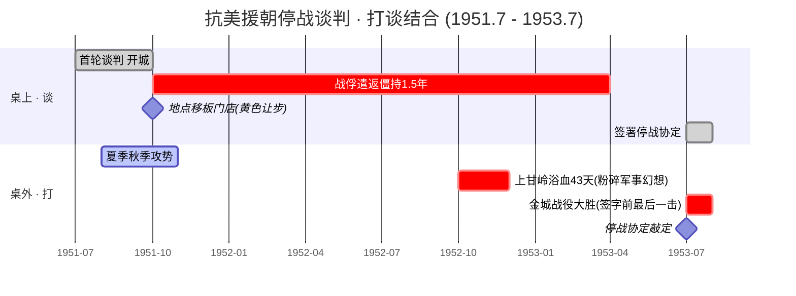
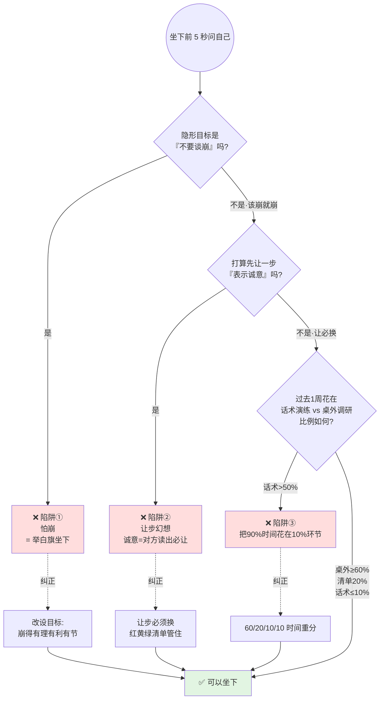

# 32.谈判的原则智慧

> 谈判的本质从来不是说服对手，而是**让对方算清楚，不跟你合作比跟你合作的代价更大**。一旦对方读出你"不敢丢"，你就没有谈判权了。

目录介绍
- 01.把团结换成跪着
- 02.市面误读之辨
- 03.三层独家主张
- 04.两大文本现场
- 05.原文四维精读
- 06.桌外较量为先
- 07.原则与灵活性
- 08.有理有利有节
- 09.停战谈判示范
- 10.三个认知陷阱
- 11.一个商业切片
- 12.三年认知复利
- 13.收束三句金言

## 01.把团结换成跪着

那一年我负责一个关键客户的续约谈判。这客户是我们当年的招牌 Logo，续约金额占我这条线年营收 30%。合同谈到第三轮，对方采购抛出来一个让我脊背发凉的要求：**"今年要么降价 35%，要么我们换供应商。"**

我当时汗都下来了。回公司开会，我跟老板说："为了保住这个客户，我觉得还是让一让吧，降 30% 也比丢掉强。"老板沉默了几秒，问我："降 30% 之后，明年他要再降 30% 呢？你准备降到什么时候？"我答不上来。当时我脑子里只有一句话——"不能丢这个 Logo"。我以为"让"等于"团结"，结果签完合同那天，采购在微信群里发了个笑脸："合作愉快，明年继续这个价。"——那个"明年继续"四个字让我当场汗毛竖起。

那个晚上我一个人在办公室翻《目前抗日统一战线中的策略问题》，看到那一句：**"以斗争求团结则团结存，以退让求团结则团结亡。"** 这 20 个字像锤子一样砸我头上。我以为这一局"保住了客户"，其实我是把明年的谈判桌提前送到了对方手上——因为他已经摸清了我的底线：**"我不敢丢。"** 一旦对方知道了你"不敢丢"，你就没有谈判权了。你剩下的只有一件事——每一年按对方的节奏往下砍。老板只说了一句话："你不是输在 30% 的价格，你是输在对方已经算准你宁可什么条件都接受也不敢丢——你这不是谈判，这是投降。"

## 02.市面误读之辨

街面上一搜"谈判技巧"，跳出来的全是开口三招、微表情、共情话术、SPIN 提问法。这套东西不是没用，而是**把 10% 的事说成了 100%**。毛选谈判观第一句就把这层皮揭了：**谈判是斗争的另一种形式**。话术只是斗争的最后一道工序，前面的实力、立场、节奏、统一战线没做到位，话术再溜也只是体面的投降。

"双赢"本身没有错，错在**把双赢理解成了"我先让一步换一个示好"**。毛选这里冷得像刀子：**以退让求团结则团结亡**。真正的双赢是**双方都打到无力再加码、又都还不舍得掀桌**那一刻达成的暂时平衡，不是任何一方"先示好"换出来的。把谈判当成"两个人坐在那间会议室里的事"——这是大多数销售第一年都会犯的错。毛选直接钉死：**桌外的较量决定桌上的结果**。你的实力、备选、统一战线、节奏控制，全部在桌外。桌上 20 分钟决定的胜负，是过去 200 天准备好的。

## 03.三层独家主张

与所有"谈判技巧课"不同，这一篇坚持三个独家主张。

**谈判不是沟通学的分支，是斗争学的分支**。斗争是手段，团结是目的——谁把次序颠倒谁就输。沟通学的前提是双方都希望达成共识，谈判学的前提是双方利益不完全对齐。**把沟通学工具拿到谈判场上用，就像拿水枪去打仗**。正确姿势是：团结永远是目的，但抵达团结的唯一路径是斗争——斗到双方都加不动码、又都不舍得掀桌的那一刻，团结才是真团结。

把这条比例钉在脑门上：**70% 桌外（实力、备选、信息、统一战线）+ 20% 底线（绝不退让清单）+ 10% 桌上（话术）**。颠倒比例的人，每场谈判都在跪着签字。桌外那 70% 决定你有没有资格谈判——产品力、护城河、现金流、plan B、信息优势、同盟者，决定你手里有几张牌。底线那 20% 决定你谈得走不走样——什么事绝对不让，必须写下来，因为人在谈判桌上情绪一上来最容易松口。桌上那 10% 是话术、节奏、姿态——它能让实力发挥到 90% 到 110%，但无法把零变成一。颠倒比例的人把 90% 时间花在话术训练上，恰恰是在最不能产生杠杆的地方使劲。

**只要对方算准你"不敢丢"，你的所有筹码立刻清零**。训练谈判力的第一课不是练嘴，是练"敢丢"——把"不敢丢"换成"不想丢"，整个谈判格局立刻翻盘。谈判的本质是双方都在评估对方的"放弃成本"——对方一旦判断你放弃比签下来更痛苦，他就知道你必签，你牌再厚都没意义。"不敢丢"交出了离场权，**离场权是谈判桌上唯一的真筹码**。训练"敢丢"三个动作：Plan B 清单具体到下一步做什么找谁，丢得起小组 2 到 3 个人陪你顶住压力，离场预演演到嘴上能说出口。

70/20/10 谈判力比例一图看透（颠倒即跪）：

## 04.两大文本现场

毛泽东的谈判观是在中国革命极其复杂、敌强我弱的残酷斗争中淬炼而成的。1940 年前后，国民党发动两次反共高潮，蒋介石一边谈一边打，一边谈一边搞摩擦。延安窑洞里，毛泽东写下了《目前抗日统一战线中的策略问题》，那 20 个字第一次被钉在历史上：**"以斗争求团结则团结存，以退让求团结则团结亡。"** 这是被皖南事变血淋淋教出来的一句话——**让出来的团结，是要赔命的**。

1945 年 8 月，毛泽东亲赴重庆与蒋介石谈判 43 天。这一次他不是在窑洞里写策略，而是亲自坐到了谈判桌对面。准备一切让步，但是"不损害人民根本利益"——**底线之内灵活到极致，底线之外寸步不让**。这两个文本现场，一个在窑洞里写出总钥匙，一个在重庆把总钥匙亲手用了一回。中国共产党在很长一段时间内相对于国民党乃至日本侵略者都处于绝对弱势，谈判由此成为一种必要的斗争工具：瓦解敌人阵营、教育广大群众、为自己争取战略喘息时间。

两大文本 · 一图看清"总钥匙"如何在窑洞里锻造 · 在重庆亲手使用：

## 05.原文四维精读

"以斗争求团结则团结存，以退让求团结则团结亡。"团结是达成协议、形成合作、维持统一战线。斗争是坚持原则、展示力量、揭穿对方真实意图。**退让是在原则问题上的无条件妥协**。注意，斗争和退让都不是目的，团结才是目的。但实现路径只有"斗争"这一条——你退一步，对方知道你"会退"，下一轮会要更多；你再退一步，对方确认你"必退"，不再认真谈判；你退到无可退，对方掀桌——团结亡。**退让不会换来团结，退让只会换来下一轮的更高加码**。

谈判从来不是孤立的桌面活动，它是军事斗争、政治斗争、经济斗争的延伸战场。"打谈结合、以打促谈"——抗美援朝两年零九个月的谈判，桌上每一寸进展都是上甘岭、金城反击战的炮弹换出来的。为什么桌外有"打"作为信号，桌上的"谈"才有重量？因为如果你坐到谈判桌前同时手里没有任何备选客户、没有 plan B、没有可以让对方感受到压力的动作——你说什么对方都不会真当回事。落到现代商业谈判的翻译——你要谈下一个大客户，最有效的"打"不是话术，而是让这个客户在谈判窗口期看到你的另一些动作：另一个客户签了大单、产品发布了新功能、媒体上有了正面声量。

北宋拿"岁币"换辽金的"和平"，每年送银送绢，结果是辽要的越来越多、金看着辽吃肉跟着上桌，最后一锅端。**这就是"以退让求团结则团结亡"最大号的历史样本**。从澶渊之盟开始，北宋每年向辽国送岁币 30 万；后来夏国跟着勒索；再后来金国崛起，要的不仅是钱，要的是燕云十六州。每次花钱买和平都把下一次的勒索价码定在更高的位置上——因为对方读出了你的底牌：你不敢翻脸。这个反面教材给现代谈判的启发是——**任何一次"花钱换和平"的让步，本质都是对未来所有相似谈判定的价**。你今天给一个客户让 20%，下一个客户很快会知道也会要求。让步从来不是一对一的事，它会变成一对所有的事。

北宋岁币递升复利 · 一图看清"花钱买和平"如何把谈判桌上的价定给未来所有对手：

## 06.桌外较量为先

桌外要先搞清楚的三件事，缺一不可：对方真实的 BATNA——如果他不和你谈还有几条退路、退路硬不硬；对方决策人的真实 KPI——他今年要交什么数字、这场谈判帮不帮他完成 KPI；对方丢掉你的真实代价——切换成本多少、业务停摆几个月、换供应商风险几何。**这三件事没摸清之前，绝不上桌**。

毛主席说"枪杆子里出政权"，谈判桌上同样是"枪杆子里出条款"。你的护城河、你的产品深度、你的客户口碑、你的不可替代性——**这就是你桌下那支枪**。没有这支枪，话术再溜也是空转。高明的谈判者不会只盯着谈判桌对面的人，而会同时关注第三方——上游、下游、监管方、行业协会、媒体、对方的内部不同部门。抗美援朝谈判时，毛主席同时在做的事是联合苏联、争取亚非拉国家、揭穿美国战俘问题真相赢得国际舆论——**这才是真正的"统一战线打谈判"**。

桌外三件事上桌前必摸清 · 一图带走"没摸清不上桌"的判定门槛：

## 07.原则与灵活性

毛泽东在《中共中央关于同国民党进行和平谈判的通知》中明确指出：我方亦准备给以必要的不伤害人民根本利益的让步，但是让步是有限度的，以不伤害人民根本利益为原则。**核心利益是底线，绝不能作为筹码**。底线一旦被当筹码，就不再是底线，是对方的开胃菜。在非根本性的问题上，可以做出战术性让步——地点、议程、时间表、面子都可以让，只要不动核心利益。

为什么必须强调"策略的灵活性"？因为只有原则性而没有灵活性的谈判根本谈不下去。一个谈判者如果把所有点都锁死、寸步不让，对方根本没法和你坐下来谈。坚守原则的真正方式，恰恰是在非原则的事情上慷慨地让，让对方感觉到在和一个讲道理的人谈判，他才会在你真正在乎的那几件事上认真考虑你的诉求。

操作上的关键是——事先就把哪些事可以让、哪些事绝不能让写成一张明确的三色清单。红色绝不让——核心利益、底线条件，宁可不签也不让；黄色可以谈——策略性条件，根据对方价码灵活交换；绿色主动送——低成本但对方很在意的条件，主动给，换取氛围。**不预先列三色清单，就是不预先想清楚"哪些必须守、哪些可以送"——这种状态下上桌，必跪**。毛主席的智慧体现在他从不在小事上较劲，但在大事上从不让步。延安时期接待斯诺，毛泽东可以让斯诺自由活动、自由提问、自由选话题；但只要涉及"中国革命的根本路线"这种红色议题，立刻拒不让步。这种该让的全让加该顶的全顶的姿态，反而让对方觉得他很好相处又很有底线。

红黄绿三色清单一图看透（上桌前必填 · 抗美援朝对号入座）：

## 08.有理有利有节

任何谈判立场和行动都要有充分的理由，**占据道义制高点**。抗美援朝谈判中，"全部遣返战俘"这条原则不只是军事问题，更是道义问题——这是国际人道法的基本要求，中方一占道义高地，美方在国际舆论上就站不住。

一切谈判策略必须**对己方有利**，不打无准备之仗。什么时候提议、什么时候反对、什么时候休会、什么时候让步——全看对己方是否有利。1953 年金城战役大胜之后立刻签字，就是抓住了"有利"的瞬间。

斗争要有限度，**在击退对方进攻、达成阶段性目标后，适时提出妥协**。打得一拳开，知道见好就收。没有"有节"，斗争就会过头，反而失去同盟者；没有"有理有利"，"有节"就成了软弱。

## 09.停战谈判示范

抗美援朝停战谈判（1951-1953）是毛泽东谈判思想在国际舞台上的经典运用。1951 年 6 月朝鲜战场陷入僵局，美国因战争伤亡巨大、国内反战情绪高涨，杜鲁门政府压力倍增。新中国也需要结束战争来争取时间进行国内建设。核心目标是在公平合理的条件下实现停战，打出国威军威。

谈判中最艰难的就是战俘遣返问题。美方提出"自愿遣返"，实质是想扣留大量中朝被俘人员；中方坚决要求全部遣返战俘。在这个问题上谈判僵持了近一年半，毛泽东的态度非常明确：在这个核心原则问题上绝无妥协余地——这是红色清单。在坚守底线的同时，中方在策略上展现了极大的灵活性：关于军事分界线方面灵活提出以双方实际接触线为军事分界线，关于谈判议程和地点方面同意将谈判地点从开城移至板门店——这是黄色与绿色清单。

整个谈判期间，战场上的枪炮声从未停止。毛泽东指示志愿军："争取和，准备打，拖不起。"最典型的例子就是 1952 年的上甘岭战役——志愿军依托坑道工事，浴血奋战 43 天，顶住了敌人疯狂的进攻，彻底粉碎了美方通过军事胜利结束战争的幻想。**是上甘岭的胜利，最终敲定了板门店的协议**。1953 年 7 月 27 日，《朝鲜停战协定》在板门店签订。这是一场伟大的胜利：军事上打成平手，政治上坚守了原则、维护了国家尊严，战略上为新中国赢得了数十年的和平建设环境。

抗美援朝"打谈结合"两年零九个月 · 一图看清桌上进展如何被战场炮弹换出来：

## 10.三个认知陷阱

很多人上桌前给自己设的隐形目标是"不要把关系谈崩"——这就等于举着白旗坐下来。对方一旦读出你"怕崩"，所有筹码立刻翻倍。正确的隐形目标是：**"该崩就崩，崩得有理有利有节"**。

"我先让一步表示一下诚意，对方应该也会让一步吧"——幻想。毛主席用 20 个字回答：**以退让求团结则团结亡**。让步从来不是诚意，让步是信号——你给的信号是"我可让"，对方收到的解读是"他必让"。

桌上 60 分钟的话术、表情、节奏只占 10%。把 90% 的时间花在 10% 的环节上必输。正确分配是：60% 时间在桌外摸三件事，20% 时间在内部列三色清单，10% 时间沙盘推演，10% 时间在桌上执行。

三个认知陷阱识别决策树 · 一图排查自己踩在哪个坑：

## 11.一个商业切片

那次复盘之后，我坐下来做了一件从业五年都没做过的事——**为每一个关键客户列一张"绝不退让清单"**。我先问自己三个问题：这个客户如果明年走了我们真的会死吗——不会死，最多少赚 30% 年收，那他就不是"不敢丢"是"不想丢"；这个价格降下去我还有利润吗——算完发现降 30% 之后毛利只有 4%；这个条件如果接受下一年对方会不会继续加码——从过去三年对方的压价节奏看，100% 会继续。

列完我给自己写了一张三色清单：红色绝不让是年价格降幅上限 10%；黄色可以谈是付款账期、服务响应 SLA、增值功能打包；绿色主动送是一次免费的技术培训加一次季度复盘会。这张清单贴在笔记本扉页，上谈判桌前必看一遍。

那个月底另一个头部客户也提出类似的压价要求。这次我没有慌，我做了三件不一样的事：桌外先做功课——拿到清单之前先摸了竞品的报价、对方的业务增长数据、他们这个部门的 KPI，搞清楚了其实他丢不起我们；桌上按三色清单走——对方开口要降 25%，我说 10% 是我的上限但账期可以从 60 天延到 90 天，另外附赠一次技术深度培训；节奏上有节——对方犹豫时我没有乘胜追击，反而主动说你们决定不了没关系下周三之前给回复。

结果那一轮谈判我们降了 8%，拿到 90 天账期，对方签了 3 年长单。这是我从业以来最有底气的一次签约——**不是因为我嘴皮子变溜了，是因为我第一次桌外先赢了**。半年过去，最大的变化不是业绩数字，是我脑子里关于"谈判"这两个字的底层观念——以前觉得谈判靠技巧、靠话术、靠关系，现在知道谈判 70% 在桌外，20% 在底线，10% 才是话术。我现在特别信那句"以斗争求团结则团结存，以退让求团结则团结亡"——**真正的合作不是让出来的，是在你有能力不合作的前提下选择合作。你没有这个能力，所有的"合作"都叫投降**。

## 12.三年认知复利

第一年最大的变化是行为节奏：上桌前必做三件桌外功课、必列三色清单。当年签约率提升不大，但平均合同毛利率上升了 12 个百分点——因为我不再为了保住客户而跪着让价。第二年我把红黄绿三色清单做成团队 SOP，每个销售上桌前都要交一份桌外摸底报告和一份三色清单。那一年团队整体毛利率比公司平均高 18%，并且大客户三年期长单签约率从 22% 涨到 47%——长单的本质是把对方未来三年的退路提前关上。第三年我开始反向训练，专门拆解那些"看起来对方在让步、其实是在挖坑"的话术。比如对方说"我们诚意很足，先把价格定了其他都好谈"——这就是典型的让你先把红色清单交出来。识别出这种话术，反手一句"那我们就先把核心条款立起来，价格反而最后再谈"——节奏立刻翻盘。拆得多了，谈判这件事在我眼里就从"技巧"变成了"棋谱"。

## 13.收束三句金言

**谈判 70% 在桌外、20% 在底线、10% 在话术——没有桌外的实力和桌上的底线，你坐下来就是认输。** 每次重要谈判前 24 小时强迫自己回答三个问题：桌外那 70% 我做了哪些功课？我的红色清单写下来了吗？桌上我准备讲的话有没有偏离前两条？三个问题问完，话术上的紧张会自动消解大半。

上桌前回答三个问题——对方真实的替代方案是什么、对方决策人的真实 KPI 是什么、对方丢掉我们的真实代价是什么。三个没答清楚绝不上桌。列一张三色清单——红色绝不让、黄色可以谈、绿色主动送。不要在谈判现场临时决定让多少，临时决定的让步都是跪着让的。记住那 20 个字——**以斗争求团结则团结存，以退让求团结则团结亡**。每次想"算了让一步吧"的时候先问一句——我让完这一步，下一年对方会不会继续要？100% 会。那就不要让。

**下一次你坐到谈判桌前的时候，问自己一句话："我这一让，对方下一年会不会继续要？"** 如果答案是"会"，那这一让不是诚意，是把明年的谈判桌提前送给对方。
