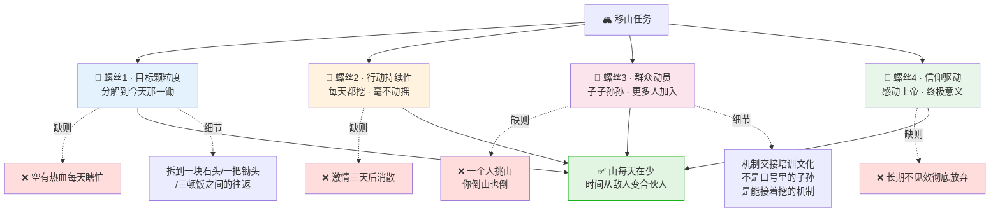
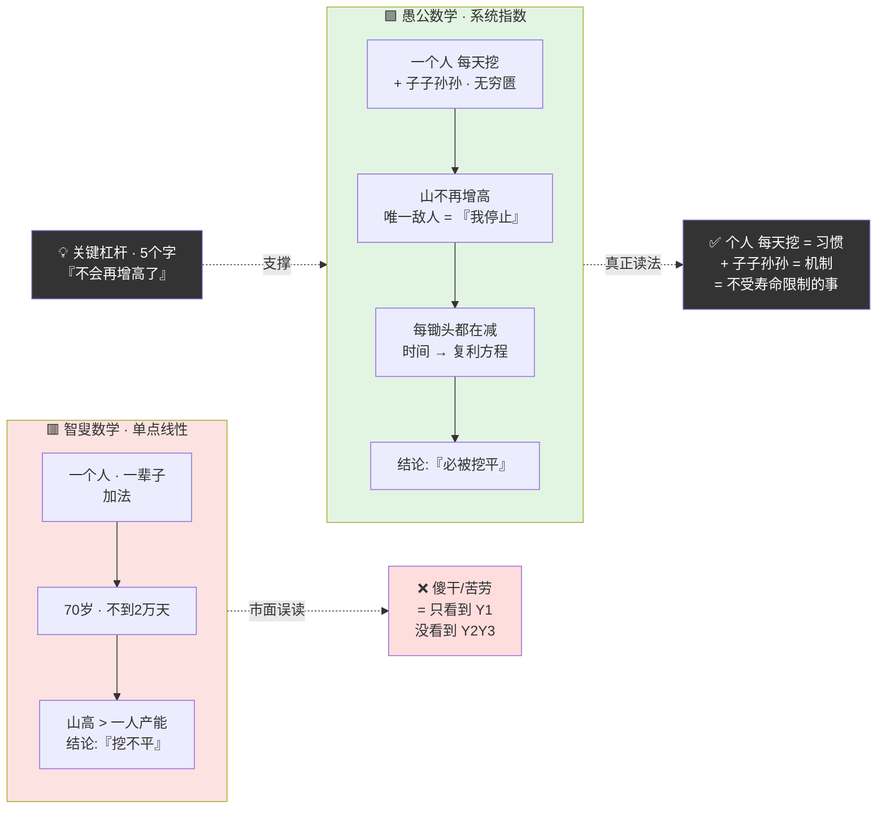
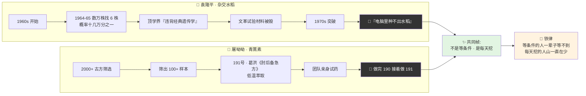
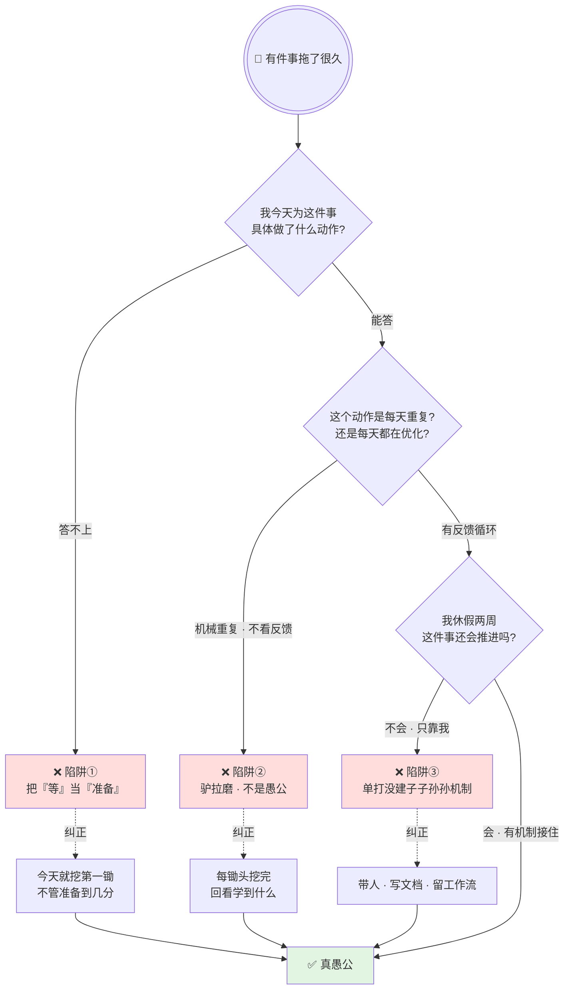
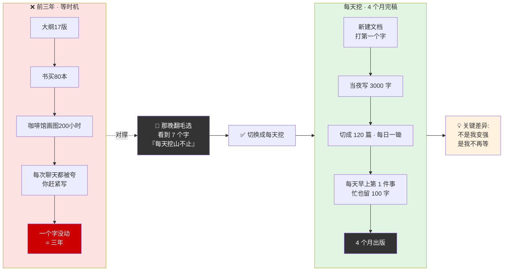
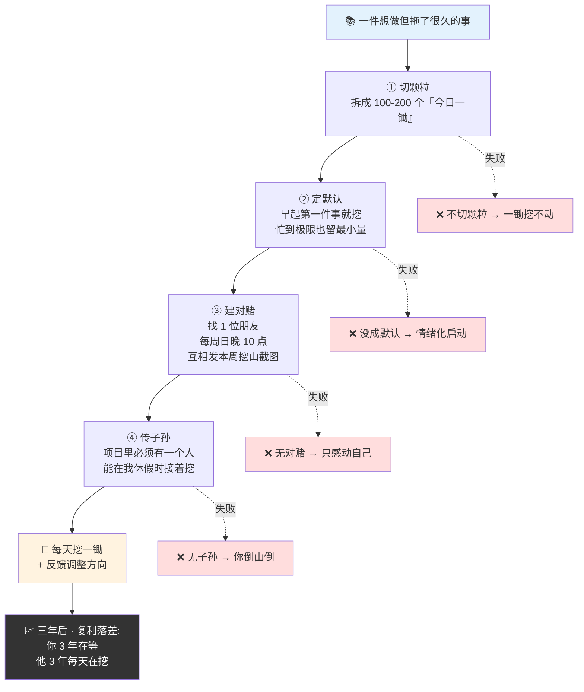

# 33.愚公移山精神力

- 01.三年没出本书
- 02.市面误读之辨
- 03.三层独家主张
- 04.一九四五·七大现场
- 05.原文四维精读
- 06.挖一锄头少一寸
- 07.子子孙孙的数学
- 08.两位当代愚公
- 09.一个商业切片
- 10.三个认知陷阱
- 11.等时间是最大毒
- 12.三年认知复利
- 13.收束三句金言


## 01.三年没出本书

我有一件事断断续续想做了三年，**写一本关于架构思想的系统性专栏**。三年里我做了大量准备：大纲列过 17 版，参考书买了 80 多本，周末蹲在咖啡馆画架构图至少有 200 个小时，每次跟同事聊天谈到这本书时他们都说"你赶紧写啊，这书出来一定卖得好"。

三年过去了，这书还是未完成。不是我没能力写，是我总在等一个"完美的启动"。等忙完这个季度、等架构足够成熟、等认知冲破天花板、等有大段独处时间。**等了三年，等来的不是成熟，是自责**。我和一个做编辑的朋友聊起这件事，他只说了一句："你知道最大浪费是什么吗？不是方向错了，是你明明有方向，却一直站在原地想着怎么翻山。"

那天晚上我翻开《毛选》第三卷，找到那篇我过去一直觉得"就是一篇讲话稿而已"的《愚公移山》。看到那七个字我突然愣住了：**"每天挖山不止"**。毛主席描述愚公的时候只讲了两个动作：一个锄头、一个簸箕。没了。他没讲"愚公沉思了十年后决定挖山"，没讲"愚公用杠杆原理撬动了山头"，没讲"愚公终于等来了最好的挖山时机"。他只讲了一件事：**每天干**。我过去三年，干的恰好是反过来的事，每天都在"想"，没有一天在"挖"。

那天晚上我打开电脑，新建了一个文档，在文件名里打下第一个字。然后又打了第二个、第三个。那一夜我写了 3000 字。三年没写完的书，**从"等时机"切换到"每天干"之后，只花了 4 个月就写完发表**。我后来把毛主席那句话写在了这本书的扉页上：**"这件事感动了上帝，他就派了两个神仙下凡，把两座山背走了。"** 不是神仙帮你搬走了山，是你每天挖这件事，让神仙觉得"这个人不帮不行"。

## 02.市面误读之辨

市面上关于"愚公移山"的解读，九成都在同一句话上反复念，**"持之以恒"**。它让你觉得愚公精神就等于咬牙坚持、死扛、不放弃。这些都没错，但它们是**正确的废话**。它们让你点头，却不告诉你星期一早上具体"扛什么、怎么扛、扛到什么时候算一站"。

真正能改变行为的解读，必须做两件市面书不愿做的事：**第一，把"移山"拆成"一锄头一锄头"的颗粒度**——愚公不是带着情绪在感动自己，他是把一座山拆成了一亿锄头；**第二，讲清楚"子子孙孙无穷匮也"这句背后的复利数学**——普通人看到的是"你一个人永远挖不完一座山"，愚公看到的是"只要我还在挖，山就不会再增长，而我的子孙会继续挖，山总有一锄头会被挖穿"。

还有一种误读——把愚公当成"傻干"的代表，然后用"聪明人要绕过去"来反讽。这同样是**没读懂原话的结构**。愚公的工作分为两部分：每天挖山（执行层）和"子子孙孙"（结构层）——后者其实是最聪明的"时间复利杠杆"。他只做了两件事：自己每天挖，让这个"挖"的动作能被继承。**把愚公读成"傻干"，是对这篇文献最大的误读**。

## 03.三层独家主张

在我看来，毛主席愚公移山思想真正的威力在于三点。

**第一，移山的关键不在"毅力"，在"分解"**。市面只讲"坚持"，不讲"分解"。但愚公真正厉害的地方不是他能坚持——是他能把一座山分解成一块石头、一把锄头、一个簸箕、三顿饭之间的往返。**分解到最细颗粒度，每一天只需要完成今天那一锄头**。不是伟大的意志力，是颗粒度的胜利。这是愚公移山方法论最核心的一层。真正让你停下来的从来不是"这件事太难"，而是"我脑子里关于这件事的画面太大了"——一座山压着你，你就不敢动；一块石头、一把锄头、一个簸箕，你就能动。**分解到最细颗粒度，不是降低难度，是消解无力感**。把大目标变成可操作的小动作，把半年后的焦虑从当下移走。颗粒度是行动力的真正开关——不是意志力，不是自我激励，而是把一件事切成你愿意动手的最小单元。

**第二，时间不是你的敌人，拖延才是**。很多人把"三年没做的事"归咎于"没时间"。但愚公的逻辑刚好相反——他不是"找时间"挖山，他是**把挖山变成了时间的默认动作**。你不是没时间，你是没让这件事成为你的默认动作。一旦它成为默认动作，时间就站在你这边。

**第三，"子子孙孙"不是浪漫的信念，是冷酷的复利方程**。愚公真正让智叟闭嘴的不是"你等着我儿子接着挖"——是"只要我家每个人都挖，山就不会再增高，而我们每一代都在让它降低"。**这一层逻辑，放在个人身上是认知复利，放在组织身上是长期主义**。

三层独家主张一图看清 · 市面口号 vs 真愚公方法论：

```mermaid
mindmap
  root((("🏔 愚公真方法论<br/>= 3 层独家主张")))
    第1层 · 分解
      市面: 坚持
      真解: 颗粒度胜利
      切到最细<br/>一亿锄头<br/>今天只挖 1 锄
      不是降低难度<br/>是消解无力感
    第2层 · 默认
      市面: 找时间
      真解: 把挖山变默认动作
      不是拖延才是时间的敌人
      成为默认<br/>时间成合伙人
    第3层 · 复利
      市面: 浪漫信念
      真解: 冷酷复利方程
      子子孙孙 = 制度
      个人 → 认知复利<br/>组织 → 长期主义
```

## 04.一九四五·七大现场

1945 年 4 月至 6 月，党的七大在延安召开。抗日战争即将迎来最后胜利，中国正站在历史的十字路口。毛泽东在七大闭幕词中讲述了愚公移山的故事，这篇闭幕词后来以"愚公移山"为题收入《毛泽东选集》第三卷。

这段闭幕词的结构极其精妙——**第一段讲愚公自己挖山（个人行动），第二段讲智叟嘲笑（外界阻力），第三段讲愚公回答"子子孙孙无穷匮也"（长期主义），第四段讲感动上帝搬走两座山（用持续行动吸引外力）**。仔细看，每一层都是对当时革命形势的精确映射——愚公是中国共产党，太行王屋是帝国主义和封建主义，上帝是全中国人民。表面在讲一个寓言，实际在部署一整套动员模型。

"下定决心，不怕牺牲，排除万难，去争取胜利。"这段话当时不是写给普通读者的，是写给即将迎来全国胜利的各根据地负责人的。他们听到的不是励志故事，是战略指令：胜利在望，但最后的山头必须一锄头一锄头挖下来。重庆谈判之后、解放战争初期、社会主义建设时期、改革开放初期——每次重大转折关口，"愚公移山"都会被重新拿出来讲。它不是一次性的演讲，是反复被激活的精神源代码。因为它回答的问题从未过时：当一件事大到"肉眼看不到结果"，你凭什么继续？愚公给了最朴素的答案：**山不会自己走，锄头不能自己挥，但只要你每天挖一锄头，山就在变小——哪怕你看不见**。这段话到今天依然有效，因为任何一件需要三年以上才能出结果的事，本质都是"挖山"。

## 05.原文四维精读

"愚公回答说：我死了以后有我的儿子，儿子死了，又有孙子，子子孙孙是没有穷尽的。这两座山虽然很高，却是不会再增高了，挖一点就会少一点，为什么挖不平呢？"请注意，**"不会再增高了"这五个字是整个论证中最关键的杠杆点**。愚公为什么敢说"挖得平"？不是靠意志感动上天，是靠一个铁的逻辑——山的高度是固定的、增长的敌人只有一个"我停止"、只要持续输出、山必被削平。但凡山在增长，愚公的论证就崩了。但山不增长——这让"每天挖"这个平凡动作有了必胜的逻辑基础。

这些话写在抗日战争胜利前夕，七大闭幕词里。台下不是在听励志故事的那种受众，而是即将去接管全国的各军区负责人、即将打内战的指挥员、即将进城的各级书记。毛主席不是给他们打鸡血——他是让每个人都相信，现在面对的两座大山，只要每天挖，就一定挖得完。

这段话最深的张力在于——愚公讲的不是"我挖得完"，而是**"我挖不完，但我保证这件事不会断"**。"子子孙孙无穷匮也"把"完成"的责任从"我"身上卸掉了一半——卸给了组织机制。智叟的思维困在"一个人能不能挖完一座山"，愚公的思维跳到了"一个系统能不能让这座山不再增高并在持续削减"。市面解读把这段话翻译成"坚持就是胜利"——这是**温吞的废话**。它没说出最锋利的那一层——**不是坚持，是让坚持可被继承**。如果你的"坚持"不能被继承、不能被制度化、不能在你倒下后仍继续运转，那你只是一个人在移山。愚公不只是一个坚持者，他是把"挖山"这个动作变成了一个系统。

## 06.挖一锄头少一寸

愚公移山的核心思想可以拆成"四颗螺丝"：目标颗粒度——把大目标分解成日常可执行的微小单元，宏伟目标让人热血沸腾，但只有颗粒化的小任务才能让人每天行动；行动持续性——依靠坚忍不拔的毅力保持前进，毛主席用了"毫不动摇"这个词；群众动员——发动"子子孙孙"以及"上帝"等一切可以团结的力量，团队不但要自己每天挖，还要让子孙也挖、让更多人加入挖；信仰驱动——用"感动上帝"来表达必胜的信念，提供终极意义。

四颗螺丝缺一不可。缺少目标颗粒度就是空有热血每天瞎忙，缺少行动持续性就是激情三天后消失，缺少群众动员就是一个人挑山，缺少信仰驱动就会在长期不见效时彻底放弃。

大部分中长期项目都是"因为流程架不住，所以不得不靠人扛"——最终拼的还是那几个扛得住的人的愚公精神。但真正要做大、做久，不能只靠人的意志驱动，必须把"每天挖山"这个动作从个人行为上升为组织机制。我后来让团队用每日站会同步"今天的愚公清单"——每天必须回答"我今天在哪件事上正在挖山"，把"移山"从口号变成每日动作。半年之后，这套机制已经不再需要我去推动——团队自己就能在每天站会上自动对齐。那一刻我理解了"子子孙孙"的真意：**不是口号里的子孙，而是机制自动运转之后，后人自然而然接着做的事**。

愚公方法论四颗螺丝一图看透（缺一即崩）：



## 07.子子孙孙的数学

愚公为什么敢和智叟那类聪明人正面叫板？因为他手里藏着一张所有聪明人都忽略的底牌——**子子孙孙，这是时间复利**。

你自己一个人每天挖，挖到 70 岁也不到 2 万天，对着太行王屋确实不够。但愚公的逻辑跳出了一步——不是我一个人在战斗，是我加上儿子、孙子、以及所有相信我的人，整个体系在持续输出。一个人是加法，一代是几何级数，子子孙孙无穷匮也是指数级数——**这就是愚公的复利方程**。

智叟的思维困在"一个人能不能挖完一座山"里——这是用短期的单点思维看待长期系统工程；愚公的思维跳到了"一个系统能不能让这座山不再增高并在持续削减"——这才是长期主义的真核心。落脚到日常行动，就做两件事：把"每天挖山"变成个人习惯（雷打不动的节奏），把"子子孙孙"变成为系统机制（交接、培训、规则、文化）。**一件事只要你每天都做一点，同时保证你不在的时候也有人接着做，这件事就不再受限于你的寿命**。

智叟 vs 愚公的两条数学曲线一图看透（这才是愚公真底牌）：



## 08.两位当代愚公

袁隆平院士的杂交水稻研究自 1960 年代始，直到 1970 年代才取得突破性进展。在这十余年间，他带领团队在稻田里一株一株地寻找天然雄性不育株。1964 年到 1965 年，连续两年在数万稻穗中找到了 6 株，概率是十几万分之一。他们顶住了来自学界"违背经典遗传学"的学术压力，也经历了文革时期试验材料被毁的毁灭性打击。袁隆平没有停留在"等条件好了再做"——他说："电脑里种不出水稻。"这句朴素的话与愚公那句"为什么挖不平呢"完全贯通——**都是在巨大不确定性里，用每天的具体动作对抗"等"**。

屠呦呦团队在 1970 年代研制青蒿素，从两千多个古代药方中筛选出上百个样本。在 191 号样本——东晋葛洪《肘后备急方》"青蒿一握，以水二升渍，绞取汁，尽服之"——的启发下，发现低温萃取的奥秘。团队首先在自己身上进行人体试药，以确认安全性。从两千到一百九十一，再到无数次失败与重启——**这就是"挖山不止"的现代版**。没有人给他们保证第 191 个样本"一定"能有突破，他们只是在做完 190 之后接着做第 191。

两个案例抽出来一个共同的帧——**他们都不是在"等条件"，而是在"每天挖"。等条件的人一辈子等不到，每天挖的人山一直在少**。

两位当代愚公 · 一图带走"电脑里种不出水稻"的共同帧：



## 09.一个商业切片

京东自建物流的故事，是当代商业史上最典型的"挖山"案例。2007 年，刘强东决定自建物流。这个决定放在当时看，几乎全是坏账：物流是典型的重资产，投资人最忌讳的赛道；竞争对手轻资产模式如日中天；公司内部高管几乎统一反对；自建物流至少需要 5 到 10 年才能见效，中间要连亏十年。智叟们说了什么——"你为什么不走轻资产模式？""你一个人能把中国全境的物流体系建起来？""你这是拿投资人的钱在赌。"——每一条都和当年智叟说愚公的句式一模一样。

刘强东的回答本质上就是愚公的模式——"不是我一个人建，是一个团队，一个体系，一套标准，一代人一代人往下建。"分解到颗粒度——不去想"全国物流网"，先从北京、上海、广州三个仓做起，一个区域一个区域打穿。子子孙孙——把物流体系标准化、制度化、流程化，让每一批新人都能站在前人的经验上继续建。每天挖山不止——连亏十年，每年都在挖，每年都在多建几个仓、多覆盖几个城市。

十年之后，京东物流成了京东最深的护城河。当年那些轻资产的智叟们，大多数已经不在牌桌上了。**这个案例把愚公移山从一句"精神口号"还原为了一个可以执行、可以复盘、可以复制的商业方法论**。不管你现在做的事有多大、有多难，先回答三个问题：你这件事能不能被分解到"每天一锄头"？你每天的那一锄头是什么？你的"子子孙孙"是谁——当你不在的时候谁会接着做？三个问题回答不出来，你只是在"想移山"，不是在"移山"。

## 10.三个认知陷阱

最常见的坑——**把"等"当成"准备"**。等我忙完这阵、等我准备好、等时机成熟、等条件具备。区别其实很清楚——**准备有具体产出，等没有**。你写了第一版大纲叫准备，你想着"明年再写"叫等。很多人三年没做出那件事，不是因为能力不够，是三年里所有"准备"都是"等"的伪装。识别方法：问自己"我今天为这件事具体做了什么动作"，答不上来就是在等。

第二个坑——**把"每天干"理解成"每天干一成不变的事"**。真正的"每天挖山"不是机械重复——是每天做完今天那一锄头之后，回头看一眼这一锄头学到了什么、明天要不要调整角度。愚公不是闭眼挖，他会看山的结构——哪块石头先撬、哪个方向更快、哪把锄头更省力。同样的动作，带反馈循环的才是挖山，不带的是驴拉磨。

第三个坑——**只靠一个人挖，没建"子子孙孙"机制**。很多人启动时很猛，但从来不带人、不写文档、不留工作流。结果就是：他扛得住团队扛不住，他一走项目立刻黄。识别方法：问你休假两周后这件事还会继续推进吗？不会的话，你只是在单打，没建系统。

三个认知陷阱识别决策树 · 一图排查自己在哪个坑：



## 11.等时间是最大毒

这是从愚公移山思想里能提炼出最锋利的一条——**"等"是一切未完成项目的最大共犯**。

三年没做的事都有一个共同的犯罪链条：先给自己找完美启动条件（等忙完这阵、等准备好、等大段独处时间、等时机成熟），条件永远不会全满足所以一直不动，直到某一天发现已经拖了三年。破解之道不是"更努力地等"，是把"等"直接掐死在启动阶段。建议做两件事：第一，拿出手机备忘录，把"我想等什么"逐条写出来——等时间？等时机？等条件？一条条划掉，每划掉一条就逼自己回答"没有这个条件我现在就能做的第一件事是什么"。第二，今天直接做一件不需要任何等待的动作——写第一句话、跑第一步、约第一个人。**做了第一锄头，"等"就自己闭嘴了；一直不做，"等"就一直是你的狱卒**。

## 12.三年认知复利

三年没动的书 · 一夜启动 · 一图看清"等时机"到"每天挖"的切换：



那夜写了 3000 字之后，我把"每天挖山"彻底嵌进了我的工作方式。第一步是把那本书分成 120 个"今天的一锄头"——不再去想"我要写一本书"，而是"今天这篇的 1500 字是什么"。第二步是每天早上第一件事，挖一锄头再吃早饭；忙得再离谱的出差日，最少 100 字。第三步是找了一个朋友每周日晚 10 点前互相发这周的"挖山产出截图"。第四步是把"子子孙孙"带进团队：每个项目必须有一个人在我休假时能帮我继续"挖"。四个动作做完，那本书从一条笔架了三年的死线，变成了一台每天自动推进的收割机。

到我写完这本书的最后一节时，回看这三年，最深刻的一个认知是——**最牛的人不是比他聪明，是他在你"等"的这三年里每天都在"挖"**。三年之前他们和你在同一条起跑线；三年之后他们做完了你想做但没做的事，不是因为差距拉大了——是因为你没动，他们在动。三年前我们同一天列了同一本书的大纲；三年后他已经出版第二本书；我还在跟人聊"我有这个想法"。这就是"等"和"挖"之间，用三年的时间复利刻出来的巨大落差。

四步落地SOP · 一图带走从"想移山"到"每天挖"的完整闭环：



## 13.收束三句金言

**把一座山分解成一亿锄头，每一天只需要挖下今天那一锄——等时间来帮你的时候，时间就不再是敌人，时间是你的合伙人。**

把任何你想做但拖了很久的事，今天就切成"每日一锄"。宏伟目标让人热血沸腾，但只有颗粒化的小任务才能让人每天行动。分解到最细颗粒度，不是降低难度，是消解无力感。愚公最厉害的武器不是毅力——是他把一座山切成了"一块石头、一把锄头、一个簸箕、三顿饭之间的往返"——切到不费劲就愿意动的那一刻，"坚持"就不再需要咬牙。

**你过去三年最想做但一直拖延的那件事，今天能不能先挖一锄头？** 不是明天，不是下周，今天。哪怕只是写下第一行字、走出第一步。你今天不挖这一锄头，这锄头就永远不会落下。
