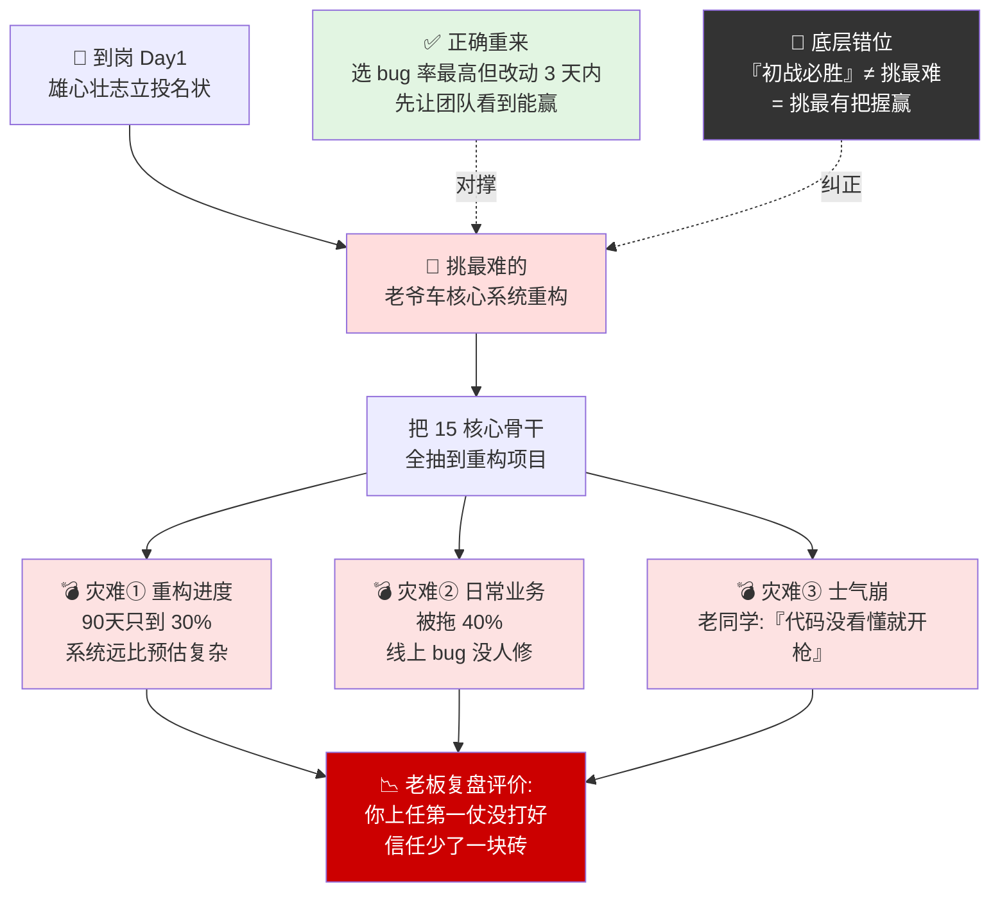
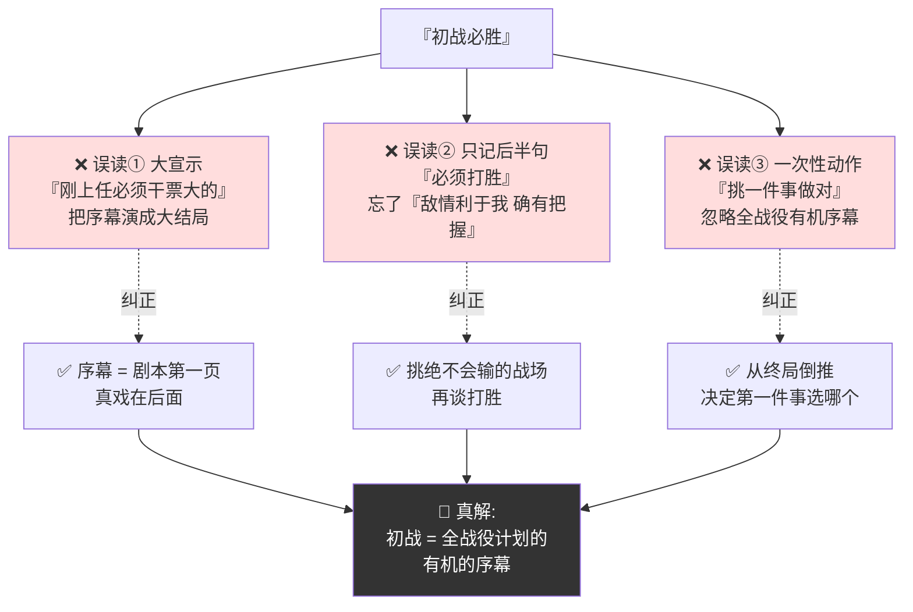
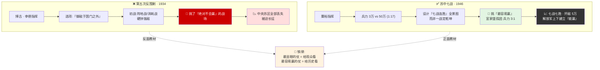
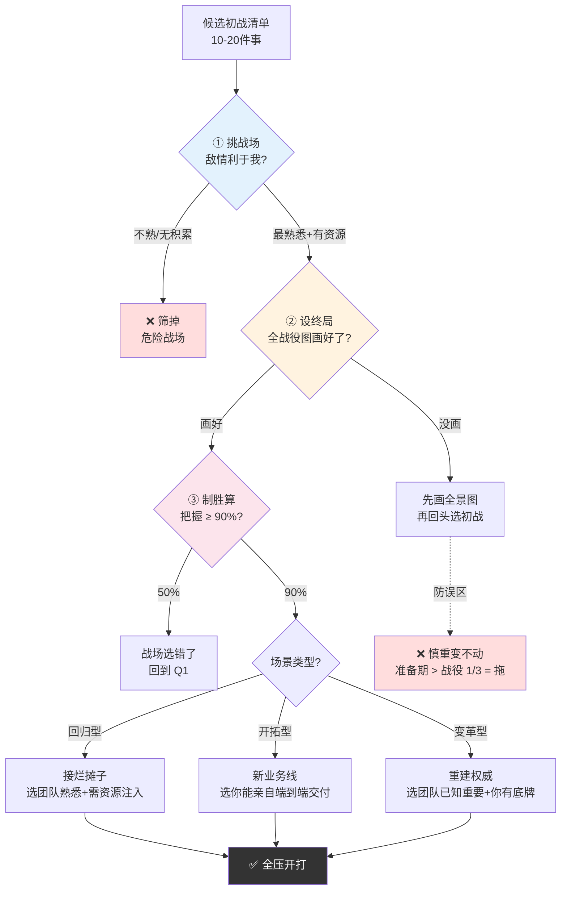
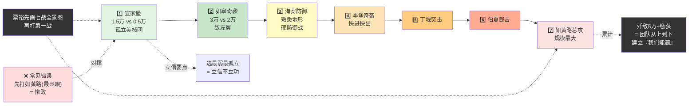
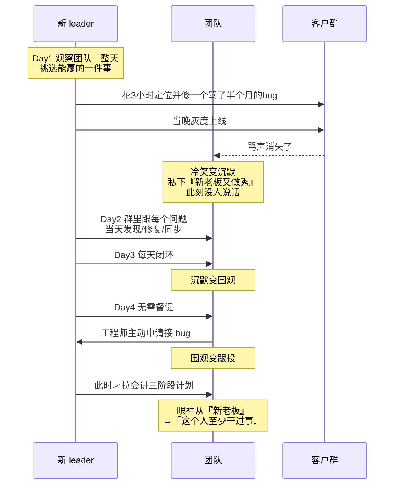
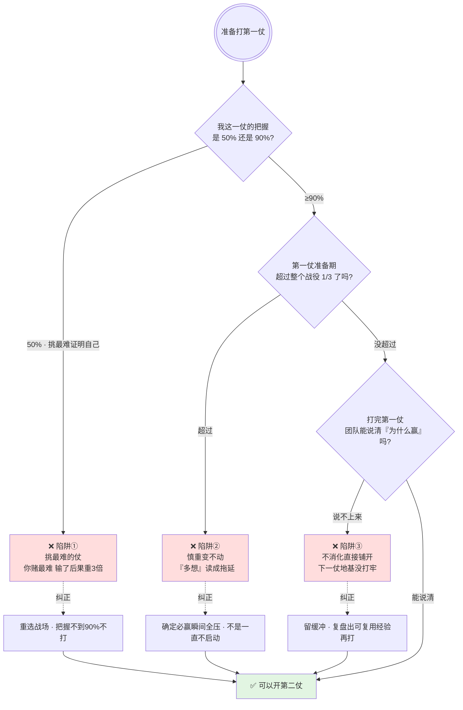

# 34.初战必胜的策略

> 第一仗不是为了让团队"练练手"，而是为了让团队"相信能赢"。一锤子打不准，后面十锤子都是在这个基准上修补。

目录介绍
- 01.空降九十天的蠢事
- 02.市面误读之辨
- 03.三层独家主张
- 04.两段历史正反面
- 05.原文四维精读
- 06.慎重初战之要
- 07.集中兵力之难
- 08.苏中七战示范案
- 09.一个商业切片
- 10.三个认知陷阱
- 11.立威而非立功
- 12.三年认知复利
- 13.收束三句金言

## 01.空降九十天的蠢事

我有一年空降到一家公司做研发总监，组里 50 多人，三条业务线。到岗第一天，我立下雄心壮志：**90 天内把最老、最烂、积累了 3 年技术债的"老爷车"核心系统重构一遍**——这是我给自己、也给老板立下的投名状。然后我把整个团队最核心的 15 个人，全部拉到这个重构项目上。我当时管这叫"集中兵力打歼灭战"，心里还觉得自己懂了毛选。

结果 90 天后成了三重灾难：重构进度不到 30%，因为系统远比我想的复杂；日常业务被拖累了 40%，因为我把主力全抽走了，线上 bug 没人修；团队士气崩了——一个老同学私下跟我说："老板，你刚来就想干票大的，但你连我们的代码都没看懂就开枪了。"更致命的是，老板第一次和我做的季度复盘里给了我一句评价："**你上任第一仗没打好，后面团队对你的信任从一开始就少了一块砖**。"

那晚我在办公室翻《中国革命战争的战略问题》，一个字一个字啃："**初战的计划必须是全战役计划的有机的序幕。没有好的全战役计划，绝不能有真正好的第一仗。**"我才反应过来——我把"初战必胜"理解成了"搞一个最难的、最显眼的、最能证明自己的大项目"，但毛主席讲的"初战"恰恰相反：**不是挑最难打的那一仗打，是挑最有把握赢的那一仗打。第一仗的目的不是立功，是立信**。

如果重来那 90 天，我会选一个线上 bug 率最高、但逻辑最清晰、改动量在 3 天内的单一模块搞重构——先让团队看到"我们能赢"，再去打下一仗。这个教训我后来讲给每一个新上任的 leader：**你上任第一仗，不是证明你有多强，是让团队相信跟着你能赢**。

空降 90 天三重灾难链路 · 一图看清"挑最难的第一仗"如何系统性崩盘：

## 02.市面误读之辨

市面上讲"第一步""第一仗"的，基本都把它读成同类词——"万事开头难，开头就要拼一把大的"。背后有一种隐形崇拜：把第一仗当成"证明自己的最好机会"——所以第一仗越打越大、越打越赌。这恰恰是毛选思想的反面。

毛主席反反复复讲了一件事：**初战必须是全战役计划的"有机的序幕"，不是喝彩，不是宣示，是"序幕"**。序幕这个词的意思是——它只是整个剧本的第一页，真正的戏在后面。很多人把序幕演成了大结局，把第一仗打成了最后一仗。这是误读一——把初战当成"刚上任就要立个大功"。

误读二藏在另一句话里："必须打胜"——市面把这一句用来佐证"所以第一仗要打大的、最难的、最显眼的"。但毛主席这里有一个极其关键却几乎从不在市面出现的限制条件："**必须敌情、地形、人民等条件，都利于我，不利于敌，确有把握而后动手。**"——也就是说，"必须打胜"的前提是"挑一个你绝不会输的战场"。挑最难、最显眼的那一仗，恰好把这条前提反过来了。这是对"必须打胜"最隐蔽也最致命的误读。

误读三是把初战必胜当成一次性的独立动作。毛主席的原话是——"初战的计划必须是全战役计划的有机的序幕，第一仗打什么、什么时候打、打多深，全部由整个战役的终局反推回来安排。"初战不是"挑一件事做对"，而是"从终局倒推回来，决定第一件事选哪个"。

三种误读一图排开 · 每一种都能让第一仗死在起跑线上：

## 03.三层独家主张

**第一，初战必胜的核心在"选"，不在"打"**。市面把注意力全放在"怎么打胜"上——兵力怎么配、节奏怎么控。但毛主席讲得更深一层——初战必胜的前提是"选哪一仗做初战"。挑对了战场，胜率已经锁定了 70%；挑错了战场，再强的战斗力也是拿肉撞铁。"选"的标准就是八个字——**敌情利于我、确有把握**。翻译到今天：敌情利于我 = 你最熟悉的业务、已积累了最多资源的那一条业务线；确有把握 = 这件事你最清楚怎么搞、且你有能力搞下来。

**第二，初战的目的是"立信"不是"立功"**。很多新上任 leader 把第一仗当成自己的功勋章——"我是新来的，我得干一票大的"。这是把初战当成了个人品牌的宣发工具。毛主席讲的"立信"有三层：立组织内部的信（让团队相信你的判断力）、立团队自己的信（让他们重新相信"我们是可以赢的"）、立你作为 leaders 的信（给团队一个"你们可以信我"的真实样本）。立功让你得业绩，立信让你得团队。业绩明年就忘了，信一旦建立，是你在团队里能带三年的基石。

**第三，初战的第一大忌不是"打不赢"，是"打成惨胜"**。"惨胜"比"打不赢"更伤组织——打不赢大家认栽吸取教训，惨胜是付出了巨大代价最后赢了，但团队自己知道"这种赢法不可持续，下次不敢跟你打了"。毛主席反复说"不斗则已，斗则必胜"——很多人把这句话理解成"必须赢"，但重点是那个"不斗则已"：**如果你没把握必胜，那就不要打这一仗，再等等**。打不赢可以再来，惨胜一次团队的心就散了。

## 04.两段历史正反面

毛泽东"初战必胜"思想的文本源头，是 1936 年 12 月发表的一篇极重要的内部讲稿——《中国革命战争的战略问题》。这篇文稿的写作背景极其特殊——**它是"教"出来的，不是"想"出来的**。

第五次反围剿的惨败，是毛泽东一生中最痛的几个教训之一。1933 年 9 月至 1934 年 10 月，第五次反围剿——博古、李德指挥下的"御敌于国门之外"宣告破产，中央苏区全部丢失，红军被迫长征。毛泽东在《中国革命战争的战略问题》中专门剖析了这次惨败的根本原因：**"第五次反围剿时，人们的错误是……开脚一步就丧失了主动权，真是最蠢最坏的打法。"** 请注意——"丧失了主动权"和"最蠢最坏的打法"，他评的不是敌人太强，而是**"开脚第一步"就走错了**。这是把第五次反围剿的失败牢牢钉在"初战没有打好"上。更具体地说，博古李德的"初战"是同强敌拼阵地战、拼消耗——**挑了一个"绝对不会赢"的战场，打了第一仗**。这就是初战选错战场的最大号反面教材。

三年后，苏中七战成了正面典范。1946 年 6 月，国民党调集 50 万大军进攻苏皖解放区。当时粟裕指挥的华中野战军主力不过 3 万余人——**兵力对比是 1 比 17**。放在军事上，这是一场几乎不可能赢的初战。但这场战争的设计是非线性的——粟裕不是在找一个"一战定乾坤"的决战机会，而是设计了"**七战连胜"的整体战役计划**。他依靠解放区群众掩护和支援（总兵力虽少但局部战场每次都能达成绝对优势），专挑孤立突出、运动中的弱敌打（从最易切的软腹部下第一刀）。关键启示——**粟裕的"初战必胜"不是在找"哪一仗最显眼"，而是在找"哪一仗最容易赢"**。最显眼的那一仗是给观众看的，最容易赢的那一仗是给历史看的。

第五次反围剿 vs 苏中七战 · 一图看清"选错战场"和"选对战场"的两极：

## 05.原文四维精读

"必须打胜。必须敌情、地形、人民等条件，都利于我，不利于敌，确有把握而后动手。"请注意——**"打胜"和"确有把握"之间是因果关系，不是并列关系**。毛主席的逻辑链条是——想打胜 → 必须挑"确有把握"的战场。市面上把这两件事拆开讲——先讲"你必须打胜"（压力），再讲"挑有把握的战场"（方法）。但原话的结构是"因为要打胜，所以挑必赢的战场"——这是一个逻辑整体，拆开就变成了鸡汤加技巧套餐。再往深一层——**"确有把握"这四个字，才是整个初战必胜思想里最反共识的一把刀**。

"必须慎重初战——初战的计划必须是全战役计划的有机的序幕。"这段话写在五大反围剿的血泊里。台下坐的红军指挥员大部分都亲历过第五次反围剿惨败，他们听到的不是军事理论，是对"我们上次死在哪里"的逐层解剖。毛主席不是在教他们新东西，是让他们找回自己本来就知道但被打懵了的东西。

这段话里最精彩的张力藏在"序幕"两个字里——序幕的隐喻意味着**你打第一仗的同时，必须已经看清楚"这一仗在整个剧本里的位置"**。反过来就是——如果没有全战役计划，那就没有资格打初战。市面解读把这段话翻译成"第一仗要打好"——这是温吞的废话。它没说出最狠的那一层——**在没有全战役计划之前，任何"初战"都是赌场冲锋**。没有全计划等于战场上横冲直撞，有全计划等于有地图再行军——这两个动作的风险天差地别。

## 06.慎重初战之要

什么是"慎重初战"的"慎重"？不是紧张、不是拖延、不是过度准备——是把注意力锁死在三件事上。

**第一，挑战场**：敌情利于我——事情到底困不困难？你是不是最熟悉这条业务线的那个人？你手里有没有资源和积累能直接对接这个战场？三个问题答完，能筛掉至少 70% 的危险战场。

**第二，设终局**：不是"先打第一仗再看第二仗"，而是**先把整个战役想清楚再打第一仗**。粟裕的苏中七战不是因为第一仗赢了才接着打，而是因为他脑里已经有"七战"的全图——从终局倒推初战。

**第三，制胜算**：敢不敢说"这一仗大概率会赢"？不敢说的话，再等等。毛主席讲"不斗则已，斗则必胜"——很多人只记后半句，其实前半句是纪律：**如果你判断打不赢，就不要打**。这是初战前最后一道自检——过了就全压，不过就继续准备。

初战不是每一次都要憋大招，但每一次必须让团队看到"我们能赢"。所以更具体地，第一仗选什么场景打——回归型：你刚接手一个烂摊子，第一仗选一件团队已经熟悉、你只需资源注入就能完成的小胜仗（不要选你自己懂团队不懂的）；开拓型：你是新 co-founder 或新业务线负责人，第一仗选一个你能在极短时间内亲自端到端交付的交付物；变革型：你需要迅速重新建立领导权威，第一仗选一件团队已经知道重要、你也已经有底牌能把控的项目。

慎重初战三要素筛选流程一图带走：

## 07.集中兵力之难

知道了"慎重初战"，为什么多数 leader 第一仗还是会踩坑？因为"集中兵力"这句话太容易说但太难做了。

你为什么不由自主分散兵力？因为新官上任综合症——刚接手团队想做太多事，急于证明自己。结果是每条业务线抽几个好手过去，看起来每件事都有人在干，但没有一件事是人够的。破解之道——列完你打算做的事情后强制砍掉 60%，只留一件上手那一仗。

外部的干扰：老板突然插进来一个紧急需求、客户催得很紧、兄弟团队需要配合。这些事一句"紧急"就能把你的主力从初战上拉走。破解之道——这些事单独开一个"缓冲池"，由你本人当隔离墙。任何新进来的需求先进缓冲池，由你亲自判断要不要把主力从初战上调过去。

深层的问题：初战打了几天没有成果，你开始怀疑自己选错了。这种自我怀疑会让你在"坚持原计划"和"换方向再试"之间反复摇摆——这比分散兵力更消耗。破解之道——初战开始前定一个"不回头期"，比如初战启动的前两周内，除非出现灾难级信号，不然不调整方向。

## 08.苏中七战示范案

1946 年 6 月，国民党集中 50 余万大军进攻苏皖解放区，华中野战军主力仅 3 万余人。毛泽东的指示非常明确："先在内线打几个胜仗。"请注意——"几个胜仗"是一个整体战役计划，不是打一个算一个。

七战全貌：首战宣家堡歼灭美军装备团，兵力 1.5 万对 0.5 万——不要碰敌人主力，先打小而孤立的部队；再战如皋奇袭敌左翼，兵力 3 万对 2 万，仍有局部优势；之后海安防御、李堡奇袭、丁堰突击、伯夏截击、如黄路总攻——逐渐扩大战场和打击力度。七战七胜，歼敌 5 万人，缴获大量装备。关键启示——**七战的设计是从"易"到"难"的精确曲线**。第一战打最弱、最孤立的部队；第二战打快进快出的快速偷袭；第三战打地形极度熟悉的防御战；每一战都为下一战积累情报、士气、装备。"初战必胜"思想在这一案例里体现为三层——选最易切的软腹下部第一刀（宣家堡孤团），每一战都是下一战的兵力训练营（越打越强），七战不是"赢了一场再想下一场"，而是"先有七战的全景图，再打第一战"。**苏中七战的结果不仅是军事上的胜利——它让解放军从上到下彻底建立了一种"我们能赢"的信**。这比任何战前动员都有效，因为信是打出来的，不是讲出来的。

苏中七战由易到难的精确曲线一图看透：

## 09.一个商业切片

那次 90 天的惨败之后，我被调到一个新项目去"救火"。这个项目的前任 leader 刚跑路、代码没人看懂、文档为零、客户天天在客户群骂。整个团队士气极差、对管理层的信任度接近冰点。这次我没有上来就重建系统——那是我上次犯的错。我做了一件所有人不理解的事：**先挑一个最简单的 bug，花了 3 小时自己定位自己修、修完当晚直接上了灰度验证——第二天客户群里那条骂了半个月的投诉消失了**。

团队是什么反应？三个态度变化：从冷笑变沉默——本来有人私下说"新老板又来做秀了"，bug 被修的那天没人说话了；沉默变围观——连续三天我都在群里跟进度、把每个问题闭环：当天发现、当天修复、当天同步；围观变跟投——第四天开始有工程师主动申请接某个 bug。这件事做完之后我才正式拉他们开会，讲这次整个"救火"的三阶段计划。团队这时候看我的眼神和第一天完全不同了——不是崇拜，是"这个人至少干过事"。

这个小胜仗不是"厉害"，是一场精心设计——我花了一整天观察团队，最后选了一件所有人能力都能做但就是没人接手的事。为什么选它做初战？三个原因：敌情利于我——版本管理、测试自动化、规范制定这些全部是我做了十年的基本功；确有把握——不是 90%、是 100% 的把握，因为都是手熟的活；立信而非立功——第一仗不是给老板看的，是给团队看的。我后面六个月打的所有大仗，地基都是这一场小仗打出来的。**因为你第一仗让团队看到了"哪怕只是一件小事，这个人说干就干、干完还有交代"**。

"修一个小 bug"作为初战的信任建立链 · 一图看清三日三态度：

## 10.三个认知陷阱

最常见的坑——**新上任第一件事先挑最难的干，证明自己**。我那次空降 90 天的核心系统重构，就是典型的"挑最难打的那一仗打，证明我能行"。但团队和老板不会因为你挑了最难的而信任你——他们只看你"有没有打赢"。你赌最难的、输了，比你不赌、稳扎稳打输了后果严重三倍。识别方法：问自己"这第一仗我的把握是 50% 还是 90%"，如果是 50%，那这一仗的战场选错了。

第二个坑——**"慎重"变成了"不动"**。把毛主席的"慎"读成王阳明的"要多想"，第一仗一直不启动。毛选的慎是"确定必赢就瞬间全压"，不是"一直不启动"。识别方法：第一仗的"准备期"超过整个战役计划的三分之一，就是在拖延而不是在慎。

第三个坑——**打完第一仗立刻全量铺开，没有等团队消化**。苏中七战每一战之间都有缓冲：宣家堡打赢之后没有立刻扑向如皋，粟裕留出了整理装备、重组兵力、消化信息的时间。识别方法：打完第一仗之后团队还能说清楚"上一仗为什么赢了"吗？说不上来，下一仗别急着开。

三个认知陷阱识别决策树 · 一图排查自己在哪个坑：

## 11.立威而非立功

这是从初战必胜思想里能提炼出最锋利的一条——**第一仗不是用来立功的，是用来立信的**。立信需要三样东西——打一场必赢的仗（证明判断力）、打一场团队能参与的仗（证明带队力）、打完立刻给参战者公开赞誉（证明分功不独吞）。

为什么这三样东西构成"立信"？判断力让团队相信你指的方向是对的，带队力让团队相信跟你打仗不会成为炮灰，分功让团队相信赢了不会只有你站上领奖台。三样齐了，"信"就建起来了。

而立功只需要一样——**一场漂亮的数据**。你可以第一仗打一个非常大的项目把数字做漂亮，但代价是团队从头到尾只能旁观，而你变成了全团队唯一的英雄。立功在短期内让你的老板满意，立信在长期内让你的团队愿意跟你打任何仗。初战就是组织的信任结构，立信是在这个结构上建第一根柱子。

## 12.三年认知复利

那次"修一个小 bug"之后，我对"初战"这件事彻底重构了认知。过去我以为初战是"展示实力"——挑最难的打、打最大声的、让最多人看到。现在我管它叫"信任种子"——第一仗不一定要大，但一定要赢，而且要所有人信。

从此我新接任何业务启动三步流程成了铁律——启动前先做"战场侦察"：把整个业务域能打的仗全列出来，每场仗旁边标三行——我手里有多少资源、团队对这件的熟悉度、打赢后能产生多大的"信"；然后做"必胜排序"：不是按"重要程度"排，是按"必赢把握 × 立信系数"排，只打必赢指数最高的那一仗。然后做"初战宣言"：不是画饼、不是 PPT 48 页，而是把"为什么挑这一仗、为什么这一仗大概率会赢、打完能给大家带来什么"写在一张 A4 纸正中间，当众念给大家听。三重仪式走完，团队对第一仗的成功率和我预估的一致率，从过去的 30% 提高到了 90%。

第二年我开始教新 leader 这件事——你不能替他们选初战，但你能问他们四个问题。你为什么挑这一仗？你有几成把握？你的团队信吗？打完之后下一步是什么？四个问题答不上来的，请他重新备初战方案——不批、不审、不打回去重写，就是坐下来陪着重新列一张表重选。

第三年我发现一个规律——**任何新业务的成功，都遵循"首战效应"**：第一仗选的必赢，后面就赢多输少；第一仗选的冒险，后面就输多赢少。这个效应就是毛主席讲的那句大实话——**"第一个战斗的胜败给予极大的影响于全局，乃至一直影响到最后的一个战斗"**。三年下来，我手头所有新业务首战成功率维持在 90% 以上，不是因为我的团队特别强，是我再也没让自己犯过"挑最难的那一仗打"的错。

## 13.收束三句金言

**第一仗不是为了让团队"练练手"，而是为了让团队"相信能赢"。一锤子打不准，后面十锤子都是在这个基准上修补。**

挑战场是初战 70% 的工作。敌情利于我加确有把握，四个字筛掉所有危险选项。初战的目的是立信不是立功——挑一个"一定会赢"的小胜仗做根基，而不是挑一个"赢了出名"的硬仗去赌。没有全战役计划之前，任何初战都是赌场冲锋——先把整个战役想清楚，再打第一仗。不斗则已，斗则必胜。如果你判断打不赢，就不要打。

**你最近一次"新起点"的第一仗，是挑的最难的那一仗，还是最有把握赢的那一仗？** 如果是最难的那一仗——下一次请你试试从"必胜把握"里面挑，而不是从"最显眼"里面挑。
