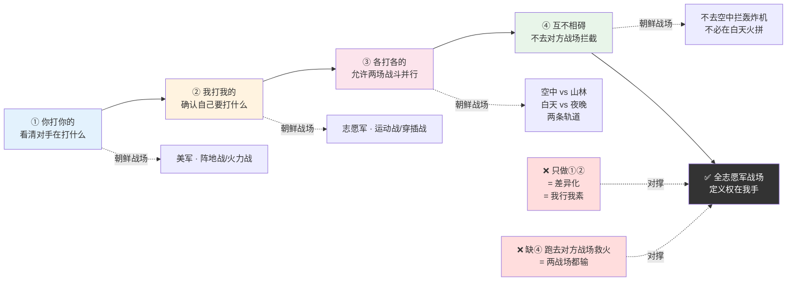
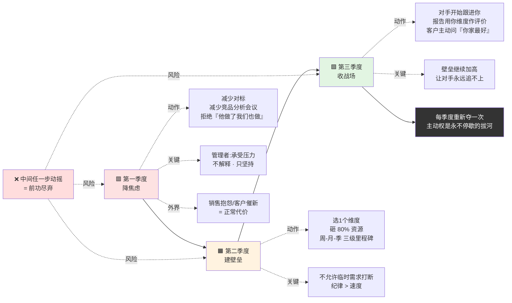

# 你打你我打我的

> 在你设计的战场上，你才可能赢；在别人设计的战场上，你最多打个平手。

#### 目录介绍
- 01.被竞品牵着走
- 02.市面误读之辨
- 03.三层独家主张
- 04.一九五零朝鲜
- 05.原文四维精读
- 06.识别对手节奏
- 07.定义自己的战场
- 08.拒绝无意义对标
- 09.用时间换主动权
- 10.一个商业切片
- 11.三个认知陷阱
- 12.三年认知复利
- 13.收束三句金言

## 01.被竞品牵着走

前年我们的产品被一家竞品盯上了。他们每两周发一个新功能、每个新功能都在对标我们的产品、每条宣传文案都在暗示"我们比XX更好"。团队的销售天天拿竞品的功能清单来问我："他们出了这个，我们要不要也做一个？"研发被逼着追了三个月，做了一个对标功能、两个对标功能、三个对标功能——我们自己的产品定位在这个过程中越来越模糊。

第三个月月会上我把竞品半年的功能上线时间表画在白板上，问了一个问题："这半年以来，我们做的每一个功能，有多少是我们自己想做的、多少是被竞品逼着做的？"数完之后发现——**80% 是被竞品逼着做的**。我们在他们的战场上，打他们最擅长的仗。他们出一招我们接一招，他们出十招我们接十招——我们不是在竞争，我们是在**陪练**。

第四周我做了一个所有人都反对的决定：**停止对标**。我们不再看竞品的功能清单。我问团队一个问题："如果这个竞品明天消失，我们最该做的是什么？"答案不是任何对标功能——是我们自己的核心体验优化。那个季度我们把竞品的研究时间从每周 10 小时砍到 1 小时，把省下的 9 小时全部投入到自己的核心体验上。

三个月后竞品发了一版大更新——但我们已经不在乎了。因为我们在一个完全不同的维度上建立起了他们追不上的优势。他们还在功能层打，我们已经跳到了用户体验层。**他们打他们的功能战，我们打我们的体验战**。两场仗不在同一个战场。

那个季度我第一次真正理解毛泽东那句"你打你的，我打我的"——它不是让你忽视对手，而是让你**把战场的定义权拿回自己手里**。

## 02.市面误读之辨

市面上讲"你打你的我打我的"的人，最爱把它讲成一种"我行我素"的心态——"不要管别人怎么想，做自己就好"。这句话听起来很酷，但它把毛泽东的战略原则降维成了**性格宣言**。

真正的"你打你的我打我的"不是心态，是**战略主动权**。它不是说"我不管你在做什么"，而是说"我知道你在做什么，但我选择不在你的战场上和你打"。心态不关心对手，战略时刻紧盯对手——区别在于，心态选择"无视"，战略选择"避其锋芒、另辟战场"。

还有一种更普遍的误读：把它当成"差异化竞争"的同义词。两个概念的区别在于——差异化是"我做和你做不同的事"，主动权是"**我决定这场竞争在哪个维度上展开**"。前者是一种选择，后者是一种权力。你打你的我打我的，终极目标是让对手不得不进入你的战场，用你擅长的规则和你竞争。

为什么这两种误读最流行？因为它们**回避了最关键的动作成本**。真正的主动权不是喊出来的，是**用放弃换来的**——你需要放弃对标、放弃跟随、放弃"别人有的我也要有"的焦虑。这种放弃在短期内看起来像在认输，大多数人扛不住这种压力。

## 03.三层独家主张

**第一层，主动权不是"做自己"，是"重新定义战场"**。你不可能在别人设计的比赛规则里赢过设计者。你能赢的唯一方法是——把比赛换到一个对手不擅长但你擅长的维度上。毛泽东打的每一场大胜仗都不是在国民党预设的战场上——你打你的城市战，我打我的游击战；你打你的阵地战，我打我的运动战。**战场定义权就是最高级的竞争权**。

**第二层，放弃对标是最难的勇敢**。竞品出了一个功能你没做，销售团队在吼、客户在催、投资人在问。如果你扛不住压力跟进了一个对标功能，你就等于把战场定义权双手奉还给了对手。你跟进得越多，你就在对方的战场上陷得越深。放弃对标不是放弃竞争，是**把资源从"跟进"重新分配到"创新"**。

**第三层，主动权是动态的，需要每季度重新夺取**。上一季度的主动权可能因为对手的战略调整而丧失。对手今天在你定义的战场上吃了亏，下一季度他一定会想办法把战场重新拉回他的优势区。主动权争夺是一场**永不停歇的拔河**——你夺回来一次不代表永远是你的。

## 04.一九五零朝鲜

**1950 年 10 月 19 日**，中国人民志愿军跨过鸭绿江。面对的是"联合国军"——**以美国为首的 16 个国家组成的联军，总兵力 42 万人**，拥有绝对的制空权和制海权。**具体装备差距**：美军一个师有 432 门炮、149 辆坦克，志愿军一个师只有 190 门炮（多为轻型）、0 辆坦克；美军全军拥有 1100 架飞机、300 艘舰船，志愿军入朝时**零架飞机、零艘舰船**。**这种装备差距大到任何一个军事参谋都会建议"不要打"**——理论上按常规打法志愿军会在一个月内被全歼。

麦克阿瑟预判的战场是：**志愿军会沿主要交通线正面迎战**。他按照美军最擅长的阵地战、火力压制来部署兵力——**用轰炸机和重炮先摧毁对方阵地，再用装甲部队推进**。这套打法在二战欧洲战场屡试不爽，麦克阿瑟自信满满地宣布"**圣诞节前结束战争**"。

但志愿军完全没按这个剧本走——**他们放弃了所有主路，走山路、夜行军、穿插渗透**。**具体细节**：志愿军 25 万人夜间徒步入朝，白天全部隐蔽在山林里（不点火、不做饭、不能有炊烟），美军侦察机飞了两周都没发现这支大军；每人负重 30-40 公斤（枪+弹+粮），日行 40 公里山路；作战时避开美军火力最强的白天，专打黄昏和黎明——**美军白天用飞机炸，志愿军夜晚用双脚走；美军打的是火力覆盖，志愿军打的是近距离穿插**。

**第一次战役打了 13 天（10 月 25 日-11 月 5 日），"联合国军"损失 1.5 万余人，被迫从鸭绿江边退到清川江以南**。第二次战役更惨烈——**美军王牌部队"北极熊团"第 31 团 3200 人被志愿军 9 兵团全歼，团旗被缴获（今存中国革命军事博物馆）**。麦克阿瑟后来承认："**我们在和一个全新的敌人打一场全新的战争。**"

这场战役的核心不是"以弱胜强"。志愿军和美军从来不是在同一维度上竞争——**美军打的是装备战，志愿军打的是运动战**。两场战争在两条完全不同的轨道上运行。**美军没有输在"打得不好"上，它输在从来没有进入过自己设计的战场**。从跨过鸭绿江的那一刻起，战场的定义权就在志愿军手里——**这就是"你打你的，我打我的"的最经典诠释**。你有制空权就让你在空中打，你的空中打法在山林里失效；我有夜行能力就让我在夜里打，你的白天优势在黑暗中归零。**同一场战争，两个战场**——这才是真正的战略。

## 05.原文四维精读

> 原文："**你打你的，我打我的。各打各的，互不相碍。**"

请注意毛泽东用的句式——**你……我……各……互……**。这不是一句口号，是一个**四步操作流程**：第一步，看清你在打什么（你打你的）；第二步，确认我要打什么（我打我的）；第三步，允许两场战斗并行存在（各打各的）；第四步，不试图在对方战场上拦截他（互不相碍）。四步缺一不可——多数人只做了前两步，就以为掌握了精髓。

四步操作流程一图看透（多数人只做前两步）：

再看一个被忽略的词——**"互不相碍"**。这四个字里藏着最深的战略智慧：**你不必在每一个维度上都赢**。对手在他的战场上大杀四方，你在你的战场上建立壁垒——两个结果可以同时成立。不理解这一点的人，会忍不住跑去对方战场上救火，最终在两个战场上都输掉。

这段话最早的正式表述出现在解放战争时期。1947 年国民党全面进攻改为重点进攻陕北和山东，胡宗南率领 25 万大军进攻延安。毛泽东主动放弃延安，转入陕北的山沟里和国民党军队周旋。他在转战途中对身边工作人员说了一句极朴素的话："**他打他的，我打我的。各打各的，互不相碍。**"

这句话的内部有一个张力：**你打你的不需要你赢，我打我的必须我赢**。对手在他的优势维度上占据上风是正常的——这不影响你的战略。你的全部注意力只集中在一件事上：我的那个维度我赢了没有？如果你的维度上你也没赢，那问题不是对手太强，是你自己没在自己的战场上打好。**不解释自己的失败，只追问自己的阵地**。

市面上把这句话翻译成"走自己的路，让别人说去吧"。这是**彻底错的**。"走自己的路"是个人修养，不涉及竞争；而"你打你的我打我的"要求你**时刻关注对手的动态，但不被对手牵走**。两者的区别在于：前者是"我不看你"，后者是"我看见你了，但我选择不跟你"。"我看见你了"这种清醒，比"我不看你"的傲慢，难一百倍。

## 06.识别对手节奏

被对手牵着走的第一步不是"跟进了某个功能"，而是**你的心里已经开始焦虑**。焦虑是丧失主动权的第一个信号——你发现自己在想"他做了这个我们没做，会不会出问题"。**这个想法一出现，你的注意力就被从自己的阵地上抽走了**。

识别对手节奏的目的不是"预判对手下一步会做什么"，而是**判断对手正在把你往哪个方向引**。每一个强敌都想把你拉进他的战场——**大厂想让你跟它拼资源**（因为它有钱）、**老牌企业想让你跟它拼品牌**（因为它有历史）、**低价竞争者想让你跟它拼价格**（因为它有毛利空间）。你要识别的不只是对手的动作，更是**动作背后他想让你做的事**。一旦你识别出了他希望你做的事，你就知道哪条路是死路。

**具体的识别方法**：每次对手出一个大动作，先问自己三个问题——**第一，这个动作最直接的效果是什么？第二，如果我跟进这个动作，我会被拖入他的哪个战场？第三，这个战场里我有没有独家优势？**三个问题回答完，如果发现"跟进 = 进入他的战场 + 我没有独家优势"，答案就是**坚决不跟**。**能忍住"不跟"的团队，才有资格谈主动权**。

## 07.定义自己的战场

凭什么你定义战场对手就得来打？答案只有一条：**你定义的战场里，有你独有的、对手短期内追不上的优势**。这个优势可以是**技术壁垒、用户关系、数据积累、对某个细分场景的极端理解**——任何对手无法在三个月内复制的优势，就是你的战场。

**定义战场的动作有三步**：**第一步，找出你的独有优势**——"什么是我能做而对手无论如何做不了的"。这个问题不好回答——大多数团队会陷入"我们哪都比对手强一点"的自我感觉良好，其实每一个"强一点"都不是壁垒。**壁垒的标准是"对手投入 3 倍资源也追不上"**——达到这个标准的能力，才是可以定义战场的独家优势。

**第二步，把你的全部资源集中到这个维度的建设上**，让它成为一个真正的壁垒。**这个动作最难的是"忍住扩张的诱惑"**——当你在某个维度做出成绩时，团队会立刻想"我们要不要也做 A/B/C 相关的东西？"每一个"要不要也做"都是资源的分流。**真正建壁垒的团队会拒绝所有扩张动作，把 100% 的资源都投在深挖那一个维度上**——直到对手放弃在这个维度上和你竞争。

**第三步，对外释放所有的信号都围绕这个维度**——让你的客户、投资人、媒体都知道"这家公司最强的是这个"，让对手在你的维度上和你竞争时天然处于舆论劣势。**这不是营销，是战场认知的塑造**——当所有人都认为"某维度这家公司最强"，对手在这个维度上的任何投入都会被市场解读为"追赶"，你在这个维度上的任何微小进步都会被市场解读为"领先"。**认知一旦确立，对手的每一步都是替你打广告**。

## 08.拒绝无意义对标

大多数公司把大量时间花在"竞品分析"上，其实是花在了**焦虑转移**上。他们不是真的需要了解竞品——**他们需要的是让自己看起来"很忙"**。"竞品分析"成了最体面的拖延方式——因为它看上去是"研究市场"，其实是在逃避"决定自己要做什么"这个更难的问题。

真正有意义的竞品分析只需要回答三个问题：**第一，竞品有没有进入我的战场？** 如果没有，看它一眼就够了。**第二，竞品在我的战场上有新的动作吗？** 如果没有，不需要深入分析。**第三，竞品最近三个月的变化透露出它想往哪个方向转型？** 如果这个方向和我的战场可能接壤，需要深度分析。如果三个问题的答案都是否定，你的竞品分析就是在浪费时间。

**80% 的竞品分析都是无用功**——它只是让团队感到\"我们在应对竞争\"的心理安慰，实际上并没有产生任何决策价值。砍掉它们，把时间还给自己的产品。**具体的动作**：把每周的"竞品分析会议"从 2 小时压缩到 15 分钟——只讨论上述三个问题，回答完就散会，不允许延伸讨论"如果我们也做 X 会怎样"这种拖沓议题。

## 09.用时间换主动权

主动权不是一天夺回的。你被对手牵了一年的鼻子，不可能下周就翻盘。**夺回主动权需要时间**：

**第一季度降焦虑**——**减少对标、减少竞品分析、减少"他做了什么我们也要做"的会议**。这是最痛苦的一季——团队会不适应，销售会抱怨，客户会问"你们怎么不出新功能"。**这时候管理者的核心工作不是解释，是承受压力**——你如果扛不住这三个月的质疑，主动权永远回不来。

**第二季度建壁垒**——**集中全部资源做一个对手追不上的维度的建设**。这一季度你需要选定"一个维度"，然后把 80% 的资源砸进去。壁垒的建成不是一次冲刺，是**每周一小步 + 每月一里程碑 + 每季度一个可展示的重大突破**。**关键不是速度，是纪律**——不允许任何"临时需求"打断这个建设。

**第三季度收战场**——**当你的壁垒建成，对手在你的维度上已经打不过你，这时候他不得不进入你的战场**。这是主动权真正回归的时刻——你会发现对手开始跟进你的方向、行业报告开始用你的维度作为评价标准、客户开始问"你们家在 X 这个方向上做得最好，其他家怎么比"。**这时候你已经赢了**，剩下的工作就是把壁垒继续加高，让对手永远追不上。

**主动权从放弃开始，到壁垒建成时回归**。这个过程需要 3-9 个月，中间任何一步动摇都会前功尽弃。

主动权三季度回归节奏一图带走（放弃→壁垒→收场）：

## 10.一个商业切片

讲一个正面案例：美团如何在阿里本地生活的正面攻击下保持主动权。

> 2018 年阿里收购饿了么，投入 200 亿亲自下场打本地生活战争。外界普遍认为美团会被拖入一场和阿里拼资源的价格战。但美团选择了一条完全不同的路——**不打价格战，打效率战**。
>
> 阿里的战场是"补贴 + 流量"，它最擅长的是把淘宝天猫的流量灌进饿了么，用补贴拉新。美团的战场是"骑手调度 + 商家 SaaS"。美团没有跟阿里拼补贴——它把全部资源投入到了骑手调度算法的优化、商家后台的数字化改造上。
>
> 三年后结果出来了——阿里的补贴停了之后饿了么的订单量回落到补贴前水平，而美团的骑手平均配送时长从 30 分钟降到了 28 分钟，商家续费率从 70% 涨到了 85%。美团没有在阿里的战场上赢，但它在自己的战场上赢得很彻底。
>
> 这个案例的核心洞察不是"美团比阿里聪明"，而是**美团从第一天起就拒绝进入阿里的战场**。它顶住了两年被骂"不如饿了么便宜"的压力，直到自己的壁垒建成。

**美团这两年扛住压力的方法**：**第一，内部对齐战场定义**——王兴多次在全员会上明确说"我们不打价格战、我们打效率战"，让整个公司在被外界质疑时不动摇；**第二，量化自己的战场进展**——每周同步骑手配送时长、商家续费率、订单履约率等数据，让团队看到\"我们的战场我们在赢\"，抵御\"隔壁战场我们在输\"的心理消耗；**第三，转化外界质疑为战场证据**——当媒体质疑\"美团不如饿了么便宜\"时，王兴的回应是\"便宜不是我们的战场，效率才是\"——**主动把话题拉回自己的战场，不允许被牵到对方的战场上讨论**。

**再对比一个反面**：同一时期某本地生活公司选择的策略是"跟阿里拼补贴+跟美团拼效率"——两条战线同时推进。**结果是两条战线都做到 60 分但没有一条做到 90 分**，两年后现金流耗尽被迫卖身。**它输的不是资源，是战场定义权**——它试图同时进入阿里和美团的两个战场，结果在两个战场上都被对方的主场优势压制，两边都赢不了。这就是"你打你的我打我的"最反面的教材。

## 11.三个认知陷阱

**陷阱一：把"做自己"当成了"不看对手"**。**你打你的我打我的，前提是你知道对手在打什么**。不看对手的人不叫"做自己"，叫**战略盲人**。**识别方法**：如果你的团队一个月都没有讨论过对手的动向，说明已经从"不被对手牵走"滑向了"完全不看对手"——这两个是完全不同的状态。破解动作：每月固定一次 15 分钟的对手动向同步会——只做识别不做跟进，把对手动向变成"背景信息"而不是"待办事项"。

**陷阱二：因为一次没跟上就自我怀疑**。竞品发了一个功能你的用户没反应，竞品拿了一轮融资你的投资人没问——这些都不是你丧失主动权的信号。**识别方法**：丧失主动权的唯一定义是——**你最近三个月的动作里，有多少是被对手逼迫的、有多少是自己主动设计的**。破解动作：每季度末统计一次"动作来源分布"——被动跟进的占比超过 30% 就要拉响警报，超过 50% 就是主动权已经丢了。

**陷阱三：夺回一次主动权就觉得安全了**。**对手会不断尝试把战场拉回他的优势区**。**识别方法**：每季度检查一次——**现在这场竞争在哪个维度上展开？这个维度还是我设计的吗？** 如果不是，你的主动权已经悄悄流走。破解动作：把\"战场维度定义\"作为季度 OKR 的第一项——如果这一项没做好，其他 OKR 完成再多也不算成功，因为你是在别人的战场上打胜仗，赢的成本会越来越高。

## 12.三年认知复利

停止对标之后的第一季度是最难的——销售天天焦虑、团队天天问我"他们又发了一个，我们跟不跟"。我只回答一句话："**告诉我那个功能在我们定义的核心维度上有没有威胁**。"绝大部分功能都没有。到第二季度，销售开始反过来告诉我："那个竞品的功能我问了几个客户，他们其实不在乎。"

**第一年的变化**：团队从"每周花 10 小时看竞品"变成"每月花 1 小时同步动向"——**省下的时间全部投入到自己的核心壁垒建设**。半年后我发现一个现象：**当我们不再追着竞品跑之后，竞品开始追着我们跑了**。因为我们在自己的维度上建立的壁垒越来越深，深到竞品不得不跟进。但他们跟进的速度永远追不上我们深耕的速度——**因为他们每追一个功能要两周，我们在这个维度上已经跑了两年**。**用对方最不擅长的方式建立壁垒，你越跑对方越追不上**。

**第二年的变化**：我们的行业地位从"某某公司的替代品"变成了"某某维度的定义者"——媒体开始用我们的产品作为行业标杆，客户开始把我们和头部大厂放在同一列比较。**这个认知重塑是复利效应最直接的体现**——一旦你在某个维度上被认为是标杆，投资人、客户、人才都会自动向你聚集，你不需要花任何额外营销费用。

**第三年的变化**：我判断一个产品团队是否成熟，有一条几乎条件反射的标准：**他们花在竞品分析上的时间占比是多少？** **超过 20% 的团队，已经被竞品牵走了主动权**；低于 5% 的团队，要么有自己的壁垒，要么完全不看对手——前者是真高手，后者是运气好还没遇到强敌。**这条标准现在成了我评估合作伙伴的默认第一问**——一个把 30% 时间花在追赶竞品的团队，无论产品做得多好都不值得深度合作，因为它没有战略主动权，未来任何一次竞争激化都可能让它崩盘。

## 13.收束三句金言

**一句话核心**：**你打你的我打我的本质不是"做自己"，是"把战场定义权从对手手里夺回来"**。**这不是心态，是战略主动权**——两者的区别在于，前者是"我不看你"，后者是"我看见你了，但我选择不跟你"。**看见但不跟**——这是所有战略执行者一生的功课。

**你应该带走的三件事**：

**一，主动权从放弃对标开始**：不跟进竞品的功能不是认输，是把资源重新分配到自己的核心壁垒上。**忍住扩张诱惑、忍住跟进焦虑、忍住被质疑的压力**——三个"忍住"做到了，主动权就在你手里。

**二，定义自己的战场需要独有优势**：**任何对手三个月内追不上的能力，就是你的战场**。定义战场三步——找独家优势、集中资源建壁垒、对外释放认知信号。三步走完，你就在自己的战场上了。

**三，主动权需要每季度重新夺取**：对手会不断尝试把你拉回他的优势区，你必须在自己的壁垒上跑得比他快。**认知一旦确立，对手的每一步都是替你打广告**——这就是战场定义权的复利效应。

**一句留给你的反问**：你最近三个月的产品动作里，**有多少是你自己想去做的、有多少是竞品逼你做的？** 如果后者超过 50%，你的主动权已经丢了。从下周开始砍掉所有"竞品逼你做的"事，把省下的时间全部还给"你自己想做的"。**先夺回主动权，再想怎么赢**——在别人的战场上永远赢不了大胜仗，只有在自己定义的战场上，你才配得上"胜利"两个字。**从今天起就练起来——找出这季度你被对手牵着鼻子做的那一件最消耗资源的事，先砍掉它，然后把省下的资源全部还给你自己真正想做的事情**。
