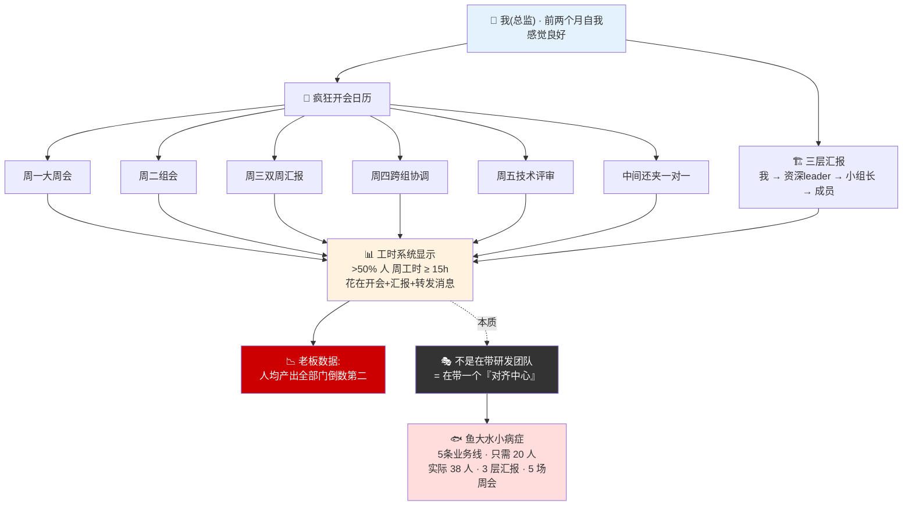
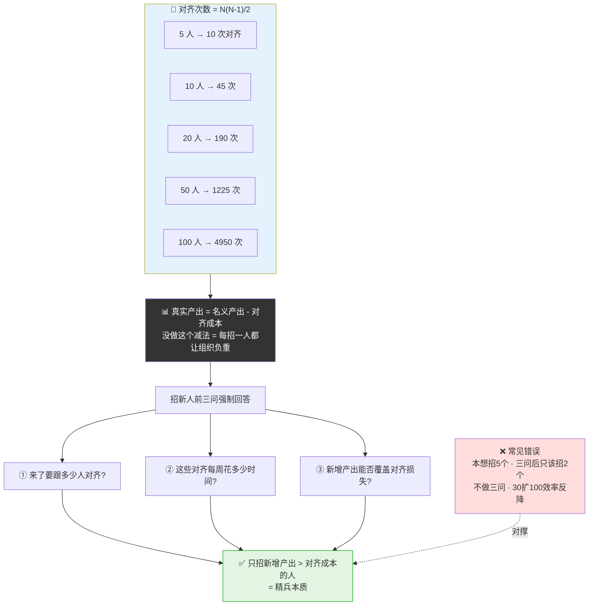
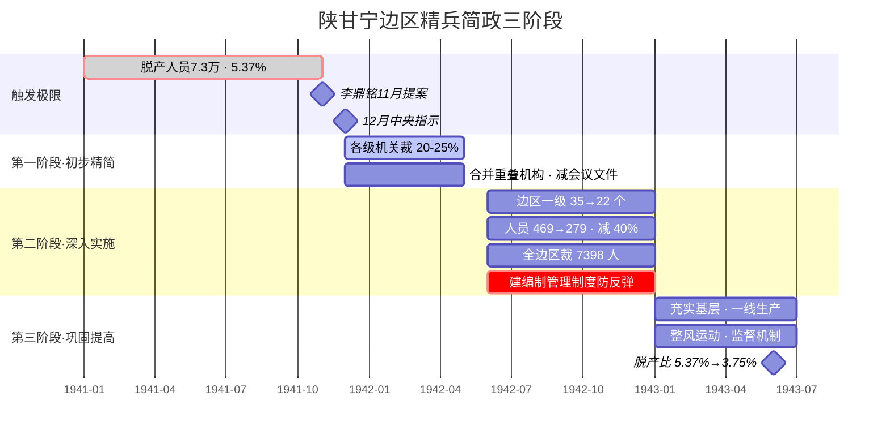
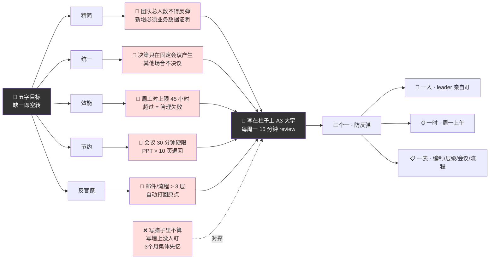
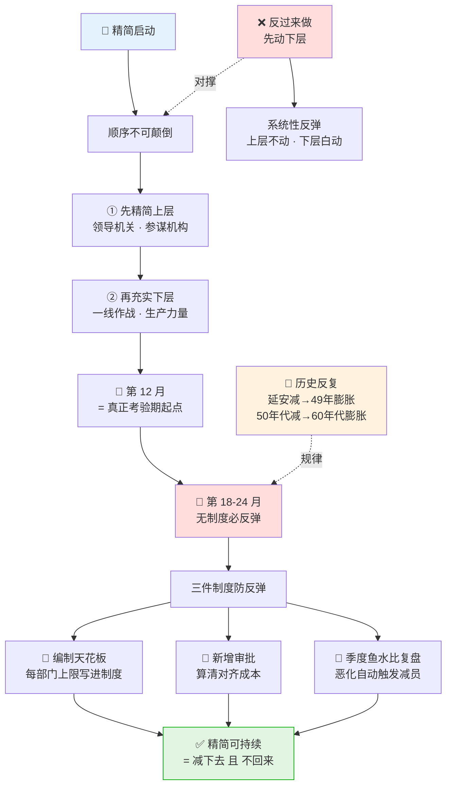
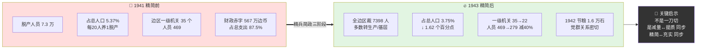
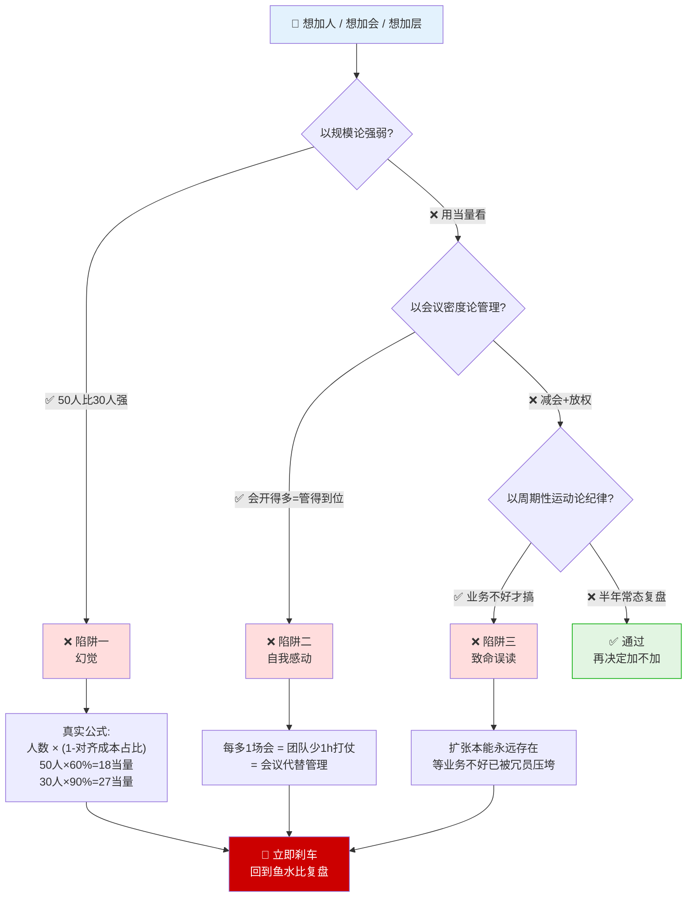

# 38.精兵简政提效率

> 组织的战斗力不在"鱼有多大"，在"水能养多大的鱼"——鱼大水小是管理者自己的责任，不是员工不努力。

目录介绍
- 01.转不动的大团队
- 02.市面误读之辨
- 03.三层独家主张
- 04.一九四二延安现场
- 05.原文四维精读
- 06.鱼水比到五字目标
- 07.机构精简之难
- 08.边区精简示范案
- 09.一个商业切片
- 10.三个认知陷阱
- 11.防止反弹长效机制
- 12.三年认知复利
- 13.收束三句金言

## 01.转不动的大团队

我有一年接手一个研发团队，总共 38 人、分 5 个小组，下面再分三层汇报：总监（我）→ 资深 leader → 小组长 → 成员。刚接手前两个月我疯狂开会——周一大周会、周二组会、周三双周汇报、周四跨组协调、周五技术评审，中间还有一对一。我自以为"信息通畅、管得到位"。

第三个月老板悄悄发来一份数据——**我们团队人均产出在整个部门倒数第二**。我第一反应："我们都在加班啊？怎么会？"老板只淡淡回一句："你的人在加班，但他们 40% 的时间都花在开会和对齐上了。"我回去翻工时系统，当场冒冷汗——**38 个人里，一半以上的周工时超过 15 小时都花在"会议+汇报+转发消息"上**。我不是在带一个研发团队，我是在带一个"对齐中心"。

那晚我翻《一个极其重要的政策》，看到毛主席那段话："目前根据地的情况已经要求我们褪去冬衣，穿起夏服，以便轻轻快地同敌人作斗争，我们却还是一身臃肿，头重脚轻，很不适于作战。"四个字点破本质——**"鱼大水小"**：机构膨胀已超过根据地承载能力。我们这个团队就是一条"鱼大水小"的鱼：38 个人管 5 条业务线，业务（水）没长大、团队（鱼）却先胖了；3 层汇报只是为了"让我看得见每个人"、其实付出的成本是"每个人看不见业务"；每周 5 场会议是我"管得到位"的幻觉、实际是"每个人都没时间打仗"。我第二天做了接手以来最痛、也最正确的一个决定——**对自己团队动刀**：精兵、简政、简会、简层级。

38人研发团队"对齐中心化"病理切片 · 一图看清"我在带研发 vs 我在带对齐中心"：

## 02.市面误读之辨

关于"精兵简政"，市面上至少有三种致命误读。

第一种误读：**把精兵简政等于裁员**。很多公司一说精兵简政就是"裁掉 X% 员工"——这是把方法当成了目的。毛主席的"五字目标"是精简、统一、效能、节约、反对官僚主义——五条全部满足才叫精兵简政，光裁员是反向操作。

第二种误读：业务不好才动刀。"现在业务不好我们要精兵简政"——意思是业务好的时候就不需要。错。**精兵简政是永久性的纪律，不是周期性的应急**。机构的扩张本能任何时候都存在，必须周期性反向操作。等到业务不好才动刀，已经晚了。

第三种误读：只砍人头，不动层级。只优化人头数、不动汇报层级——这是最常见的"假精简"。**层级不动，会议不会少；会议不少，效能不会升**。真正的精兵简政必须同时砍人头、砍层级、砍会议、砍流程——四件事一起做。

## 03.三层独家主张

主张一：判断组织是否过载的唯一指标不是"人数"，而是 **"鱼水比"——业务规模能不能养这么多人**。鱼大水小是管理者自己的责任，不是员工不努力。人数是绝对值，鱼水比是相对值。1000 人不一定臃肿，30 人也可能臃肿。1941 年陕甘宁边区"20 个老百姓养 1 个脱产人员"就是典型鱼大水小——再勤奋的脱产人员也救不了组织，因为再勤奋也要吃饭、也消耗资源。

这个指标的真正威力在于——它把组织过载的责任彻底归到管理者身上。绝大多数中层面对效率下降的第一反应是"团队不努力、要加强 KPI"——这是把锅甩给员工。鱼水比视角告诉你完全相反的判断：如果鱼大水小，说明你这个管理者没把"水"养够，跟员工努不努力没关系。落到操作，一个最朴素的量化就是人均产出与人均成本之比——这个比值下降，无论多努力都必须减鱼或养水，没有第三条路。

主张二：**每多一个人，对齐成本按 N² 增长**。这是组织设计中最反直觉的一条：5 人团队对齐 10 次；10 人 45 次；20 人 190 次；50 人 1225 次。人数翻 10 倍，对齐次数翻 122 倍。这就是很多公司从 30 人扩到 100 人时效率反而下降的原因——不是新人不行，是 N² 曲线把所有人的精力都吃掉了。真实产出等于名义产出减去对齐成本——这个减法没做的人，每多招一个都在让组织负重。操作上有一个最朴素的判断：每次招新人之前强制回答三个问题——他来了要跟多少人对齐？这些对齐线每周要花多少时间？他的新增产出能否覆盖这些时间损失？三问答完，往往会发现本来想招 5 个的岗位只该招 2 个。精兵的本质不是不招人，是只招那些新增产出大于对齐成本的人。

N² 对齐成本曲线一图看透（人数翻10倍 · 对齐翻122倍）：

主张三：**五字目标必须配硬性红线**（会议半小时硬限、邮件 3 层打回），否则一定反弹。抽象口号无法约束行为，只有具体红线才能。如果翻译成"任何会议超过 30 分钟必须停下来重新评估，否则就是官僚主义"——这条红线就可执行、可检查、可问责。更重要的是红线必须配套"违反就有代价"的机制，否则就是装饰。没有违反代价的红线就是废纸——大家心知肚明这条线划着但越线没事，那这条线就等于不存在。

## 04.一九四二延安现场

日伪军的扫荡和三光政策——1941-1942 年，日军对华北各抗日根据地出动千人以上的扫荡达 174 次，使用兵力 83 万多人次。国民党顽固派的经济封锁——1941 年 1 月制造皖南事变后，对边区实行断邮、断汇、断运。自然灾害雪上加霜——1940-1942 年华北连续旱蝗灾害。

最触目惊心的数据：陕甘宁边区 1941 年脱产人员达 7.3 万人，占总人口的 5.37%；财政赤字 567 万元（边币），占财政总支出的 87.5%；公粮征收达 20 万石，比 1940 年翻倍。"精兵简政"这一政策最早由陕甘宁边区参议会副议长、开明绅士李鼎铭先生于 1941 年 11 月提出。中共中央采纳了这一建议，并于 1941 年 12 月发出《关于精兵简政的指示》。毛主席称这是"一个极其重要的政策"。

值得注意的是这条政策的提出者并不是党内同志，而是党外开明绅士李鼎铭。这一细节藏着两层深意：党中央在 1941 年最困难时期能虚心采纳党外人士建议——如果关起门来只听内部声音，可能根本意识不到机构臃胀的严重程度，因为内部每个人都在为"自己的部门、自己的岗位"辩护；李鼎铭作为参议员敢提触及核心利益的建议，说明边区那种"三三制政权 + 党外人士敢讲真话"的氛围是真实存在的。没有这种氛围，李鼎铭这句话根本上不到党中央的桌面。翻译到现代——很多公司的精兵简政方案，最有效的来源不是 HR、不是中层，是那些"在公司里但不在权力链里"的人：基层老员工、外部顾问、客户、合作伙伴。他们能讲真话、不需要顾及晋升、看到的问题最真实。只听权力链上的反馈永远做不出真正有力的精兵简政方案——因为权力链上的每个人都在为自己保存编制。

1941-1943 延安精兵简政三阶段推进甘特图（分期减 + 分期建 · 减量与提质同步）：

## 05.原文四维精读

《一个极其重要的政策》核心段落："目前根据地的情况已经要求我们褪去冬衣，穿起夏服，以便轻轻快地同敌人作斗争，我们却还是一身臃肿，头重脚轻，很不适于作战。……我们八路军新四军是孙行者和小老虎……目前我们须得变一变，把我们的身体变得小些，但是变得更加扎实些，我们就会变成无敌的了。"三个关键比喻：冬衣与夏服——形势变了，装备必须变；臃肿与轻快——重不是优势，灵活才是；身体小与更扎实——**精简的目的是变强，不是变弱**。

《抗日时期的经济问题和财政问题》："在这次精兵简政中，必须达到**精简、统一、效能、节约和反对官僚主义**五项目的。"五字互锁——精简是人数和机构真正减下来；统一是决策权集中、不能多头；效能是精简后效率必须提升；节约是成本必须真正下来；反对官僚主义是作风必须改、不能换汤不换药。少任何一字，精兵简政就是表面文章。

毛主席强调："**精兵简政，必须是严格的、彻底的、普遍的，而不是敷衍的、不痛不痒的、局部的**。"这三个词点出精兵简政最反直觉的地方——它是一次主动的、系统的、根本性的自我革命，不是优化、不是调整、不是改进。历史上多少组织变革落入"精简一阵子，反弹大一截"的循环？原因只有一个——精简的同时没有建立长效机制：人头数指标可以涨、新增编制理由可以编、会议可以加回来、层级可以重叠。没有制度保障，所有精简都是周期性反弹的前奏。

## 06.鱼水比到五字目标

精兵简政的根本目的是解决"鱼大水小"的矛盾——庞大军政机构与有限物质基础之间的矛盾。这一维度强调精简不是为精简而精简，而是为适应战争环境、克服经济困难、提高战斗力的战略举措。组织维度分三个层次：精简上层（减少领导机关人员）、充实下层（加强基层和战斗部队）、裁减非生产人员。

效能维度是精兵简政的落脚点——为什么必须把"效能"作为单独维度、而不是直接讲"减员"？因为**减员是手段，效能才是目的**——混淆这两者是绝大多数公司精兵简政失败的根源。"为减员而减员"的公司会出现一种典型反模式：裁掉 20% 之后，剩下的人加班 50%，整体产出下降 30%。原因是被裁的不一定是最不重要的那 20%，留下的也不一定是最有效率的。真正以效能为目的的精兵简政完全不同——它的判断标准不是"减了多少人"，而是"减完之后单位人均产出有没有上升"。如果减员后人均产出上升，哪怕只减 5% 也是大胜；如果下降，哪怕减了 30% 也是灾难。任何精兵简政方案启动之前先定义"成功"的指标：不是"减员 X%"，而是"3 个月后人均产出提升 Y%"或"决策周期从 X 天缩到 Y 天"。

毛主席的五字目标——精简、统一、效能、节约、反对官僚主义——每一字都必须配一条硬性红线，否则一定空转：精简配"团队总人数不得反弹，新增必须经业务数据证明"；统一配"所有决策只能在一个固定会议产生，其他场合不决议"；效能配"周工时上限 45 小时，超过即管理失败"；节约配"会议半小时硬限，PPT 超过 10 页退回"；反官僚配"邮件 / 流程 3 层转发自动打回原点"。写在脑子里的不算红线，写在白板上、每天看到的才算。

我自己的做法很笨但有效——把五字红线和防反弹机制写成 A3 大字贴在团队工位最显眼的柱子上。每次有人提加编、提加层，站到柱子前面看一眼再说话——很多本来要说出口的"再加一个人吧"，看着柱子就咽回去了。**红线的真正威力不在它有多严，而在它有多看得见**。光写不盯没用——必须指定一个人每周 review 一次红线执行情况。没有人盯的红线，三个月后会"集体性失忆"。我的做法是"三个一"：一个人（leader 亲自盯、不能委托，因为破线最大来源就是 leader 自己）、一个时点（每周一上午第一件事、固定 15 分钟红线 review）、一张表（当周新增编制 / 层级变动 / 会议数量 / 流程层数四项数据，超线红字标出）。

五字目标 → 硬性红线一图对号（写在墙上才算数）：

## 07.机构精简之难

精简一个人靠的是 HR 流程，精简一个机构靠的是斗争力——因为机构背后是利益、是权力、是历史、是面子，动一个机构往往动一群人。毛主席原话："精兵简政必然会遇到阻力，必须敢于斗争、善于斗争。"

精简有明确顺序——先精简上层（领导机关、参谋机构），再充实下层（一线作战、生产力量）。为什么？因为上层不精简，下层就不会动；上层精简了，下层自然跟上。反过来做（先动下层）会触发系统性反弹。边区精兵简政之所以成功，关键在于同时建立了编制管理制度——任何新增编制必须经过严格审批、必须经过业务数据论证。没有这一条，所有精简都是周期性反弹。

更关键的一层是：**精兵简政最大的敌人不是"减不下去"，而是"减下去之后两年又回来了"**。这个反弹规律历史上反复出现——延安减下去过、49 年进城又膨胀；50 年代精简过、60 年代又膨胀。没有制度保障的精兵简政，最长不超过 18-24 个月就反弹。原因是组织的扩张倾向是结构性的——每个负责人都本能想多招人（团队大代表权力大）、每个项目都本能觉得人手不够、每次困难时刻的应急都会留下"加几个人"的合理性。真正能防反弹的制度至少包括三件事——编制天花板（每部门上限写在制度里）、新增审批（新岗位必须层层审批、算清对齐成本）、定期复盘（每季度做一次鱼水比复盘、恶化的自动触发减员评估）。精兵简政之后的 12 个月才是真正的考验期。

精简顺序 + 18-24 月反弹曲线（先上后下 + 12 月考验期）：

## 08.边区精简示范案

1941 年，陕甘宁边区面临严峻形势：总人口约 140 万，脱产人员 7.3 万，平均每 20 个老百姓要养活 1 个脱产人员。财政赤字 567 万元，公粮征收翻倍，机构臃肿。这一组冰冷数字背后，是一幅令人窒息的真实图景——根据地的"水"已经被抽到见底，"鱼"却还在迅速变大。1937 年抗战初期边区脱产人员只有约 1.4 万人，到 1941 年膨胀到 7.3 万——四年增长五倍多；而同期边区总人口几乎没有增长，可耕作土地反而在缩减。一边是供给端的极度有限，一边是消耗端的迅速膨胀，这就是教科书级别的"鱼大水小"。雪上加霜的是三个外部冲击同时袭来——国民党经济封锁、日寇大规模扫荡、自然灾害。正是在这种"再不动就要崩盘"的极限压力下，李鼎铭的提案才具备了被毛主席采纳的历史条件。任何精兵简政的成功，都不是因为政策有多英明，而是因为 leader 终于承认：再不动，就真的没鱼吃了。

三阶段推进——第一阶段（1941.12-1942.4）初步精简：裁减各级机关 20-25%，合并重叠机构，减少会议文件。第二阶段（1942.6-1942.12）深入实施：边区一级机关从 35 个减至 22 个、人员从 469 减至 279、精简 40%；全边区共裁减 7398 人，多数转入生产部门或充实基层；建立编制管理制度防反弹。第三阶段（1943 年初）巩固提高：充实基层和生产一线，开展整风运动，建立检查监督机制。成效触目：脱产人员占人口比例从 5.37% 降至 3.75%，1942 年节约粮食 1.6 万石；机构精简后办事效率提高，密切党群关系；主力部队更加精干，战斗力提高。关键启示——**边区精简不是一刀切，而是分三个阶段、配合生产运动、配合制度建设，"减量"与"提质"同步、"精简"与"充实"同步**。

边区精简前后关键指标对比切片（数据说话 · 不靠感觉）：

## 09.一个商业切片

那晚我在白板上画了两栏。左栏"水"（业务真实规模）：5 条业务线——2 条核心、2 条探索期、1 条正在关停——真正需要稳态投入的只有 3 条。右栏"鱼"（团队实际编制）：38 人、3 层汇报、5 场周会、每周平均开会 15 小时。画完我自己愣住了——水其实只够养 20 条鱼，我养了 38 条。不是"业务养不活这个团队"，是"团队已经大到业务不知道该拿它做什么"。

当周我做了三个决定。精兵：停掉 1 条关停中的业务线，2 条探索期合并为 1 个小组；38 人优化到合适规模。简政：3 层汇报改为 2 层——我直接对 4 个 leader，leader 直接对工程师，砍掉"小组长"这一层。简会：5 场周会砍到 2 场——只保留"周一目标会 + 周五战报会"，每场 30 分钟硬性限时，其他全部异步文档。

毛主席说精兵简政要达到"精简、统一、效能、节约、反对官僚主义"——我抄在白板正中间，每个字配一条硬性红线。第一个月月底复盘时，工时系统显示——会议、汇报、转发占比从 40% 降到 16%，产出（按交付任务数）提升 38%。但更关键的是我听到团队里一句话——"**现在大家终于有时间写代码了**。"那一刻我才真正明白毛主席那句话——"变得身体小些，但变得更加扎实些。"

## 10.三个认知陷阱

陷阱一：以规模论强弱——"我们部门 50 人，比隔壁 30 人的部门强"——幻觉。实力的真正衡量是人均产出乘以团队战斗力。50 人如果对齐成本占 40%、产出只有 30 人乘以 60% 等于 18 人当量；30 人如果对齐成本只占 10%、产出 30 乘以 90% 等于 27 人当量。50 人的部门反而比 30 人的弱 50%。

陷阱二：以会议密度论管理——"我每周开 5 场会，对每个人都管得到"——自我感动。每多开一场会，团队就少 1 小时打仗时间。开会多不等于管理到位，开会多等于管理者用会议代替管理。真正的管理是减少会议、增强信任、放权一线。

陷阱三：以周期性运动论纪律——"今年业务不好，搞一次精兵简政"——致命误读。精兵简政是永久性纪律，不是周期性运动。机构的扩张本能任何时候都存在，必须周期性反向操作（每半年一次鱼水评估）。等到业务不好才动刀，组织已经被冗员压垮了。

三大认知陷阱决策树（每次要加人加会加流程之前，先跑一遍）：

## 11.防止反弹长效机制

半年过去，团队从 38 人稳定在 25 人，业务产出翻了近一倍，留下的都是真正能打仗的。我固化了四条制度：半年一次"鱼水评估"，每半年把业务规模和团队规模摆在一张表上，鱼大水小就必须主动缩编，不等出问题再动；新增人员需要"两重举证"，想增加一个人必须证明两件事——不增这个人业务会怎样、能不能通过流程工具优化替代，两个问题答不好一律不增编；"会议熔断"机制，任何一场会议跑超 30 分钟自动熔断，剩下的内容必须异步，任何一条信息经手超过 3 个人，发起人必须重新找到"能决策的人"直接谈；每季度一次"官僚主义复盘"，拉团队一起找最近哪些事其实不该走三层流程，把它改成直通——官僚主义不是别人的问题，是每个人的默认行为，必须定期清。

这半年我体会最深的一件事是——**组织的战斗力不取决于"有多少人"，取决于"这些人中有多少人真的在打仗"**。过去我以为多招人等于战斗力提升，现在我知道——每多一个人就多一层汇报、一次会议、一次对齐成本，超过拐点之后再多人都是负担。毛主席说"褪去冬衣，穿起夏服"——这八个字是管理者一辈子的功课。越想打仗的时候，越不要被自己的装备压垮。

## 12.三年认知复利

第一年最大的变化是从"被动应对"变成"主动检查"。每半年一次鱼水评估、每月一次会议熔断复盘，团队规模稳定、产出翻倍。

第二年我把"鱼水评估 + 五字红线 + 双重举证"打包成方法论，和同级 leader 一起共建。效果是——整个研发体系周工时下降 23%、人均产出提升 31%——精兵简政从一个团队的事变成了组织能力。

第三年最大的变化是指标从"人头数"变成"战斗力密度"——人均能打仗的产出、人均决策权、人均冗余度。编制不再是核心管理对象，**战斗力密度才是**——这是精兵简政思维真正长出来的东西。

## 13.收束三句金言

**组织的战斗力不在"鱼有多大"，在"水能养多大的鱼"——鱼大水小是管理者自己的责任，不是员工不努力。** 它至少颠覆了三个我们习以为常的管理直觉——过去说"业绩不行 = 员工不努力"，鱼水比视角说业绩不行 = 鱼水失衡、是 leader 没控好编制和层级；过去说"团队不行 = 招的人不够强"，鱼水比视角说团队不行 = 水撑不起这么多鱼、再强的人也会被稀释；过去说"出问题 = 加人加层"，鱼水比视角说出问题 = 先减鱼、让水重新养得动。精兵简政不是一项"政策"，是 leader 这个职位与生俱来的责任。

**把五字目标贴在白板上，每条配一条硬性红线**。每半年做一次鱼水评估，新增人员必须双重举证。写在墙上的纪律才能被执行——会议半小时、邮件 3 层打回、异步优先，不写在墙上就会被遗忘。

**褪去冬衣，穿起夏服，把事情变得小而扎实。** 组织的战斗力不取决于有多少人，取决于这些人中有多少人真的在打仗。越想打仗的时候，越不要被自己的装备压垮。

下一次你又想"是不是该再招几个人"的时候，问自己一句话——**"我团队现在的鱼水比是多少？"** 答不出来，那么新招的每一个人都在加深"鱼大水小"。先做一次鱼水评估，再决定招不招。
