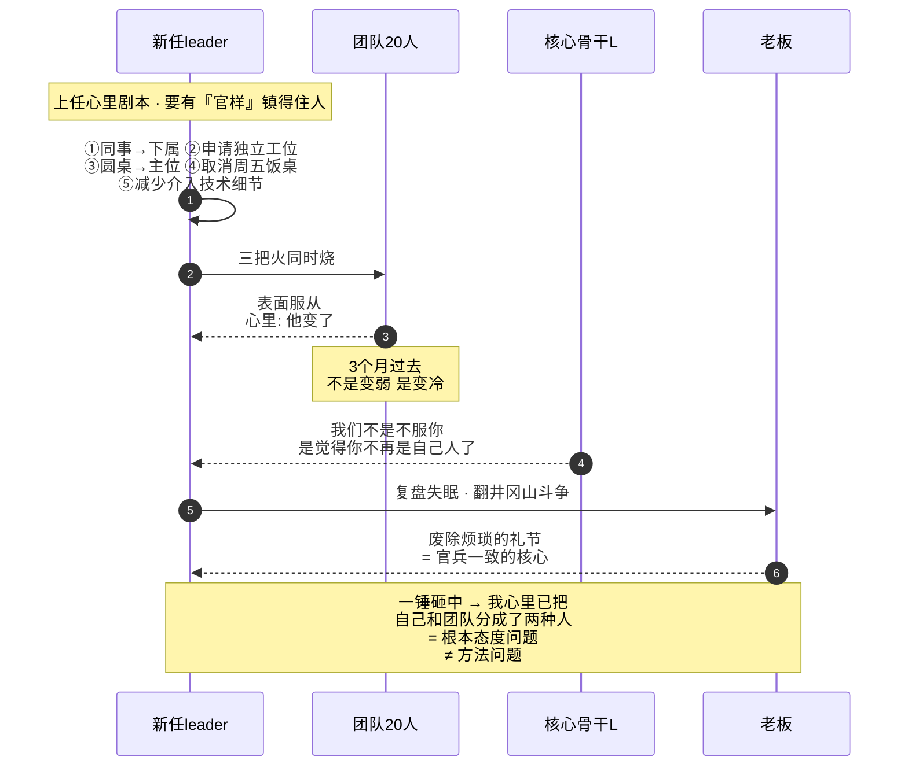
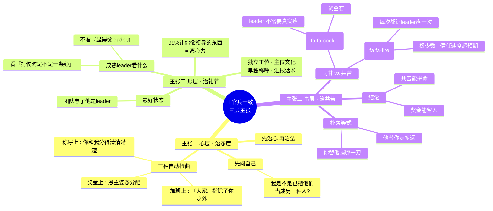
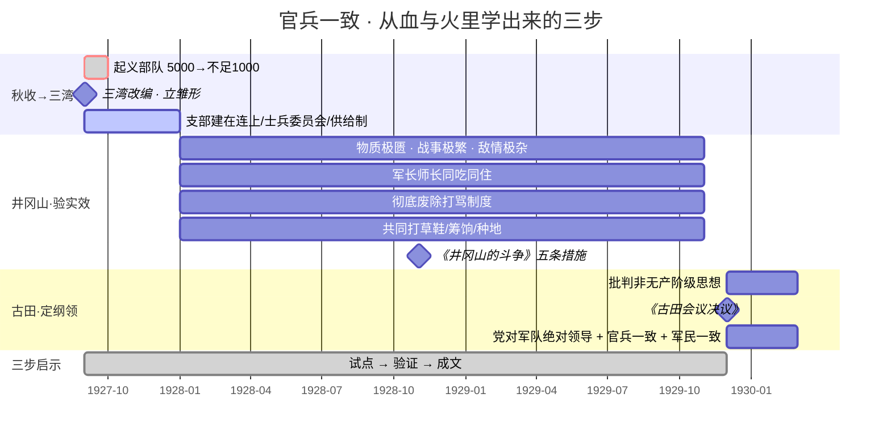
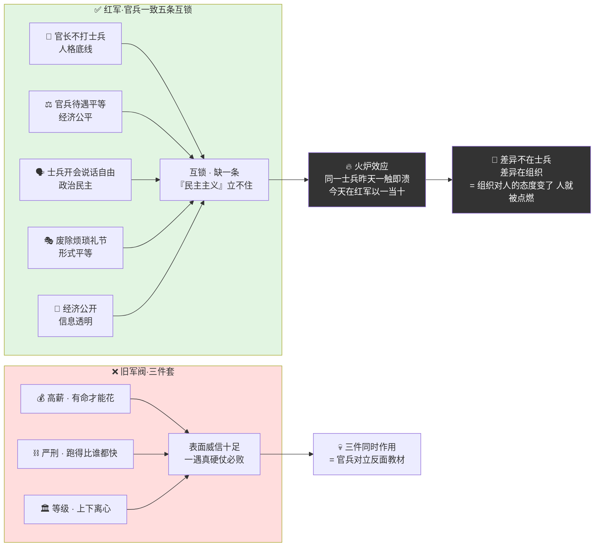
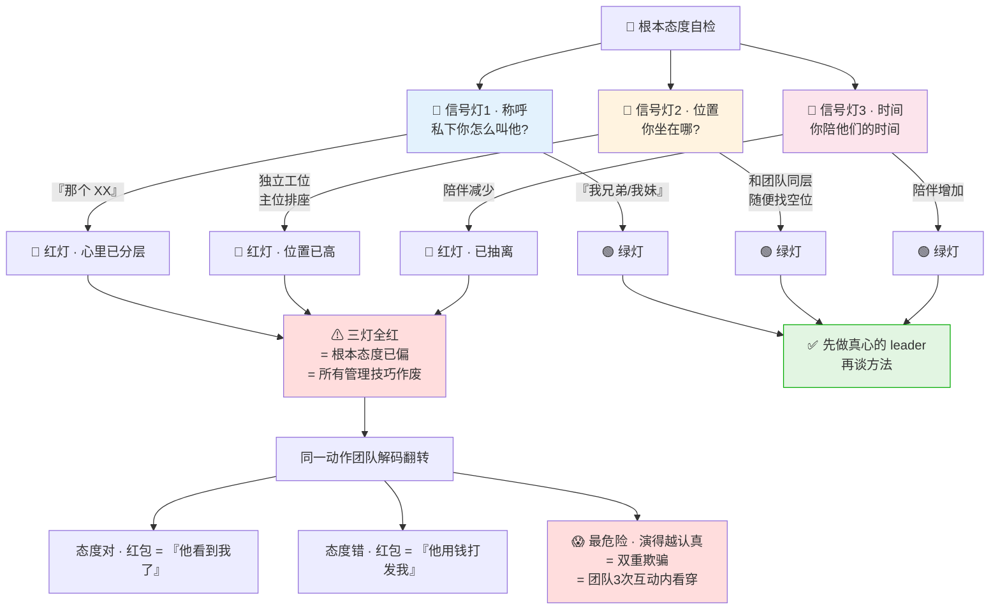
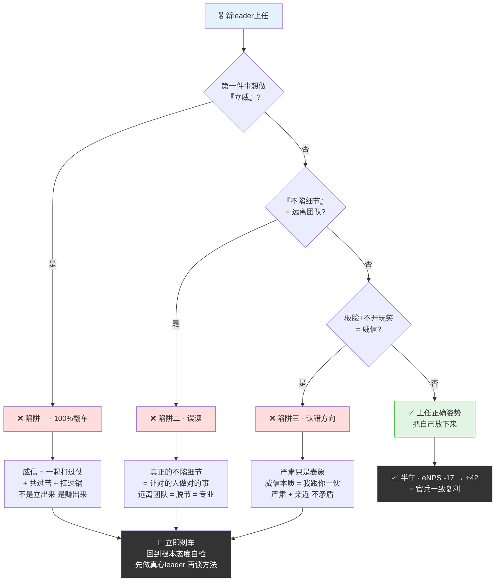
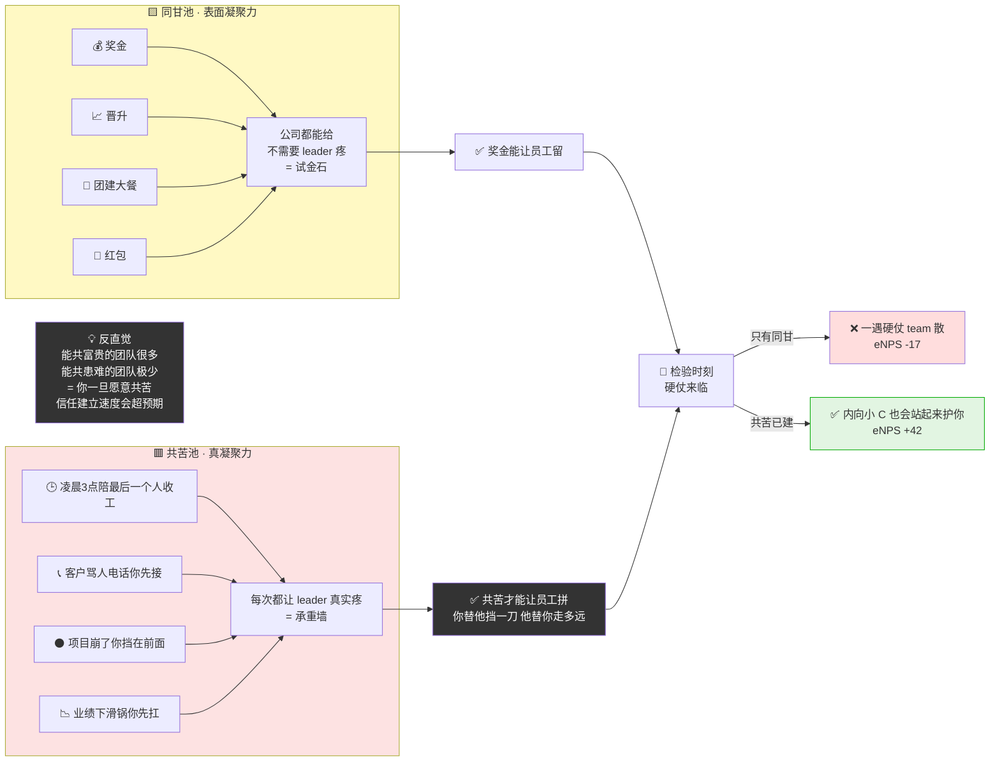

# 41.官兵一致的平等

- 01.新官上任三把火
- 02.市面误读之辨
- 03.三层独家主张
- 04.三湾古田两节点
- 05.原文四维精读
- 06.根本态度非方法
- 07.废除烦琐的礼节
- 08.三湾改编示范案
- 09.一个商业切片
- 10.三个认知陷阱
- 11.共苦比同甘更重
- 12.三年认知复利
- 13.收束三句金言

// TODO 优化整篇文档

## 01.新官上任三把火

// TODO 换一个案例

那一年我 33 岁，被提到一个 20 人团队的 Leader。上任第一件事，我做了所有菜鸟管理者都会做的事，**立威**。我把原来"同事"的称呼，悄悄改成了"下属"；我专门申请了一间独立的工位，把自己和团队隔开；我把团队的周会从"圆桌坐"改成了"我坐主位，大家坐两侧"；我取消了前任 leader 周五的"大家吃饭聊聊"，改成"一对一汇报"；我把自己对技术细节的介入减到最低，理由是"管理者不应该陷在细节里"。我心里的剧本是：我现在是 leader 了，我要有点"官样"，否则镇不住人。

三个月后，团队里两个核心骨干先后提出离职。我拉着其中一个技术最强的 L 去楼下喝咖啡，他犹豫了很久，说了一句我永远不会忘的话："哥，你上任以后，我们团队不是变弱了，是**变冷了**。你不再和我们一起卡在那个 bug 前面了，你也不再知道我昨晚几点才睡。我们不是不服你，我们是觉得你不再是自己人了。"

那晚我失眠，打开《毛选》第一卷，翻到《井冈山的斗争》："红军的物质生活如此菲薄，战斗如此频繁，仍能维持不敝，除党的作用外，就是靠实行军队内的民主主义。"，"官长不打士兵，官兵待遇平等，士兵有开会说话的自由，废除烦琐的礼节，经济公开。" 我盯着"**废除烦琐的礼节**"这几个字看了很久。当年红军没饭吃、没枪、没弹、没后勤，仗还那么频繁，为什么不散？毛主席给出的答案极其朴素——官兵一致。我突然意识到自己干了一件反过来的事：我没什么可给团队的（资源、奖金、升职名额都卡着），却先给自己加了一堆"礼节"。我以为这是当领导；在团队眼里，这只是"他变了"。

那一晚我第一次真正读懂了毛主席在《论持久战》里的一句话："**很多人对于官兵关系、军民关系弄不好，以为是方法不对，我总告诉他们是根本态度（或根本宗旨）问题。**"我的问题从来不是方法问题。是我心里已经把自己和团队分成了两种人。

新官上任"三把火"病理时序图（我以为在立威 · 实际在建离心力）：

## 02.市面误读之辨

// TODO 把这个优化一下，对照模版文档@样式优化

关于"官兵一致"，市面上至少有三种致命误读。

很多人一听官兵一致就以为是"扁平化、不要层级"——完全反向。毛主席原话："反对极端民主化"。**官兵一致不是没有层级，而是层级之内人格平等、决策之中民主参与**。指挥权依然集中，但人不分高低。

"我对团队好，每月发红包、季度团建、年底大餐"——以为这就是官兵一致。错。毛主席说："很多人对于官兵关系弄不好，以为是方法不对，我总告诉他们是根本态度问题"。**红包和团建是方法，不是态度**。态度不对，发再多红包也是火上浇油——因为团队感受到的是"用钱在收买"。

"团队赚钱时一起分"——这只是同甘，不是一致。毛主席的核心是共苦：**红军在物质生活极端菲薄、战斗极端频繁的条件下仍能维持不敝——共苦才是真同志**。能共富贵的团队很多，能共患难的团队极少。

## 03.三层独家主张

主张一：**不要先问"怎么激励团队"，先问自己"我是不是已经在心里把他们当成另一种人了"**。把人分成两种的那一刻，所有管理技巧都作废。那条线一旦画下，会立刻产生三种自动化扭曲——称呼上 leader 没别的意思但团队听到的是"你和我分得清清楚楚"，加班上 leader 说"大家辛苦一下"但团队听到的是"大家"指除了你之外的所有人，奖金上 leader 说"这是我特别为你们争取的"但团队听到的是你以"恩主"的姿态分配。先治"心"，再治"法"——这是这一主张要放在第一位的原因。

主张二：**让你感觉"像个领导"的东西，99% 是离心力**。独立工位、主位文化、单独称呼、向上汇报话术——一个好 leader 最好的状态，是团队忘了他是 leader。真正成熟的 leader 不在意"显得像个领导"，他在意的是"团队跟我打仗时是不是和我一条心"——这两件事方向完全相反。

主张三：**奖金能共享的团队很多，凌晨 3 点还在一起的团队极少**。你愿意替团队挡哪一刀，他们就愿意替你走多远的路——这是组织凝聚力最朴素的等式。多数管理者最大的认知误区：以为同甘是凝聚力的来源，其实同甘只是凝聚力的"试金石"，真正的凝聚力来自共苦——因为同甘几乎不需要 leader 付任何额外代价，而共苦每一次都在让 leader 真实地疼一次。愿意共苦的 leader 极少，所以一旦你愿意共苦，团队对你的信任会以你想不到的速度建立。

三层独家主张思维图（心→形→事 · 三层同治）：

## 04.三湾古田两节点

旧军队为什么必然垮？因为它被两条根本性问题钉住，一条是内部的病灶：士兵被当工具、一触即溃，要靠"三湾改编、建立官兵一致"来治；一条是外部的绑定：没有自己的武装、任人宰割，要靠"党指挥枪、绝对领导原则"来治。正是这两条惨痛教训叠加，才在 1927 年秋之后逼出了"三湾改编 + 党指挥枪 + 官兵一致"的整套底层制度，它不是凭空设计的理论，是从血与火里学来的活下来的方法。

三湾改编：1927 年 9 月，毛泽东领导秋收起义部队在三湾村改编，确立党对军队绝对领导，建立士兵委员会，实行民主制度。秋收起义后部队从 5000 人锐减到不足 1000 人，旧军队习气严重——三湾改编是中国共产党第一次系统性建立"官兵一致"的组织雏形。1929 年 12 月古田会议通过的《古田会议决议》，系统批判各种非无产阶级思想，确立党对军队绝对领导原则，系统阐述官兵一致、军民一致的原则。三湾立雏形、井冈山验实效、古田定纲领——这三步是"官兵一致"完整的诞生路径。**对今天组织管理者的启示是：任何成功的实践，最终都要走完"试点—验证—成文"的三步**——只停在前两步，传承期限不会超过下一任 leader 的任期。

三湾→井冈山→古田 · 官兵一致三步诞生路径甘特图：

## 05.原文四维精读

《井冈山的斗争》（1928 年 11 月）："红军的物质生活如此菲薄，战斗如此频繁，仍能维持不敝，除党的作用外，就是靠实行军队内的民主主义。官长不打士兵，官兵待遇平等，士兵有开会说话的自由，废除烦琐的礼节，经济公开。"五条措施一字一句：官长不打士兵——人格底线；官兵待遇平等——经济公平；士兵有开会说话的自由——政治民主；废除烦琐的礼节——形式平等；经济公开——信息透明。五条互锁，少任何一条，"民主主义"立不住。

《论持久战》（1938 年 5 月）："军队政治工作的三大原则：第一是官兵一致，第二是军民一致，第三是瓦解敌军。这些原则要实行有效，都须从尊重士兵、尊重人民和尊重已经放下武器的敌军俘虏的人格这种根本态度出发。""很多人对于官兵关系、军民关系弄不好，以为是方法不对，我总告诉他们是**根本态度（或根本宗旨）问题**，这态度就是尊重士兵和尊重人民。"关键四个字：根本态度——它不是技巧、不是话术、不是流程，是你心里到底有没有把对方当人。

红军最神奇的现象："同样一个兵，昨天在敌军不勇敢，今天在红军很勇敢，就是民主主义的影响。红军像一个火炉，俘虏兵过来马上就熔化了。"同一个士兵，昨天在敌军一触即溃，今天在红军以一当十——**差异不在士兵，差异在组织**。组织对人的态度变了，人就被点燃了。这是组织对人的最深奥秘。旧军阀部队靠的是高薪加严刑加等级——表面上很有"威信"，但一遇真正硬仗：高薪没用（有命才能花）、严刑不灵（跑得比谁都快）、等级崩塌（上下离心）。三件事一起作用，必败。这是"官兵对立"最大号的反面教材。

《井冈山》五条互锁 vs 旧军阀三件套 · 对撑图：

## 06.根本态度非方法

毛主席说"官兵一致首先是根本态度问题"——什么样的"根本态度"叫错？三个识别信号：称呼变了——私下你怎么称呼下属？"那个 XX"还是"我兄弟 / 我妹"？位置变了——你坐的位置和团队是平等的、还是高于他们的？时间分配变了——你愿意花在他们身上的时间，是减少了还是增加了？三个信号同时变红，说明你的"根本态度"已经偏了。

态度对的人发一个红包，团队感动；态度错的人发十个红包，团队冷漠。因为团队读的不是钱，是钱背后的"心意"。心意来自态度，不来自金额。同一个动作，团队的解码器完全不同：同一个红包，态度对的 leader 发出来是"他记得我加班，是真的看到我了"，态度错的 leader 发出来是"他在用钱打发我"；同一顿饭，态度对的是"他想认识我们这帮兄弟"，态度错的是"他想完成 leader 关怀 KPI"。最危险的是：演得越认真，反向伤害越深——因为团队会得出一个比"他不关心我"更糟糕的结论："他不关心我，但还在装作关心我"——这是双重欺骗，是对信任的彻底摧毁。团队三次互动之内就能判断出 leader 是真心还是在演。所以与其学习"如何把方法做漂亮"，不如先回到态度本身：**先做一个真心的 leader，再谈方法**。

根本态度三信号灯一图看透（三灯全红 = 态度已偏）：

## 07.废除烦琐的礼节

毛主席在井冈山亲自废除的"烦琐礼节"，对照现代职场：旧军队官长有专门马匹、食堂、警卫对应现代职场的独立工位、单独食堂、专属座驾；士兵向官长行军礼对应向上汇报话术、"T 总"；官长开会坐主位对应主位文化、排座次；经济不公开对应薪资保密、决策黑箱；烦琐的请示流程对应三层签字、邮件抄送。废除烦琐的礼节，不是没规矩——是保留必要规矩、废除多余仪式。必要规矩：决策权、问责机制、专业纪律、安全红线。多余仪式：仅为彰显"官的身份"的所有形式。

回 IM 消息的速度——是检验"官兵一致"最朴素的指标。**消息发出 30 分钟内回复的 leader，团队心里有底；2 小时内不回的 leader，团队心里凉**。这不是技巧，是态度的真实显形。

## 08.三湾改编示范案

支部建在连上——确立党对军队的绝对领导。建立士兵委员会——实行民主制度。官兵待遇平等——实行供给制。缩编部队——精干队伍，保留火种。

为什么三湾已经定框架，井冈山时期还要"深入"？因为三湾给出的是组织雏形，井冈山给出的是真实战场上的检验——任何制度只有在最艰苦、最危险、最考验人心的环境里被反复验证，才能从"理论"变成"基因"。井冈山是一个极限实验室，它给"官兵一致"提供了三种几乎不可复制的高压条件——物质极度匮乏（考验能不能真的吃同一锅饭、穿同一件衣）、战事极度频繁（考验民主制度会不会在打仗时被"非常时期"借口暂停）、敌情极度复杂（考验各种背景的人能不能真心融合为一支队伍）。正是这三个极限同时叠加，才检验出"官兵一致"不是好天气下的口号，而是恶劣天气里的承重墙。

井冈山时期，毛主席亲手做了几件具体事情，让"官兵一致"从纸面落到血肉：军长师长和士兵同吃同住——一床草席、一盆冷水、一份伙食；建立士兵委员会的常态运作——而不是只挂名牌；彻底废除"打骂制度"——从身体到尊严的双重解放；官兵共同打草鞋、共同筹饷、共同种地——劳动一致。这种深入，最终把"官兵一致"从一个组织安排，升级为一种文化基因——士兵知道自己不是炮灰，长官知道自己不是老爷，所有人都知道我们是一伙的。**关键启示：三湾、井冈山、古田三步走——这是任何一个组织从"旧式管理"走向"新型团队"的完整路径**。

## 09.一个商业切片

那次聊完 L 的当周，我立刻做了四件事：把独立工位搬回到团队中间——没有宣布、没有发公告，就是有一天大家上班看到我换了位置，之后再加班到凌晨，大家抬头就能看到我还在；废除周会的"主位文化"——从那之后我只坐两种位置：随便哪个空位，或者大家指定给我的位置，发言顺序按贡献而不是按级别；重建每周一次的"饭桌时间"——不讲项目、不讲 KPI，只聊人，谁最近家里有事、谁身体不舒服、谁在学什么新东西，我开始当做大事去记；给自己立了一条"共苦红线"——团队有人加班到 23 点之后，我必须在线陪到最后一个人收工，不是为了监督，是为了让他们知道——"这件事我也没退出"。

一个月之后发生了一件事：我在一个跨部门的会上被对面部门的总监当众挤兑——"你们这个方案一看就没认真做。"我正要回应，团队里那个最内向的小 C 突然站起来："这个方案每一个指标我和 T（指我）两个人对过三遍，您可以随便抽一个点问我们。"会后小 C 对我说："哥，你最近和我们一起加班的那几次，我心里是记着的。"那一刻我才真正理解毛主席说的"尊重士兵"——**你不需要做很多事，你只需要让团队感到"你把他们当一回事"**。哪怕只有一次。我也在那一个月里想通了自己之前的错误：**我想靠"姿态"建立威信，但威信不是姿态建的，是"一起扛过事"建的**。

## 10.三个认知陷阱

陷阱一：新 leader 上任做的第一件事如果是"立威"——几乎 100% 翻车。威信不是立出来的，是赚出来的——和团队一起打过几场仗、共过几次苦、扛过几次锅。没有这些前提的"立威"，团队眼里只是"他变了、装上了"。

陷阱二："管理者不应该陷在细节里"——这句话 80% 是误读。真正的"不陷细节"是让正确的人做正确的事，不是主动远离团队。远离团队的不叫专业，叫脱节。Leader 必须知道团队昨晚加班到几点、卡在什么地方——这不是管理细节，是组织温度。

陷阱三：一上任就板着脸、不再开玩笑、不再吃饭聊天——以为这叫严肃等于威信。错。**严肃只是表象，威信的本质是"我跟你一伙"**。最好的 leader 是开会时严肃、扛事时硬气、平时跟大家一桌饭——严肃和亲近不矛盾。

三大认知陷阱决策树（新leader上任前先跑一遍）：

## 11.共苦比同甘更重

半年之后我把自己带团队的心法沉淀成了三条铁规，贴在工位上：尊重比激励更早到达——奖金、晋升、OKR 都是"方法"；"我把他当成人、不当工具"才是态度。态度不到位，方法都是火上浇油。能共苦才有资格共事——我不会让团队扛我不扛的事。发版凌晨 3 点，我在；客户骂人的电话，我先接；业绩下滑的锅，我挡在前面。废除一切没必要的"礼节"——不再有"小 T 约我"这种流程；团队 IM 里我是第一个回消息的人之一；没有"向上汇报话术"这种事——有事直接说，错了一起扛。

半年后那次小规模绩效盘点里，团队的 eNPS（员工净推荐值）从上任时的 -17 涨到了 +42。真正让分数变动的，不是我学了什么管理课，是我不再假装自己是"另一种人"。经过这半年我才真正想清楚——"同甘"是奖金、是晋升、是分蛋糕，每个公司都能给；"共苦"是凌晨 3 点的陪伴、是客户骂人时挡在前面、是项目崩了时第一个站出来——**这是用钱买不到的**。奖金能让员工留，共苦才能让员工拼。

同甘 vs 共苦两个池子一图对撑（能留 vs 能拼）：

## 12.三年认知复利

第一年最大的变化是我把自己从"二楼"搬回了"一楼"——工位、位置、说话方式、回消息速度。一年下来团队 eNPS 从 -17 涨到 +42，主动离职率从 18% 降到 6%。

第二年最大的变化是团队开始反手护我——跨部门会议有人替我说话、关键时刻有人主动顶上、对外评价我的话开始变好。这就是毛主席说的"火炉熔化俘虏兵"——同一拨人，组织对他们的态度变了，他们对组织的态度也变了。

第三年最大的变化是我开始系统培养下一批 leader——他们上任的第一课不是"如何立威"，而是"如何把自己放下来"。三年下来，我们组培养出 4 个 leader——他们带的团队 eNPS 平均都在 +35 以上。**这就是"官兵一致"思维的真正复利——它不止是带好一个团队，是培养出一批懂得带团队的 leader**。

## 13.收束三句金言

**先解决"根本态度"，再谈方法。不要先问"怎么激励团队"，先问自己"我是不是已经在心里把他们当成另一种人了"。把人分成两种的那一刻，所有管理技巧都作废。**

**废除"烦琐的礼节"。独立工位、主位文化、单独称呼、向上汇报话术——这些让你感觉"像个领导"的东西，99% 是离心力。一个好 leader 最好的状态，是团队忘了他是 leader。**

**能共苦的 leader，才配带团队打硬仗。奖金能共享的团队很多，凌晨 3 点还在一起的团队极少。你愿意替他们挡哪一刀，他们就愿意替你走多远的路。**

下一次你又对自己说"我现在是 leader 了，要有点'官样'"的时候，问自己一句话——**"我心里现在是不是已经把团队和自己分成了两种人？"** 如果答案是肯定的——那不是变成 leader，那是变成离心力。先把自己放回去，再谈管理。
