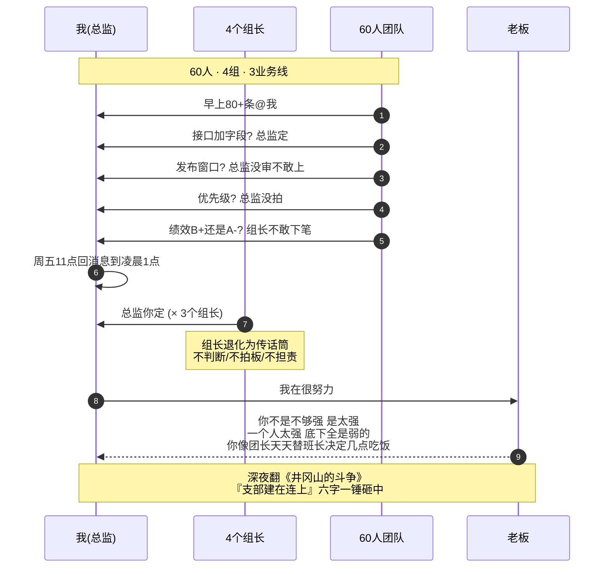
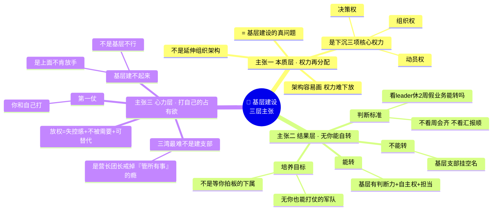
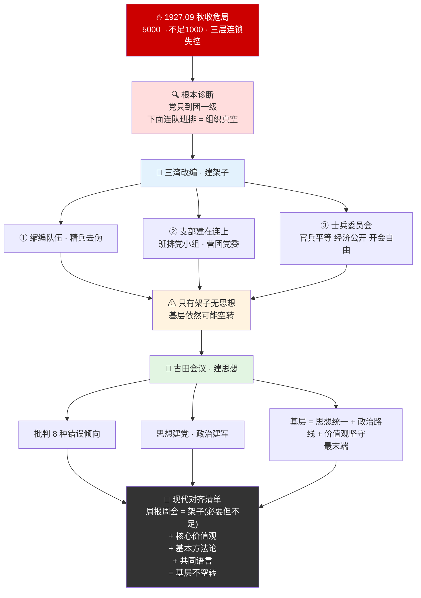
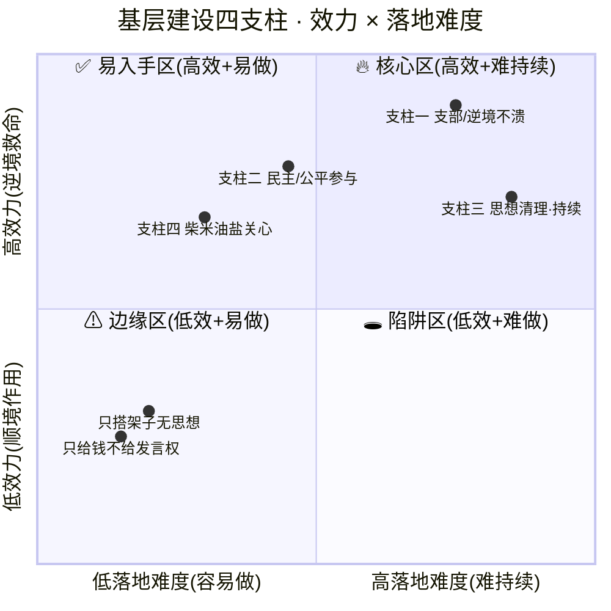
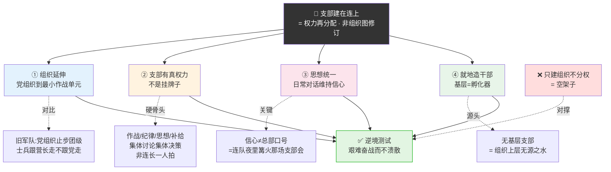
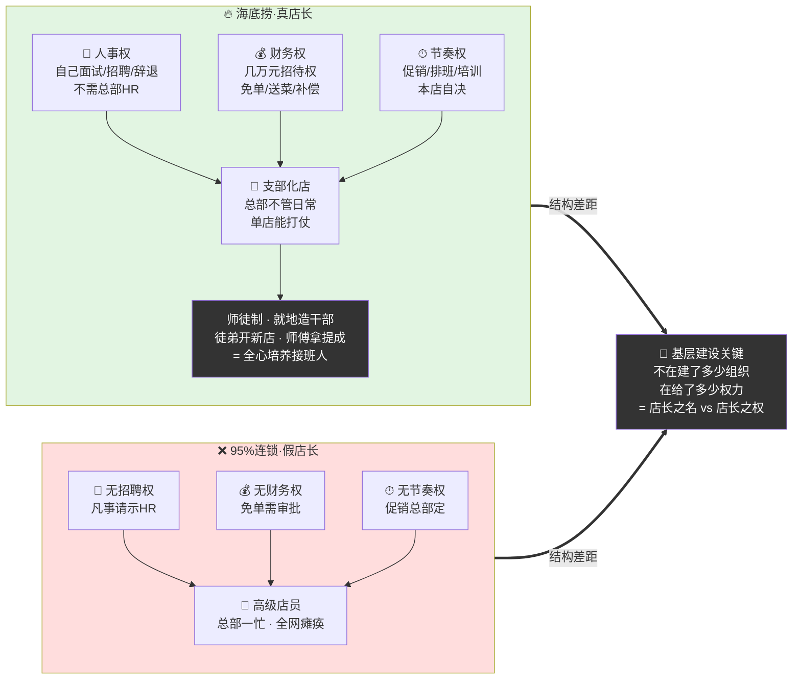
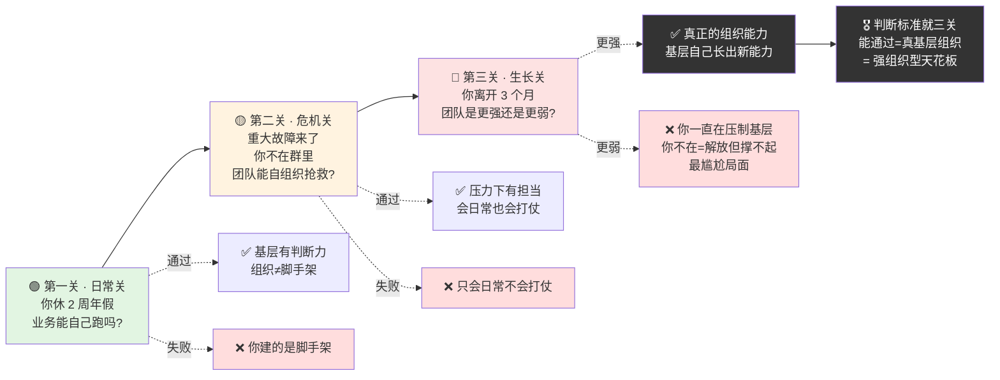

# 42.基层组织建设法

- 01.只有我做决策
- 02.市面误读之辨
- 03.三层独家主张
- 04.三湾古田两节点
- 05.原文四维精读
- 06.支部建在连上
- 07.决策权下沉之难
- 08.井冈山示范案
- 09.一个商业切片
- 10.三个认知陷阱
- 11.无你也能打仗的军队
- 12.三年认知复利
- 13.收束三句金言

## 01.只有我做决策

那一年我做技术总监，下面 60 人、4 个组、3 条业务线。开始两个月还撑得住，第三个月开始，我每天早上睁开眼就是 80 多条 @我的消息："这个接口要不要加字段，等总监定一下。"，"这个发布窗口总监没审，不敢上。"，"这个需求优先级总监没拍，组里吵成一团。"，"这个同学绩效 B+ 还是 A-，组长不敢下笔。"我周五晚 11 点还在群里一条条回消息，回到凌晨 1 点多才睡。第二天早上起来，又是满屏的 @。

最恐怖的是**团队明面上很"规矩"、看起来都在听我的话，但业务跑得奇慢无比**。任何一个很小的决策都要经过我这个节点；我在的时候还能转，我一休假整条线几乎停摆。更要命的是，4 个组长里有 3 个已经退化成了"传话筒"，他们不判断、不拍板、不担责，所有难的事都往我这里推一句"总监你定"。

季度复盘时老板把我叫进去，指着我说了一句话："**你这个团队最大的问题不是你不够强，是你太强。你一个人太强，底下就全是弱的。**"，"你现在天天在各个战场上来回救火，你像什么？像一个团长，天天替班长决定'这个班今天几点吃饭'。"那一晚我把《毛选》翻到《井冈山的斗争》，盯着这一行字看了很久，"**红军所以艰难奋战而不溃散，'支部建在连上'是一个重要原因。**"

我突然意识到，我犯的不是"管理太粗"的错，是管理太细、细到把基层的"神经末梢"全废掉了。毛主席在三湾改编干的最狠的一件事不是改番号、不是减兵，是把"决策权、组织权、动员权"全部下沉到连队。连队能自己判断、自己动员、自己组织，部队才能在团长不在的地方继续打仗。团长不用在所有战场，因为每个连都有自己的"小团长"。而我做的事恰恰相反——我把所有的决策都收到了自己手上。我不是在打造一支军队，我是在打造一个"没有我就停摆的 60 人项目组"。那一刻我真正读懂"支部建在连上"这六个字，**它不是一个组织术语，它是一个普通管理者从"个人英雄"走向"组织能打仗"的第一道门**。

60人团队"总监中心化"病理时序图（4个组长退化为传话筒）：

## 02.市面误读之辨

// TODO 把这块优化饱满一些

外面讲"基层建设"的版本大体分三派，每一派都偏掉了关键一截。

架构派的典型口号是"在每个连建党支部就是基层建设"，把支部当成组织框图，没看见"决策权下沉"才是骨子。

培训派的典型口号是"多搞培训、多带新人就是基层建设"，把基层建设当成能力培训，没看见"位置"和"权力"才是关键。

关怀派的典型口号是"多和员工吃饭聊天就是基层建设"，把基层建设矮化成情感公关，没看见"制度"和"机制"才是底盘。

毛泽东三湾改编做的真正狠事，不是"建一个支部"，而是**把"枪、人、钱、令"四件事的决策权强行下沉到连队**，连队党支部能自己讨论、自己拍板、自己执行。三湾以前部队"兵为将有"，三湾以后"枪听党的，党在连里"。

一句话，**基层建设不是建组织框图，是建"基层能拍板"的权力结构**。你给基层建了支部、却不给决策权，基层照样是空架子；你给基层下了决策权、却不立制度边界，基层就会失控。框图、培训、关怀都是"补丁"，真问题是"权力地图怎么画"。

## 03.三层独家主张

主张一：**基层建设的本质不是延伸组织架构，是下沉核心权力**。很多人把"支部建在连上"理解成把组织架构延伸到底层，这是把它当成了"管理学问题"。毛主席的初心不是延伸架构，而是把决策权、动员权、组织权三项核心权力下沉到一线作战单元。这是一场权力的再分配、不是一次组织图的修订。架构容易画、权力难下放——这才是基层建设的真问题。

主张二：**判断基层是否建成的标准是"leader 缺位业务能否自转"**。判断一个团队是不是真的把基层建起来了，不看周会有多齐、汇报有多顺，看 leader 休 2 周假业务能不能自己转。能转，说明基层有判断力、有自主权、有担当；不能转，说明上面那个"基层支部"是挂空名。真正的基层建设是培养一支"无你也能打仗"的军队，不是培养一群"等你拍板"的下属。

主张三：**基层建设的第一仗是 leader 和自己的占有欲打**。为什么很多 leader 嘴上喊基层建设、手上却收紧权力？因为放权意味着失控感、意味着不被需要、意味着自己的位置变得"可替代"。三湾改编最难的不是建支部，是让营长、团长把"我管所有事"的瘾戒掉。基层建不起来往往不是基层不行，是上面的人不肯放手。

三层独家主张思维图（架构 vs 权力 vs 自己 · 三层同治）：

## 04.三湾古田两节点

毛泽东的基层建设思想落地于两个历史节点，三湾改编（1927 年 9 月）和古田会议（1929 年 12 月）。1927 年 9 月秋收起义受挫后，部队从 5000 人锐减到不足 1000 人。溃散不止、纪律松弛、逃兵不断，军队面临瓦解的危险。更深层的问题是，党的组织只设在团一级，基层连队没有党的组织，"枪杆子"没有真正握在党的手里。

为什么这场危局是"基层建设"思想的真正起点？因为它把一个被掩盖很久的组织原理，残酷地暴露在了所有人面前，**没有基层组织的队伍，遇到外部冲击会以惊人的速度蒸发**。5000 人锐减到不足 1000 人背后不是单一原因，是三层连锁失控同时发生——个体层战士士气崩溃、逃兵不断（找不到归属感和价值感），班排层没有人组织、没有人讲、没有人带（班排没有支部），团一级命令传不下去、声音收不上来（团到连之间存在巨大的"组织真空"）。最致命的是这个"组织真空"，党的组织停在团一级，下面的连队、班排是组织上的盲区。这意味着两件事，党的方针无法到达每一个战士，每一个战士的真实状态无法反馈到决策层。中间这几层"看不见、听不见、管不到"，所以任何一次外部冲击都会被无限放大。

更深层的问题是，当军队的最小作战单元里没有党的组织时，党对军队的领导只是名义上的领导。一旦遇到危机，士兵跟谁走完全取决于连排长个人。这种"靠人不靠组织"的格局是 1927 年大革命失败的最深教训之一，也是后来"支部建在连上"被作为根本性解决方案的真正原因。**毛主席从这场危局里看到的，不是"如何挽救溃败"，而是一个更根本的命题——组织必须长在最小作战单元里，否则永远只是一支随时会瓦解的雇佣队**。

三湾改编三件事环环相扣——缩编队伍（一个师缩为一个团，精兵简政、去伪存真）；支部建在连上（连队建党支部、班排建党小组、营团建党委）；建立士兵委员会（实行官兵平等、经济公开、开会有自由）。

1929 年古田会议将三湾改编开创的基层建设原则进一步理论化、制度化、思想化。三湾解决的是"组织架子"问题，但只有架子没有"思想"——基层组织依然可能空转。古田会议明确批判了各种错误倾向，让基层建设从"建组织"升级为"建思想"——基层不仅是组织延伸的最末端，还是思想统一、政治路线落地、价值观坚守的最末端。**对今天组织管理者的启示是非常具体的**：仅给基层小组建立"小组长 + 周会 + 周报"这套架子是不够的——你还必须让基层和组织在核心价值观、基本方法论、共同语言三件事上对齐。三件事不对齐，基层组织依然空转。

三湾"建架子"→ 古田"建思想" · 双节点升级图：

## 05.原文四维精读

"红军所以艰难奋战而不溃散，'支部建在连上'是一个重要原因。"，注意"**艰难奋战而不溃散**"七个字：基层建设的真正考验不在顺境、而在逆境。基层有支部、逆境中仍有主心骨；基层无支部、一仗败下来部队就散了。

"红军的物质生活如此菲薄，战斗如此频繁，仍能维持不敝，除党的作用外，就是靠实行军内的民主主义。官长不打士兵，官兵待遇平等，士兵有开会说话的自由，废除烦琐的礼节，经济公开。"——"物质如此菲薄、战斗如此频繁，仍能维持不敝"是在告诉你，**基层凝聚力的来源不是物质，是公平、参与、被尊重**。给得起钱留不住心；给得起位置和发言权，才能留住命。

"红军第四军的共产党内存在着各种非无产阶级的思想……这些不正确的思想……妨害党的组织之执行正确路线。"——基层建设不是只搭架子就完事，还要持续清理基层组织内的"非无产阶级思想"——**基层建设是一个持续运营的过程、不是一次性工程**。

"我们应该深刻地注意群众生活的问题，从土地、劳动问题，到柴米油盐问题。……一切这些群众生活上的问题，都应该把它提到自己的议事日程上。"——基层建设落到底，是一句最朴素的话：**关心人**。柴米油盐都不放在议事日程上的领导，再宏大的战略也下不了基层。

原文四段·四维精读一图闭环（逆境-民主-思想-关心 · 四支柱）：

## 06.支部建在连上

"支部建在连上"是基层建设的第一性原理——它的四层含义单独剖析。

第一层：把党的组织延伸到最小独立作战单元。旧军队党组织最低只到团一级，团以下"兵为将有"——士兵跟着营长、连长走，不跟着党走。三湾以后党的组织延伸到了"连"这个最小独立作战单位——连级有支部、班排有小组，意味着任何一支独立行动的部队都能听到党的声音、贯彻党的意志。

第二层：支部有真权力，不是挂牌子。连支部能讨论本连的作战部署、纪律执行、士兵思想问题、补给分配——这些过去只能由连长一人决定的事，现在变成了集体讨论、集体决策。**这才是"支部建在连上"的硬骨头——不是建组织，是分权力**。

第三层：思想统一。每个党员、每个士兵的思想动态，连支部第一时间掌握、第一时间引导。逆境中部队最容易溃散，是因为信心动摇——而**信心是靠基层的"日常对话"维持的，不是靠总部的几句口号**。

第四层：就地造干部。连支部书记、班党小组长就是未来的连长、营长、团长。基层不只是"被管理的对象"，更是"干部的孵化器"。没有基层支部，组织上层就成了无源之水。

"支部建在连上"四层含义一图看透（缺一即空架子）：

## 07.决策权下沉之难

知道了"支部建在连上"的好，为什么大多数管理者做不到？因为下沉决策权这件事真做起来有三道坎。

第一道坎：短期犯错阵痛。下沉决策权之后基层会犯错——这是必然。第一周、第一月，基层拍板的决策十有八九不如你拍得准。这时候很多 leader 受不了"明明能更好的事被搞砸了"的感觉，下意识把权又收回来。一收，前功尽弃。破解之道——把"基层会犯错"当成下沉成本明确写进预算。三湾改编后井冈山头几仗也吃过亏，但毛主席没收权，因为他知道**短期成本换的是长期组织能力**。

第二道坎：失控感。决策下沉以后，leader 不再是信息的中心节点。这种"我不知道一线在干什么"的失控感，对很多控制型 leader 来说是致命的。破解之道——用周会加双周一对一加紧急事件群三个轻量信息通道替代过去"满群消息全 review"的重通道。信息密度可以稀，但关键节点不能漏。

第三道坎：自我价值动摇。最深层的坎是这个——当基层能自己拍板的时候，leader 突然觉得"我好像没那么重要了"。这种"被替代感"会让人下意识制造一些"只有我能解决的难题"，把自己重新变回瓶颈。破解之道——重新定义自己的位置：**leader 不再是"决策的中心"，而是"方向的设定者、跨组的协调者、底线的守护者"**。你不需要在每个战场，但你必须在每个战场的"地图绘制者"位置上。

## 08.井冈山示范案

三湾改编后，毛泽东率领这支不足 1000 人的队伍上了井冈山。兵力微弱、武器简陋、缺乏给养、敌人四面围追堵截——任何一个外在条件都不利，但偏偏是这支队伍活了下来、长大了。

思想不散：每个连队都有党支部、定期组织政治学习。在最困难时是基层党员干部的坚定信念稳住了军心。一支部队能不能扛住"看不到希望"的时刻，看的不是总司令的演讲，是**连队夜里围着篝火讨论"我们为什么打仗"的那个支部会**。作风不垮：官兵平等、同甘共苦。毛泽东、朱德等领导人与普通战士一样穿草鞋、吃粗粮、挑粮食上山。朱德的扁担就是这一时期的真实写照。纪律严明：在井冈山期间毛泽东制定了著名的"三大纪律六项注意"，通过基层组织严格执行，赢得了当地群众支持。纪律不是靠总部下文，是靠连支部一人一人盯出来的。

到 1928 年底，这支起初不到 1000 人的队伍发展成为拥有数千人的红四军、建立了井冈山革命根据地。**基层建设是这支军队从弱到强、从小到大的根本密码**。更深的启示是——当上层资源极度匮乏、外部环境极端恶劣的时候，**组织能不能活下来几乎完全取决于基层的强度**。基层强，则一支队伍可以在不被任何人补给的山沟里活两年；基层弱，则再多资源、再好装备，输一仗就溃散。

## 09.一个商业切片

海底捞被研究最多的不是它的服务，是它的**店长制度**——一个被无数次拆解、却始终学不像的基层建设样本。第一，人事自主权：店长可以自己面试、招聘、辞退一线员工，不需要总部 HR 审批。第二，财务自主权：店长有几万元的"招待权"，可以自己决定给客人免单、送菜、补偿。第三，节奏自主权：店长决定本店的促销、排班、培训节奏。这三项权力下沉，把"店"这个最小作战单元变成了一个真正能打仗的支部——总部不用管单店的日常，单店自己能打。

海底捞最厉害的不是放权，是配套了一套"基层干部就地培养"的师徒制——店长可以把自己的徒弟培养成新店店长，徒弟开新店、师傅拿提成。这一招让"店长"这个角色愿意全心培养接班人——这正是毛泽东"就地造干部"思想的现代翻版。对比海底捞，市面上 95% 的连锁品牌店长只是"高级店员"——没有招聘权、没有财务权、没有节奏权，凡事请示总部。总部一忙，全网瘫痪。这就是没有基层建设的典型——**有店长之名，无店长之权**。基层建设的关键不在于"建了多少基层组织"，在于"给了多少基层权力"。海底捞值钱的从来不是它的服务，是它把"决策权下沉到店"这件事做到了极致。

海底捞店长 vs 95%连锁店长 · 三权对比 + 师徒制复利图：

## 10.三个认知陷阱

陷阱一：伪基层建设。很多人以为"我每周开周会、听各组汇报、每个组都'参与'了"就是基层建设。这是最常见的伪基层建设——周会上听汇报跟基层能不能自己拍板是两回事。**真正的基层建设是会后那 6 天 23 小时里，组长能不能自己定**。会上你说话他听，会下他凡事问你——这不是基层建设，是中央集权的另一种形式。

陷阱二：撒手不管的伪赋能。一些 leader 听了"基层建设"四个字，索性彻底撒手、啥都不管，美其名曰"赋能"。这不是基层建设，这是甩锅。**真正的基层建设是有边界的放权**——明确哪些事必须组长定（不跨组、不改接口、不涉合规），哪些事必须 leader 定（跨组、对外、长期方向）。没有边界的放权等于没有标准的混乱。

陷阱三：有组长头衔无组长权力。很多团队组织图上有组长头衔，但组长没有真权力、没有真位置、没有真担当——绩效是 HR 定的、人是上面派的、节奏是 leader 拍的。这种组长是"传话筒"、不是"基层 leader"。基层建设的真考验是看——**组长敢不敢替组员把锅扛了？组长有没有权决定组员的去留？组长能不能在你不在的时候自己开会、自己拍板、自己向客户交付？** 三个问题答"是"，才叫真基层。

## 11.无你也能打仗的军队

把整套基层建设思想压缩成一个最朴素的判断标准——**无你也能打仗**。

第一关最简单也最残酷——你休 2 周年假，团队的日常业务还能跑吗？跑得动，说明基层有判断力；跑不动，说明你建的不是组织，是脚手架。毛主席当年长征前后多次离开根据地几个月，根据地没散——这才是组织真正的强度。

第二关更高阶——重大故障来临，你没在群里，团队能不能自己组织指挥、自己定位、自己修复、自己复盘？能扛下来说明基层不仅会"日常"、还会"打仗"——这一关考的是基层在压力下的判断力和担当力。

第三关是终极测试——你离开 3 个月，团队是更强了还是更弱了？如果更强，说明基层在你不在的时候自己生长出了新能力；如果更弱，说明你之前一直在"压制"基层，你不在反而是基层的解放，但他们没能力自己撑——这是最尴尬的局面。**真正的基层建设应该让你离开 3 个月、回来发现团队更强了**——这才是组织能力，不是你的个人技能。

"无你也能打仗"三关阶梯一图带走（每一关升维一次）：

## 12.三年认知复利

第一年最大的变化是重新定义自己的角色。从"什么事都靠我拍板"的英雄角色，转向"我搭舞台、组长唱戏"的搭建者。这一年会经历强烈的失重感——很多事不再围着你转，你需要主动找到新的价值锚点。

第二年会发现组织自动涌现新能力。组长之间开始横向协作；组员开始挑战组长；新的需求、新的方向开始从基层"冒出来"，而不是从你这里"派下去"。**这是组织从机械结构向有机结构跃迁的关键一年**。

第三年最大的福利是——团队的成功逐渐和你"看起来无关"，但每个核心节点都嵌着你早年立下的规则、文化、机制。**你成为了组织的"基础设施"，而不是"操作员"**。这种"无形而有效"的状态正是毛主席讲"领而不导、导而不操"的真意。

## 13.收束三句金言

**一个一个人很强的团队，最大的弱点就是"这个人"。真正能打仗的团队，是把判断权、动员权、组织权下沉到一线，让每个基层单元"支部建在连上"——你不在，他们也能打。** 强人型组织和强组织型组织走在两条完全不同的曲线上——强人型所有决策走 leader，看似快，风险是 leader 离场秩序瓦解，天花板由个人决定；强组织型一线就能拍板，关键时刻爆发力强，leader 离场依旧运行，天花板由组织整体决定。你越能干，组织就越脆弱，因为它失去了你就立刻塌方。

**基层建设的本质不是画组织图，是下沉核心权力。** 每个小团队必须有明确的三项自主权——技术决策、人事判断、组内动员。总监只做 Review、不做 Rewrite。给位置，人才能长出判断力。

**真正的组织强度不看你在的时候多顺，看你不在的时候扛不扛得住。** 判断一个团队是"项目组"还是"军队"，标准极简——leader 休 2 周假，业务还能自己转吗？能转就是真组织；不能转，你搭的是一个依赖你的脚手架。

**你管的那个团队，今天你休两周年假，它还能自己打仗吗？** 如果答案是"不能"——那你建的不是支部，是一根离了你就塌的木头桩子。
