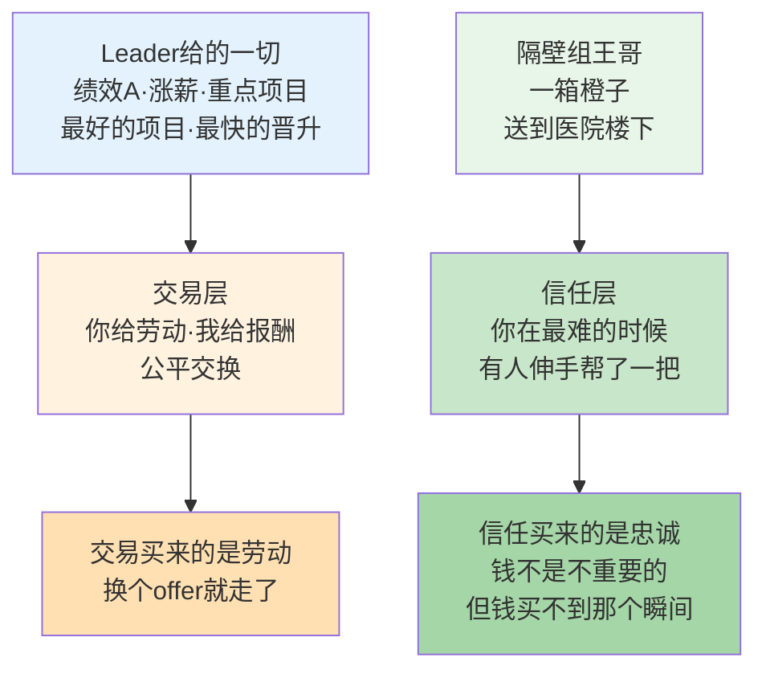
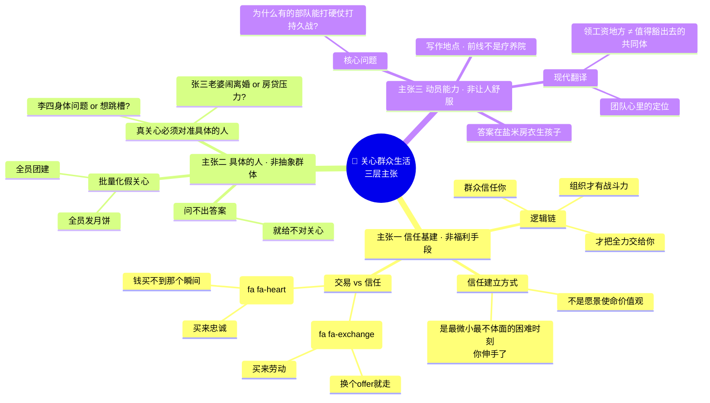
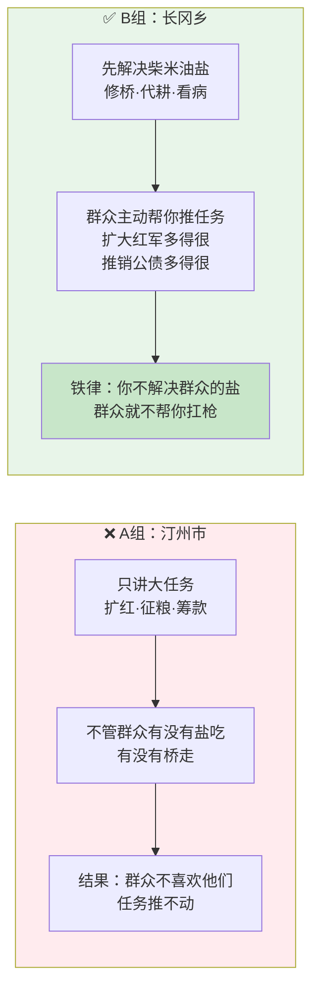
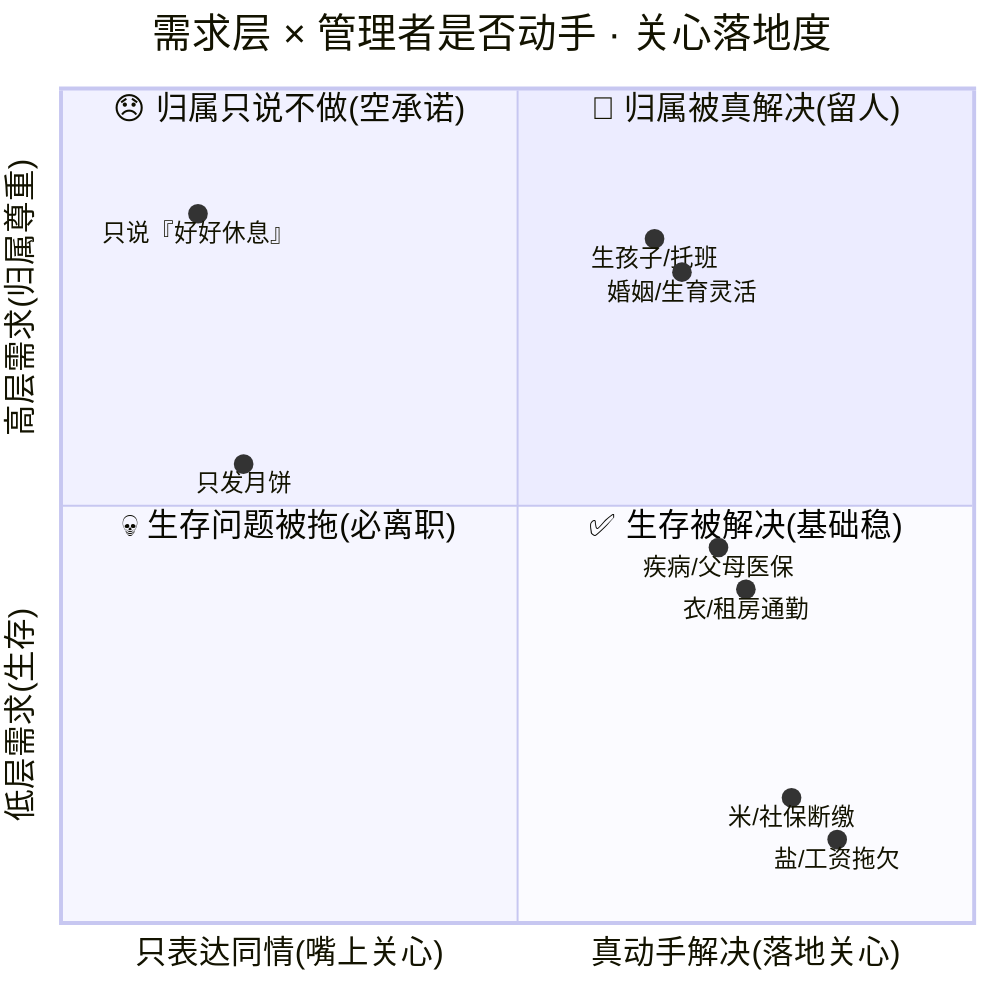
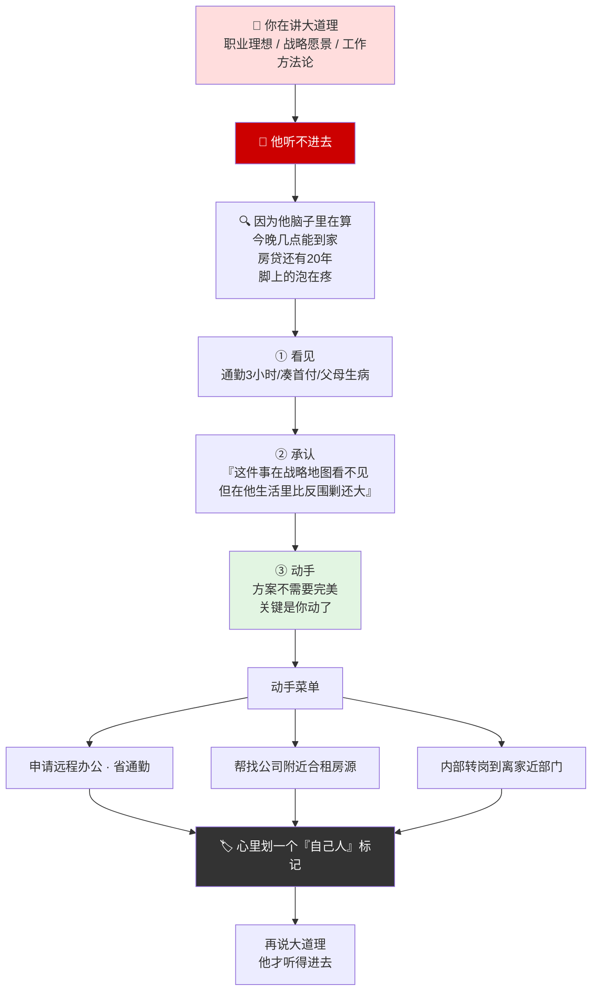
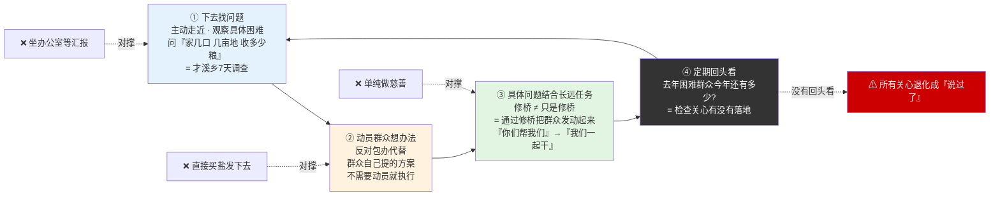
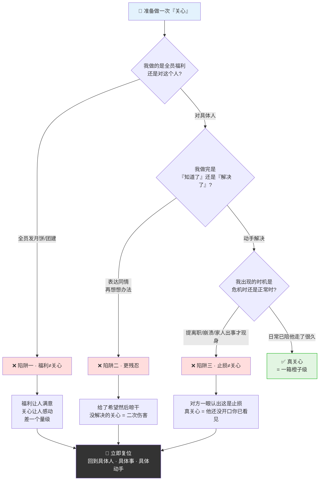

# 44.关心群众生活法

- 01.离职面谈现场
- 02.市面误读之辨
- 03.三层独家主张
- 04.一九三四现场
- 05.原文四维精读
- 06.柴米油盐方法论
- 07.小事即大事
- 08.群众路线闭环
- 09.关心与要求辩证法
- 10.两种错误倾向
- 11.三个认知陷阱
- 12.一个商业切片
- 13.三年认知复利
- 14.收束三句金言

## 01.离职面谈现场

// TODO 这个案例缺乏说服力，帮我优化

去年团队里最稳的一个骨干突然提离职。我懵了，绩效 A、涨薪刚过、重点项目核心成员，怎么就要走？约了顿火锅，喝到第三瓶他才开口："老大，你给的薪水和项目都没问题。但上次我女儿肺炎住院，你只回了一句'好好休息'。隔壁组的王哥，当晚送了一箱橙子到医院楼下。"

他说这话的时候语气很平静，不是抱怨，更像陈述一个事实。但那句话穿透力极强：**我管了他两年，给了他最好的项目、最高的绩效、最快的晋升，最后败给了一箱橙子**。

那个周末我翻开毛选，《关心群众生活，注意工作方法》。原文写着："**要得到群众的拥护吗？要群众拿出他们的全力放到战线上去吗？那么，就得和群众在一起，就得去发动群众的积极性，就得关心群众的痛痒，就得真心实意地为群众谋利益，解决群众的生产和生活的问题，盐的问题，米的问题，房子的问题，衣的问题，生小孩子的问题，解决群众的一切问题。**"

我盯着"盐的问题，米的问题，房子的问题，衣的问题，生小孩子的问题"看了很久。毛主席讲革命动员，不讲大道理，讲的是**盐米房衣生孩子**。他不是在写管理手册，他是在告诉每一个指挥员：**你不关心战士的柴米油盐，战士凭什么为你冲锋陷阵？**

从此立了条规矩：**每个下属身上必须记住一件"非工作的事"——他的孩子几岁、他的房贷压力、他最近在焦虑什么。记住不算完，要动手。**

两年绩效A+最好项目 败给一箱橙子——信任 vs 交易的差距：

## 02.市面误读之辨

市面上讲"关心群众生活"的人，最爱引用的就是那句"以人为本"，"关心员工"。然后配一段"所以要做团建、发福利、搞生日会"。这种讲法有两个硬伤：

**第一，它把关心群众生活讲成了"员工福利"**。真正的《关心群众生活》不是在教你"怎么讨好员工"，而是在回答一个更根本的问题：**组织和群众之间那根"信任纽带"到底是怎么建立起来的？为什么有的组织振臂一呼应者云集，有的组织涨薪也留不住人？**

**第二，它把"关心"讲成了"示好"**。毛泽东讲的"关心"有严格定义，不是逢年过节发月饼、不是团建搞轰趴、不是晨会喊口号。**是解决群众"切身的、具体的、他们正在痛的问题"**。战士没鞋穿，你给他一双鞋，比讲一百次"革命必胜"管用；下属孩子没人接，你帮他联系一个托班，比谈十次职业规划管用。**区别在于你解决的是他"嘴里在说的事"还是"心里在痛的事"**。

为什么这种"员工福利论"最流行？因为它**最省心**。发月饼只需要行政部走采购流程，不需要你真正了解任何人。而毛泽东讲的关心需要你**走进每一个人的具体生活**，知道谁家老人病了、谁最近在凑首付、谁老婆快生了。**前者是预算，后者是心力**。绝大多数管理者选了前者，不是因为前者更有效，而是因为前者不需要"用心"。

真正能改变组织的关心，必须做两件市面管理课不愿做的事：**第一，把注意力从"KPI完成率"挪出一部分到"人的具体困难"上**；**第二，动手解决，而不是"知道了"**。这两件事都不出现在任何管理者的 OKR 里，所以大多数公司永远做不到。

## 03.三层独家主张

这篇文章想讲的关心群众生活，完全不同。三层市面很少讲的东西：

关心群众生活不是"福利手段"，是**组织的信任基建**。毛泽东的逻辑链非常清楚：群众信任你→才会把全力交给你→组织才有战斗力。而信任不是靠"愿景""使命""价值观"建立的，是靠**你在他最具体、最微小、最不体面的困难时刻，伸手帮了一把**。那箱橙子之所以打败了两年的绩效和晋升，因为它触达的是"信任"层，而绩效和晋升触达的是"交易"层。**交易买来的是劳动，信任买来的是忠诚。**

关心的对象不是"抽象的人"，是**具体的、一个一个的人，带着各自具体的痛**。很多人把"关心团队"理解成"请大家吃饭"——这是一种**批量化的假关心**。真正的关心必须对准具体的人：张三最近状态差，是因为老婆闹离婚还是因为房贷压力？李四最近频繁请假，是身体出问题了还是想跳槽？**你问不出答案，你就不可能给对关心。**

关心群众生活的终极目的不是"让群众舒服"，而是**让组织有动员能力**。毛泽东写这篇文章的地点不是疗养院，是前线。他在回答一个生死攸关的问题：为什么有的部队能打硬仗、打苦仗、打持久战？答案藏在"盐米房衣生孩子"里。**今天的翻译是：一个团队能扛多大的压力、打多硬的仗，不取决于激励制度的设计，取决于团队成员在心里把"这个团队"当成了什么——是领工资的地方，还是值得豁出去的共同体。**

三层独家主张思维图（信任基建 · 具体的人 · 动员能力）：

## 04.一九三四现场

《关心群众生活，注意工作方法》写于 1934 年 1 月，江西瑞金，第二次全国工农兵代表大会上的结论。此时第五次反"围剿"正在惨烈进行，前线吃紧，后方物资极度匮乏。

很多人第一次读这篇文章会把它当成"领导讲话稿"，觉得是老生常谈。**这是把它彻底读浅了**。这篇文章的真身不是讲话，是**作战动员**。毛泽东在文章里讲了两件当时最具体的事：汀州市政府只管扩红征粮、不管群众有没有盐吃有没有桥走，结果是"群众不喜欢他们"；长冈乡和才溪乡把群众的柴米油盐管好了，结果是"扩大红军多得很、推销公债多得很"。

**毛泽东在拿两个活生生的案例做 A/B 测试**。汀州市只讲"大任务"，结果是任务推不动；长冈乡先把"小事"解决了，结果是群众主动帮你推任务。这个对比不是修辞，是**他在告诉苏区所有干部一个铁律：你不解决群众的盐，群众就不帮你扛枪。**

汀州市 vs 长冈乡——一场影响历史的 A/B 测试：

读这篇文章的副标题是"注意工作方法"。毛泽东把"关心群众生活"和"注意工作方法"并列，意思是**这两件事是同一件事的一体两面**：正面的方法是关心群众生活，反面的方法是官僚主义和命令主义。不讲工作方法的关心是滥好人，不关心群众的工作方法是暴政。

## 05.原文四维精读

下面这几段是《关心群众生活》最硬核的部分，从字眼、现场、张力、反共识四个维度拆。

> **原文**：我们对于广大群众的切身利益问题，群众的生活问题，就一点也不能疏忽，一点也不能看轻。

**精读**：两个"一点也不能"，是毛泽东笔下密度最高的双重否定。第一重否定"不能疏忽"对应对群众痛苦视而不见的冷漠型官僚；第二重否定"不能看轻"对应觉得"这都是小事不重要"的自负型官僚。**两种官僚合在一起，就是所有组织脱离群众的全部病因。**

**反共识**：今天的管理者习惯把"人的问题"和"业务的问题"分成两个赛道，前者交给 HR，后者自己抓。毛泽东这句话把赛道直接合拢了——**群众生活问题是业务问题的前置条件，跳过前置条件搞业务，效率再高也是虚假繁荣。**

> **原文**：解决群众的穿衣问题，吃饭问题，住房问题，柴米油盐问题，疾病卫生问题，婚姻问题。总之，一切群众的实际生活问题，都是我们应当注意的问题。

**精读**：毛泽东列了一张具体到"柴米油盐"的清单。这不是修辞，是**操作清单**。他在警告每一个干部：**别跟我谈"关心群众"的大词，你说你关心，那你说说你们村哪家缺盐、哪家孩子生病、哪家房子漏雨？** 说不出来，说明你根本没在关心。

**反共识**：今天最流行的管理者自欺是——"我很关心团队，我给他们争取了最好的薪资。"但薪资是**对价的**，不是关心的。关心是**不对价的**——你知道他爱人生日、他孩子考学压力、他父亲住院陪护排班。**前者是 HR 能做的事，后者只有你能做。**

> **原文**：要得到群众的拥护吗？要群众拿出他们的全力放到战线上去吗？那么，就得和群众在一起，就得去发动群众的积极性，就得关心群众的痛痒，就得真心实意地为群众谋利益。

**精读**：连续四个"就得"，是全文最密集的排比。这不是优美修辞，是**因果链**：在一起→发动积极性→关心痛痒→谋利益。这个链条不可跳过任何一环。跳过"在一起"直接谈"积极性"，是做 PPT 动员；跳过"关心痛痒"直接"谋利益"，是交易而非信任。

**反共识**：今天很多 CEO 一年没和一线员工吃过一次饭，然后在全员会上说"我很关心大家"。毛泽东给了一个硬标准：**你没和群众"在一起"过，后面三个"就得"自动失效。** 在一起不是物理距离，是你知道他们的具体生活。

> **原文**：组织革命战争，改良群众生活，这是我们的两大任务。

**精读**："两大任务"并列，不是主次关系。打仗和组织生活改良，在毛泽东笔下是等权重的。这意味着——**一个只顾打仗不管群众死活的指挥员，和逃兵同罪。**

**反共识**：把这句话翻译到今天：**你的 OKR 里，"完成业务目标"和"解决团队具体困难"必须并列，不能一主一次。** 只盯业务 OKR 不管人的团队，短期能冲业绩，长期一定崩——崩的不是能力，是人心。

原文四段·关心马斯洛映射象限图（今天需求 vs 1934 清单）：

## 06.柴米油盐方法论

毛泽东把"关心群众生活"翻译成了一系列可操作的关键词：盐、米、房、衣、柴、油、疾病、婚姻、生孩子。这不是随口列举，这是**一张"群众痛苦指数清单"**，按紧迫性从高到低排列：没盐吃活不下去（生存层），没衣穿无法过冬（安全层），没房子住无法安家（归属层），婚姻和生育是马斯洛的尊重和繁衍层。**毛泽东在 1934 年没有学过马斯洛，但他用直觉排出了完全对等的需求金字塔。**

**今天的翻译**：

生存层（对应盐/米/柴）——工资拖欠没有、社保公积金有没有断缴、加班餐费报不报得下来。**这一层出了问题，其他一切管理动作都是笑话。**

安全层（对应房/衣/疾病）——租房通勤多久、有没有居住证影响孩子上学、父母的医保能不能覆盖大病。**这一层是团队稳定性的基石，大多数主动离职的根本原因藏在这一层。**

归属层（对应婚姻/生孩子）——产假能不能休完不被打扰、哺乳期有没有灵活工作机制、单身同事有没有被催婚压力传导。**这一层决定了一个人在团队里待多久。**

**操作清单**：每季度至少和每个直接下属做一次"非工作对话"，只聊生活不聊业务。记住三件事——他最近最大的压力源是什么、他未来半年最重要的个人生活事件是什么、他现在最需要你帮他解决的一个具体问题是什么。**记住不算完，动手。**

## 07.小事即大事

毛泽东在原文里举的例子全是最不起眼的事：汀州市没有桥、长冈乡缺柴火、才溪乡缺盐。有人在会议室里会质疑——"革命战争时期，你不去讨论第五次反围剿的战略，你在会上讲一座桥？"

**毛泽东的回答前置了**：群众过河没有桥，这件事在指挥部的战略地图上确实看不见，但在群众的生活里，它比反围剿还大。一个人每天花两小时绕路过河，他的全部精力用在了"生存"上，你号召他"为革命奋斗"，他听不进去——不是不爱国，是脚上的泡在疼。

**这件事在今天的具体翻译是**：团队成员每天通勤三小时，你跟他谈职业理想，他脑子里想的是"今晚几点能到家"；团队里有人正在凑首付、每月还完房贷只剩三千块生活费，你跟他谈工作方法论，他脑子里想的是"房贷还有 20 年"。**这些"小事"不解决，你说的每一句"大话"都是隔靴搔痒。**

这不是让你去帮每个人买房修桥，而是**你得先看见、先承认**。看见之后的动作可以有无数种——帮他申请远程办公省通勤、帮他找公司附近的合租房源、帮他联系内部转岗到离家近的部门。**关键不是你的方案有多完美，关键是你动手了。**

**小事即大事，因为你解决一件小事，群众在心里给你划一个"自己人"的标记。标记攒够了，你说的"大事"他才听。**

小事看不见 大事推不动 · "看见→承认→动手"三步流程图：

## 08.群众路线闭环

"关心群众生活"和"注意工作方法"不是两件事，是群众路线的完整闭环。

**闭环第一步：下去找问题。** 不是坐在办公室等人来汇报，是主动走近群众，观察他们的具体困难。毛泽东在才溪乡的调查做了七天，跟贫农、中农、富农分别谈话，问的不是"你对革命怎么看"这种大问题，而是"你家几口人、几亩地、去年收了多少粮"这种小问题。**小问题问得越具体，真相越藏不住。**

**闭环第二步：动员群众一起想办法。** 毛泽东特别反对"包办代替"。群众缺盐，不是你去买一堆盐发下去——这是慈善，不是组织。正确的做法是：把缺盐的问题摆在群众面前，和他们一起讨论怎么解决。群众自己提出的方案，执行起来不需要你做任何动员工作。

**闭环第三步：把解决的具体问题和长远任务结合。** 修一座桥不只是修桥，是通过修桥把群众发动起来、组织起来。桥修好的那一刻，群众感受到的不是"政府做了一件好事"，而是"我们做了一件大事"。**从"你们帮我们"到"我们一起干"的认知迁移，才是关心群众生活的真正终点。**

**闭环第四步：定期回头看。** 毛泽东问长冈乡的一个问题是："去年的困难群众，今年还有多少？"这不是关心，是*检查关心有没有落地*。**没有回头看，所有关心都会退化成"说过了"。**

群众路线四步闭环图（下去→动员→结合→回头看 · 一环缺则空转）：

## 09.关心与要求辩证法

这是市面解读几乎不碰的一层：**关心和要求是一对矛盾，两者必须在同一个人身上同时存在。**

只关心不要求的是滥好人。他把团队弄得很舒服，但团队不出活。舒服三个月之后，团队开始恐慌——因为大家知道自己没在成长。**你只是"对他们好"，不是"为他们好"。**

只要求不关心的是暴君式管理。他逼团队出活，团队也确实在出活，但出活的代价是骨干一个一个走。留下来的都是走不了的，走不了的人不反抗，但也不拼命。**你得到了服从，但失去了战斗力。**

毛泽东的逻辑是：**关心是要求的前提，要求是关心的延续。** 你先解决他的盐米房衣，让他觉得"你是自己人"；然后你才能提要求——"现在我们去打这场硬仗"。**没有前置的关心，你的要求就是压迫；没有后续的要求，你的关心就是收买。**

**实战用法**：每次提一个高要求之前，先检查自己有没有做一件事让他觉得"我跟你们站在一起"。如果没有，先别开口，先做那件事。做了，开口才有资格。

## 10.两种错误倾向

毛泽东批两种人，一针见血：**只谈任务不谈群众生活的官僚主义者**和**只讲福利不讲组织目标的尾巴主义者**。

官僚主义者的特征是"只派任务不收反馈"——上级问"任务完成了吗"，他答"正在推进"；群众问"我的问题怎么解决"，他答"再研究研究"。**这种人不是在管理，是在拖延。** 他在用"程序正确"掩盖"实质不作为"。

尾巴主义者的特征是"群众要什么给什么"——不加分析、不加引导，把关心理解成了迎合。**这种人不是在服务，是在讨好。** 他在用"民主"掩盖"失责"。

毛泽东给出的正确公式是：**从群众中来（收集他们的具体困难）→ 到群众中去（把解决方案带回去和他们一起执行）→ 集中起来（把个别问题的解决经验提炼成普遍方法）→ 坚持下去（把这些方法制度化、常态化）。** 这是群众路线，也是所有管理学的元代码。

## 11.三个认知陷阱

真正做过关心的人很少，大多数人掉在三个认知陷阱里：

**陷阱一：把福利当关心。** 发月饼、办生日会、组织团建——这些是福利，不是关心。福利是对"所有人"的，关心是对"这个人"的。**你记得他孩子叫什么、他老婆在哪工作、他最近在为什么失眠，这比一百盒月饼都有穿透力。** 福利让人满意，关心让人感动。两者之间的量级差，就是员工在心里给你划"老板"还是"自己人"的分界线。

**陷阱二：把"知道了"当"解决了"。** 你表达了同情、听取了困难、答应"我想想办法"。然后呢？没有然后了。**"知道"是零，"解决"才是一。** 中间隔的这段距离，就是你和真正受拥护的领导者之间的全部差距。毛泽东给的标准非常硬：你说你关心群众，那你解决了盐的问题吗？解决了米的问题吗？**没解决的关心，是一种更残忍的伤害——你给了他希望，然后亲手把它晾干。**

**陷阱三：只在危机时关心。** 下属提离职了你才谈，下属崩溃了你才陪，下属家人出事了你才出现。这种"救援式关心"的问题是：**对方能一眼认出这是止损，不是关心。** 真正的关心发生在一切正常时——他还没开口，你已经看见了。**关心不是在对方跌倒时伸手，是在他累的时候已经陪他走了很久。**

三大认知陷阱决策树（每次要关心前先跑一遍）：

## 12.一个商业切片

讲一个关心能改变组织战斗力的案例：**海底捞的"店长关心权重"制度。**

海底捞把店长的考核里塞进了一个其他餐厅绝对不想做的指标：员工满意度。不是填表的满意度，是检测店长知不知道**自己店里每个员工的家庭住址、子女情况、租房条件、最近一次请假原因**。不知道？扣分。知道但没动作？也扣分。

这个制度带来了一个巨大的连锁反应——海底捞的店长们花在"了解员工具体生活"上的时间，大概是同行店长的五倍。结果是：海底捞的员工流失率是行业平均的三分之一；而员工满意度在服务行业里几乎断崖式领先。**更低的人力成本、更高的服务质量——这两个看似矛盾的指标，被"关心"这个变量同时推向了最优解。**

**这个案例的核心洞察不是"海底捞对员工好"，而是"关心群众生活是一笔数学上绝对划算的投资"**。一个人因为没鞋穿跑不动，你拼命的推他、骂他、激励他，都不如给他一双鞋。给鞋的成本 50 元，推骂激励的管理成本是每天 100 元。**你不算这笔账，是因为你把管理成本当成了"水"，以为是免费的。**

反观绝大多数餐饮企业，他们的培训手册里全是"服务标准""客诉流程""翻台率红线"，没有一个字是关于"你怎么了解你员工的真实困难"。于是店长把所有精力放在"监督"上——监督出勤、监督服务、监督客诉。**监督是关心缺位的代价。**

## 13.三年认知复利

离职面谈那箱橙子成了我管理生涯的分水岭。当周我做了一件事：给团队每个人建了一个"非工作档案"——他家里几口人、孩子多大、通勤多远、最近压力源是什么。不是一次性问完，是在接下来三个月里一顿一顿饭吃完的。**三个月后，我发现我对团队的理解比过去两年加起来都深。**

一个月内，我开始在周会上插一个固定环节：**"本周有没有人遇到了非工作上的困难需要团队帮一把？"** 第一周没人说话，第三周有人开口了——"我奶奶住院，下周能让我提前一小时走吗？"第六周变成了三个人同时开口。**当一种行为被养成习惯，它就不再依赖号召，而成为团队文化。**

半年后，我发现一个变化——以前团队出了问题，我是最后一个知道的；现在团队出了问题，我是第一个知道的。**不是因为监控，是因为信任。** 信任建立后的第一个红利不是效率，是信息——所有被你真正关心过的人，都会主动把"你该知道的信息"告诉你。**信息差才是管理者最大的隐性成本，而关心是消除这个成本的唯一杠杆。**

三年后，我带过的团队从 12 人到 60 人，我形成了一个铁律：**面试每一个直接下属的最后一题，是"你最近一个月最焦虑的一件事是什么，无关工作"。** 我不是在考察他，我是在提前建立关心的入口。三年间有三次，候选人回答完这个问题后哭了——不是因为题目残忍，是因为在过去三五年里，没有人问过他这个问题。**一个人的孤独不是没有同事，是没有一个能说出焦虑的对象。**

这个发现让我重新理解了"领导力"：**领导力的本质不是把一群人指挥到正确的地方，是你让他们愿意把你当自己人。而"自己人"这个身份，不是任命出来的，是一箱橙子一箱橙子搬出来的。**

## 14.收束三句金言

**一句话核心**：**你不知道群众碗里有什么，就别指望群众为你流血**。关心群众生活不是福利手段，是组织动员力的唯一入口。

**你应该带走的三件事**：

**从盐米房衣开始**：别谈企业文化、别谈愿景使命——先解决他最具体、最微小、最不体面的那个困难。解决一个，信任就开始积累。
**一个人一个人地关心**：对事可以批量处理，对人必须一个一个见面。你记得他孩子叫什么，比任何表彰都有穿透力。
**关心是要求的前提**：先让他觉得你是自己人，再提要求。顺序反了，你得到的不是战斗力，是压抑。

**一句留给你的反问**：

> 你团队里最沉默的那个人，他最近三个月最大的压力源是什么？如果答不上来，**你今天的管理就是在沙子上盖楼。**

**从下周一开始就能练的最小动作**：挑团队里你最不熟的那个人，约他一顿午饭，全程不谈工作，只问三件事——他家里几口人、他每天通勤多久、他最近一次真正放松是什么时候。**这三个问题问完，你就完成了从"管理者"到"自己人"的第一次身份切换**。这个动作的门槛低到不能再低，但绝大多数管理者一辈子都没做过——因为他们觉得"这不像管理该有的样子"。恰恰是这种"不像管理"的动作，才是真正管理的起点。**关心群众生活不是柔性技巧，是硬性战斗力——你从这顿饭开始练，一年之后你的团队会用一种你今天想象不到的方式回报你**。

**最后送你一句话**：**你今天愿意花在了解一个员工上的每一分钟，都会在他未来某一次帮你扛住危机时，一比十倍地还回来**——那时候你会明白，毛主席讲的"关心群众生活",从来不是伦理，是在漫长时间维度里投资回报率最高、也最难被复制、最难被模仿的一项在长期主义视角下都成立的战略级管理动作。
