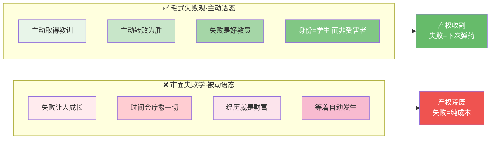
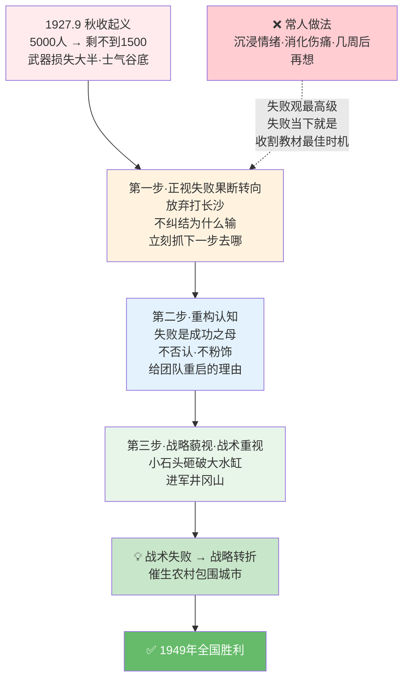

# 50.如何看待失败观

- 01.赔光积蓄那夜
- 02.市面误读之辨
- 03.三层独家主张
- 04.一九二七秋收现场
- 05.原文四维精读
- 06.内因外因之辨
- 07.失败审计法
- 08.秋收起义示范案
- 09.一个商业切片
- 10.三个认知陷阱
- 11.刀刃必须向内
- 12.三年认知复利
- 13.收束三句金言

## 01.业务被砍那夜

32 岁那年，我带着一个 7 人团队攻坚一条新业务线，投入十一个月，从调研、原型到内测全跑通了。就在公开上线前一周，公司战略调整，整条线被砍，团队就地解散。

老板说"方向没问题，是时机不对"。我点头，脸上平静。回到工位做的第一件事是在脑子里列归因清单：战略摇摆、预算砍半、上游不配合、竞品抢先。"不是我的问题"，每一条的最后四个字一模一样。

那两三个月我活成了三个词：**愤懑、反刍、偏执**。逢人就说"公司没耐心"，同事点头但眼神飘走；每天把"如果当时多争取两个月"在脑子里嚼几十遍。某天夜里照旧翻旧账，随手拿起《毛选》，翻到《实践论》，盯着一句话看了十分钟："人们经过失败之后，也就从失败取得教训，改正自己的思想使之适合于外界的规律性，人们就能变失败为胜利，所谓'失败者成功之母'，'吃一堑长一智'，就是这个道理。"

又读到他给错误的定性："错误有两重性。错误一方面损害党，损害人民；另一方面是好教员，很好地教育了党，教育了人民，对革命有好处。""好教员"三个字，我盯了很久。我想起毛主席受过二十次左右的处罚和打击：被撤职、被开除党籍、被边缘化。宁都会议解除他红一方面军总政委职务时，39 岁。这个人，是踩着连续二十次失败的断崖长起来的。不是没输过，他是把每一次失败嚼碎咽下去，变成下一次的子弹。

那一夜我第一次换了个角度看那十一个月——不是"业务被砍"，是"那十一个月到底教会了我什么"：从零到一验证需求、资源砍半时排优先级、在老板动摇前递出风险预警、在团队恐慌时稳住节奏。我列出来的每一条，跟之前那个归因清单完全相反：之前每条指向别人，现在每条指向自己。这不就是毛主席说的"好教员"？不是浪费了十一个月，是用十一个月把以后十年的坑提前踩了一遍。那一夜，我第一次睡了整觉。

同一次业务被砍——归因清单的180度反转：

## 02.市面误读之辨

市面上讲失败观的，无非三派，每一派都避重就轻，全是软着陆的安慰剂。

鸡汤派的口号是"失败是成功之母，下次会更好"，问题在于**把失败抽象成安慰，绝口不提"审计"才是转化的关键动作**。

外因派说"失败不是你的错，是市场、时代、团队的问题"，问题在于**贩卖廉价止痛药，回避"刀刃向内"才是真正的解药**。

躺平派讲"接受现实，不必苛责自己"，问题在于**把失败扭曲成放弃的借口，不说"用一次"才是失败唯一的兑现方式**。

三派的共同盲区，就是把失败当成"已经过去的事"。**而毛主席的失败观，从始至终都把失败当成"未来的弹药"**。失败本身没有任何意义，意义只在于你从里面长出了什么。失败之后什么都没长出来，那就是纯粹的失败——全是成本，没有半分回报。

一句话说透：**失败不是成本，是教材，但前提是你愿意坐下来把它读完**。

## 03.三层独家主张

我读毛选这部分的结论，和市面上所有"失败学""归因论"有三处本质区别。

**失败后第一反应甩外因，是廉价的精神鸦片**。绝大多数人摔了跤，第一反应都是怪市场、怪客户、怪团队、怪大环境。这种归因当下舒服，代价就是下次还在同一个坑里摔。毛主席的失败观，核心要求是"刀刃向内"——把失败的根因落到自己的结构性短板上。**这一刀很疼，但不切下去，下一次失败就在路口等着你**。

**只做"反思"没用，必须做"审计"**。很多人失败后只会脑内复盘，想完就完了，留不下任何具体动作。真正的失败处理，必须做标准化审计：把每一条失败写下来，用内因外因的标尺重新切割，揪出真正的根因。**没有形成书面文档的失败，全是白交学费**。我自己亲测，一份 7 天内写完的失败审计报告，价值远超所有心灵成长鸡汤。

**失败里长出的教训，必须在下个月的真实场景里"用一次"**。不用的教训会自动蒸发：3 个月忘 70%，半年忘 95%。只有落地用过一次的教训，才会沉淀成肌肉记忆。这一点几乎所有市面书籍都不讲，**他们讲到"反思"就停了，但反思是 0，使用才是 1**。

## 04.一九二七秋收现场

毛主席关于失败的核心论述，散见于《实践论》《改造我们的学习》，以及对 1927 年秋收起义失败的事后总结。写作背景是实打实的至暗时刻：大革命失败，共产党人被大肆屠杀，秋收起义遭遇重挫，整个革命看起来已经走到了绝路。

在这种环境下写下"失败是成功之母"，**从来不是鸡汤，是从血泊里提炼出来的认知处方**。秋收起义出发时五千人，文家市会师时只剩不到一千五，损失超三分之二。要记住：**失败观不是哲学思辨，是临床急救方案**。文家市会议上，毛主席要解决的是最具体的问题：这支打残了的部队，明天往哪走？他的答案是：放弃原定打长沙的目标，转向井冈山，去敌人统治最薄弱的农村。**这个决策本身，就是"失败转化"的现场实操**，把秋收起义的军事失败，直接转化成了"农村包围城市"的战略起点。

还原这个现场你就懂了：毛主席的失败观，从来不是"接受失败"，**是"在失败里立刻找下一步"**。失败发生的瞬间，眼睛立刻盯住"它告诉了我什么、我接下来该往哪走"。苏共处理失败的逻辑是"批判加清算"，出事先找责任人、抓人处罚。毛主席恰恰相反："惩前毖后、治病救人"。**失败不是用来惩罚人的，是用来教育所有人的**。这种把失败转化为教材的能力，是中共区别于其他所有革命组织的核心优势。把"党"换成"公司"，把"秋收起义失败"换成"创业失败"，逻辑完全成立。

## 05.原文四维精读

"错误有两重性。错误一方面损害党，损害人民；另一方面是好教员，很好地教育了党，教育了人民，对革命有好处。"

毛主席没用"经验""教训"这种平淡的词，他用了"好教员"，**一个主动授课的角色**。教员不是被动的回忆，是主动向你传递信息。这个比喻最妙的地方，就是**把你对失败的姿态从"回头复盘"变成了"向前听课"**。当你把失败当成教员的那一刻，身份就从"受害者"变成了"学生"。学生的姿态是坐下来听课，不是反复哀嚎"为什么是我"。**这一个身份转换，决定了你是被失败压垮，还是被失败托举**。

这段话出自处理党内犯错同志的指导原则，语境极其关键：**他不是对着一帆风顺的人讲大道理，是对着一群刚犯了大错、灰头土脸的人讲出路**。还原这个现场你就明白：这句话不是道德安慰，是组织重启指令。台下的人需要的不是"没关系"，是"我还能重新站起来的理由"。"好教员"三个字，给了他们把"失败者身份"换成"学习者身份"的通道。

再看这句话里的矛盾并置，"损害党"和"对革命有好处"。同一件事既有害又有利？看似矛盾，实则打破了非黑即白的线性思维。**失败从来不是 100% 的坏，也不是 100% 的好，它有两面性，关键看你会不会用**。这种"两重性"思维，是毛主席最核心的方法论：任何事都有两面，别被单一面占满全部视线。失败的"坏"是当下的、显性的；"好"是潜在的、需要你主动挖的。

"人们经过失败之后，也就从失败取得教训……人们就能变失败为胜利。"市面上把这句话翻译成"失败让人成长"——这是严重的弱化。原话的力量不在"成长"，在"**取得教训**""**变失败为胜利**"这两个主动动作。差别在哪？"失败让人成长"是被动语态，仿佛成长会自动发生；"取得教训、转败为胜"是主动语态，**必须你伸手去拿、动手去转化**。这就是毛式失败观和市面失败学的根本分野：前者要求你主动收割，后者等着时间自动疗愈。**失败的产权在你手里——你不主动收，它就荒着；你主动割，它就变成弹药**。

被动语态 vs 主动语态——失败产权归属：

## 06.内因外因之辨

毛主席处理失败最硬核的原则，就是四个字：**刀刃向内**。

矛盾分析法的核心结论：**内因是根本，外因是条件**。失败的根源永远在内部矛盾，外部环境只是催化剂和放大镜。一支军队打输了，根本原因是战略错、战术僵、纪律散——敌人强只是外部条件。分析失败，本质就是抓主要矛盾。

人失败后本能甩外因，无非三个原因：自尊保护——承认自己不行太打脸；认知偷懒——怪外因最简单，瞬间就能闭环；求职需要——怪外因才能说服下家"不是我能力差"。**这三点都能让你当下舒服，但代价完全一致：下次还在同一个地方摔**。

每一次失败都必须做"内因重切"三步。先写下你当时所有的外因解释；用"内因是根本"的标尺重新切——这件事里，我做了什么、没做什么，直接导致了结果？归类定性：这是认知问题、能力问题，还是态度问题？我自己亲测，43 条失败走完三遍流程，列出外因占 90%，内因重切后也占 90%。**这组数据像冷水浇头，但也真正救了我**。

## 07.失败审计法

知道要审计，具体怎么审？我打磨了一套"失败审计法"——简单粗暴，但极其有效。

拿一张表建三列：A 列写发生了什么——一句话说清事实，不带情绪，不加修饰；B 列写我当时的归因——市场差、客户烂、合伙人坑、时机不对，全写下来；C 列做内因重切——用"内因是根本"的标准，重新挖真正的根因。**写完回头看，B 列和 C 列的反差，就是你最大的认知盲区**。

几十条失败捋完，你会发现它们最终都归到 4 到 5 个核心短板上。说"融资没跟上"，本质是两年没做好数据看板，投资人从没看到真正的产品市场匹配；说"合伙人跑路"，本质是利益分配一直含糊，股东协议拖了半年都没签；说"客户流失"，本质是做了自己想做的产品，从没跟客户深度聊过十次。毛主席说"分析失败就是分析主要矛盾"——那天我才算真的做到了。

把这 4 到 5 条核心短板写在便签上，贴在书桌前，给它起个具体的名字，比如"**我的 160 万学费清单**"。为什么要起名？**因为起了名字，它就从"模糊的羞耻感"变成了"具体的资产"**。每天看见它，你就会想：今天我有没有为补上这些短板做点什么。

## 08.秋收起义示范案

1927 年 9 月秋收起义，原定打长沙，结果起义后连遭挫败，五千人剩不到一千五，武器损失大半，士气跌到谷底。从任何标准看，都是彻头彻尾的军事失败。

但毛主席用三步把死棋走活了。**第一步——正视失败，果断转向**。文家市会议上，他说服所有人放弃打长沙，转向敌人统治薄弱的农村。不纠结"为什么输了"，立刻抓"接下来去哪"，把失败的当下直接变成重新决策的起点。**第二步——重构认知，给团队重启的理由**。他对战士们说，这次起义受了挫折，但失败是成功之母，关键是从里面总结经验。不否认失败，不粉饰太平，但给了所有人一个"我们能从这里站起来"的认知框架。**第三步——战略藐视，战术重视**。用"小石头砸破大水缸"的比喻给大家信心，同时做出进军井冈山的务实决策。既给长期必胜的信念，又给当下稳妥的路径。

秋收起义的战术失败，催生了农村包围城市的战略转折，成了中国革命最重要的"成功之母"。没有这次失败，就没有井冈山道路；没有井冈山道路，就没有 1949 年的胜利。**这不是"失败可以变成功"的鸡汤，是"失败发生的瞬间就要立刻盯紧下一步"的硬核动作**。文家市会议离起义失败只有几天，毛主席没让团队沉浸在情绪里消化伤痛，直接把所有人拉到了"明天往哪走"的现场。**这才是失败观的最高级：失败发生的当下，就是收割教材的最佳时机，等不得**。

文家市三步走——从5000残兵到中国革命转折点：

## 09.一个商业切片

讲一个近年硅谷最值得借鉴的实践：Failure Resume，也就是"失败简历"。

不少顶级创业者公开发布自己的失败清单，列全所有做黄的项目、被拒的融资、踩过的大坑。不是他们大方，是他们清楚——**失败简历比成功简历更值钱**。一份写着"创业 3 次失败、被拒 47 次融资、踩过 5 个具体的坑"的简历，比一句"成功创业 1 次"，对投资人说服力强得多。原因很简单：**成功可能靠运气，失败一定是教材**。一个能清晰说清自己 5 个具体短板的人，下一次大概率不会再在这 5 件事上栽。

OpenAI CEO、前 YC 总裁 Sam Altman，就反复公开讲自己第一次创业 Loopt 的失败——把 4 个根本原因列得明明白白：选错赛道、没找到产品市场匹配、扩张太快、没及时止损。正是这份失败审计，让他后来做 YC 时能精准识别出哪些创业公司在重蹈 Loopt 的覆辙，大幅提升了项目筛选的准确率。

反观市面上 99% 的失败创业者，选择把失败藏起来：不写复盘、不做总结、悄悄换份工作。**"藏起来"的代价极大**——下次再创业，带着同样的盲点，犯同样的错，甚至摔进同一个坑里。这个切片的结论很直白：**失败的最大价值，是公开化之后让自己和别人都受益。一份诚实的失败审计，是创业者最硬核的资产**。

## 10.三个认知陷阱

**陷阱一：把反刍当成反思**。最常见的误区是反复回放失败细节，"当初要是……就好了"在心里转几十遍，以为这是反思。错了，这叫反刍。**反刍只生产痛苦，不生产动作；反思必须落地**——一份审计文档、几条核心短板、下个月的改进计划，缺一不可。识别方法很简单：问自己，上次复盘失败后我做了什么具体改进？答不上来，就是在自我消耗，不是在反思。

**陷阱二：把放下当成解脱**。很多人处理失败的方式是"放下"——不想了、不提了、转移注意力。这本质是逃避。放下的代价就是失败的教材永远收不回来，下次还会在同一个地方摔。**真正的破解之道不是"放下"，是"用过"**。只有落地用过的失败，才能真正放下；没用过的失败，永远在潜意识里占着你的认知带宽。

**陷阱三：把教训收藏起来不用**。得出几条教训，记在本子上就完事了，从不在真实场景里用。这种"反思、教训、收藏"的闭环，和"读书、笔记、吃灰"是同一种病——缺了"用一次"的环节，所有教训都会随时间蒸发。破解方法：每条教训写下来的同时，立刻定一个使用时间点——**下个月必须在某个真实场景里用一次。没有使用计划的教训，等于没有教训**。

## 11.刀刃必须向内

整套失败观压缩成最朴素的判断，就是五个字：**刀刃必须向内**。

向内难，因为疼。承认是自己的认知、能力、选择出了问题，会直接冲击自尊。所以人本能向外甩锅，怪市场、怪他人、怪时代。**向外不疼，但代价是永远不长记性**。向内三步走，人人都能做：把脑子里所有外因借口全写下来，一个不留；用"内因标尺"逐条切——每一个外因背后，我自己的问题是什么？把挖出来的内因归类，找出核心短板，写下来贴在显眼处。

很多人误会：向内就是全算自己的错，就是自虐。完全不是。**向内的本质，是"找出我能改变的部分"**。市场改不了、时代改不了、别人的性格改不了，只有自己的能力、行为、决策可以改。**把刀刃指向自己，不是因为自己最差，是因为自己是唯一可控的变量**。

## 12.三年认知复利

业务被砍那一周，我关起门做了一件很疼的事：**把十一个月的失败逐条写下来，逐项审计**。

Excel 里建三列：事实、当时的归因、内因重切。把那份"全是别人的错"的清单逐条翻出来，主语全部替换：把"预算没给够"改成"我没有在第三次评审会上把需要的资源拍在老板桌上"，把"上游不配合"改成"我第二个月就该拉着上游负责人吃一顿饭，不是发邮件等着他回"。写完 37 条，保护壳全碎了——每个"外部原因"背后都站着一个"我当时就该做但没做的事"。起名"**37 条悔过清单**"，贴在书桌前。

那一个月我没急着申请转岗，做了件反常识的事：**对着短板刻意练习**。向上管理差，找了三个带过大团队的 mentor，每次带一个具体的决策场景去问"如果是你，你怎么跟老板沟通"；风险评估偏乐观，定了一条死规矩——任何方案汇报前必须附一页"最坏剧本"：最糟会怎样、早期预警信号、我打算怎么兜底。

一个月后愤懑、反刍、偏执全消失了。不是心理疗愈好了，是我开始有事干了，而且每一件事都是那 37 条悔过清单指明的方向。我才真正懂"错误是好教员"——前提是你真的坐下来听课。大多数人只是吃了错误的苦，从没读过错误这本书。

半年后接手新项目，从调研到上线跑了九个月，没被砍，第二年开始盈利。老板年终面谈说了一句："你这次推进的方式，跟上次完全不是一个人。"那一刻我彻底理解了毛式失败观：不是让你对失败麻木，是让你把失败从一笔烂账变成一本教材。那十一个月不是沉没成本，是此后每个项目的防坑手册。

三条铁规，沿用至今：任何项目收尾必须出一份"决策复盘"，把关键节点的决策写下来、标注为什么这样选、重判"如果重来怎么选"，没有文档学费就白交了；刀刃必须向内，怪外部是最便宜的止痛药——当下舒服，代价是下次还摔；失败要"用"不只是"反思"，从失败里长出的教训下个季度必须在真实场景里用一次，不用的教训会蒸发。三年后回头看那 37 条悔过清单，最核心的 5 条短板里有 4 条我再也没犯过。

## 13.收束三句金言

**失败不是成本，是教材——但前提是你愿意坐下来读完它。** 90% 的人吃了失败的苦，却没读失败的书，所以在同一个地方摔第二次、第三次。真正的失败，是摔过之后什么都没长出来。

**每一次重大失败，7 天内必须出一份审计文档。** 先列全外因借口，再用"刀刃向内"的标尺重切根因。没有这份文档，你的学费就是纯亏损。

**怪外因是廉价止痛药。** 外因归因当下舒服，代价就是下次在同一个坑里再摔一次。敢对自己下刀的人，才能真正把教训变成能力。

**失败要"用"，不要只"反思"。** 从失败里提炼的教训，下个月必须在真实场景里用一次。不用的失败就像不用的知识，蒸发得比你想的快。用过一次，它才真正是你花钱买来的本事。

**你最近一次重大失败之后，有没有写过一份"刀刃向内"的审计文档？如果没有，那次失败的学费就白交了。下一次，你大概率还会在同一件事上摔跤。**
