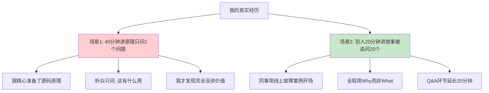
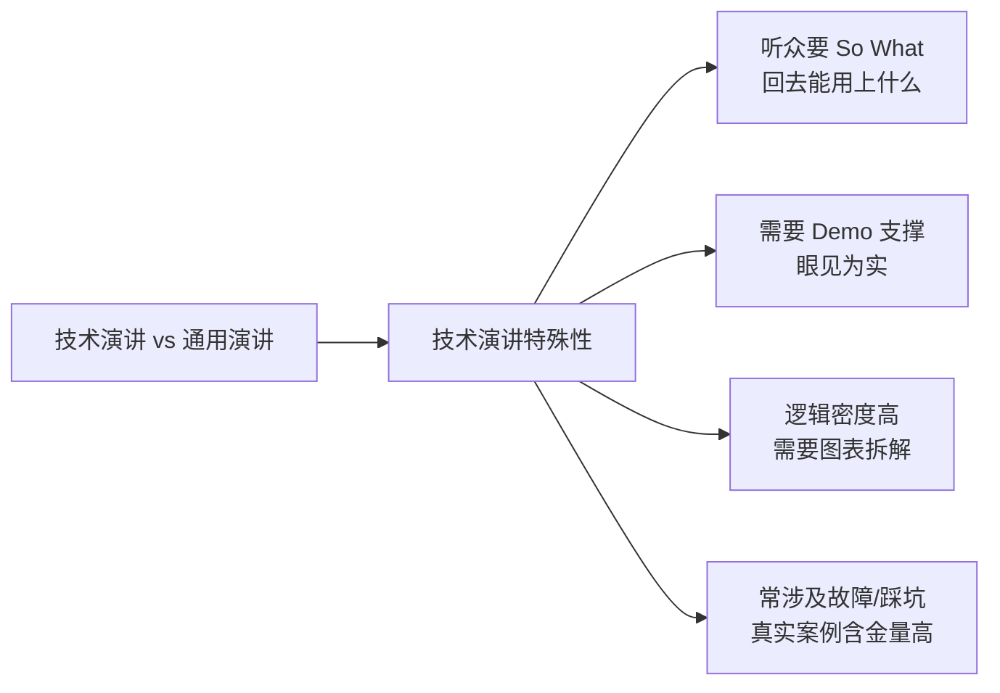
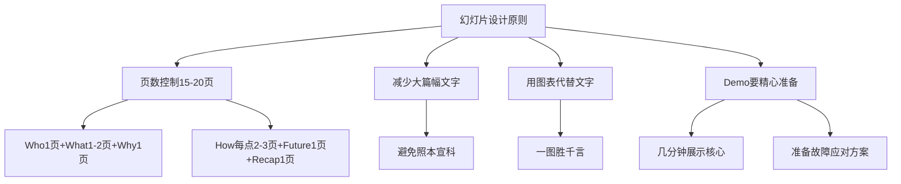
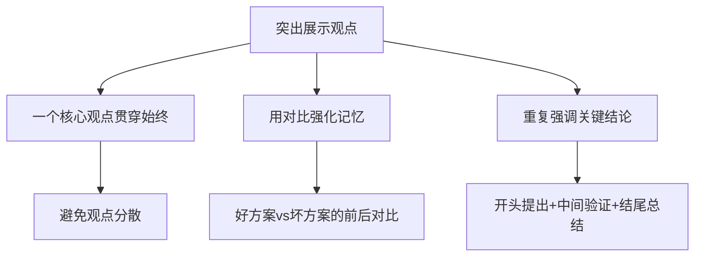
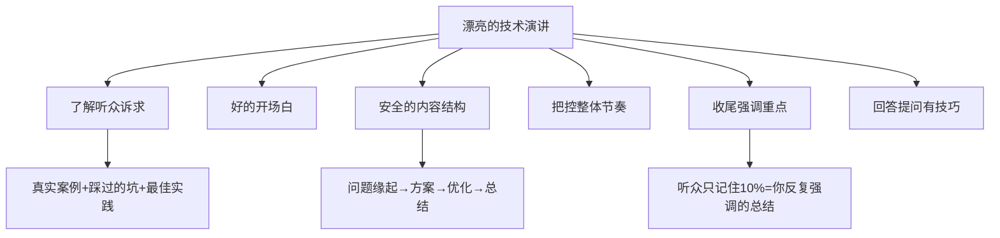
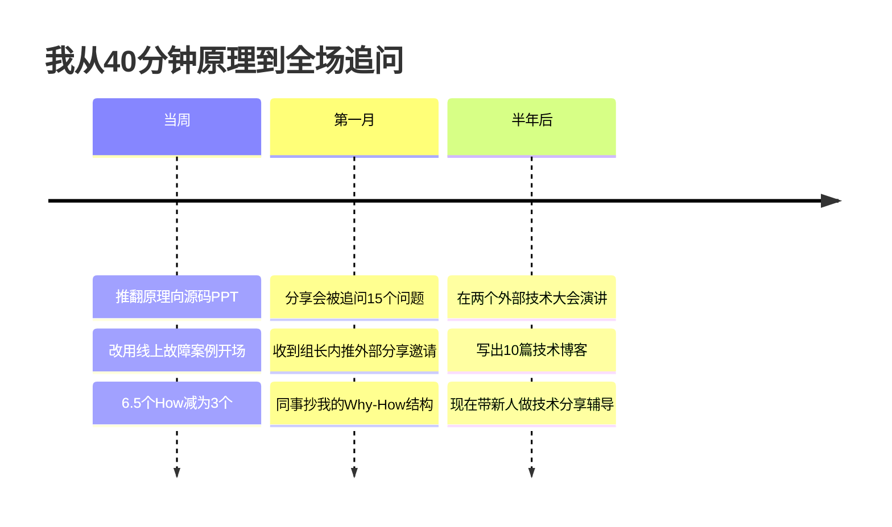
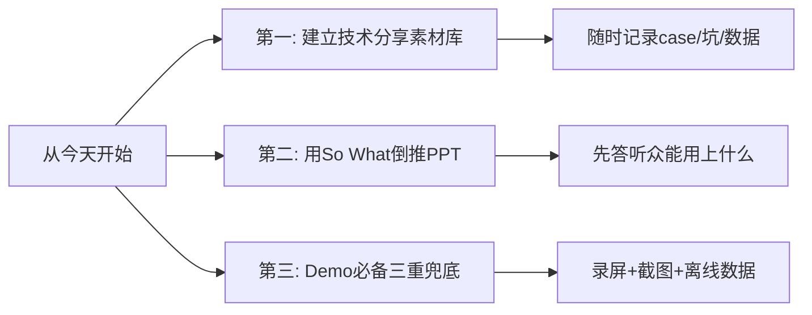

# 46.做好技术的演讲
#### 目录介绍

- [46.做好技术的演讲](#46做好技术的演讲)
      - [目录介绍](#目录介绍)
  - [01.讲了40分钟原理](#01讲了40分钟原理)
  - [02.技术演讲特殊性](#02技术演讲特殊性)
  - [03.技术类分享模板](#03技术类分享模板)
  - [04.技术PPT与Demo配合](#04技术ppt与demo配合)
  - [05.突出地展示观点](#05突出地展示观点)
  - [06.做一场漂亮演讲](#06做一场漂亮演讲)
  - [07.总结回顾这一节](#07总结回顾这一节)
  - [08.后来发生的改变](#08后来发生的改变)
  - [09.今天起改变三点](#09今天起改变三点)
  - [10.课后作业思考下](#10课后作业思考下)

> **📎 阅读提示**｜本章聚焦"**技术演讲**"的特有难点（模板/Demo/观点提炼）。关于**通用演讲的临场紧张、故事化、肢体语言、试讲训练**，请参见第 47 章《公众演讲的提升》，本章不再重复。

## 01.讲了40分钟原理

去年组里举办技术分享会，我准备讲一个开源框架的源码解析。我花了两周时间整理：底层原理、数据结构、调度算法、源码注释……做了 35 页 PPT。

分享当天我讲了整整 40 分钟，自我感觉非常硬核。结果 Q&A 环节，第一个举手的同事问：**"你讲的这些原理，对我们日常业务有什么用？"**

我愣了一下，磕磕巴巴答："这个……能帮你理解底层机制……" 同事不再追问，全场没人再有问题。**40 分钟的精心准备，换来一句"有什么用"和满场沉默。**

下一位是组里的另一位同事，他讲了 20 分钟。开场就讲一个故事：**"上周三凌晨 3 点，线上接口超时报警把我从被窝里拽起来——我们今天的主题，就是这次故障背后的那个坑。"**

全场瞬间安静——所有人想知道后来怎么了。他用"问题→排查→方案→踩坑→最佳实践"的结构讲完，**Q&A 环节被追问了 20 多个问题，整整延长了 20 分钟才结束。**

那次之后我才彻底想通：**技术演讲不是在炫技，而是在回答"听众回去后能用上什么"**。听众想要的不是 What（你做了什么），而是 So What（这对我有什么用）。下面这一篇，是我后来彻底重做技术分享的方法论。

## 02.技术演讲特殊性

**技术演讲的特殊之处，一共 4 条**：

1. **听众要 So What，不要 What**：技术人参加分享的动机永远是"我回去能用上吗？"——不像 TED 那样图个感动或启发，技术听众要的是**方法、代码、避坑指南**。
2. **必须有 Demo 或数据**：一个只讲概念的技术分享是无效的，**眼见为实**是行规。
3. **逻辑密度高**：架构图、时序图、性能对比表都需要清晰呈现，**图表能力**决定了半场胜负。
4. **真实案例最值钱**：一次线上故障、一个踩坑总结、一次架构演进——这些"血汗案例"才是技术演讲的核心资产。

明确了这 4 点差异，你就知道**技术演讲不能照搬 TED 演讲那套故事化模板**，需要一套技术专属的骨架。

## 03.技术类分享模板

在明确了主题之后，就需要设定好演讲的主线，对于技术类的分享，有一个相对固定的模式：

1. Who: 自我介绍，让听众了解自己，建立连接； 
2. What&When: 今天要分享的主题，通过简短介绍吸引听众的注意力、好奇心； 
3. Why: 为什么要做这个架构改造、技术升级，整个项目的背景是什么样的，结合对听众的了解，做特定的介绍； 
4. How: 深入浅出 3~4 个最核心的内容点，当然为了全面性，你可以都罗列出来，但介绍的重点建议控制在 3~4 项； 
5. Future: 让大家了解你未来的计划，你对技术趋势的看法等等； 
6. Recap: 对今天的主题再做一个回顾，让听众加深对核心内容记忆。

你可能会觉得，往往项目做完了，信息比较零散，一下要总结得这么有条理和全面很难，包括哪些是最值得分享的内容也不是马上就能全部列出来。

这里分享一个我自己的心得，我习惯写wiki，任何时候自己想到值得分享的内容都丢进去，包括收集到的数据、文档、代码片段等等。

当你的内容越来越丰富的时候，你就可以开始梳理这些case，一方面整理自己的思路，调整主线，另一方面看如何把这些case分布到主线的每一个环节，或者舍去。

对于初次演讲，或者特别重要的演讲场合，如果你想让演讲效果更好、避免紧张一时不知如何表达，逐字稿会给你带来巨大的帮助。

逐字稿能非常好地帮你组织语言，人的大脑非常不擅长做大量信息的前后逻辑处理，但文字和图表能非常高效地帮助你梳理逻辑关系。

使用逐字稿，要避免照本宣科，脑子里不停地回忆逐字稿下一句是什么，而是应该充分理解逐字稿的逻辑。

在演讲时，之前训练过程中脑子里不断预热过的关键词会按这个逻辑很流畅地释放出来，你会逐渐找到感觉，跟随这个感觉变得更投入，最后还能根据实际情况做临场发挥，越来越放松和自如。

## 04.技术PPT与Demo配合

多少页幻灯片合适？ 还是回到前面我们说的模式：

1. Who: 1 页 
2. What&When: 1~2 页 
3. Why: 1 页 
4. How: 展开 3~4 点，每点 2~3 页 
5. Future: 1 页 
6. Recap: 1 页

基本控制在 15~20 页的范畴，当然可以根据实际需要再增加，比如为了增加数据对比展示等。

对于技术分享，不太建议大量采用交互式的幻灯片，每句话一张幻灯片，频繁上下文切换，容易让听众分心。

而很多复杂的技术逻辑很难在精炼到每页一句话的同时又能让听众容易理解，这样会导致听众无法跟上你的节奏。

对于幻灯片的内容，建议减少大篇幅的文字，用最精简的文字加上图表来展示，不仅使得幻灯片清晰明了，也不会让听众觉得照本宣科。

可能大家也会注意到，平时听语音信息的速度比你看文字的速度要慢很多，而阅读文字又比从一个图获取信息要低效。

尤其在技术分享中涉及复杂逻辑和架构时，更需要注重图表来提高沟通效率，往往能达到一图胜千言的效果。

技术分享的另一个特点就是经常用到 Demo。**Demo 是技术演讲的杀手锏，做得好胜过千言万语，做砸了直接毁掉整场分享**：

- **有限时间内展示核心特点**：几分钟内让听众直观感受到技术价值，不要试图把所有功能都演示一遍。
- **多环节场景串联**：提前设计好 Demo 的场景切换顺序，避免频繁切窗口/切终端。
- **备好失败预案**：一定要准备录屏或截图，网络出问题、服务挂了、命令打错——**这些是"必然会发生"，不是"可能会发生"**。
- **Demo 之前先讲清 What & Why**：不要让听众看着屏幕猜你要演示什么，先用 30 秒说清"这个 Demo 会展示什么、为什么值得看"。

**关于通用演讲的临场紧张、试讲训练、肢体语言、赋比兴讲故事，参见第 47 章《公众演讲的提升》**。本章不再重复展开，接下来直接进入技术演讲的另一核心问题：如何让观点被听众记住。

## 05.突出地展示观点

在技术演讲中，最怕的就是听众听完后不知道你到底想说什么。突出展示观点的核心方法是"一个中心，多个支撑"：

首先，明确你这次演讲最核心的一个观点是什么，然后围绕这个观点展开3-4个支撑论据。每个论据讲完后，都要回扣到核心观点上，帮助听众强化记忆。

善用对比也是突出观点的好方法。比如展示优化前后的性能数据对比、方案A和方案B的优劣对比，通过直观的差异让听众感受到你方案的价值。

最后，在演讲的开头提出核心观点，中间用案例验证，结尾再次总结强调。这种"总分总"的结构能够最大程度地帮助听众记住你的核心信息。

## 06.做一场漂亮演讲

如同架构设计一样，了解需求永远是第一步的，任何脱离需求的架构设计都是耍流氓。参加技术大会的听众，主要是想学习知识，借鉴经验解决工作中的实际问题。

那么演讲嘉宾可以在 PPT 中针对性地准备这些内容：包括真实案例、碰到的问题、踩到的坑、尝试过的各种解决方案以及解决方案的优缺点、迭代演进和最佳实践等等。

技术演讲的开场，一个稳妥的公式是"**我是谁 + 我的从业经历 + 演讲对你的价值**"。技术听众最反感"绕圈子"，前 30 秒把这三件事讲完，观众才会决定要不要继续听你讲。

内容结构怎样组织会让人觉得比较有逻辑而不会显得无头无绪呢？按照"问题缘起 - 方案 - 优化方案 - 总结"这类"总分总"的结构来组织内容是比较安全的。

我们可以讲一下遇到了什么问题，问题产生的原因是什么，为了解决相应的问题，我们做了些什么，以及为什么要这么做。

然后，我们就可以展开描述解决方案的迭代过程、遇到过的矛盾冲突点，针对这些矛盾，介绍下有哪些传统的解决方案以及优缺点，之后再介绍递进方案和最佳实践。最后做一个总结。

内容框架搞定了，内容呈现也搞定了，接下来有些讲师会有疑问，"讲的内容这么多，时间不够用怎么办？"有的则表示，"很快就把准备的内容讲完了，好尴尬呀！怎么办？"这就涉及演讲节奏的把控问题了。

如何把控好演讲的整体节奏呢？个人经验是，人在紧张的情况下，语速会加快，导致演讲往往会比自己预计的时间更早结束。时刻提醒自己要放慢语速，会让听众觉得演讲人更稳重，也给了自己更多的思考时间。

演讲之前，我们一定要规划好每一页 PPT 要讲什么内容，哪些是要点，要讲多少分钟。技术大会有一个好处就是中途不会有听众打断你，演讲结束后才会统一提问，所以提前规划好的节奏一般不会被打乱。

随着演讲逐渐进入尾声，一场 40-50 分钟的演讲，由于涉及的架构、流程、方案等技术细节非常多，根据我的经验，第二天还能记得全部内容 10% 的听众少之又少。

听众记住的这 10% 是什么？除了开场灿烂的微笑，大部分就是收尾时演讲人"反复强调"的总结啦，所以最后的总结部分一定要重视。

总结部分的内容在精不在多，听众有收获就达到目的了。总结的时候可以反复强调结论、强调实践。要想让听众记住你期望他记住的 2-3 个关键点，以达到分享的目的，在收尾时的总结和强调就至关重要。

这个环节也是部分讲师比较头疼的，"万一碰上不会的问题怎么办？"我的个人经验是：首先，不要和提问者起冲突，特别是针对"你讲的我完全不赞同"这类观点。

可以表示"这是自己公司的实践，方案有很多，各有优缺点。"然后就可以马上转入"下一个问题"。还可以将问题技巧性地转化一下，比如说"这位朋友要问的是不是这样一个问题呢？"而转化后的问题正是自己擅长的。

还有一个大招，假如碰到让你比较尴尬的问题，你可以回答"这是个很好的问题，但几句话可能讲不清楚，感兴趣的话，我们线下交流。"这也是一种办法。

## 07.总结回顾这一节

**技术演讲不是炫技，而是回答"听众回去能用上什么"——Who/What/Why/How/Future/Recap 模板 + Demo 实证 + 突出观点 + 反复强调收尾。**

六个环节对照来看，各自的核心与常见错误分别是：**准备环节**——核心是了解听众要的 So What，常见错误是闭门造车、只讲 What；**内容环节**——核心是 3-4 个 How 加"总分总"结构，常见错误是塞太多内容、什么都想讲；**PPT 环节**——核心是多图少字、控制在 15-20 页，常见错误是大量文字堆砌导致照本宣科；**Demo 环节**——核心是眼见为实并备好失败预案，常见错误是现场翻车又无兜底；**收尾环节**——核心是反复强调 2-3 个关键结论，常见错误是虎头蛇尾、不做总结；**提问环节**——核心是不起冲突、技巧性转化，常见错误是和提问者争论。

**你应该带走的三件事**：

1. **听众导向**：先问"对听众有什么用"，再决定讲什么。
2. **结构模板**：技术分享用 Who-What-Why-How-Future-Recap，控制 15-20 页。
3. **Demo 兜底**：录屏、截图、离线数据准备齐全，永远假设现场会翻车。

## 08.后来发生的改变

那次失败后我把整份 35 页 PPT 全部推翻。这次我先问自己一个问题："**听众听完后，能在他们的工作里用上什么？**" 想清楚后我重新组织：用一个真实的线上故障案例开场（赋）、把底层调度算法类比成"地铁调度系统"（比）、最后升华到"任何分布式问题都可以用 X 思路解决"（兴）。**6 个 How 砍到 3 个。**

一个月后我用新方法重做了同主题的一次分享。20 分钟讲完，**Q&A 环节被追问了 15 个问题，组长当场发消息说"下季度大会我要内推你去讲"**。组里其他同事开始问我："你的'故障案例 + 类比'这个结构能不能教我用一下？"

半年后我在两个外部技术大会做了演讲，听众反馈都很好。同时我把每次分享的内容沉淀成博客，半年写了 10 篇。**那个曾经被问"有什么用"的人，现在成了组里专门辅导新人技术分享的"布道者"。** 我对每个新人说的第一句话总是："**先问听众能用上什么，再写第一页 PPT。**"

## 09.今天起改变三点

**第一件事：建立技术分享素材库**。在工作中遇到有趣的技术问题、踩过的坑、想出的巧妙方案，随时记录到你的 wiki 或笔记中。包括数据、文档、代码片段、架构图等。当你的素材越来越丰富时，你离一场好的技术演讲就越来越近。

**第二件事：用 So What 倒推 PPT**。做下一份技术分享 PPT 前，先在纸上写一句话："**听众听完后能在他们工作里用上什么？**"想不出来就先别打开 PPT——想清楚这一句，你的每一页 PPT 都会有意义。

**第三件事：Demo 必备三重兜底**。下次做 Demo 前，一定准备好：（1）录屏视频（真机演示挂了立刻放）；（2）关键步骤截图（截图能撑起半场）；（3）离线数据备份（网不通就用本地）。**"翻车预案"决定了你的技术演讲能不能称得上专业**。

## 10.课后作业思考下

1. 回忆你最近一次做技术分享或演讲的经历，用本章的框架评估一下：你做到了哪些？哪些地方可以改进？
2. 选一个你最近做的技术项目，用"Who-What&When-Why-How-Future-Recap"的模板梳理一遍，看看能否形成一个完整的分享提纲。
3. 找一份你熟悉的技术分享 PPT（自己的或同事的），用"So What"三个字审视每一页：这一页对听众有什么用？删掉所有答不上"So What"的页。
4. 在下一次需要做技术分享时，为你的核心 Demo 环节准备好"录屏 + 截图 + 离线数据"三重兜底，然后现场故意断网试一次，看看你能否稳定应对。

---

> **📎 下一站** ｜ 讲得漂亮的前提，是脑子稳得住。第 49 章开始进入"底层思维的训练"板块——从最稀缺的"专注"开始，一路走到情商。
