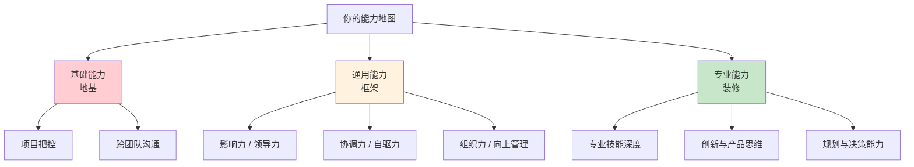

# 1.4 要带上技能地图

#### 目录介绍
- [01.看一个真实案例](#01看一个真实案例)
- [02.断点自测三问](#02断点自测三问)
- [03.晋升资本是什么](#03晋升资本是什么)
- [04.技能的四个层级](#04技能的四个层级)
- [05.三层能力的骨架](#05三层能力的骨架)
- [06.技能地图的价值](#06技能地图的价值)
- [07.具体化的原则](#07具体化的原则)
- [08.三步动手绘制](#08三步动手绘制)
- [09.一年后的复盘](#09一年后的复盘)
- [10.今天起改变三点](#10今天起改变三点)
- [11.课后作业思考下](#11课后作业思考下)

## 01.看一个真实案例

工作第五年，我去面试一家心仪的大厂。后半程面试官合上简历问："抛开简历，说说你在项目里具体做了什么？"我报出组件化开发、性能优化、并发处理一堆名词，他再追问："深入到什么程度？能独立承担什么量级的工作？"我瞬间卡住了。

我说不清 Java 到底"熟"到什么层级，也道不出高并发项目的具体 QPS 和我做过的优化动作。四十秒的沉默里，只剩空调送风的声响。最后面试官礼貌收尾，我知道这轮结束了。

坐在大楼外的马路牙子上，我想了整整一小时。工作五年，居然说不清自己到底会什么。不是能力单薄，而是我从未认真盘点过自己：误以为忙碌就是成长、项目数量等于技术深度、"感觉还行"就是实打实的实力。

当晚回家，我摊开一张 A3 纸，把五年接触过的所有技术点一一列下。看着纸上三十多个零散的技能词，我彻底愣住了——它们毫无体系，我分不清哪项能独立扛事、哪项只是浅尝辄止，更看不出什么是自己的核心壁垒。

那一刻我明白，**没有技能地图的人，就像大海里没有航海图的船长**。划桨再用力，也不知道自己身在何处，看不清前路的风口与暗礁。从那晚起，我画出了第一版属于自己的技能地图，今天想把这张地图的绘制、使用与迭代方法一步步讲给你。

## 02.断点自测三问

在往下读之前，请你花 30 秒对自己做三个"是 / 否"判断。

**第一问**：如果现在有面试官问你"你在过去三年具体做了什么、深到什么程度"，你能否 60 秒内说清楚，并给出可衡量的数字（如项目规模、QPS、团队规模、上线成果）？如果不能，你就断在**"存不下"**——能力散在日常里，从未被结构化保留。

**第二问**：你能否列出目前岗位所需的全部技能，并按"了解 / 掌握 / 熟练 / 精通"给自己打分？如果不能，你就断在**"看不清"**——认知模糊，无法评估自己与目标的差距。

**第三问**：你能否说出下一年最该突破的两项技能，并给出它们将从几分提到几分？如果不能，你就断在**"走不动"**——知道差距却不知道方向，学习没有优先级。

这一节主要解决"存不下"和"看不清"两断点；下一节《经营好自我公司》把"走不动"接完。

## 03.晋升资本是什么

很多人张口就是月薪要涨到多少、坐上什么职位、几年内赚多少钱。听完这些远大蓝图，不妨反问一句：你凭什么达成？你的资本是什么？

对职场人来说，晋升的核心资本从来不是野心，而是清晰的优势、技能与资源，也就是属于你的能力地图。当年那次面试之前，我以为自己"技术很全面"、"项目做得不少"、"人也踏实"——这些不是资本，是自我感觉。真到了面试台上，模糊的自我感觉一句都换不成筹码。

回头看，我发现自己那几年其实一直在四个坑里打转：对工作缺乏系统认知，遇到问题没有稳定的方法可以调用；想补短板但不知道自己缺什么、该从哪里入手；学了不少干货课程，落不了地也用不到项目上；学习时杂乱无章，不会归类沉淀，也始终找不到清晰的目标。这四条我全中，不是不努力学，而是学完的知识全在脑子里散堆着，从来没有被真正梳理归档过。

## 04.技能的四个层级

技能地图上每一格，都需要一把尺子来量。这把尺子由浅到深有四级——**了解、掌握、熟练、精通**。

**了解**是知其然，甚至知其所以然，不必上手但要有基本认知，例如"知道 Redis 是什么、用来干嘛"就属于这一级。**掌握**是硬技能，一上手就要会用，深度可以在实践中迭代，例如"能用 Java 独立写出增删改查功能"就属于这一级。**熟练**是大量训练后的深度掌握，不仅会用还能做好，例如"能独立完成一个完整项目"。**精通**在熟练之上再进一步，能讲清"为什么这么做"、能做对比分析，例如"能主导技术选型和架构设计"。

真正的两次质变发生在跨级的时候。第一次是**从"了解"到"掌握"**——很多人在"了解"这一层自我感觉良好，一被追问才发现是一知半解。当年我嘴上说"了解 Redis"，其实连持久化机制都没认真看过；直到某次线上事故 Redis 主从切换失败，我才被迫从"了解"跳到"掌握"，把 RDB 和 AOF 两个原理挨个读了一遍。第二次是**从"掌握"到"熟练"**——这一跨要靠刻意练习，有针对性地训练薄弱环节，而不是简单重复已经会的（第 14 章会详讲）。

精通之上其实还有第五层，叫**综合应用**——不是单一技能的精通，而是多个技能的融合。一个架构师需要同时精通编程、系统设计、性能优化、团队协作，才能做出真正好的架构方案。这一层不是学出来的，是做出来的。

## 05.三层能力的骨架

有了尺子还不够，还要有骨架。技能地图的骨架由三层能力构成，缺一层楼就撑不起来。

**基础能力**是职场立足的根基——项目把控与跨团队沟通。检验标准很简单：交给你一个完整的项目，你能不能从头到尾把它做好？我第五年最大的短板就在这里：写代码没问题，但让我独立把控一个跨三个团队、六个月周期的重构项目，我心里没底。

**通用能力**是让你从"做事的人"变成"能带人做事的人"的关键。影响力是部门级的口碑与话语权；领导力是预见并管理项目风险，推动项目上线；协调力是跨团队资源协调，能平衡多方利益；自驱力是无人督促下的自我管理，能主动发现并推动问题；组织力是把不同角色凝聚起来，把团队战斗力提上去；向上管理是与上级建立稳定反馈机制，在关键节点透传信息。这六项听起来务虚，可一旦真的当过一次项目负责人就明白：写代码的时间只占三成，剩下七成都在做这些事。

**专业能力**是你的核心竞争力。它包含四块：专业技能是对技术原理和业务的深度理解，创新能力是模块级的技术决策与系统级问题发现，产品思维是权衡需求、体验与实现之间的分寸，规划能力是制定并推动业务规划。这四块拉开的是"高级工程师"和"资深工程师"之间那道薪资分水岭。

**三者的关系**——基础能力是地基，通用能力是框架，专业能力是装修。地基不稳楼建不高，框架不好空间受限，装修不好别人不愿来。三者缺一不可，但在不同阶段的优先级不同：0-3 年重基础，3-8 年重通用，8 年以上重专业。

思维层次也跟着能力走，越是往上层，越吃"发现应用"层的思维。多数人的思维停留在"理解信息"——能看懂、能复述，但无法提炼出更深层的洞察。要往上走，需要刻意训练：每次学到新知识后逼自己回答三个问题——"这说明了什么？""和我之前知道的有什么关联？""我能用它做什么？"很多技术人员写代码没问题，可一到技术选型、架构决策就频频失误，就是因为思维还在"理解"层，缺少"判断和预测"的能力。

## 06.技能地图的价值

技能地图这个工具，最大的价值不在于记录你"会什么"，而在于让你清楚地看到你"缺什么"。**大多数人对自己能力的认知是模糊的，觉得自己"还行"却说不清"行"到什么程度**。技能地图把模糊的感觉变成可量化的评估——让职业发展从"凭感觉"变成"看数据"。

具体到操作层面，它有六个用途一句话讲清：**目标设定**看清当前水平与目标水平的差距；**需求分析**结合行业趋势确定哪些技能对未来重要；**现状评估**识别强项与短板，有的放矢；**路径规划**按优先级和依赖关系确定学习顺序；**进展追踪**记录已掌握技能、学习时间与成果；**动力激励**用可视化的进步换来成就感。

在选择投什么、学什么的时候，技能地图就是那把"二八定律"的筛子——**在你列出的所有技能中，20% 的关键技能决定了你 80% 的职场价值**。找出这 20%，把 80% 的精力集中在它们上，而不是平均用力。学习最怕的从来不是没有资源，而是资源太多不知道选什么；技能地图这个过滤器，帮你筛出最匹配当前需求的那几条学习路径。

## 07.具体化的原则

地图能不能用得起来，取决于你有没有把它拆到"可以直接开始学习"的粒度。技能地图上罗列的都是能力的抽象，落到日常还需要具体化才能上手。

举一个具体例子。针对移动端开发来说，"扎实的 Java 基础"是一个抽象能力，具体化就是把它拆成"掌握面向对象思想、熟练运用数据结构、掌握并发的知识"三块。但"掌握并发知识"依然太大，还可以继续拆成"理解线程模型 / 掌握锁机制 / 了解并发容器"这种可以直接开始学的单元。拆的原则是——**如果一个技能点还是太大、太模糊，就继续拆，直到你能看着它就知道下一小时该做什么**。

好的技能地图应该是"活的"，它随着你的成长不断进化。**建议每 6 个月做一次大更新**：删掉已经不需要的技能点，添加新出现的技能需求，重新调整各技能的优先级。你的技能地图，就是你职业发展的"活地图"。

## 08.三步动手绘制

技能地图不是画完就束之高阁的一张图，它是一个循环。整个循环拆下来就三步。

**第一步：列出所有技能，构建技能树**。把工作领域需要的技能逐一列出来，按"概念（需理解）/ 事实（需记忆）/ 过程（需练习）"三类展开，最好用思维导图工具（我当年用的是 XMind，现在很多人用飞书文档的画板也行）。以学骑自行车为例：概念下罗列"前灯 / 轮胎 / 头盔"，事实下罗列"交规 / 信号灯含义"，过程下罗列"上车 / 踩踏 / 刹车"。核心事项可以加亮，帮你保持专注。

**第二步：自评打分，形成基线**。给树上每一项按 0-3 四级打分——0 是不具备该项能力，1 是具备基本能力，2 是完全具备能力，3 是专家级、可以指导他人。**这一步的关键是诚实**——写"2"很爽，可如果心里知道自己其实是"1"，就诚实写"1"，不然你自己在骗自己。评完之后你会得到一张能力基线，一眼就能看到哪一格空着、哪一格发亮。

**第三步：制定提升计划，尤其关注 0 到 1 的突破**。基于基线，圈出最需要突破的两项——不是最想学的两项，是最短板的两项。为每项定一个"多长时间提升一个层级"的目标。**最容易踩的坑**是只收集数据却不复盘、不把地图用到后续的能力规划里——地图一旦变成摆设，就白画了。每 6 个月重新评估一次，让它保持活的。

## 09.一年后的复盘

那次面试失败的一周内，我在 A3 纸上画完了第一张技能地图：基础能力 5 项、通用能力 6 项、专业能力 9 项，一共二十格。

画完那一刻我愣住——原来我自认为"技术很全面"，其实是从来没有被强迫结构化过。地图画完以后一眼就能看到：基础能力里"项目规模把控"只有 1 分，通用能力里"向上管理"只有 0 分，专业能力里"高并发架构"只有 1 分。**那是我第一次不靠感觉、而是靠数据看到自己的短板**。

按"二八定律"我只挑了两项：**项目规模把控**（1 → 2）、**高并发架构**（1 → 2）。一个月之内我主动申请接下了一个跨团队的重构项目做"项目把控"的训练场；同时每周三个晚上系统读《高性能 MySQL》和公司内部的线上事故复盘库。以前我一个月什么都学、什么都没学深；现在一个月两条线，反而都往前推了一大步。

半年后我重新面那家之前拒我的大厂。面试官问了同样的问题："你到底会什么？"这次我没卡壳，我说："我的技能分三层——基础能力上，我能独立把控 3-5 人月级别的项目；通用能力上，我在向上管理和跨团队协调上做过两次实战；专业能力上，Java 生态到了精通，性能优化和大前端跨端都熟练，高并发架构正从熟练往精通迭代。"说完我把手机里的技能地图截图给面试官看了。

两周后我拿到了那份 offer，薪资涨了 45%。走出大厦的时候我想起半年前坐在马路牙子上流的汗——**决定你职场下限的，不是你会多少，而是你会不会把你会的说清楚**。

一句话核心：**技能地图不是一张展示你会多少的奖状，而是一张告诉你接下来该朝哪儿走的导航图**。

你应该带走三件事。第一，**四维分级**——了解 / 掌握 / 熟练 / 精通，自己给每项技能贴标签，梳理简历、准备述职之前先拿它做一次尺子。第二，**基础 / 通用 / 专业三层不缺一**，地基、框架、装修，缺哪一层都撑不起职场竞争力，判断下阶段该往哪里发力的时候用它。第三，**6 个月更新一次**——地图是活的，每半年删旧加新一次，把它变成你半年度复盘的固定动作。

## 10.今天起改变三点

**第一点，今天就画。**今天就花 1 小时，把你当前岗位和目标岗位所需的所有技能列出来，用思维导图形式呈现。先列大的能力模块（基础 / 通用 / 专业），再逐步细化到具体技能点。不求一次完美，先搭好框架，后续持续迭代。

**第二点，今天就打分。**参考四级评估体系（0-不具备、1-基本、2-完全具备、3-专家级），给技能地图上的每一项打分。诚实地标记所有 0 分和 1 分的项目，这些就是你当前最需要突破的短板；同时也标记出 3 分的项目，这是你的护城河，要继续保持。

**第三点，今天就圈出下半年。**根据自评结果，运用"二八定律"筛选出最重要的两项需要提升的技能，为每项定一个具体的学习计划——明确资源、时间投入和阶段性目标。6 个月后重新自评，检验提升效果，再滚动制定下一轮。

## 11.课后作业思考下

**第一题 · 晋升资本盘点 + 技能维度自测**：列出你目前拥有的 5 项最有价值的技能，按"了解 / 掌握 / 熟练 / 精通"四个维度打分；再列出目标岗位需要但你还不具备的 5 项能力。这个分布是否与你的工作年限匹配？最紧迫需要补齐的是哪一项？

**第二题 · 思维层次自检**：选一个你最近完成的项目，用"理解信息 / 概括洞察 / 发现应用"三个层次来复盘。你在哪个层次投入最多？是否跳过了概括洞察直接进入执行？下一个项目里，你打算怎么有意识地训练更高层次的思维？

**第三题 · 护城河推演**：假设明天你所在的公司突然倒闭，你要在一周内找到新工作。你会用哪些技能和经验来打动面试官？这些就是你的"护城河"。如果你觉得底气不足，说明你需要在哪些方面加强积累？请把这份清单加进你的技能地图 v2。

---

> **📎 下一站** ｜ 地图有了，还得学会经营。下一节我们把"自己"看作一家公司，用经营者的视角重新盘一遍你的时间、产品和口碑。
