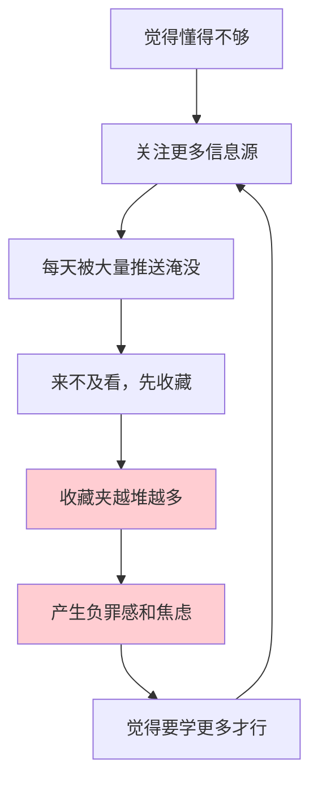

# 2.3 建立优质信息源

#### 目录介绍
- [01.看一个真实案例](#01看一个真实案例)
- [02.先来说一个场景](#02先来说一个场景)
- [03.信息为什么要分层](#03信息为什么要分层)
- [04.一手二手三手怎么分辨](#04一手二手三手怎么分辨)
- [05.怎么评估一个信息源](#05怎么评估一个信息源)
- [06.搭建你的信息源清单](#06搭建你的信息源清单)
- [07.信息源的定期清理](#07信息源的定期清理)
- [08.这几个坑我踩过](#08这几个坑我踩过)
- [09.后来发生的改变](#09后来发生的改变)
- [10.今天起改变三点](#10今天起改变三点)
- [11.课后作业思考下](#11课后作业思考下)

## 01.看一个真实案例

我有个前同事叫阿杰，是我们组公认"最爱学习"的人。

他的手机里关注了 47 个公众号，知乎关注了 300 多个话题，B 站收藏夹分了 12 个分类，每天通勤两小时全部用来刷内容。他还有一个特别夸张的习惯——**看到好文章先收藏，然后继续刷**，他说这叫"先存着，周末统一看"。

三年下来，他的收藏夹里有 2100 多篇文章。

去年年底他离职前跟我吃饭，说了句让我印象很深的话：

> "我这三年看了那么多东西，可你要我现在讲清楚任何一个领域，我都讲不出来。我感觉自己什么都知道一点，又什么都不知道。"

更讽刺的是，那顿饭他还在不停地刷手机，边刷边说"这条不错，先收藏"。

我当时就问他一句：**你收藏的这两千多篇，你记得住几篇的标题？**

他想了半天，说："……大概三篇吧。"

**2100 篇进去，3 篇留下来，转化率 0.14%。**

这个数字让我脊背发凉，因为我知道——**曾经的我自己，也是这样的**。

## 02.先来说一个场景

信息焦虑的本质，是一个**越努力越焦虑**的死循环：

注意这个循环里最要命的一环：**收藏这个动作，会给你一种"我已经学了"的错觉。**

心理学上这叫"**替代性完成**"——当你把一篇文章放进收藏夹，大脑会错误地把"保存"当成"掌握"，于是焦虑暂时缓解了，学习的动力也随之消失。

所以**收藏夹越满，人越虚**。

要打破这个循环，靠"少刷一点"是没用的（那是反人性的，坚持不过三天）。真正有效的做法是——**从源头上控制进来的是什么**。

这就是本节的主题：**建立优质信息源**。

## 03.信息为什么要分层

绝大多数人的信息源是一锅粥——公众号、朋友圈、短视频、技术博客、行业群聊，全都混在一起，谁推给我我就看谁。

这样做的后果是：**你分不清哪些是可以用来做决策的，哪些只是用来打发时间的。**

我的做法是把信息源分成三层：

| 层级 | 定义 | 典型例子 | 我的时间分配 |
|------|------|---------|-------------|
| **一手信息源** | 信息的原始出处，未经他人转述 | 官方技术文档、学术论文、原始财报、开源代码、一线亲历者的复盘 | **60%** |
| **二手信息源** | 对一手信息的加工、解读、整合 | 技术解读文章、书评、行业报告、体系化的课程、优质专栏 | **30%** |
| **三手信息源** | 二手信息再加工，或纯粹的情绪内容 | 营销号转载、标题党、短视频速览、"三分钟读完 XX" | **10%** |

核心原则只有一句话：**越往上走，信息越接近事实；越往下走，信息越接近情绪。**

而大多数人 80% 的时间，都花在了最下面那一层。

## 04.一手二手三手怎么分辨

理论好懂，难的是实操。给你四个快速判断的问题：

**① 它有没有告诉你"出处"？**

一篇文章说"研究表明， multitasking 会降低 40% 效率"，却不说这是哪篇研究、样本多大、谁做的——**它就是三手信息**。

有明确出处的，才有资格进入候选。

**② 作者是"在场"还是"听说的"？**

判断标准很简单：作者是**亲自做过这件事**，还是**看别人做过然后写出来的**。

- 一个做过千万级并发架构的人写的高并发文章 → 一手
- 一个从没写过代码的人整理的"高并发入门 10 讲" → 三手

**③ 它的结论能不能被验证？**

"这个方法能提升效率"——不可验证。
"我们用这个方法把接口响应时间从 800ms 降到 120ms，压测数据如图"——可验证。

**可验证的信息才值得你花时间。**

**④ 它是在传递信息，还是在传递情绪？**

如果一篇文章让你读完之后的感受是"愤怒""焦虑""爽"，但你想不起来它到底说了什么事实——**你刚刚消费的是情绪，不是信息**。

一个简单的自测：**读完后，你能不能用一句话复述它的核心事实？**

复述不出来，就是情绪内容。

## 05.怎么评估一个信息源

知道怎么分辨层级之后，还需要一套评分标准，来判断"这个信息源值不值得长期订阅"。

我用这五个维度打分，每项 0-2 分，满分 10 分：

| 维度 | 0 分 | 1 分 | 2 分 |
|------|------|------|------|
| **可溯源** | 从不给出处 | 偶尔给，含糊 | 几乎每篇都有明确出处 |
| **有立场但诚实** | 有隐藏利益，从不声明 | 利益相关时会提一句 | 主动声明立场和局限 |
| **可验证** | 全是观点，无法验证 | 部分有数据 | 结论都配可复现的数据/案例 |
| **时效性** | 内容长期过时 | 时好时坏 | 稳定更新，标注时间 |
| **信息密度** | 2000 字只有 1 个观点 | 中等 | 几乎没有废话 |

**评分标准：**

- **8 分以上**：设为"必读"，更新即看
- **5-7 分**：放入"选读"，标题感兴趣才点
- **4 分以下**：直接取关，别犹豫

我按这个标准清理过一次，47 个公众号最后只剩 9 个。但说实话，**剩下这 9 个带给我的东西，比原来那 47 个加起来还多**。

## 06.搭建你的信息源清单

知道标准了，接下来是落地。给你一个可以直接抄的模板：

**第一步：按领域分组**

不要按平台分（公众号/知乎/B站），要按**你要解决的问题**分。

比如我当时分了四组：

| 领域 | 我要解决什么问题 | 一手源 | 二手源 |
|------|----------------|-------|-------|
| 移动架构 | 怎么把 App 做得更稳 | 官方文档、AOSP 源码、Google I/O | 3 个技术专栏 |
| 团队管理 | 怎么带 10 个人的团队 | 无（管理没有一手源） | 2 个管理专栏 + 3 本书 |
| 个人成长 | 怎么学得更有效 | 认知科学论文 | 2 个优质 Newsletter |
| 行业动态 | 知道在发生什么 | 各公司财报 | 1 个行业周报 |

**第二步：每组控制在"3+3"以内**

每个领域最多 3 个一手源 + 3 个二手源。

**这不是随便定的数字**。一个人的有效阅读带宽有限，每组超过 6 个，你就必然开始"收藏而不读"。

**第三步：给每个源标注"检查频率"**

- 日报类：每天扫一眼标题
- 周刊类：周末集中看
- 文集类：遇到问题时再去翻

**频率是信息源的命门。** 一个每天更新的号你只在周末看，等于没订；一个季度更新的专栏你每天去刷，纯属浪费时间。

## 07.信息源的定期清理

信息源会"变质"。

一个两年前很优质的号，可能换了运营、接了广告、作者转型了，质量一落千丈——**但因为你订阅得早，你还在习惯性地看它**。

所以必须建立清理机制。我的做法：

**① 季度大扫除（每季度末，1 小时）**

打开你的订阅列表，对每个源问三个问题：

1. 过去三个月，这个源给我提供过**至少一条我真正用到的东西**吗？
2. 如果我今天才第一次看到它，我**还会订阅吗**？
3. 它最近 10 条内容里，**有几条我是完整看完的**？

三个问题里有两个答不上来 → **取关**。

**② 30 天规则**

任何信息源，如果连续 30 天你都只是"打开又关掉"而没有完整读完一条内容——**说明你的需求已经变了，退订**。

不要有"说不定以后有用"的想法。**以后有用的东西，你到时候一定找得到**（而且那时的信息质量会更好）。

**③ 退出成本要低**

很多人不清理，是因为觉得"万一错过重要信息怎么办"。

给你一个解药：**保留入口，取消推送。**

比如把公众号设为"不看更新"，把 Newsletter 改成"季度归档邮件"，把群聊设为免打扰——**需要的时候你还能找到它，但它不再占用你每天的注意力**。

## 08.这几个坑我踩过

**坑一：以为"越多越全"。**

我曾经觉得关注得越多，信息越全面。后来发现恰恰相反——**源越多，噪音越大，你错过真正重要信息的概率反而更高**。

信号淹没在噪音里，等于没有信号。

**坑二：非一手不看。**

矫枉过正也不对。一手指信息虽然准确，但**密度低、门槛高**。一篇论文 30 页，核心结论可能只有一段。

正确姿势是：**用二手源发现，用一手源验证。**

看到二手文章说"研究表明 XX"，如果它对你很重要，就去找到那篇原始研究，**花 10 分钟看它的摘要和结论**。这一步能过滤掉至少一半的误读。

**坑三：把"收藏"当成"建立信息源"。**

收藏是一次性的，信息源是**持续供给**的。

一个一年更新两次但每次都是干货的源，价值远高于一个每天推送十条但全是可有可无内容的源。

## 09.后来发生的改变

说说我自己做完这套清理之后的变化。

**清理前**：47 个公众号，每天刷 2 小时，年底说不清学到了什么，长期处于"我是不是又落后了"的焦虑里。

**清理后**：9 个核心源 + 若干"按需查阅"的归档源，每天 30 分钟，一年下来：

- 完整读完的书从每年 3 本变成 12 本
- 收藏的文章从 700 多篇降到 80 多篇，**但回看率从 2% 提升到 60%**
- 每季度能产出 2-3 篇自己的技术总结（以前一年写不出一篇）

最关键的一点：**我不再焦虑了。**

因为我清清楚楚地知道，我的信息来自哪里、质量如何、有没有遗漏——**确定感取代了焦虑感**。

## 10.今天起改变三点

如果你只想做三件事，做这三件：

**第一，今天就删掉一半信息源。**

不用纠结删哪个，先用"4 分以下直接取关"的标准过一遍。你会惊讶地发现，删完之后**什么都没错过**。

**第二，给剩下的每个源标注"一手/二手/三手"。**

标注完你会发现，自己 80% 的时间花在了三手信息上。**看见问题，就解决了一半。**

**第三，设一个季度提醒，定期大扫除。**

就在日历里建一个每季度重复的事件，1 小时。这一小时是你一年里**性价比最高的投资之一**。

## 11.课后作业思考下

1. 打开你的订阅列表，数一数一共有多少个信息源？过去一个月，你完整看完过其中几个的内容？
2. 挑出你最常看的 3 个源，用"可溯源/有立场/可验证/时效性/信息密度"五项打分，它们各得几分？
3. 找出你最近收藏的 10 篇文章，**它们的原始出处分别是什么**？能找到出处的有几篇？
4. 如果从现在起，你只能保留 5 个信息源，你会留哪 5 个？为什么？

---

> 上一篇：[2.2 体系思维很重要](./02.体系思维很重要.md) ｜ 下一篇：[2.4 卡片笔记写作法](./04.卡片笔记写作法.md)
