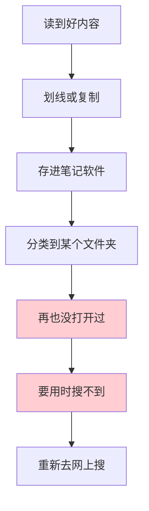

# 2.4 卡片笔记写作法

#### 目录介绍
- [01.看一个真实案例](#01看一个真实案例)
- [02.先来说一个场景](#02先来说一个场景)
- [03.卢曼的卡片盒](#03卢曼的卡片盒)
- [04.三种笔记的本质区别](#04三种笔记的本质区别)
- [05.永久笔记到底怎么写](#05永久笔记到底怎么写)
- [06.卡片之间怎么连起来](#06卡片之间怎么连起来)
- [07.用什么工具搭](#07用什么工具搭)
- [08.这几个坑我踩过](#08这几个坑我踩过)
- [09.后来发生的改变](#09后来发生的改变)
- [10.今天起改变三点](#10今天起改变三点)
- [11.课后作业思考下](#11课后作业思考下)

## 01.看一个真实案例

先讲一个真实存在的人。

尼克拉斯·卢曼（Niklas Luhmann），德国社会学家。他在不到 30 年的学术生涯里，写了 **70 多本书、400 多篇学术论文**——这个数字，大概相当于一个普通教授十辈子的产出。

有人问他怎么做到的，他的回答出乎意料地平淡：

> "我从不强迫自己做任何不情愿做的事，我只做对我来说容易的事。当我卡住时，我就去做别的。"

真正的秘密在他身后才被发现——他留下了一个**装有 9 万张卡片的木盒**。

这些卡片不是读书笔记，不是摘抄，而是一个**会自己生长的思想网络**。卢曼写书的时候，不是从空白页开始"憋"，而是去卡片盒里翻——**发现某几条卡片之间能串起来，一篇文章的骨架就有了**。

我当时看到这个故事的第一反应是：这跟我有什么关系？我又不当教授。

第二反应是：等等，**我缺的从来不是"写不出来"，而是"没东西可写"**。

以前我写技术总结，每次都对着空白文档发呆两小时。而卢曼的做法相当于——**你平时就一直在写，只是写成一个个小卡片，到要输出的时候只需要拼接**。

这个思路彻底改变了我记笔记的方式。

## 02.先来说一个场景

先看看大多数人（包括曾经的我）是怎么记笔记的：

这条链路的问题出在哪？

**出在"保存"这一步被当成了终点。**

你以为你存下来的是知识，实际上你存下来的只是**别人的一段话**。它没有被你消化，没有和你的其他知识产生关系，也没有变成"你的东西"。

这就是为什么你的笔记软件里有几千条内容，但你写东西的时候还是一片空白——**因为那里面没有一条真正属于你**。

## 03.卢曼的卡片盒

卢曼的卡片盒（Zettelkasten，德语"卡片盒"）有三个反直觉的设计：

**① 每张卡片只写一件事**

不是"第三章笔记"，而是"**一个想法**"。

一张卡片 = 一个完整的、可以独立存在的最小想法单元。

**② 卡片必须用自己的话写**

抄录原文不叫笔记，叫搬运。

你必须**把它翻译成自己的语言**——这个翻译的过程，才是真正的学习。

**③ 卡片的重点不是"存"，而是"连"**

卢曼的卡片上有编号（如 21/3a、21/3b），编号的作用不是分类，而是**表示"这张卡片跟哪张有关"**。

新卡片进来时，他会主动去找：**它和已有的哪些卡片能搭上关系？**

**这三条加起来，才是真正的"知识网络"。**

## 04.三种笔记的本质区别

卡片笔记法把笔记分成三类，这个分类是整套方法的核心：

| 类型 | 是什么 | 处理方式 | 寿命 |
|------|--------|---------|------|
| **闪念笔记** | 脑子里一闪而过的想法 | 随手记下，**1-2 天内必须处理完** | 临时 |
| **文献笔记** | 读书/读文章时的笔记 | 记在文献旁，带上出处，**作为原料** | 中期 |
| **永久笔记** | 经过自己消化、能独立存在的想法 | 用自己的话写完整，存入卡片盒，建立链接 | **永久** |

绝大多数人的问题在于：**只做闪念笔记和文献笔记，从来不做永久笔记。**

于是笔记永远停留在"原料"状态，没有一道工序把它加工成"成品"。

**一个判断标准：**

如果你记的笔记，三个月后翻出来完全看不懂当时为什么记——**那它就只是闪念笔记，不是永久笔记**。

## 05.永久笔记到底怎么写

这是最关键的实操部分。一条合格的永久笔记，需要满足四个条件：

**① 原子化：一张卡片只讲一件事**

反例：

> "今天读了《思考，快与慢》，讲了系统1和系统2，还提到了锚定效应和可得性偏差，对我很有启发。"

这张卡片什么都讲了，等于什么都没讲。

正例（拆成三张）：

> 卡片 A：系统1是快速、自动、无意识的思考；系统2是缓慢、需要刻意启动的思考。人们 95% 的时间在用系统1。
> 卡片 B：锚定效应——人做判断时会被最先接触到的数字影响，即使那个数字明显无关。
> 卡片 C：可得性偏差——人会根据"容易想起来"来判断概率，所以空难比糖尿病更让人害怕。

**② 用自己的话写，写完整**

不要写"参见某某书第几章"，要写**完整的句子**，让三个月后的你（或者一个完全没读过那本书的人）也能看懂。

这一步很难，因为它要求你**真的理解了**——**写不清楚，就是没想清楚**。

**③ 标清楚来源**

> 来源：《思考，快与慢》第 8 章 / 原文页码 P128

不是为了引用，而是为了**将来能回溯**。

**④ 写完就问一句：它跟什么有关？**

这是卡片盒的灵魂。

每写一张新卡片，花 30 秒想：**我卡片盒里有没有跟它相关的？** 有就建立链接。

**这 30 秒，是整件事的价值所在。**

## 06.卡片之间怎么连起来

链接不是随便加的，有三种高质量的连法：

**① 承接关系（A 是 B 的前提/延伸）**

> 卡片 A：人的工作记忆容量有限（约 7±2 个组块）
> 卡片 B：所以教学时应该"分块"呈现信息，一次不超过 5 个

**② 对比关系（A 和 B 说的是同一件事的两个面）**

> 卡片 A：间隔重复利于长期记忆
> 卡片 B：集中练习短期效果好但遗忘快
> → 互相对比，共同支撑"为什么要分散学习"

**③ 冲突关系（A 和 B 互相矛盾）**

> 卡片 A：专注单一领域才能精通
> 卡片 B：跨界迁移能带来创新
> → **冲突是最有价值的链接**，它逼你去找边界条件："在什么情况下 A 对？什么情况下 B 对？"

**卢曼说过一句话我很认同：**

> "只有当一张卡片和别的卡片产生联系时，它才开始变得有用。"

## 07.用什么工具搭

很多人卡在这一步，纠结用什么软件。我的建议非常明确：**工具不重要，简单最重要。**

| 方案 | 适合谁 | 优点 | 缺点 |
|------|-------|------|------|
| **纯文本 + 文件名编号** | 极简主义者 | 永不过时，检索快 | 链接要手动维护 |
| **Obsidian / Logseq** | 想要双向链接的人 | 双链、图谱、本地存储 | 有一点学习成本 |
| **Notion / 语雀** | 团队协作 | 数据库能力强 | 依赖网络，迁移麻烦 |
| **纸质卡片盒** | 卢曼原教旨 | 最符合原始设计 | 检索不便 |

我自己用的是**纯文本 + Obsidian**，理由很简单：**纯文本意味着 20 年后我还能打开它**。

**最小可行方案（推荐你今天就这么做）：**

1. 建一个文件夹叫 `cards`
2. 每篇笔记一个 `.md` 文件，文件名用 `YYYYMMDD-简短标题.md`
3. 文件开头写来源，正文写你的理解
4. 文中提到别的卡片时，用 `[[文件名]]` 链接

**就这样。** 不需要插件，不需要模板，不需要花里胡哨的看板。

真正重要的是**你有没有坚持写**，而不是你用什么写。

## 08.这几个坑我踩过

**坑一：把卡片盒当成收藏夹。**

我一开始疯狂地往里塞摘录，一个月存了 300 多条，感觉很充实。

三个月后回头看，**一条都想不起来**——因为我存的还是"别人的话"，不是"我的想法"。

判断标准：**这条笔记里有"我的判断"吗？** 没有，就别存。

**坑二：过度追求分类体系。**

我曾经花了整整一个周末设计分类树：技术/管理/成长/……下面再分三层。

结果每次存笔记都要纠结"这该放哪"，**最后干脆不存了**。

卢曼的洞见是：**放弃分类，改用链接。**

分类是树状的，现实知识是网状的。**用树去装网，注定装不下。**

**坑三：想一次性搭好完美系统。**

这是拖延症最爱的伪装。

开始的时候，你的卡片盒会很丑、很乱、链接很少——**这是正常的**。卢曼的第一张卡片也是从零开始的。

**先记 100 张再说优化的事。**

## 09.后来发生的改变

我用这套方法两年半，最大的三个变化：

**变化一：写东西不再需要"憋"。**

以前写一篇技术文章要 8 小时，其中 5 小时在找素材和理思路。

现在我会先去卡片盒里搜关键词，把相关卡片拖出来摊在面前——**骨架立刻就有了**，剩下的只是串联和补充。写同样的文章，现在 2 小时能完成。

**变化二：想法会自己冒出来。**

这是最神奇的一点。当你的卡片之间有了足够多的链接，你会发现**两个从没想过要放在一起的领域，突然能互相解释**。

我有一篇关于"技术债管理"的文章，灵感来自一张讲"复利"的卡片。**它们本来毫无关系，是链接让它们相遇了。**

**变化三：不再害怕遗忘。**

以前学完东西总担心忘了。现在我知道：**只要它进了卡片盒，并且和别的东西连上了，我就不会真的失去它。**

这种安全感，让我敢于去学更多"暂时用不上"的东西。

## 10.今天起改变三点

**第一，今天写你的第一张永久笔记。**

就一张。挑你今天学到的最有感触的一个点，用自己的话写 3-5 句话，标上来源。

**不要想着搭系统，先写一张出来。**

**第二，给这张卡片找至少一个"邻居"。**

问自己：它和我已知的什么东西有关？把那个东西也写成一张卡片，然后建立链接。

**有链接的卡片，才算真正进入了你的知识网络。**

**第三，定一个"清闪念"的固定时间。**

每天下班前 10 分钟，把今天记的闪念笔记处理掉——能变成永久笔记的就写完整，不能的就删掉。

**闪念笔记不过夜，这是整套方法能持续运转的关键。**

## 11.课后作业思考下

1. 打开你的笔记软件，随便翻 10 条笔记，有多少条是"自己的话"，有多少条是"复制粘贴"？
2. 挑一篇你最近读过的文章，试着把它拆成 3 张独立的原子卡片，每张只讲一个点。
3. 找出你笔记里两条看起来完全无关的内容，**试着找出它们之间的一种联系**（承接/对比/冲突都行）。
4. 如果你现在要写一篇关于"你最熟悉的领域"的文章，你的笔记里能直接拿来用的素材有几条？

---

> 上一篇：[2.3 建立优质信息源](./03.建立优质信息源.md) ｜ 下一篇：[3.1 宏观学习的方法](../04.学习方法/01.宏观学习的方法.md)
