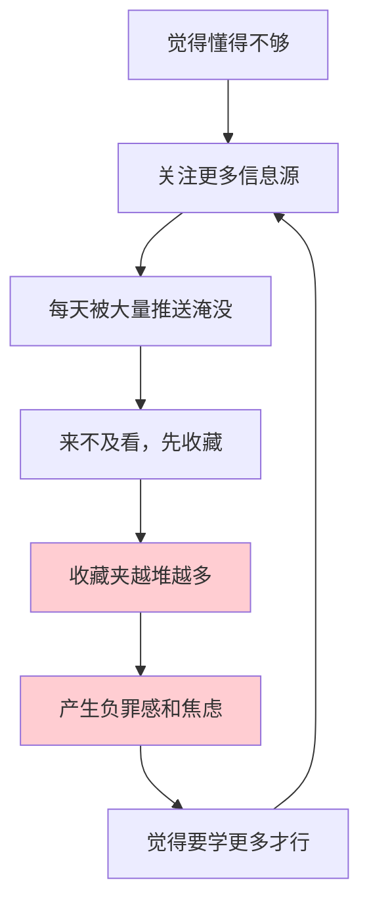
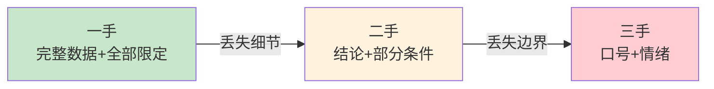

# 2.3 建立优质信息源

#### 目录介绍
- [01.看一个真实案例](#01看一个真实案例)
- [02.断点自测三问](#02断点自测三问)
- [03.先来说一个场景](#03先来说一个场景)
- [04.信息为何要分层](#04信息为何要分层)
- [05.一手二手和三手](#05一手二手和三手)
- [06.怎么评估信息源](#06怎么评估信息源)
- [07.搭建信息源清单](#07搭建信息源清单)
- [08.信息源定期清理](#08信息源定期清理)
- [09.这几个坑我踩过](#09这几个坑我踩过)
- [10.后来发生的改变](#10后来发生的改变)
- [11.今天起改变三点](#11今天起改变三点)
- [12.课后作业思考下](#12课后作业思考下)

## 01.看一个真实案例

我有个前同事叫阿杰，是我们组公认「最爱学习」的人。

他的手机里关注了 47 个公众号，知乎关注了 300 多个话题，B 站收藏夹分了 12 个分类，每天通勤两小时全部用来刷内容。他还有一个特别夸张的习惯：**看到好文章先收藏，然后继续刷**，他说这叫「先存着，周末统一看」。三年下来，他的收藏夹里攒了 2100 多篇文章。

有一年年底他离职前跟我吃饭，说了句让我印象很深的话。

> 「我这三年看了那么多东西，可你要我现在讲清楚任何一个领域，我都讲不出来。我感觉自己什么都知道一点，又什么都不知道。」

更讽刺的是，那顿饭他还在不停地刷手机，边刷边说「这条不错，先收藏」。我问他：**你收藏的这两千多篇，你记得住几篇的标题？**他想了半天，说：「大概三篇吧。」

我不死心，拉着他从 2100 多篇收藏里随机抽了 100 篇，一篇一篇过：

| 随机抽样 100 篇的下场 | 数量 | 占比 |
|----------------------|------|------|
| 当时完整读过、现在还能说出大概内容 | 4 篇 | 4% |
| 打开过，读到一半放弃 | 13 篇 | 13% |
| 标题眼熟，内容零印象 | 41 篇 | 41% |
| 连「收藏过它」这件事都不记得 | 42 篇 | 42% |

**42% 的收藏，连「被收藏过」这件事都被忘记了**。而有印象的那 4 篇里，说得出标题的正好 3 篇，和他的估计刚好对上。

**2100 篇进去，3 篇留下来，转化率 0.14%**。

这个数字让我脊背发凉，因为**曾经的我自己，也是这样的**。

## 02.断点自测三问

在往下读之前，先做三道判断题。任意一题命中，这一节就值得你认真读完。

| 断点 | 自测题 | 症状描述 |
|:----:|:------|:--------|
| 源太多 | 你订阅的公众号、知乎、Newsletter、群聊，加起来多少个？超过 30 个？ | 输入过载：多而失控 |
| 出处模糊 | 随便挑最近印象最深的一个技术观点，你说得出它的原始出处（论文/文档/代码/复盘）吗？ | 层级混乱：只吃三手 |
| 从不清理 | 上一次「取关一批订阅」是什么时候？超过半年没动过？ | 系统僵死：进多出少 |

三道题依次对应本节的三条主线：**上游筛选（分层）、单条判定（评估）、系统维护（清理）**。你在哪一条上薄，就重点看那一段。

## 03.先来说一个场景

信息焦虑的本质，是一个**越努力越焦虑**的死循环：



这个循环里最要命的一环：**收藏这个动作，会给你一种「我已经学了」的错觉**。

心理学上这叫「**替代性完成**」，把一篇文章放进收藏夹，大脑会错误地把「保存」当成「掌握」，焦虑暂时缓解，学习的动力随之消失。更深一层，「保存」还关闭了大脑那盏「未完成」的提示灯（蔡格尼克效应）：一篇「该读而没读」的文章本来会一直硌着你，点一下收藏，大脑立刻盖章「此事已了结」。它从待办，变成了永远不会再想起的事。

所以**收藏夹越满，人越虚**。

不确定自己是不是这样？算一笔「注意力账单」：回忆昨天消费的所有内容，逐条归层，一手、二手还是三手？各占多少时间？大多数人的结果高度一致：**三手占八成，一手连一成都不到**。这不是意志力差，是你从来没管过「订阅」这件事。信息是别人推给你的，但订与不订，从来都是你说了算。

本册 2.1《信息过载怎么办》讲过怎么判断单条信息值不值得看。但比单条信息更上游的问题是：**这些信息从哪来？**经谁的筛选、按谁的意愿、推到你面前的？

> 过滤，是信息涌到眼前时的自救；订阅，是信息还没进门时的把关。

打破这个循环，靠「少刷一点」没用（反人性，坚持不过三天）。有效的做法是：**从源头控制进来的是什么**。这就是本节的主题：**建立优质信息源**。

## 04.信息为何要分层

绝大多数人的信息源是一锅粥，公众号、朋友圈、短视频、技术博客、行业群聊，全都混在一起，谁推给我我就看谁。

这样做的后果是：**你分不清哪些用来做决策，哪些只是打发时间**；更隐蔽的是，你连「这条信息该信几分」都无从判断。我的做法是分三层：

| 层级 | 定义 | 典型例子 | 我的时间分配 |
|------|------|---------|-------------|
| **一手信息源** | 信息的原始出处，未经他人转述 | 官方技术文档、学术论文、原始财报、开源代码、一线亲历者的复盘 | **60%** |
| **二手信息源** | 对一手信息的加工、解读、整合 | 技术解读文章、书评、行业报告、体系化的课程、优质专栏 | **30%** |
| **三手信息源** | 二手信息再加工，或纯粹的情绪内容 | 营销号转载、标题党、短视频速览、「三分钟读完 XX」 | **10%** |

三层各自的作用，值得多说两句。

**一手源是「事实所在地」，但你不需要住在那里**。一手信息准确、完整、带全部限定条件，但门槛高、密度低，一篇论文 30 页，核心结论可能只有一段。读一手源从来不用通读：**论文先读摘要、图表、结论三样，相关再往下钻；官方文档当字典按需查**。你只需要在关键结论上**用它核对二手源有没有说错**。60% 的时间听着多，拆开看大部分是这种「带着问题的短平快核查」，真正逐字精读的，一年也没有几篇。

**二手源是「翻译和桥梁」**。好的二手信息做两件事：把一手内容翻译成你听得懂的话，把散落各处的碎片整合成结构。判断标准就一条：**它有没有把你引向一手，还是拦着你不让你去？**

**三手源不是零价值，危险的是它伪装成学习**。「三分钟读完一本书」给你的感觉和读完一本书一模一样，甚至更爽。给它 10% 的预算是清醒，让它吃掉 80% 的时间，就是失控。

信息从一手流向三手，也是一路失真的过程：



一手说「在满足某某条件的一组实验里，观察到 A 现象」；二手说「研究表明 A 是真的」；三手说「科学证明 A，不知道就晚了」。**每往下一层，信息越少，刺激越强**。

核心原则一句话：**越往上走，信息越接近事实；越往下走，信息越接近情绪**。而大多数人 80% 的时间，都花在最下面那层。注意「时间分配」指的是**主动学习的时间预算**，娱乐不算在内，但它必须被明确当成娱乐，而不是糊里糊涂当成学习。

## 05.一手二手和三手

理论好懂，难的是实操。四个快速判断的问题。

**① 它有没有告诉你「出处」？**

一篇文章说「研究表明，multitasking 会降低 40% 效率」，却不说哪篇研究、样本多大、谁做的，**它就是三手信息**。靠谱的二手会给出一手的「可点击路径」：论文名、书名加页码、原始链接；三手最喜欢说「据科学研究」「有专家表示」。**「科学」和「专家」不具名，就等于没有出处**。

**② 作者是「在场」还是「听说的」？**

一个做过千万级并发架构的人写的高并发文章，是一手；一个从没写过代码的人整理的「高并发入门 10 讲」，是三手。「在场」有个伪装不了的破绽：**细节**。亲历者写得出弯路、翻车和当时的心跳，转述者只有观点和形容词。

**③ 它的结论能不能被验证？**

「这个方法能提升效率」，不可验证。「我们用这个方法把接口响应时间从 800ms 降到 120ms，压测数据如图」，可验证。**可验证的信息才值得你花时间**。

**④ 它是在传递信息，还是在传递情绪？**

读完的感受是「愤怒」「焦虑」「爽」，却想不起它说了什么事实，**你消费的是情绪，不是信息**。自测：**你能不能用一句话复述它的核心事实？**复述不出来，就是情绪内容。

---

四个问题会用了，来个实战演示。假设你想搞清楚：**边写代码边听带歌词的音乐，到底影不影响专注？**同一条信息会以三副面孔出现：

| | 一手 | 二手 | 三手 |
|---|---|---|---|
| **典型形态** | 一篇认知心理学的实验论文 | 一篇引用该论文的科普长文 | 一条 15 秒短视频 |
| **说了什么** | 两组被试对照实验：在涉及语言加工的任务中，带歌词音乐组的成绩显著下降；实验设计、样本量、数据表俱全 | 「某研究发现，带歌词音乐会干扰涉及语言的任务，但对纯操作性任务影响较小」，附适用边界，文末列出参考文献 | 「震惊！听歌写代码等于白干，科学家已证实！」评论区吵成一团 |
| **限定条件** | 全部保留 | 保留大半 | 全部删光 |
| **你花的时间** | 40 分钟 | 8 分钟 | 15 秒 |
| **你带走的** | 一个可靠的结论 + 判断力 | 一个能用的结论 | 一个错误的结论 |

**三手最快，快到它还顺便留下一个错的**。短视频把「在语言相关任务中」这个限定条件删掉，结论就从「分情况」变成了「一刀切」。

再送一个 30 秒判断法：**遇到拿不准的内容，问一句「往上游走一层，我能找到什么？」**搜引号里的原句（转述千遍，原话只有一个）、顺参考文献摸到一手、给精确数字找娘家（**没有娘家的精确数字，基本是编的**）。追得到上游的按一手二手对待；追不到的，一律按三手处理。**找不到源头的信息，就当它是从石头缝里蹦出来的**。

## 06.怎么评估信息源

分辨层级之后，还需要一套评分标准，判断「这个源值不值得长期订阅」。五个维度，每项 0 至 2 分，满分 10 分：

| 维度 | 0 分 | 1 分 | 2 分 |
|------|------|------|------|
| **可溯源** | 从不给出处 | 偶尔给，含糊 | 几乎每篇都有明确出处 |
| **有立场但诚实** | 有隐藏利益，从不声明 | 利益相关时会提一句 | 主动声明立场和局限 |
| **可验证** | 全是观点，无法验证 | 部分有数据 | 结论都配可复现的数据/案例 |
| **时效性** | 内容长期过时 | 时好时坏 | 稳定更新，标注时间 |
| **信息密度** | 2000 字只有 1 个观点 | 中等 | 几乎没有废话 |

**评分标准**：8 分以上设为「必读」，更新即看；5 至 7 分放「选读」，标题感兴趣才点；4 分以下直接取关，别犹豫。

走一遍完整的评估演练。我关注过一个技术公众号，拿它过五维：**可溯源（2 分）**，最近十篇里八篇文末挂着参考文献或原始链接；**有立场但诚实（1 分）**，广告会标注，但偶有软文混在正文里不声明；**可验证（2 分）**，讲优化必附压测数据，讲方案带前后对比截图；**时效性（1 分）**，更新不稳定，时效性看「稳定」，不看「勤奋」；**信息密度（2 分）**，随机抽读三篇，每篇都能带走至少一个可动手的方法。合计 **8 分，转正「必读」**。这个号我跟了三年，它给我的方法论，比很多书的密度还高。

打分有三个技巧：**抽样，别凭印象**（翻最近 10 篇列表，随机点开 3 篇读完，人对「关注了很久」的源有感情分，抽样是唯一去滤镜的办法）；**看比例，不看单篇**（十篇里三篇硬货就值得留；只有一篇偶尔惊艳，那是高光时刻，不是平均水平）；**查作者，确认「在场」**（他在做他写的事吗？「在场」的作者天然可信一个层级）。

两个最常见的误判也要警惕：**把更新勤当高质量**，频率只影响「时效性」那一栏；**把文采当信息密度**，读完连连点头却复述不出事实的文章，写得越漂亮越是三手。

另外，五维不是等权的：**做决策用的源，「可验证、可溯源」最重；学方法用的源，「信息密度」最重；跟动态用的源，「时效性」最重**。同一个源，「学方法」打 9 分，「做决策」可能只有 6 分。先想清楚你要它干什么，再打分。

我按这个标准清理过一次，47 个公众号最后只剩 9 个。但说实话，**剩下这 9 个带给我的东西，比原来 47 个加起来还多**。

## 07.搭建信息源清单

知道标准了，接下来是落地，四步。

**第一步：按领域分组**

不要按平台分（公众号/知乎/B 站），要按**你要解决的问题**分。按平台分组，管理的是「我在哪刷」；按领域分组，管理的才是「我要解决什么」。

比如我当时分了四组：

| 领域 | 我要解决什么问题 | 一手源 | 二手源 |
|------|----------------|-------|-------|
| 移动架构 | 怎么把 App 做得更稳 | 官方文档、AOSP 源码、Google I/O | 3 个技术专栏 |
| 团队管理 | 怎么带 10 个人的团队 | 无（管理没有一手源） | 2 个管理专栏 + 3 本书 |
| 个人成长 | 怎么学得更有效 | 认知科学论文 | 2 个优质 Newsletter |
| 行业动态 | 知道在发生什么 | 各公司财报 | 1 个行业周报 |

表里有个诚实的细节：**管理那栏的一手源是空的**，管理领域几乎不存在严格意义的一手信息源，最好的替代品是一线管理者的亲历复盘。承认每个领域的信息生态不同，清单才做得真实。

**第二步：每组控制在「3+3」以内**

每个领域最多 3 个一手源 + 3 个二手源。**这不是随便定的数字**：阅读带宽有限，每组超过 6 个，你就必然开始「收藏而不读」。

**第三步：给每个源标注「检查频率」**

日报类，每天扫一眼标题；周刊类，周末集中看；文集类，遇到问题时再去翻。

**频率是信息源的命门**。每天更新的号你只在周末看，等于没订；季度更新的专栏你天天刷，纯属浪费。我当时的一周信息流：通勤 15 分钟扫日报标题、午饭后 15 分钟读标记的文章、周六上午 60 分钟集中读周刊专栏、周日晚上 30 分钟清空收件箱。**预算之内怎么读都不焦虑，预算之外，多一条都是负担**。

**第四步：给新源设「试用期」**

前三步是静态清单，加上这一步，它才变成能自我更新的系统。**任何新源，不许直接进核心清单**：先进「试用期」收藏夹，试用 30 天，期间只做一件事：**每当你真的从它那里用上了什么，就在备忘录里记一行**。到期用五维打分对照记录：8 分以上且有真实使用记录，转正；5 至 7 分，「选读」；记录一片空白，退出，哪怕它名声再大。

**订阅是一份注意力的长期合同，签约之前，先试用**。

每个转正的源，存一张档案卡：

```text
信息源档案卡
名称：XX 技术周刊
领域：移动架构 ｜ 层级：二手
检查频率：周六上午
五维得分：9（可溯源 2 诚实 2 可验证 2 时效 2 密度 1）
试用期记录：第 2 周用它排查过一次启动耗时问题
```

清单之外还有一类「按需查阅源」：官方文档站、搜索引擎、标准库手册。它们不推送、不占预算，用到再查：**它是你的字典，不是你的报纸**。

## 08.信息源定期清理

信息源会「变质」：一个两年前很优质的号，可能换了运营、接了广告、作者转型了，质量一落千丈，**但因为你订阅得早，你还在习惯性地看它**。习惯是最大的滤镜：它变差是渐进的，等你察觉时，已经白看了半年水文。所以必须建立清理机制。

**① 季度大扫除（每季度末，1 小时）**：对每个源问三个问题。过去三个月，它给过我**至少一条真正用到的东西**吗？如果今天才第一次看到它，我**还会订阅吗**？它最近 10 条里，**有几条我完整看完**？三问里有两问答不上来，**取关**。

**② 30 天规则**：任何源，连续 30 天都只是「打开又关掉」，**说明你的需求变了，退订**。不要想「说不定以后有用」，**以后有用的东西，到时候一定找得到**（而且那时的信息质量更好）。

**③ 退出成本要低**：怕错过？解药是**保留入口，取消推送**。公众号设「不看更新」、Newsletter 改季度归档、群聊免打扰，需要时找得到，但它不再占用每天的注意力。还有一关心理障碍是**沉没成本**：「关注三年了，删了多可惜」。不可惜，订阅不是投资，**它只在「持续给你好内容」时才有价值**。

---

清理要有依据，这份「变质信号清单」季度大扫除时逐条对照：

| 变质信号 | 背后发生了什么 |
|---------|---------------|
| 更新节奏突变：周更变日更 | 大概率开始追流量，内容从「想清楚再写」变成「凑够数量」 |
| 软文和推广比例上升 | 商业化本身没错，但你的信息密度在被稀释 |
| 标题党化：陈述句变惊叹号 | 编辑团队接管，标题开始服务于点击而不是准确 |
| 作者换成「团队运营」 | 那个「在场」的人走了，一手变二手、二手变三手 |
| 你开始「顺手划掉」它的推送 | 最容易被忽略的信号，不是它变差了，是你的需求变了 |

最后一条尤其值得注意：**清理不只是淘汰差的源，也包括你长大了、用不上的源**。一份从来不变的信息源清单，说明你的问题清单也从来没变过。

一个健康的信息源系统，就是有进有出、自己呼吸的。

## 09.这几个坑我踩过

**坑一：以为「越多越全」**。恰恰相反，**源越多，噪音越大，你错过重要信息的概率反而更高**。40 个源里各有一条重要信息，你会全部错过；4 个源里各有一条，你一条都不会漏。**「全」是搜索的事，不是订阅的事**：订阅解决「持续跟进最关心的几件事」，天下大事交给搜索。

**坑二：非一手不看**。矫枉过正。一手信息准确但**密度低、门槛高**。正确姿势：**用二手源发现，用一手源验证**。二手说「研究表明 XX」，如果对你很重要，就去找原始研究，**花 10 分钟看摘要和结论**。这一步能过滤掉至少一半的误读。

**坑三：把「收藏」当成「建立信息源」**。收藏是一次性的，信息源是**持续供给**的。一年更新两次但次次干货的源，价值远高于每天推送十条可有可无的源。收藏夹里那两千篇文章救不了你，就像仓库堆满零件不等于有生产线。

**坑四：把算法推荐当成信息源**。推荐流的问题不在内容差，它经常推得很好。问题在**优化目标**：算法按「停留时长」优化，不按「你的目标」优化。把信息源交给推荐流，等于**把订阅权外包给一台以留住你为目标的机器**。对策一条：**主动检索，替代被动接收**。推荐流可以刷，但要清醒归入「三手 + 娱乐」，计入那 10% 的预算。**刷可以，别以为自己在学习**。

## 10.后来发生的改变

**清理前**：47 个公众号，每天刷 2 小时，年底说不清学到了什么，长期「我是不是又落后了」。

**清理后**：9 个核心源加上若干按需查阅的归档源，每天 30 分钟。一年下来：完整读完的书从 3 本变 12 本；收藏从 700 多篇降到 80 多篇，**回看率从 2% 提到 60%**；每季度产出 2 至 3 篇技术总结（以前一年写不出一篇）。

还有个小插曲：清理后的第二年，阿杰跳槽前又约我吃饭，说他也照做了一次大扫除，47 个公众号砍到 11 个。我问他感觉如何，他说：「**你知道最舒服的是什么吗？我终于可以理直气壮地对『信息焦虑』说：我看完了**。」

最直观的变化在周一早晨：以前是地铁上刷完三个号二十多条推送，到工位脑子塞满碎片，**什么都知道一点，正事一件没想**；现在是扫一眼两个日报标题，清楚这周要攻的两个问题，到工位直接开工。**进脑子的少了，能用的多了**。顺带还有个意外收获：**信息免疫力**。日常输入一手二手占大头之后，再点开标题党会强烈「水土不服」，一眼看出它没有出处、没有细节、只有情绪。

至于「不怕错过吗」这个最深的顾虑，一个月后我发现了规律：**真正重要的信息，会重复抵达你**。行业级大事会同时出现在周报、核心公众号和同事的午饭闲聊里，想错过都难；只在营销号出现过的「惊天独家」，不看你毫无损失。**信息的重复抵达，是世界自带的冗余备份，守好几个高质量入口，重要的事自然会来找你**。

最关键的一点：**我不再焦虑了**。我清清楚楚知道信息来自哪里、质量如何、有没有遗漏，**确定感取代了焦虑感**。

## 11.今天起改变三点

**第一，今天就删掉一半信息源**。用「4 分以下直接取关」的标准过一遍。你会惊讶地发现，删完之后**什么都没错过**。

**第二，给剩下的每个源标注「一手/二手/三手」**。标注完你会发现，自己 80% 的时间花在了三手上。**看见问题，就解决了一半**。顺手把三层比例写在便签上：60/30/10，贴在屏幕边上。

**第三，设一个季度提醒，定期大扫除**。日历里建一个每季度重复的事件，1 小时，带着五维打分表和变质信号清单去执行。这一小时是你一年里**性价比最高的投资之一**。

## 12.课后作业思考下

1. **摸一次家底**：数一数你一共有多少个信息源？过去一个月完整看完过几个？算一下「订阅利用率」，低于 20%，就该动手了。

2. **给最常看的源打分**：挑 3 个最常看的源，五维打分各得几分？有低于 5 分却霸占着你每天时间的吗？

3. **做一次溯源练习**：找最近收藏的 10 篇文章，**原始出处分别是什么**？追不到上游的，按三手处理，现在就可以删。

4. **做一次断舍离预演**：只能保留 5 个信息源，你留哪 5 个？这 5 个，就是你真正的问题清单。

到这里，信息「进门」的问题解决了：分层、打分、建清单、定期清理。最后一问：**进门的好信息，怎么存下来才不会白白流走？**这正是下一节《卡片笔记写作法》要解决的问题。

---

> 上一篇：[2.2 体系思维很重要](./02.体系思维很重要.md) ｜ 下一篇：[2.4 卡片笔记写作法](./04.卡片笔记写作法.md)
