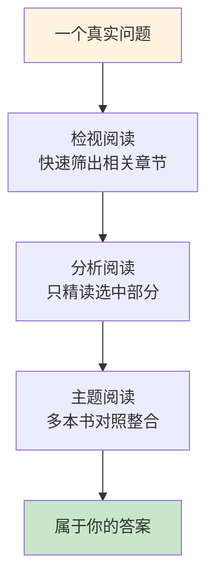
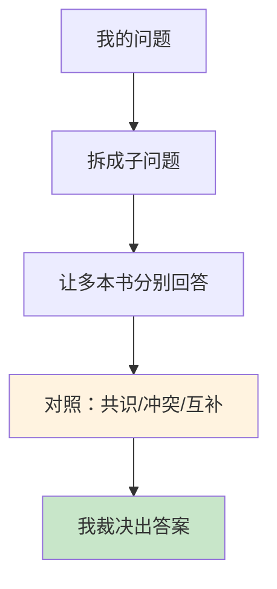

# 3.8 主题式阅读方法

#### 目录介绍
- [01.看一个真实案例](#01看一个真实案例)
- [02.断点自测三问](#02断点自测三问)
- [03.先来说一个场景](#03先来说一个场景)
- [04.阅读的三个层次](#04阅读的三个层次)
- [05.二十分钟辨书法](#05二十分钟辨书法)
- [06.把书读透的三问](#06把书读透的三问)
- [07.多本书圆桌对质](#07多本书圆桌对质)
- [08.围绕问题组书单](#08围绕问题组书单)
- [09.主题阅读做笔记](#09主题阅读做笔记)
- [10.这几个坑我踩过](#10这几个坑我踩过)
- [11.今天起改变三点](#11今天起改变三点)
- [12.课后作业思考下](#12课后作业思考下)

## 01.看一个真实案例

有一年，团队让我牵头做一场技术分享，主题是「怎么做一场不冷场的内部分享」。我第一反应是读书，下单了四本：《演讲的力量》《高效演讲》《TED 演讲的秘密》《像 TED 一样演讲》。

书到货那天，我给自己定了个规矩：**既然买了，就从第一页认真读到最后一页**。

结果你可能猜到了：第一本读到第二章，卡在「演讲的三种叙事结构」上，和我要做的事关系不大，但「认真读书」的执念让我不肯跳。四本书在待办清单上躺了两个多月，分享日期越来越近，我一个完整的章节都没整理出来。

最后怎么办成的？deadline 前一周，我换了个问法：**不再问「这几本书讲了什么」，改问「我的分享还缺什么」**。分享缺三块：开场、控场、收尾。我拿着这三个问题翻四本书的目录，只挑对应章节读：

- 开场：四本书一共讲了四种方法，两种高度重合，对比后留三种；
- 控场：两本书讲眼神和提问技巧，合并成两条；
- 收尾：只有一本书讲得好，直接取用。

**一周时间，四本书，我只读了大约一百页，但那场分享，成了我当年评价最高的一次**。

复盘这件事，真正管用的不是「读了多少」，而是**我第一次让书为我服务，而不是我为书服务**。

## 02.断点自测三问

在往下读之前，先做三道判断题。任意一题命中，这一节就值得你认真读完。

| 断点 | 自测题 | 症状描述 |
|:----:|:------|:--------|
| 从第一页开读 | 拿到一本新书，你会不会习惯从头翻到尾？ | 无筛选：为整本书打工 |
| 一次只读一本 | 学一个主题，你是「串行读完 A 再读 B」还是「多本对照着读」？ | 单书思维：错过对质 |
| 只摘录不裁决 | 你的读书笔记有「我同意 / 不同意」的表态吗？基本没有？ | 借住的知识：过客不入库 |

三道题依次对应本节的三条主线：**先筛后读（检视阅读）、多书对质（主题阅读）、必写裁决（笔记闭环）**。你在哪一条上薄，就重点看那一段。

## 03.先来说一个场景

大多数人的阅读是「书籍驱动」的：听说某本书好，买回来，从第一页读起，读到哪算哪。读完一本，怅然若失地想「这本书到底要干嘛来着」，然后翻开下一本。

这个模式的代价，一年后见分晓：**书读了不少，问题一个没解决**。你要解决的问题还在原地（技术分享照样冷场，时间管理照样失控），因为你的阅读和你的问题，从头到尾没有对齐过。

「问题驱动」的读法完全反过来：**先有问题，再找书；书为问题服务，问题读完即止**。同一个领域，书籍驱动的人读完十本还在原地，问题驱动的人读透三章就解决了问题。

这就是本节要讲的**主题阅读**：围绕一个真实的问题，同时调度多本书，让不同的作者回答你的问题，然后由你整合出属于自己的答案。

## 04.阅读的三个层次

想学会主题阅读，得先知道阅读不止一个层次。按由浅入深，分三层：

| 层次 | 核心动作 | 回答的问题 | 耗时 |
|------|---------|-----------|------|
| **检视阅读** | 系统化略读 | 这本书值不值得读？值得读哪部分？ | 每本 20 分钟 |
| **分析阅读** | 精读咀嚼 | 这本书（这一章）到底在说什么？ | 只对选中的部分做 |
| **主题阅读** | 多书对照整合 | 针对我的问题，答案是什么？ | 贯穿全程 |



三层的关系是**漏斗**：检视阅读负责「广撒网」，用最小成本圈定哪些书的哪些章节值得读；分析阅读负责「深加工」，把选中的部分真正吃透；主题阅读负责「总装」，把不同作者的观点放在同一张桌上对质，拼出你自己的答案。

注意一个关键区别：本节讲的是「**围绕一个问题、同时使用多本书**」的读法；至于怎么把单本书读深、怎么长期提升阅读能力，是另一个话题。只要你有迫近的具体问题，本节的方法就是最快的路径。

## 05.二十分钟辨书法

检视阅读的目标：20 分钟内回答三个问题：**这本书讲什么？和我的问题相关吗？相关的部分在哪？**标准动作五步：

**看封面序言（2 分钟）**。序言是作者亲口告诉你「这本书为谁写、解决什么问题」的地方，跳过序言直接读正文，等于放弃作者递给你的说明书。

**研究目录（3 分钟）**。目录是这本书的骨架。带着你的问题扫一遍，把可能相关的章节直接标记出来，这一步之后，你就从「要不要读这本书」进入「要读哪几章」。

**翻索引（5 分钟）**。在索引里搜你的问题关键词，看这本书有几页在讲它：页数多，说明它是这本书的重头戏；页数少甚至没有，这本书大概率可以排除。

**挑三个相关章节读首尾（5 分钟）**。每个章节的开头和结尾承担了「本章讲什么」的承诺和兑现，读这两处基本能判断这一章的水准和相关性。

**读最后两三页（5 分钟）**。好书的结尾，作者会把全书要点重新收拢一遍，这是你判断「这本书值不值得留下」的最后依据。

20 分钟后，给这本书一个判定：**精读某几章、只做参考资料、还是放弃**。三个都是好结果：放弃一本不相关的书，不是读书失败，而是筛选成功。

## 06.把书读透的三问

经过检视筛选，你要精读的往往只是一本书里的两三章。分析阅读就发生在这两三章上，核心动作是三问：

**第一问：它在说什么？（找出骨架）**读完一节，合上书，用自己的话复述这节的核心观点，复述不出来就回去重读。一节一句话，一章串起来就是骨架。

**第二问：它凭什么这么说？（诠释意图）**作者用了什么论据、案例、推理？这个观点的前提条件是什么，是普适规律，还是只在某些场景成立？把前提找出来，你才知道这个方法能不能搬到你的场景。

**第三问：我同意吗？（评价与批评）**最容易被跳过、但最不能跳过的一步。同意，道理在哪？不同意，反对的理由是什么？**没有经过你表态的知识，只是借住在你脑子里的客人；你表过态的，才是你的**。

三问的过程直接做在笔记上：左边记作者的骨架，右边记你的评价，这份笔记是下一步主题阅读的重要原料。

**提醒一句**：分析阅读只对「检视筛出来的章节」做，不要升格为「把每本书都从头读到尾」。**读透三章相关内容，远胜囫囵吞下一整本**：前者解决问题，后者只解决「读完一本书」的虚荣。

## 07.多本书圆桌对质

现在到了最关键的一层：你手里有四五本书，各有两三章和你相关。主题阅读的做法，是**把你面对的作者们，变成一场圆桌会议的嘉宾**。四步：

**第一步：把你的问题拆成子问题**。「怎么做一场不冷场的分享」拆成：怎么开场抓住注意力？怎么组织内容不让人走神？现场互动怎么做？怎么收尾让人记住？问题越具体，书越容易回答。

**第二步：让每本书分别回答**。带着同一个子问题，去每本书的相关章节找答案。注意：**不是让作者讲他想讲的，是让作者回答你想问的**。没答的直接跳过；答了的，摘录并标注出处。

**第三步：对照和冲突**。把几本书对同一子问题的回答并排放在一起，你会发现三种情况：

- **英雄所见略同**：多本书都强调的，基本是这个领域的共识，可信度高；
- **各执一词**：冲突的地方，恰恰是这个领域最有争议、最值得你亲自判断的地方；
- **互补拼图**：每本书各贡献一角，拼起来才是完整答案。

**第四步：由你裁决**。综合各方观点，结合你的实际情况（听众、场景、水平），给出你的结论。它可能采纳了 A 书的方法、B 书的框架、C 书的提醒，但**它不是任何一本书的，它是你的**。



主题阅读结束时，你收获的不是「读完了四本书」，而是「解决了我的问题」。顺便还摸清了这个领域的地形：哪些是共识，哪些有争议，哪些书值得留在书架上。

## 08.围绕问题组书单

主题阅读的起点不是书单，是问题。从问题走到书单，四步：

**把问题写成一个问句**。不是「我想学演讲」，而是「怎么让一场 40 分钟的技术分享不冷场」。问句里最好带场景和约束，场景越具体，后面的筛选越准。

**多渠道找候选书**。按质量优先级排序：① 这个领域公认的经典（多本书反复引用的源头书）；② 你信任的人的推荐（高赞回答、行业前辈的书单）；③ 顺藤摸瓜（从已选书的参考文献和脚注里挖）。候选 5 至 8 本即可，不必贪多。

**检视阅读过一遍，砍到 3 至 5 本**。用第四节的 20 分钟检视法逐本过，果断淘汰「讲得浅」「和你场景不符」「纯粹蹭热点」的。**书单宁缺毋滥：三本回答到位的书，胜过十本各说各话的书**。

**给每本书标注「预计回答哪个子问题」**。书单定稿时，你应该能画出一张「子问题 × 书籍」的对照表：哪个子问题有哪几本书回答、哪个子问题还没有书覆盖（后者可能要靠文章、课程或请教他人补位）。

到这里你会发现：**好的书单是问题的形状，不是热度的形状**。

## 09.主题阅读做笔记

主题阅读的笔记，和单本书笔记完全不同：它**以子问题为单位组织，而不是以书为单位**。每个子问题建一页笔记，结构固定为四栏：

```text
【子问题】怎么开场抓住注意力？
├─ 书A《演讲的力量》：用悬念提问开场，案例……（第X章）
├─ 书B《高效演讲》：开场90秒定生死，要先给结论……（第X章）
├─ 书C《TED的秘密》：用个人故事开场……（第X章）
├─ 对照：A和C是故事派，B是结论派；共同点是"前90秒必须有钩子"
└─ 我的裁决：我的场景是技术分享，用"未解决问题"开场 + 30秒给地图
```

三个要点：

**每条摘录必须带出处**。将来你会忘记哪个观点来自哪本书，出处是回头核对和深挖的钥匙。

**对照栏是灵魂**。只摘录不对照，笔记就退化成了「散装收藏夹」。真正值钱的是那行「A 和 C 是故事派，B 是结论派」：它意味着你已经开始形成自己的判断框架。

**裁决栏必须写满**。每个子问题的笔记，最后必须有「我的裁决」，哪怕暂时只写一句「先按 B 的方法试，下次试 C 的」。**没有裁决的主题阅读，等于开了场圆桌会议却没有形成决议**。

这份笔记做完，它就是你在这个问题上的「自编教材」。下次同事遇到同样问题，你递给他的不是四本书的书单，而是这一页答案。

## 10.这几个坑我踩过

**坑一：书单越攒越大，问题迟迟不动**。我后来又攒过一次「时间管理」主题的书单，一口气列了 14 本，结果光是检视就拖了两周：书单本身成了一件新收藏。**记住书单要为问题服务：问题等不了 14 本，5 本足够**。

**坑二：舍不得跳读，觉得不读完一本是背叛**。「买了就要读完」是我坚持很多年的执念，代价是一堆读到一半的书和一堆没解决的问题。后来想通了：**一本书的定价买的是「整本书的内容」，但你有权只用其中对你有用的 10%**。出版社不会因为你没读完而退款，你的问题却会因为读完无关章节而拖延。

**坑三：只摘录、不裁决**。我最早的对照笔记全是摘录，看着满满当当，用的时候发现还是各说各话：我依然不知道该用谁的方法。加上「对照 + 裁决」两栏之后，笔记才从「素材库」变成了「决策书」。

## 11.今天起改变三点

**第一，从今天起，买书之前先写下你要解决的问题**。把它写成一个带场景的问句，贴在书单最上面。凡是答不上「这本书帮我解决这个问题的哪一部分」的书，先不买。

**第二，从今天起，任何新书先做 20 分钟检视阅读**。书名、目录、索引、章节首尾、全书结尾，五个动作做完再决定精读哪部分。**先筛后读，永远不要从第一页直接开读**。

**第三，从今天起，同一主题的多本书用「子问题对照笔记」串起来**。每条带出处，对照写共识与冲突，最后必须写你的裁决。**裁决可以错，但不能空**。

## 12.课后作业思考下

**1. 生成你的第一个主题问题**：写下你当前工作或生活里一个真实的、让你有点头疼的问题（比如「需求总是被产品改来改去怎么办」）。把它改写成带场景和约束的问句，按第八节的四步，两周内组织出一个不超过 5 本的书单，并完成全部检视阅读。

**2. 完成一次三书对照**：从你的书单里挑一个子问题，让至少三本书分别回答，写出「摘录 + 对照 + 裁决」完整的对照笔记。检验标准：合上笔记，你能用三分钟向同事讲清楚「这个子问题，不同流派怎么看，我打算怎么做」。

**3. 给旧书单做一次手术**：翻出你「买了还没读」的书，逐本问一句「它对应我现在的哪个问题」。能对上的，进主题书单；对不上的，明确标记「暂缓」。统计一下：这一刀砍掉了多少本？留下的每一本，你能在 10 秒内说出它该读哪几章吗？

---

> 上一篇：[3.7 对抗遗忘记忆法](./07.对抗遗忘记忆法.md) ｜ 下一篇：[4.1 知识迁移与运用](../05.学以致用/01.知识迁移与运用.md)
