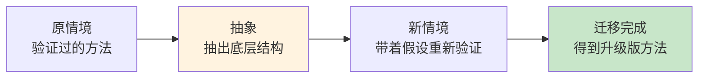
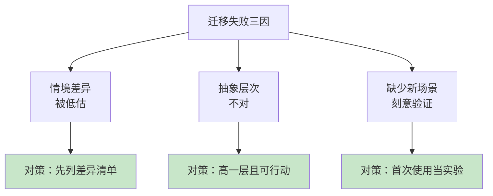

# 4.1 知识迁移与运用

#### 目录介绍
- [01.看一个真实案例](#01看一个真实案例)
- [02.断点自测三问](#02断点自测三问)
- [03.先来说一个场景](#03先来说一个场景)
- [04.什么是知识迁移](#04什么是知识迁移)
- [05.表层迁移与深层迁移](#05表层迁移与深层迁移)
- [06.怎么抽象出可迁移的模式](#06怎么抽象出可迁移的模式)
- [07.跨界调用的三个练习](#07跨界调用的三个练习)
- [08.迁移为什么会失败](#08迁移为什么会失败)
- [09.这几个坑我踩过](#09这几个坑我踩过)
- [10.后来发生的改变](#10后来发生的改变)
- [11.今天起改变三点](#11今天起改变三点)
- [12.课后作业思考下](#12课后作业思考下)

## 01.看一个真实案例

先讲一次失败的迁移。

我在电商平台做过大促保障，那段时间学到一套很扎实的方法：**预案思维**。大促前把每个环节问一遍「它挂了怎么办」，缓存挂了降级到库、支付超时引导重试、流量超限开队列削峰。这套方法我用得炉火纯青，当年双 11 零事故。

两年后，我接手一个数据迁移项目：把一个跑了六年的老库，迁到新架构上。表面看，这也是「保障任务」，我信心满满地套用大促经验：列风险清单、写值班表、定应急群。

结果迁移切流那晚，出事了。老系统写的存量数据和新系统的增量数据对不上，回滚按钮形同虚设，因为**我们压根没演练过回滚**。团队通宵救火，最后靠人肉比对数据收场。

复盘会上领导问我：「大促你不是搞过预案吗？」我说搞了。他又问：「那大促的预案和这次差在哪？」我答不上来。

后来我盯着白板想了很久才想明白：**大促那套方法真正的精髓，不是「列风险清单」，而是「每一个预案都必须真实演练过」**。大促前我们做过三轮全链路压测，回滚流程跑过无数遍；而这次迁移，我搬来了「列清单」的动作，却没搬「先演练」的灵魂。

**我搬了表面做法，丢掉了底层结构。这次失败教会我的，比任何一次成功都多**。

## 02.断点自测三问

在往下读之前，先做三道判断题。任意一题命中，这一节就值得你认真读完。

| 断点 | 自测题 | 症状描述 |
|:----:|:------|:--------|
| 只搬做法 | 换新场景时，你搬过去的话里，还带不带原场景的名词？ | 表层迁移：形似神不似 |
| 情境差异 | 用旧经验之前，你写过一份「新场景比原场景差在哪」的清单吗？ | 差异被低估：致命盲区 |
| 不做验证 | 旧方法用到新场景，你会当成「已验证」直接上，还是当「实验」试跑？ | 一步跳过：本可拦截的翻车 |

三道题依次对应本节的三条主线：**深层迁移（剥场景名词）、差异清单（先识别再迁移）、首次当实验（新场景重新验证）**。你在哪一条上薄，就重点看那一段。

## 03.先来说一个场景

这个场景极其普遍：换了家公司、换了个项目、换了个领域，过去积累的经验突然「不管用了」。

于是很多人得出结论：经验不可靠，换了场景就得重学。这句话对了一半：**不可靠的不是经验，是未经抽象的经验**。

事实是，所有领域都由两层构成：

- **表层**：具体的做法、工具、术语、流程，换一个场景就失效；
- **底层**：问题的结构、思考的框架、权衡的逻辑，大量场景通用。

「隔行如隔山」隔的是表层；而底层结构，往往是**隔行不隔理**的。会迁移的人和一个场景一个场景重新摸的人，成长速度差出数量级。

知识迁移，就是把 A 情境学到的东西，用到 B 情境的能力。**它是「学了很多」和「学一抵十」之间的分水岭**。

## 04.什么是知识迁移

先给个朴素定义：**知识迁移，就是把在一个情境里学到的东西，用到另一个情境里**。

它有三个特征，缺一不可：

**第一，原情境里它是被验证过的**。你真的用过、跑通过、踩过坑，不是道听途说的「知道」。我迁移「预案思维」之所以有资格，是因为大促真的零事故；如果我只是看过一篇文章，那不叫迁移，叫转述。

**第二，你抽出了它超越原情境的部分**。这是最关键的一步：从「大促要做预案」里抽出「高风险动作必须演练兜底方案」，前者只属于大促，后者属于一切高风险动作。

**第三，新情境里你重新验证了它**。迁移不是照搬落地，而是带着假设进入新场景：这里适用吗？哪里要改？我的数据迁移项目如果当初做过这一步，就会在演练回滚时发现流程走不通，迁移的失败本可以在演练阶段被拦截。

注意这个链条里**没有「直接照搬」这个环节**：照搬不是迁移，是复制。迁移的产物也不是原方法，而是「升级版」：它既包含原方法的骨架，又吸收了新场景的特殊性。

## 05.表层迁移与深层迁移

按抽象的程度，迁移分两种。用我自己的例子做对照：

| 维度 | 表层迁移 | 深层迁移 |
|:----|:----|:----|
| 迁移的是什么 | 具体做法、工具、动作 | 问题结构、原则、权衡逻辑 |
| 我迁移了什么 | 列风险清单、建应急群、排值班表 | 高风险动作，预案必须真实演练过 |
| 结果 | 形似神不似，关键时刻掉链子 | 跨场景成立，越用越强 |

表层迁移的特点是**学得快、用得爽、死得惨**：动作一模一样地搬过去，起初看着像模像样，场景一变化就露馅。因为它搬运的是「大促预案」这具躯壳，而不是「高风险必演练」这个灵魂。

深层迁移的特点是**开始慢半拍、越用越值钱**：你得先停下来想「这方法成立的前提是什么」，看似多花了时间，但抽出来的结构可以反复使用。「高风险必演练」此后跟着我进了发布流程、家庭重大决策、甚至本书的写作（新章节先小范围试读，就是一次演练）。

**判断你在做哪种迁移，只需要问一个问题：你搬到新场景的那句话里，还带不带原场景的名词？**带（「大促要这样」「外科手术要那样」）多半是表层；不带（「高风险动作必须演练」）才可能是深层。

## 06.怎么抽象出可迁移的模式

从「具体做法」到「通用结构」，有一条可操作的路径，我总结为**剥洋葱四步**。以「大促预案」为例：

**第一步：完整描述原做法**。大促前两周，我们列出所有核心环节；给每个环节写「挂了怎么办」的预案；预案全部真实演练；不通过的预案触发方案调整。

**第二步：逐层追问「为什么成立」**。为什么要演练？因为预案写在纸上和真跑起来是两回事。为什么要真跑？因为故障时的反应时间以秒计，没练过的流程根本来不及执行。为什么来不及执行也要练？因为练过才能暴露流程本身的漏洞，纸面预案往往在第一次真跑时就崩溃。

**第三步：剥掉场景名词，只留条件语句**。把「大促、缓存、支付」全部剥掉，这段追问浓缩成一句：**任何「失败了代价很高」的动作，它的兜底方案必须事先真实演练过**。注意这句话里已经没有任何电商的痕迹，它可以平移到发布、手术、谈判、演讲任何领域。

**第四步：给这句话标注适用边界**。它什么时候成立？「失败代价高」且「可以事先演练」的时候。如果失败代价低（做个试验而已），直接快速试错就行，别浪费时间演练。边界和结论同样重要，没有边界的原则会变成新的教条。

四步做完，你手里就有一个「可迁移的模式」：它一句话说清、带适用条件、背后有你亲历的案例支撑。**建议把这个过程写下来：写不出一句不含场景名词的话，说明抽象还没完成**。

## 07.跨界调用的三个练习

抽象能力不是天赋，是练出来的。三个日常就能做的练习：

**练习一：名词替换法（每周一次）**。挑一个你熟悉的领域方法，强行替换到无关领域，看它是否还成立。比如：技术上的「灰度发布」（新功能先放给 1% 的用户），替换到生活里：新的作息计划，先在工作日试一周，别一上来就推翻全部旧习惯。成立的，记下来；不成立的，追问差在哪个前提。**这个练习练的是「剥名词」的手感**。

**练习二：双栏笔记法（配合每天的复盘）**。左栏写「今天发生了什么」（具体事件），右栏写「这背后是个什么一般问题」（抽象结构）。比如左栏「和产品吵了一架，因为需求文档没写清验收标准」，右栏「信息不对称 + 事前对齐缺失 = 冲突」。积累一个月，你会发现右栏开始重复出现，**那些反复出现的，就是你的可迁移模式库**。

**练习三：迁移预告法（进入新场景前做）**。接手任何新事情之前，写下三行：① 我有哪些可能用得上的旧经验；② 这些经验里，哪些是做法、哪些是结构；③ 新场景和原场景最大的差异是什么、我担心哪条经验会失灵。这份「预告」会让你在新场景里保持警觉：**失灵的经验不可怕，浑然不觉地套用失灵经验才可怕**。

三个练习分别对应「会抽象」「有库存」「能预警」，循环做，迁移会从刻意为之变成思维本能。

## 08.迁移为什么会失败

不是所有迁移都值得做，失败的迁移大多栽在三个原因上，逐个说：

**原因一：情境差异被低估**。结构相似不等于情境相同。数据迁移和大促保障，底层都是「高风险变更管理」，但数据迁移多了一个致命差异：**数据是状态，流量是过程**。流量洪峰过了就过了，数据错了会一直错下去。我当时没识别这个差异，预案的力度自然不够。**迁移前必须做「差异清单」：新场景比原场景多了什么、少了什么、什么变了性质**。

**原因二：抽象层次不对**。抽象太浅，搬过去是躯壳（表层迁移的病）；抽象太深，又变成一句正确的废话，「凡事预则立」谁都会说，但它指导不了任何具体动作。合适的抽象层次是：**比原场景高一层，但低到仍能指导行动**。「高风险动作必演练」比「大促要预案」高一层，又比「凡事预则立」具体得多。

**原因三：缺少新场景的刻意验证**。这是我的数据迁移项目死的直接原因：把旧经验当成了「已验证」，忘了它在新场景只是「待验证」。正确姿势是：任何迁移过来的方法，在新场景的第一次使用都当成一次实验（小步引入、设置观察点、准备好它失灵时的退路）。

三个原因里，第三个最隐蔽也最致命：**它让失败的人误以为「经验没用」，其实是有用的经验没走完最后一公里**。

## 09.这几个坑我踩过

**坑一：把「听过很多领域」当成迁移能力**。有一阵我很热衷跨界概念，聊什么都能扯两句生物学、军事学的类比，听着很高级。真到用时才发现：类比只能是「表达的修辞」，不能是「行动的依据」。**能指导行动的迁移，必须自己亲手完成抽象那一步，二手的抽象不算数**。

**坑二：一次失败就全盘否定经验**。数据迁移那次翻车后，我一度觉得大促的经验全是运气。后来复盘才分清：列清单没错、演练没错，错的是只搬了一半。**失败之后别问「这经验还有没有用」，要问「这次失败砍掉了经验的哪一部分、留下了哪一部分」**。

**坑三：只做顺向迁移，从不逆向检验**。顺向迁移是「老经验救新场景」，逆向检验是「新场景反过来修正老经验」。数据迁移教我的「数据是状态、流量是过程」，反过来让我对大促预案里「数据一致性」环节的重视程度完全变了。**双向流动，经验才会越用越厚；单向搬运，经验迟早搬空**。

## 10.后来发生的改变

那次翻车之后，我把「迁移」变成了一个显式的动作。

最明显的变化在带新人上。以前新人问我「这个项目该怎么做」，我会直接教做法。现在我会多走一步：带着他做一次剥洋葱：「这套流程里，哪部分是这个项目特有的？哪部分你下个项目还用得上？」一年下来，几个新人都开始自发地说「这是个可迁移的」或「这是这次特有的」，成长速度肉眼可见地快于同龄人。**因为他们攒的不是项目经历，是模式库存**。

我自己也尝到了甜头。写作本书时我迁移了三条老经验：

- 发布流程里的「灰度」变成了「先小范围试读」；
- 大促保障里的「预案演练」变成了「每章的方法先在自己身上跑一遍」；
- 数据迁移的「先对齐基线」变成了「先明确每节要解决的读者问题」。

这本书能按计划推进，一半功劳属于这三条迁移。

回头看，**「学了很多」和「学一抵十」之间的差距，从来不在学了什么，而在你有没有把学到的东西，亲手从具体场景里剥出来一次**。

## 11.今天起改变三点

**第一，从今天起，挑一个你最引以为傲的成功经验，做一次剥洋葱四步**：描述做法 → 追问成立原因 → 剥掉场景名词 → 标注适用边界。产出物是写下来的一句「条件语句」，比如「任何××的动作，必须先××」。**写不出这句，说明这个经验还没真正属于你**。

**第二，从今天起，用双栏笔记攒你的模式库存**：每天三分钟，左栏记一件事，右栏写它背后的一般问题。不用贪多，一个月后你会拥有一批自己的可迁移模式，它们是你跨行业、跨赛道的底气。

**第三，从今天起，任何旧经验进入新场景，第一次使用都当成实验**：小范围试、设观察点、备退路。实验成功，经验升级；实验失败，你收获的是边界。**两种结果都比「浑然不觉地照搬」强**。

## 12.课后作业思考下

**1. 复盘一次你的迁移失败**：回想一个「老经验在新场景失灵」的经历。用第 08 节的三个失败原因做诊断：是情境差异被低估、抽象层次不对，还是缺少新场景验证？再追问一层：这次失败帮你砍掉了原经验的哪部分、留下了哪部分？把留下的部分用一句「条件语句」写出来。

**2. 完成一次完整的正向迁移**：选一个你验证过的方法（工作方法、生活习惯都行），按剥洋葱四步抽象成一句带边界的话，然后本周内在一个完全不同的领域里找机会用一次它。记录：用它之前你的预期是什么？用完之后，哪部分成立了、哪部分需要修正？

**3. 启动你的双栏笔记**：从今天起连续七天，每天记一条「事件 → 一般问题」。第七天回头通读，把重复出现过的「一般问题」圈出来，那就是你的模式库存的第一批存款。问问自己：哪一条是你本周就能在别的场景用上的？

---

> 上一篇：[3.8 主题式阅读方法](../04.学习方法/08.主题式阅读方法.md) ｜ 下一篇：[4.2 输出倒逼着输入](./02.输出倒逼着输入.md)
