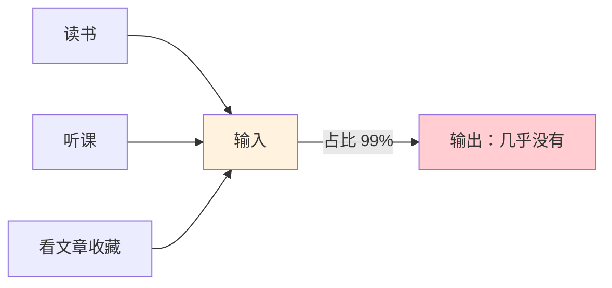
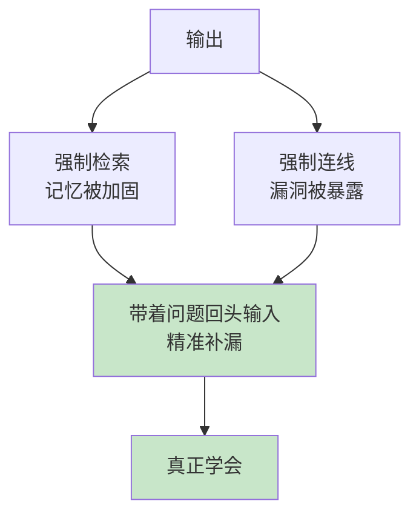
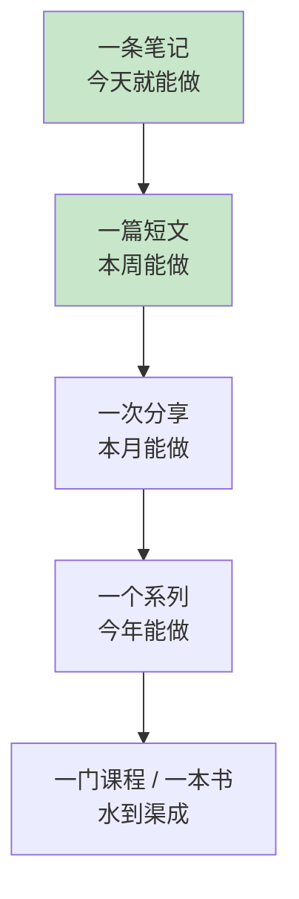
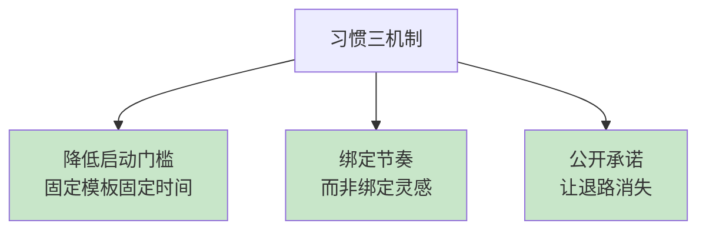
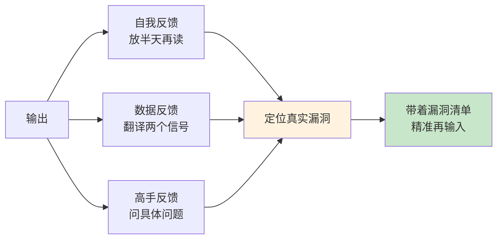
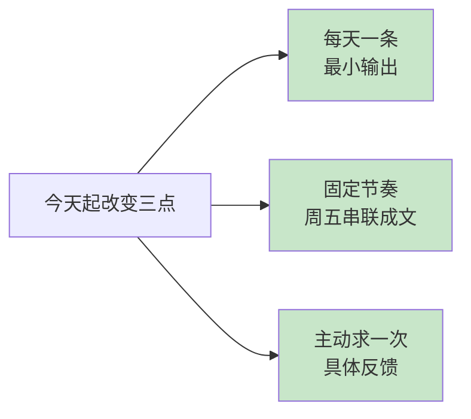

# 4.2 输出倒逼着输入

#### 目录介绍
- [01.看一个真实案例](#01看一个真实案例)
- [02.先来说一个场景](#02先来说一个场景)
- [03.为什么输出是最高效的学习](#03为什么输出是最高效的学习)
- [04.输出金字塔：从最小可行开始](#04输出金字塔从最小可行开始)
- [05.最小可行输出的四种形式](#05最小可行输出的四种形式)
- [06.怎么建立输出习惯](#06怎么建立输出习惯)
- [07.输出之后的反馈循环](#07输出之后的反馈循环)
- [08.这几个坑我踩过](#08这几个坑我踩过)
- [09.后来发生的改变](#09后来发生的改变)
- [10.今天起改变三点](#10今天起改变三点)
- [11.课后作业思考下](#11课后作业思考下)

## 01.看一个真实案例

很多年前，我在团队里是出了名的「线程池懂王」。参数张口就来，面试题倒背如流，同事遇到相关问题都来问我。

直到有一天，我决定把这些经验写成一篇博客。

写到一半，我卡在了这样一个问题上：**「一个任务提交进线程池，是先创建线程，还是先进队列？」** ——我的直觉说「肯定先开线程，开满了才排队」，但另一个声音说「不对吧，我好像在哪看过是先排队」。

我翻遍了自己的笔记：没有答案。问了几位同样「精通」线程池的同事：三个人三个说法。最后我只能去读源码，一路追到 `execute()` 方法里那三行判断——**先核心线程，再队列，再最大线程**——原来队列排在最大线程前面，和我的直觉正好相反。

那天我盯着源码坐了很久。一个我以为「精通」了的知识点，在写作面前不堪一击。

更要命的是，往下写我才发现这不是个例：拒绝策略的执行时机、 shutdown 和 shutdownNow 的区别、空闲线程的回收逻辑……几乎每一段都有我以为懂、其实说不清的地方。那篇博客我写了整整四天，写完之后，线程池在我脑子里才第一次真正「长住了」——此后多年，再没忘过。

**一篇四天的博客，胜过四年自以为是的「懂了」。**

从那天起我明白了一件事：**检验你是否学会的唯一标准，不是你能输入多少，而是你能输出多少。**

## 02.先来说一个场景

先看一组大多数人学习的构成：

读书、听课、看文章——全是输入。收藏、点赞、划线——看起来像加工，其实还是输入。一年下来，输入了几百小时，输出几乎为零。

这种结构的问题，不在于「学得不够多」，而在于**输入的公平错觉**：

- 读书时你觉得「这段讲得真好」——每个知识点给你的满足感是一样的，大脑无法区分「真懂了」和「看懂了字面」；
- 收藏时你觉得「先存着以后看」——收藏的瞬间获得掌控感，然后永远不会打开第二次。

而输出会瞬间撕开这层错觉。让你把刚看的东西讲给别人听，三句话之内你就会暴露：哪里是真懂，哪里只是眼熟。**输入时人人都是懂王，输出时才知道自己几斤几两。**

所以本节的核心主张是：**不要等「学好了再输出」——输出不是学习的毕业典礼，输出本身就是学习的一部分，甚至是最高效的那部分。**

## 03.为什么输出是最高效的学习

为什么写一篇博客，比读十篇文章更能让你学会？两个原因。

**原因一：输出是最强力的检索练习。**

回忆一下上一节讲的对遗忘的对抗——**合上书回忆，远胜于翻书重读**。输出本质上就是一场大规模的检索：写线程池博客时，你必须凭记忆把整个机制串起来——参数怎么配合、任务怎么流转、异常怎么处理。每一个「写不下去」的地方，都是记忆的断点。这种带着压力的主动回忆，对记忆的加固作用是被动重读的数倍。

**原因二：输出会强制你补齐「逻辑漏洞」。**

输入的时候，知识是以「点」的状态进来的：这个概念、那个参数、某条结论。大脑天然容忍这些点之间的缝隙——读的时候根本看不出来。

输出不行。写一篇文章，点与点之间必须连线：「为什么队列排在最大线程前面？」「拒绝策略为什么在这时触发？」——**读者的眼睛会替你检查所有你没讲清的地方，而最先发现这些漏洞的读者，就是你自己。** 这就是为什么卡壳的地方总是出现在写作途中，而不是阅读途中：阅读走的是知识的「单向道」，写作走的是「全连通图」，走不通的断头路一目了然。

注意最后一步：**输出之后带着问题回头输入**。没有输出，你不知道该输入什么，读书像撒网，广而无效；有了输出暴露的漏洞，每一次回头查资料都精准无比——这就是「输出倒逼输入」的完整含义：**不是输出的量替代输入的量，而是输出的质，决定了输入的方向和效率。**

## 04.输出金字塔：从最小可行开始

很多人对输出的想象过于宏大：写一本书、做一门课、开一场演讲。于是迟迟不敢开始——「我还没准备好」。

正确的路径恰恰相反：**从最小可行的输出开始，一层层往上爬。**

这个金字塔的逻辑是：**每一层的输出，都是上一层输出的素材**。

一条笔记（一个知识点的卡片）攒多了，串起来就是一篇短文；短文写了几篇，发现互相有关联，就能整理成一次内部分享；分享做了几场、反馈攒够了，就是一个系列；系列沉淀到底，课程和书是自然结果。

我认识的几位高产作者，没有一个是「憋大招」憋出来的——全是笔记攒出来的。反过来看那些「等我准备好」的人，十年过去，大招还憋在肚子里。

金字塔每一层的启动成本和收益：

| 层级 | 启动成本 | 核心收益 |
|------|---------|---------|
| 一条笔记 | 10 分钟 | 检索练习 + 知识资产 |
| 一篇短文 | 半天 | 逻辑漏洞暴露 + 公开反馈 |
| 一次分享 | 一周 | 表达能力 + 影响力 |
| 一个系列 | 数月 | 系统化 + 个人品牌 |
| 一本书 | 数年 | 深度沉淀 |

**关键在第一层：它便宜到你没有理由拒绝。** 不要小看一条 10 分钟的笔记——本节你正在读的这本书，最初也就是几百条那样的笔记。

## 05.最小可行输出的四种形式

「最小可行输出」的标准：**10-30 分钟内完成、只覆盖一个知识点、今天就能发布或存档。** 四种形式，按门槛从低到高：

**形式一：卡片笔记（10 分钟）。** 学完一个知识点，用自己的话在卡片上写三行：它是什么？解决什么问题？和我已知的什么有关？——这就是第 2 章「卡片笔记写作法」一节里「永久笔记」的最小形态。它不公开、不完美，但它完成了输出的核心动作：脱离原文，凭理解重写。

**形式二：群内分享（15 分钟）。** 把今天学到的东西，讲给同事群或学习群听——三五句话配一张图。公开讲的好处是有真实听众：有人追问「为什么」，你就得再想一层。别嫌群小，**三个听众的追问，胜过三十天的独自默读。**

**形式三：一篇短文（30 分钟 - 半天）。** 500-1500 字，讲清一个问题即可。写不出长的就写短的，讲不深就先讲浅——**完成比完美重要，发布比收藏重要。** 发在哪里都行：博客、朋友圈、知识星球。发布本身会带来神奇的心理变化：一旦知道「有人会看」，你对准确性的标准自动上调一档。

**形式四：一次复盘文档（30 分钟）。** 项目告一段落、问题解决之后，写一页纸：遇到了什么问题、试了什么方法、什么有效什么无效。它输出的不是「知识」而是「经验」——**经验不写下来就只是经历，写下来才变成可复用的资产。**

四种形式覆盖了不同的输出对象：自己、小圈子、公众、未来的自己。**不必贪多，选一种你能坚持的开始。**

## 06.怎么建立输出习惯

知道要做，和真的持续做，中间隔着一条习惯的鸿沟。三个经过验证的机制：

**机制一：把启动门槛降到反悔都来不及。**

想写短文时，「打开电脑、新建文档、想标题」这三步就能劝退一半的人。对策是**固定模板 + 固定时间**：每天午饭后，打开同一个文档模板，标题先用日期占位，第一句固定写「今天我想说清楚一件事：」。心理学上叫「降低启动摩擦」——**习惯的敌人不是没时间，是每次启动时那一下心理阻力。** 阻力足够小，习惯才能跑起来。

**机制二：绑定节奏，而不是绑定灵感。**

等灵感的人一年输出不了几次。对策是把输出绑在一个必然发生的节奏上：每周五下班前，把这周的三张卡片串成一篇短文。灵感不可控，节奏可控——**灵感是节奏的副产品，不是前提。** 事实上，绝大多数写作者都会告诉你：坐下来开始写之后，灵感才来。

**机制三：公开承诺，让退路消失。**

对自己说的计划，放弃成本为零。对策是公开承诺：在群里说「我打算每周发一篇学习笔记，欢迎监督」，或者直接立一个公开的连载。我在博客最早期定的规矩是「每周至少一篇」——前二十篇质量平平，但**正是那二十篇，把「输出」从一个念头焊死成了习惯。** 公开承诺的狠处在于：断更一次的社交成本，远高于硬着头皮写完一篇的成本。

三个机制里，**先做第一个**：门槛降到位，节奏和承诺才有意义。

## 07.输出之后的反馈循环

输出不是终点。一次完整的循环是：**输出 → 反馈 → 修正 → 再输入 → 再输出**。反馈这个环节，大多数人白白浪费了。三种反馈，价值依次升高：

**反馈一：自我反馈（发布前）。** 写完之后放半天，再读一遍，问自己三个问题：哪一段我自己都读不顺？哪个概念是照抄的而不是消化的？如果只能留一段，留哪段？——**放半天再读，你能瞬间看到写作时被「熟练感」掩盖的漏洞。**

**反馈二：数据反馈（发布后）。** 阅读量、点赞、评论——别迷信它们，但要看两个信号：**哪一段被引用最多**（那是你讲得最透的地方）和**哪个评论在追问细节**（那是你讲得最糊的地方）。数据不说谎，但要会翻译：它告诉你的不是「你行不行」，而是「哪里行、哪里不行」。

**反馈三：高手反馈（主动求来）。** 把输出拿给你认可的前辈看，问一个具体的问题：「这篇里，我对××的理解对不对？」——**问得越具体，得到的反馈越值钱。** 「您觉得怎么样」只能换来客气，「我卡在××这里对不对」能换来真知。我的博客早期最大的飞跃，就是一位前辈在评论区指出我对一个机制的理解「方向反了」——那条评论价值超过之前全部的阅读量。

三种反馈最终都汇成同一个东西：**一份漏洞清单**。带着这份清单回头读书、查源码、请教人——这一轮输入的效率，是漫无目的输入的十倍。这就是反馈循环的完整闭环：输出倒逼输入，反馈导航输入。

## 08.这几个坑我踩过

**坑一：追求完美，一篇打磨三个月。** 我最早的博客是「月更」，因为每篇都想写成巅峰之作。后来发现：打磨三个月的那篇，和打磨三天的那篇，阅读量没有本质区别——但月更的我一年只有 12 次输出练习，周更的有 52 次。**输出的核心收益来自「次数」，不是「单篇质量」**：写得越多，单篇质量自然会涨；反之不成立。

**坑二：只输出「已确定无疑」的东西。** 有阵子我只写烂熟于心的主题，安全但停滞——输出变成了搬运。后来开始写「正在学的东西」：学一个新框架，就边学边写「踩坑实录」。**输出学习中的困惑，比输出学成后的总结更有价值**——困惑是真实的，读者能共鸣；总结常常是后见之明，反而没滋味。

**坑三：把负反馈当成否定。** 早期一篇文章被人评论「理解有误」，我脸热了三天，一度想删文。后来想通：**指出错误恰恰是最珍贵的反馈——它免费地帮你修复了一个认知漏洞。** 从此我把「被指出错误」重新定义为「赚到」。转变这个心态之后，我甚至开始主动求挑错，成长速度完全不同。

## 09.后来发生的改变

坚持输出这么多年，改变是滚雪球式的。

最初的两年，变化只在于「记得住」：凡是写过博客的知识点，几乎不需要复习——写作本身就是最深的检索练习。同事遇到的疑难杂症，我多半写过，答案信手拈来。所谓「懂王」的口碑，第一次有了真实的内容。

第三四年，变化开始外溢：博客攒了两百多篇，有文章被社区推荐，有同行来信讨论问题，有会议邀请找我做分享——**这些机会没有一个是「准备好」之后争取来的，全是输出攒出来的。** 我人生中第一次意识到：影响力不是喊出来的，是一篇篇输出沉淀出来的。

再往后，输出改变了我的输入结构。读书时我的手会自动进入「输出模式」：这段能写成什么？那个观点和我已有的哪篇能连起来？——**输入和输出咬合成齿轮之后，学习效率是完全不同的物种。**

回头看线程池那篇博客的四天：那四天没有白费。它教会我的不是线程池——是「输出」这个动作本身。**从那以后，每当我感觉「学了很多却心里没底」，我就知道该写点什么了。输出一出手，虚的实的，立刻见分晓。**

## 10.今天起改变三点

**第一，从今天起，每天完成一条最小可行输出**：一张三行卡片、一段群内分享、或半页复盘——10 分钟即可，只覆盖一个知识点。关键标准：用自己的话，脱离原文重写。

**第二，从今天起，给自己绑一个输出节奏**：每周五（或任何你固定空闲的时间）把本周的三条输出串成一篇短文并发布。不求好，只求发。坚持四周，你会亲眼看到第二周的自己比第一周进步。

**第三，从今天起，每次输出后主动求一次具体反馈**：发出去之后，找一个人（同事、朋友、前辈均可），问一个具体问题：「这篇里××那部分，我的理解对吗？」把得到的回答记进漏洞清单——那才是你这周真正的学习收获。

## 11.课后作业思考下

**1.做一次输出压力测试**：挑一个你自认为「很懂」的知识点，现在凭记忆写 300 字讲清它的核心机制——不许翻任何资料。写完后对照原始材料，统计：遗漏了几个关键点？写错了几个？把这个「漏洞清单」保存下来，它就是你的学习导航图。

**2.发布你的第一篇最小输出**：本周内，把你最近学到的一个东西，用任一形式（卡片、群分享、短文、复盘）公开发布出去。发布后记录两个数据：写之前你以为要花多久？实际花了多久？——大多数人的第一个发现是：启动远比想象中容易。

**3.建立你的反馈档案**：为你已有的任何一次输出（哪怕是一段聊天记录）收集一条具体反馈：找一个人问「我这样理解对吗」。然后把「我的原始理解 + 对方的反馈 + 修正后的理解」三行写进一个文档。这个文档，就是你最私人的错题本——也是未来你输出「我是怎么学会学习的」的最好素材。

---

> 上一篇：[4.1 知识迁移与运用](./01.知识迁移与运用.md) ｜ 下一篇：[结语 让学习成为你一辈子的复利](../06.结语.md)
