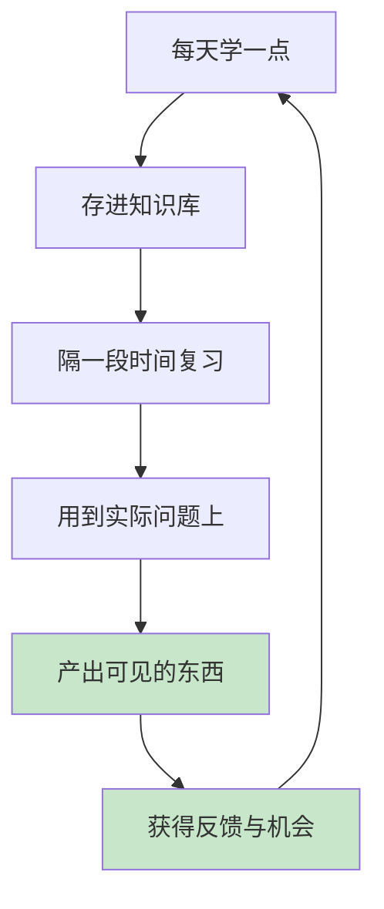

# 结语 让学习成为你一辈子的复利

#### 目录介绍
- [01.回到最初的那个问题](#01回到最初的那个问题)
- [02.你真正该带走的三样东西](#02你真正该带走的三样东西)
- [03.复利到底是怎么产生的](#03复利到底是怎么产生的)
- [04.学得会之后，考验才刚开始](#04学得会之后考验才刚开始)

## 01.回到最初的那个问题

开篇的时候，我讲了自己工作第三年的窘境：买了书、报了课、收藏了几百篇文章，年底却写不出一行"成长收获"，主管给的评语是"没有看到能力维度的跃迁"。

那时候我以为问题出在"不够努力"。

现在你应该已经知道答案了：**问题不在努力程度，而在链路是否完整。**

存不下、记不住、用不出——这三个断点任何一个堵着，你的投入都会被悄悄吃掉。而这本书做的全部事情，就是帮你把这三个断点一个个接上。

## 02.你真正该带走的三样东西

读完这本册子，如果你只记住三样东西，我希望是这三样：

| 带走什么 | 判断标准 | 它解决什么 |
|---------|---------|-----------|
| **一套筛选标准** | 你能说出"什么东西不值得学" | 不再被信息洪流冲着走 |
| **一个能检索的知识库** | 需要时能在 1 分钟内找到 | 收藏不再是冷藏 |
| **一个输出习惯** | 学完就有地方可写、有人可讲 | 知识真正变现 |

注意，**这里面没有一条是"读了多少本书"**。

我见过收藏几千篇文章的人，也见过每年读 100 本书的人，他们的焦虑程度往往比不读书的人还高——因为**输入量从来不是指标，转化率才是**。

## 03.复利到底是怎么产生的

学习这件事，本质上是一个复利模型：

复利的关键是**"不能断"**，而不是"某一天特别猛"。

- 一天学 8 小时然后消失三个月，效果约等于零
- 每天学 25 分钟坚持三年，会甩开绝大多数人

这背后有个残酷的算术：如果你每天进步 1%，一年后是原来的 **37 倍**；如果每天退步 1%，一年后只剩 **3%**。

差距不是靠某一次爆发拉开的，是靠**不中断**拉开的。

所以我给你的建议非常朴素：**不要给自己定一个坚持不下来的计划。**

每天 25 分钟，比"周末学一整天"有用得多。前者能跑三年，后者通常跑不过三个周末。

## 04.学得会之后，考验才刚开始

这本册子解决的是"学得会"。

但请你一定记住一件事：**学得会，只是入场券。**

我身边有太多这样的人——书读得通透，笔记做得漂亮，讲起来头头是道。可真到了要交付一个项目、带一个团队、扛一个指标的时候，还是掉链子。

原因很简单：**"知道"和"做到"之间，隔着一条巨大的鸿沟。**

这条鸿沟里，塞着 25 个非常具体的问题：目标怎么拆、计划怎么排、执行怎么盯、复盘怎么做、风险怎么控、资源怎么要……

这些问题，没有一个是靠"多读书"能解决的。

**它们需要的是另一套完全不同的能力——把事情做成的能力。**

那正是下一册《自我精进 · 成事》要讲的内容。

学得会之后，真正的考验是把它做出来。

---

> 上一章：[4.2 输出倒逼着输入](./05.学以致用/02.输出倒逼着输入.md) ｜ 下一步：**卷二《自我精进 · 成事》**
