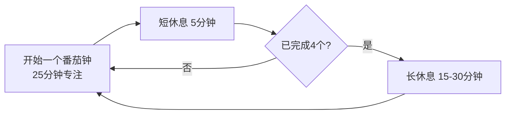

# 3.2 番茄工作法实践
#### 目录介绍
- [01.那一天我只写了17行代码](#01那一天我只写了17行代码)
- [02.断点自测三问](#02断点自测三问)
- [03.番茄工作法是什么](#03番茄工作法是什么)
- [04.为什么是25分钟](#04为什么是25分钟)
- [05.四步开始使用](#05四步开始使用)
- [06.处理中断的原则](#06处理中断的原则)
- [07.番茄钟与任务的匹配](#07番茄钟与任务的匹配)
- [08.番茄钟+PDCA组合拳](#08番茄钟pdca组合拳)
- [09.番茄法的局限性](#09番茄法的局限性)
- [10.这几个坑我踩过](#10这几个坑我踩过)
- [11.总结回顾这一节](#11总结回顾这一节)
- [12.后来发生的改变](#12后来发生的改变)
- [13.今天起改变三点](#13今天起改变三点)
- [14.课后作业思考下](#14课后作业思考下)
- [15.下一站六顶思考帽](#15下一站六顶思考帽)

## 01.那一天我只写了17行代码

那是上线前一周的周一，我手上压着一个核心模块要交付。我早上 9 点准时到工位、打开 IDE，对自己说：「今天必须把这个模块写完。」

结果晚上 11 点我准备下班的时候，提交记录显示，那一天我只新增了 17 行代码。

我当时整个人是蒙的。我明明一整天都在工位上，没午睡也没吃太久饭，怎么就写了 17 行？我打开浏览器历史回看：9:00-9:40 处理早上的邮件；9:40-10:15 同事 A 来工位讨论了一个接口；10:15-10:40 写了几行代码，微信弹消息回复了 8 分钟；10:40-11:30 开了一个临时拉的会。下午类似的循环又重复了 6 遍。

我的电脑没闲着，但**真正在写核心模块的时间，加起来不超过 50 分钟**。剩下 11 个小时全在「切换上下文」。

那天回家路上我刷到一篇文章，讲一个意大利大学生用厨房定时器做时间管理。我一开始觉得「这种小学生玩具能有什么用」，但实在没辙了，第二天决定试一下：手机定 25 分钟，把微信关掉，耳机戴上，开干。

25 分钟结束后，我看了眼提交记录，已经写了 80 多行代码，比前一天一整天都多。

那一刻我意识到，我不是没有时间，我是从来没有真正「用过」我的时间。之前每个 25 分钟都被切成 5 个 5 分钟，每次切换要花 2-3 分钟找回状态，最终大部分时间都耗在了找状态上。下面这套番茄工作法，就是那一天救了我。

## 02.断点自测三问

事中执行失控的第二种典型症状是「一天下来不知道自己做了什么」。这不是能力问题，是**注意力管理**问题。番茄工作法直接针对这个断点。用三问自测你最近一周：

| 断点自测三问 | 你最近一周 | 若答「否」意味着 |
| :--- | :--- | :--- |
| 你能不能连续专注 25 分钟不看手机？ | □ 能 □ 不能 | 注意力被切成碎片 |
| 你知道自己一天真实有效产出几个 25 分钟吗？ | □ 知道 □ 不知道 | 对自己产能没数 |
| 你识别过自己最大的中断源吗？ | □ 识别过 □ 没识别过 | 中断在暗处无法治理 |

有一个「否」，就说明你在拿注意力做慈善，别人一喊你就送出去一段。番茄工作法的关键，不是那个数字 25，而是把注意力当成有限资源来管。

## 03.番茄工作法是什么

番茄工作法由意大利人弗朗切斯科·西里洛（Francesco Cirillo）在 1987 年发明。当时他还是大学生，为了提高学习效率，用一个番茄形状的厨房计时器来计时，这就是名字的由来。

方法本身简单到不用背：

四要素一张表看清：

| 要素 | 时长 | 作用 |
| :--- | :--- | :--- |
| 番茄钟 | 25 分钟 | 单位专注块，不可分割 |
| 短休息 | 5 分钟 | 每个番茄钟之间 |
| 长休息 | 15-30 分钟 | 每 4 个番茄钟之后 |
| 核心原则 | 一旦开始不可中断 | 中断即作废，重开一个 |

## 04.为什么是25分钟

25 分钟不是随意选的数字，它的设计非常精巧：

**足够短**。「只是 25 分钟」的心理暗示能显著降低启动阻力。你不用下定决心「今天要写完」，只需要「先坚持 25 分钟」。

**足够长**。能完成一个有意义的工作块，比如写一个函数、读完一个章节、整理一段思路。

**符合注意力周期**。大多数人的注意力集中时间在 20-45 分钟之间。25 分钟正好落在下沿，保证 90% 的人可以完成。

25 分钟不是铁律。等你熟练之后，可以根据自己的情况调整为 30、45 甚至 50 分钟。但**新手强烈建议从 25 分钟开始**，因为「短」是它的心理防线。

番茄工作法的精髓，不在于「25 分钟」这个数字，而在背后的四个理念：**时间盒**（把时间变成有限资源）、**单任务**（一段时间只做一件事）、**节奏感**（专注与休息交替）、**可视化**（记录每天完成几个番茄钟）。

## 05.四步开始使用

**第一步：列出今天的任务**。每天早上或前一天晚上，列出今天要完成的任务，然后预估每个任务需要多少个番茄钟。经验值是一天有效的番茄钟数量在 8-12 个之间，超过 12 就是自我欺骗。

**第二步：开始番茄钟**。选择优先级最高的任务，设定 25 分钟倒计时，开始工作。在这 25 分钟内不看手机（除非工作需要）、不回复消息（统一放到休息时间处理）、不切换任务、被打断就记下来休息时处理。

**第三步：处理中断**。中断是番茄工作法最大的挑战。规则见下一节。

**第四步：记录和回顾**。每天结束时，记录今天完成了几个番茄钟、被中断了几次、哪些任务完成了、哪些没完成。这些数据能帮助你了解自己一天的真实产出能力、发现最大的干扰源、优化明天的任务安排。

## 06.处理中断的原则

中断分两种，处理方式完全不同：

| 中断类型 | 举例 | 正确处理 |
| :--- | :--- | :--- |
| 内部中断 | 突然想刷手机 / 想到还有别的事没做 | 快速记在纸上，继续当前番茄钟 |
| 外部中断 | 同事来问问题 / 领导拉临时会 | 能拖就拖：告知「5 分钟后回你」；不能拖：终止番茄钟，处理完重开一个 |

关键原则：**一个番茄钟一旦被中断，就作废，不能「接着算」**。这是番茄工作法看起来「严苛」但实际最关键的设计。它的作用是把「中断」的成本显性化，让你和你身边的人都清楚：「刚才那 15 分钟白干了」，从而形成对专注时段的敬畏。

## 07.番茄钟与任务的匹配

四类任务与番茄钟的匹配思路：

| 任务类型 | 匹配方式 | 具体做法 |
| :--- | :--- | :--- |
| 大任务（>4 个番茄钟） | 拆分 | 每个子任务 1-3 个番茄钟 |
| 小任务（<1 个番茄钟） | 合并 | 凑一个番茄钟批量做（回邮件、审代码等） |
| 创意类任务 | 连续 | 2-3 个连续番茄钟，短休息时不要切换 |
| 机械类任务 | 弹性 | 1-2 个番茄钟，可延长到 30-40 分钟 |

估不准是新手常态。第一周你会发现自己「预估 3 个番茄钟的任务用了 6 个」，这很正常，一个月后你的估算会越来越准，最终你会知道自己「写一个中等复杂度接口约 2 个番茄钟」这种精准数据。

## 08.番茄钟+PDCA组合拳

番茄工作法完美嵌进 PDCA 的 D 环节。两者搭配的做法：

- **Plan**：早上列出任务清单，预估每个任务的番茄钟数
- **Do**：按计划执行番茄钟，中断按规则处理
- **Check**：下午 5 点做一次快检，对比预估和实际
- **Action**：晚上花 5 分钟总结当天数据，调整明天的计划

工具方面不需要买真正的番茄形计时器（虽然仪式感很强）。手机上有大量免费的番茄钟 App，甚至系统自带的计时器就够用。选一个简单的、能记录数据的即可，工具越简单越好。

## 09.番茄法的局限性

番茄工作法不是万能的，以下场景不适合硬套：

| 场景 | 为什么不适合 |
| :--- | :--- |
| 需要频繁协作的工作 | 强制不中断 25 分钟不现实 |
| 创意灵感涌现阶段 | 一鼓作气比强制休息更重要 |
| 会议密集的日子 | 可用番茄钟本就没几个 |
| 值班/oncall | 随时可能被叫走 |

番茄工作法的本质是「有意识地管理时间」，不要把它变成教条。25 分钟可以调整为 30/45/50 分钟；进入心流状态不想停可以继续做；休息时间也可以根据实际情况灵活安排。核心是「有意识」三个字，别为了番茄而番茄。

## 10.这几个坑我踩过

我用番茄工作法两年多，踩过 5 个典型坑：

| 常见误区 | 具体表现 | 正确做法 |
| :--- | :--- | :--- |
| 25 分钟当禁欲期 | 憋到 25 分钟结束才敢喝水上厕所 | 生理需求随时处理，只是番茄钟中止重开 |
| 手机放旁边靠意志力 | 想「我不看就是了」，结果 5 分钟一瞄 | 物理隔离（抽屉、静音、放同事那儿） |
| 短休息刷手机 | 5 分钟休息刷 15 分钟出不来 | 起身走动，绝不打开信息流 App |
| 一天硬凑 16 个番茄钟 | 强行冲量，第二天完全崩盘 | 8-12 是可持续区间，别透支 |
| 只计时不复盘 | 番茄钟数用来晒图，从不看数据 | 每天写 3 行：完成几个、中断几次、TOP1 干扰源 |

其中最坑的是「靠意志力抵抗手机」。人的意志力是有限资源，尤其下午 3 点后会大幅衰减。**任何依赖意志力的方案都会失败**，你需要的是物理隔离。

## 11.总结回顾这一节

番茄工作法是一个简单但极其有效的时间管理工具。核心是：用 25 分钟的时间盒创造专注的工作环境，用 5 分钟的休息保持持久的产出能力，用记录和回顾不断优化你的工作效率。

如果你能坚持番茄工作法两周以上，你会收到三个礼物：

- **掌控感**。时间不再是模糊流逝的，而是一个个可数的番茄钟。
- **专注力**。你会重新发现「一口气写 25 分钟代码」是多么爽。
- **自我认知**。你会知道自己一天真实的产出极限是多少个番茄钟，从此告别「我以为我能做完」的盲目乐观。

## 12.后来发生的改变

回到开篇那个一天只写 17 行代码的我，从用第一个番茄钟开始，我做了下面这些改变。

我做的第一件事是给自己买了一个最简单的物理计时器（手机太容易点开微信），并在桌上放了一张 A4 纸做记录。第一周的数据让我自己都震惊：**平均每天完成 6 个番茄钟（理论应该 12 个）、平均每天被打断 9.4 次（一周累计 47 次）、中断源 TOP3 是微信群消息（38%）、同事走过来问问题（25%）、自己想刷一下手机（21%）**。那一刻我才意识到，之前的工作日本质上是被外界和自己撕成几十块碎片的。

针对中断 TOP3 我做了三个动作：微信群全部静音并改成下午 1 点和下班前各看一次；工位上贴了一张红色的「勿扰中」小牌，上面写「番茄钟进行中，5 分钟后回复你」；手机在番茄钟期间放进抽屉物理隔离。一个月后我的数据是**平均每天 10 个有效番茄钟，被打断从 9.4 次降到 2.1 次**。我那个原本要写两周的核心模块，提前 3 天交付了。

三个月下来番茄工作法融进了我的肌肉记忆。加班时间从每周 15 小时降到 5 小时以内（白天产出大幅提升）；晋升答辩通过（评委指着我的产出列表说「你这个产出量在你的级别里是 TOP」，但其实我只是把时间用对了）；生活质量明显改善（晚上有时间运动、读书、陪家人）。更关键的是，番茄工作法让我建立了对时间的「敬畏感」——**每个番茄钟都是不可再生的资源**，从此再也不会随便浪费一个 25 分钟。

## 13.今天起改变三点

**第一，今天下午就试一个番茄钟**。选一个你一直在拖延的任务，设定 25 分钟倒计时，关闭所有通知，全力以赴。25 分钟后，你会惊讶于自己的产出。这就是你重新掌控时间的第一步，成本极低，但会立刻改变你对「专注」的定义。

**第二，从明天开始记录你的番茄钟数据**。不需要多复杂，一张纸就行：今天完成了几个番茄钟？被中断了几次？被什么中断的？一周后回顾这些数据，你会对自己的工作效率有全新的认知。我自己第一周就发现被打断了 47 次，这个数字到今天我都记得清清楚楚。

**第三，识别并物理隔离你最大的中断源**。记录一周之后找出出现频率最高的中断源。手机就放到抽屉里；同事临时请求就设定一个「免打扰时段」告知团队；微信群全部静音并固定时段批量看。**物理隔离永远比意志力可靠**。

## 14.课后作业思考下

1. 今天试用番茄工作法完成一个任务，记录：你用了几个番茄钟？预估和实际差多少？被中断了几次？感受如何？
2. 连续使用番茄工作法一周，统计你每天平均完成多少个有效番茄钟，找出效率最高和最低的时段，思考原因。
3. 尝试把番茄工作法和 PDCA 结合使用一天：早上 Plan（列任务+预估番茄钟），白天 Do（执行），下午 Check（对比），晚上 Action（调整明天的计划）。
4. 思考番茄工作法在你的实际工作中是否完全适用？如果不完全适用，你会如何调整来适应你的工作节奏？

## 15.下一站六顶思考帽

PDCA 解决了「怎么把事情推下去」，番茄工作法解决了「怎么专注地推」。但事中执行还有一个隐形杀手：**开会时越讨论越乱**。

大家一开会就吵，A 说风险、B 说收益、C 说方案、D 说流程，最后越吵越离题、越讨论越焦躁，谁的话都没听进去。下一节讲六顶思考帽，教你在会议里让所有人「按顺序戴同一顶帽子」，让讨论从吵架变成产出。
