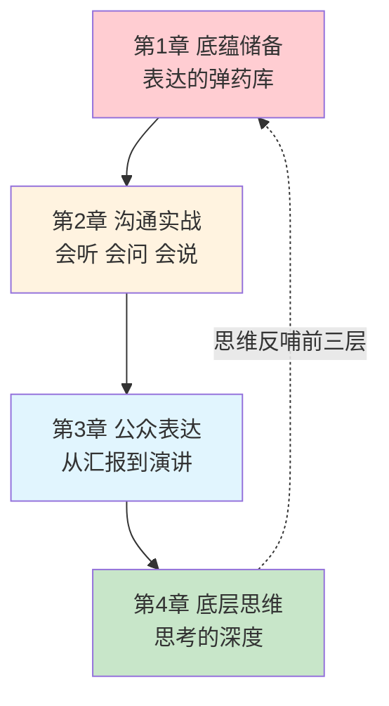

# 开篇 为什么你的能力，总是不被看见

#### 目录介绍
- [01.一个扎心的场景](#01一个扎心的场景)
- [02.问题到底出在哪](#02问题到底出在哪)
- [03.这本书解决什么问题](#03这本书解决什么问题)
- [04.为什么叫「立言」](#04为什么叫立言)
- [05.这本书该怎么用](#05这本书该怎么用)
- [06.说得清之后呢](#06说得清之后呢)

## 01.一个扎心的场景

先讲一个我至今想起来还会脸热的场景。

那是一次季度述职。我负责的稳定性专项，是我那一年干得最硬的活：线上故障率降了六成，大促零事故，还顺手沉淀了一套排查工具，团队人手一套。

轮到我上台，我说了什么呢？我照着 PPT 念了十五分钟——「这个季度我们做了 A、B、C 三件事，A 的背景是……B 的过程是……C 的数据是……」每一页都是流水账，每个数据都很扎实，但台下的人越听越低头看手机。

述职结束，评委只问了一个问题：「所以，你个人的核心贡献是什么？」

我张了张嘴，又把那三件事的流水账复述了一遍。评委笑了笑，在表上写了什么，我不知道。

结果出来，我拿了个中档。更难受的是后面——绩效沟通时，领导跟我说了句掏心窝的话：

> "活我都知道是你干的。但**你讲不出来，我没法替你讲**。评审会上十几个人，我只能按你呈现出来的样子给分。你损失的不是能力分，是呈现分。"

那天晚上我失眠了。不是委屈，是后知后觉的害怕——**原来我已经默默吃了好几年这个亏**：方案评审输给讲得好的、晋升答辩输给讲得好的、连团建时被大家记住的，都是会讲段子的人。

**活干得越好，说不清楚的时候越亏**——因为别人会默认：讲不明白，多半也没想明白。

## 02.问题到底出在哪

后来我花了很长时间琢磨这件事：为什么肚里有货，倒不出来？

「表达能力差」是最容易想到的答案，但它太笼统了。把「说不清」拆开看，其实是三层欠账：

| 欠在哪 | 具体表现 | 后果 |
|--------|---------|------|
| **底蕴不足** | 说话没细节、没例证、没新鲜感 | 讲两分钟就没词了，只能干巴巴列数据 |
| **表达无方法** | 汇报没结构、提问不会问、上台就紧张 | 内容有十分，呈现出来只剩三分 |
| **思维不成型** | 观点没有主见、思考浮于表层 | 说什么都「有点道理」，但说不透任何一件事 |

这三层是递进的，而且**顺序不能乱**：


- 只补表达、不补底蕴——成了话术高手，说三句就露馅；
- 只攒底蕴、不练表达——就是我述职那晚的样子：满仓的货，出不了港；
- 两者都有、思维不成型——说得流利，但说不到点子上，撑不起「有观点」的标签。

**「不被看见」从来不是运气问题，是这三层的结构性欠账。** 而市面上绝大多数「口才书」，只教中间那一层（还是最浅的话术部分）——这就是为什么很多人学了表达课，依然说不清自己的工作。

## 03.这本书解决什么问题

这套书一共三册，贯穿语是「**学得会，做得到，说得清**」。

本册负责最后一环——**说得清**，并借此把你的能力放大出去。

它不讲「口才速成」，而是沿着「底蕴 → 沟通 → 表达 → 思维」四个层面，把「说得清」拆成一条完整的修炼链：



| 章节 | 解决的问题 |
|------|-----------|
| 第1章 底蕴储备 | 说话没内容——语言和阅读的长期积累怎么做 |
| 第2章 沟通实战 | 一对一接不住话——理解、沟通、提问的方法 |
| 第3章 公众表达 | 一对多讲不出彩——幻灯片、演讲、技术分享 |
| 第4章 底层思维 | 说什么都浅——专注、记忆、质疑、思考、情商这七项地基 |

注意这条链的特殊设计：它不是从「敢说」开始，而是从「有货」开始，最后又落回「想得深」。**因为表达的瓶颈，十有八九不在嘴上。**

## 04.为什么叫「立言」

看到书名里「立言」两个字，你可能会觉得有点大——出自「三不朽」：立德、立功、立言。太上立德，其次立功，其次立言。

我用它命名，是取它的字面结构：

```text
立言
 ├─ 立（思想）：专注 · 记忆 · 思考 · 质疑 · 情商   → 第 4 章
 └─ 言（言说）：底蕴 · 沟通 · 提问 · 演讲         → 第 1-3 章
```

**「立」是内在的思想，「言」是外在的言说**——一个词，恰好覆盖了本册的两块内容，也道出了两者的关系：先立得住，才言得出。

这也是本册区别于市面上「话术类」表达书的地方。只教话术的书，读者学完依然说不出有内容的话——**因为没有思想支撑的表达，是空转的技巧**。而本册把一半篇幅给了「立」的那一半：怎么让自己真的有观点、有思考、有值得说出去的东西。

同时，三册也构成一个完整的递进：

```text
卷一 学习（修己）  →  卷二 成事（立功）  →  卷三 立言（传世）
     学得会                做得到                说得清
```

学了、做了，最后说出去了——能力才完成了从「拥有」到「被看见」的最后一跳。

## 05.这本书该怎么用

三条建议：

**第一遍，按目录顺序通读，重点感受「链条」。**

从底蕴到思维的四层结构，是这本书的骨架。先看清骨架，你才能定位自己的欠账在哪一层——是没货、不会说，还是想不深。**定位错了，努力就会白费**：底蕴不足的人去练话术，是拿最贵的学费买最不值的东西。

**第二遍，对着自己的「高频场景」精读。**

你每周都要做汇报？精读第 3 章的幻灯片一节加金字塔式组织。你带团队要一对一沟通？精读第 2 章。你要做技术大会分享？第 3 章的技术演讲一节就是为你写的。**用场景带动阅读，每读一节，当周就用一次。**

**第三遍，回到第 4 章，开始长期修炼。**

前三章的方法，练三个月就有明显变化；第 4 章的七项底层能力，是要陪一辈子的——专注、思考、质疑，这些不是技巧，是每天都要走的内功。这一遍没有终点，只有里程碑。

## 06.说得清之后呢

这本册子解决的是「说得清」。

到这里，整套书的三环也合龙了：**学得会，做得到，说得清**——输入、输出、放大，一个普通人的能力闭环。

但我想在最后说一句实话：这套书能给你的，是方法和框架；**能不能立得住，取决于你往里面装多少真实的东西**。你说出口的每一句有分量的话，背后都得有你读过的一本书、做过的一件事、想透的一个问题。

表达是树冠，思想和经历是根。**根越深，冠越大——这本书帮你修剪树冠，但浇水施肥，要靠你自己的人生。**

---

> 下一篇：[第1章 底蕴储备](./01.底蕴储备/01.语言底蕴的提升.md)
