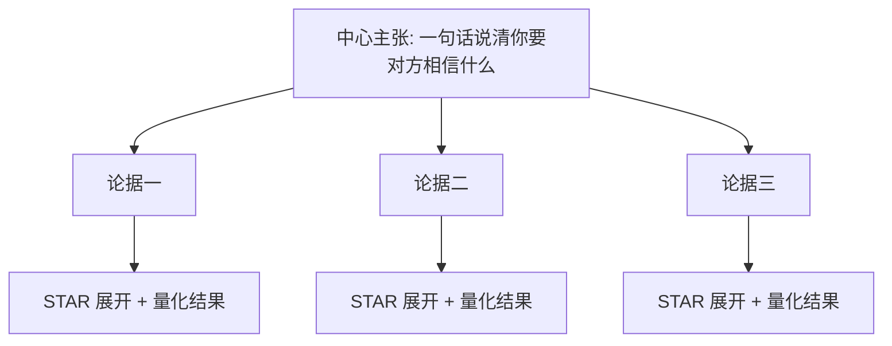
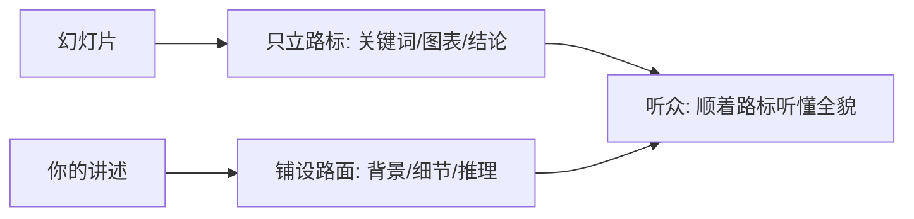
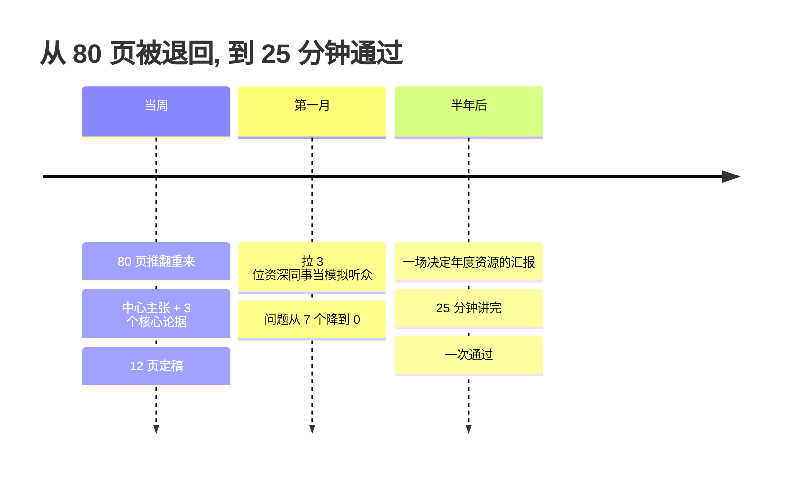
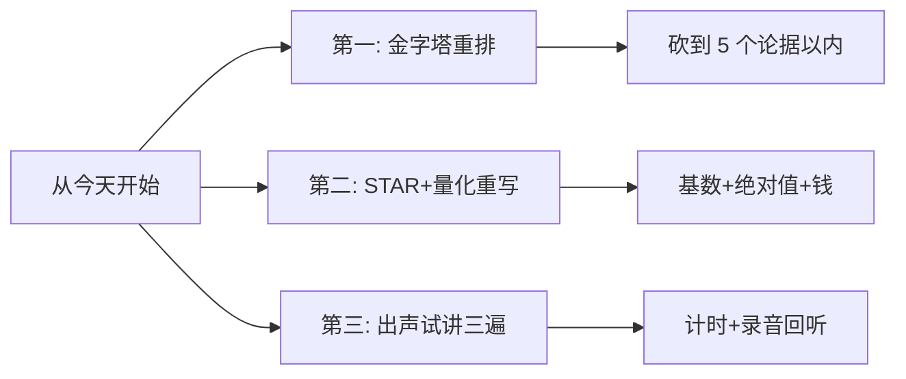

# 3.1 演示幻灯片提升
#### 目录介绍
- [01.看一个真实案例](#01看一个真实案例)
- [02.什么是好的演示](#02什么是好的演示)
- [03.演示的三大误区](#03演示的三大误区)
- [04.金字塔结构框架](#04金字塔结构框架)
- [05.幻灯片当提词器](#05幻灯片当提词器)
- [06.精选核心的论据](#06精选核心的论据)
- [07.STAR四步展开法](#07star四步展开法)
- [08.量化成果三原则](#08量化成果三原则)
- [09.演讲不做复读机](#09演讲不做复读机)
- [10.时间控制与模拟](#10时间控制与模拟)
- [11.这几个坑我踩过](#11这几个坑我踩过)
- [12.总结回顾本章节](#12总结回顾本章节)
- [13.后来发生的改变](#13后来发生的改变)
- [14.今天起改变三点](#14今天起改变三点)
- [15.课后作业思考下](#15课后作业思考下)

## 01.看一个真实案例

第一次代表团队向管理层做年度汇报，我熬了两周做了 80 页 PPT。每一页都精心配色、加动画、堆图表，自己看着特别满意。拿给主管看，他翻完后只说了一句话：**「砍到 15 页以内，每页能让我 30 秒看懂。」**

我当时整个人是懵的。那么多内容怎么砍？我做的每件事都很重要啊！为了显得全面，我把 4 个项目全列上去，每个项目再展开五六页细节。结果就是：汇报讲完，台下没有一个人记得我做了什么。

更惨的是现场。我准备了 40 分钟的内容，自我感觉良好地讲完后，老板的第一个问题是：**「刚才你讲了那么多事情，你最想让我记住哪一件？用 30 秒说清楚。」**

我又懵了。讲了 40 分钟，居然没让人记住一个重点。会后的反馈更扎心：「你讲了很多 What（做了什么），但没有讲清 Why（为什么这么做）和 So What（这件事意味着什么）。」

**那次汇报，方案被退回重做。**痛定思痛我才明白：演示不是用来证明「我很努力」的，而是用来帮对方做判断的——批准你的方案、认可你的价值、记住你的主张。这一节，就是我后来重新学习的整套演示方法论。

## 02.什么是好的演示

先定义清楚：什么算「演示」？

工作汇报、方案评审、客户提案、产品介绍、内部分享、晋升答辩——场景不同，本质相同：**演示，是在有限的时间里，让听众理解、相信并记住你的主张。**三件事缺一不可：没理解，白讲；没相信，白讲；没记住，还是白讲。

任何一次演示都由三个环节构成，环环相扣：

- **做片子**：把散落的素材组织成能支撑主张的结构——这一步决定了一半的成败。
- **讲片子**：把结构里的内容现场传递出去——纸面 100 分，讲出来 60 分，最后就是 60 分。
- **答问题**：对方的追问才是真正的考场——大部分判断，是在问答里完成的。

三个环节里，大部分人只在第一个环节努力——片子改到深夜，一次都没出声讲过，问题全靠现场即兴。**演示的失败，八成不是输在做片子，是输在后两个环节从没练过。**

动手之前，先用三问自测你最近一次演示：

| 自测三问 | 你最近一次演示 | 答「否」意味着 |
|---------|--------------|--------------|
| 听完 30 秒内，对方能说出你的核心结论吗？ | □ 能 □ 不能 | 结构没搭金字塔 |
| 每个成果都量化到「基数 + 比例 + 价值」了吗？ | □ 能 □ 不能 | 结果只是文字描述 |
| 你出声试讲过 3 遍以上吗？ | □ 有 □ 没有 | 上场大概率翻车 |

三问里有一个「否」，你的演示就是在赌运气。**片子是证据墙，不是幻灯片秀**——这一节教你把它做对。

## 03.演示的三大误区

三大误区，一张表看清：

| 误区 | 典型表现 | 台下感受 | 正确做法 |
|------|---------|---------|---------|
| 形式至上 | 大量动画和炫酷图表 | 「内容不够，形式来凑」 | 重心放回内容本身 |
| 数量至上 | 罗列所有做过的事情 | 「啥都做了，啥都不精」 | 精选 3-5 个核心论据 |
| 细节至上 | 每页密密麻麻全是字 | 密集恐惧 / 翻页飞快 | 只留关键词，细节口述 |

**形式至上**：明明一两句话能说清的事，也要做一整页区块加动画。我见过最夸张的一份汇报，光目录页就有四个飞入动画和一个旋转图标——翻每一页都要等动画播完，台下盯着特效看，内容反倒没人记得。片子的漂亮程度从来不是加分项，动画一多，反而把注意力从内容引到了特效上。

**数量至上**：以为列得越多越显得能干，干脆把做过的全部罗列上去。我那 80 页就是典型——4 个项目一个不舍得删，每个再摊开五六页，结果每一件都只分到两三页的篇幅，**任何一件都撑不起「我做得足够深」的印象**。台下无法判断哪些才是重点，只留下「这人很忙」的模糊印象——**忙，不等于有价值。**

**细节至上**：知道要少列事，又掉进另一个坑——对挑出来的几件事讲得特别细。两种表现：页数少但每页密密麻麻；或者每页内容不多但页数巨多，讲的时候翻页飞快。共同的结果都是：**你讲得很累，对方什么都没接住。**判断自己有没有细节至上，有个小标准：一页内容如果需要听众花超过 30 秒才能读完，这页就不是「演示页」，是「文档页」——文档页的正确归宿是附件，不是屏幕。

## 04.金字塔结构框架

好的演示，背后只有一个结构——金字塔：**一个中心主张，三到五个核心论据，每个论据再向下展开细节。**

为什么必须是金字塔，而不是平铺？因为**听众的注意力是从上往下递减的**：开场最专注，越往后越涣散。把最重要的主张放在最前面、把支撑分层展开，等于把最重的内容放在注意力最满的时刻——这也是表达领域常说的「结论先行」。反过来，把结论憋到最后才揭晓，是用对方最疲惫的时刻，承载你最重要的信息。

落到片子上，是通用的三段式：

| 段落 | 页数 | 讲什么 |
|------|------|--------|
| 开场 | 1-2 页 | 你是谁、今天讲什么、为什么对听众重要 |
| 主体 | 8-15 页 | 3-5 个核心论据，STAR 展开 |
| 收尾 | 2-3 页 | 总结主张 + 明确的下一步 |

三条基本要求：

- **结构清晰**：思路用金字塔，历程用时间线，系统用架构图，流程用流程图——**用对方熟悉的图形语言**。
- **重点突出**：核心内容提炼成 3-5 点，开场 1 分钟内让听众拿到今天的「地图」。
- **与讲述匹配**：你讲什么，片子就呈现什么。最忌讳嘴上讲 A、屏幕上是 B。

**开场 30 秒，决定听众愿不愿意听下去。**别用「今天我讲一下 XX 项目的情况」这类正确的废话开场，直接回答听众心里的问题：「接下来 30 分钟，我想向大家证明一件事——XX 方案值得投。」主张、时长、对听众的意义，一句话给完。

**收尾段特别提醒**：最后一定要有明确的「下一步」——需要对方做什么决定、给什么资源、什么时间点确认。**没有行动请求的演示，只是一场信息广播。**

## 05.幻灯片当提词器

很多人怕紧张忘词，干脆把要说的话全部贴在片子上。**这种做法有两大坏处**：一是满屏文字把听众逼出「密集恐惧」；二是听众十秒钟扫完文字就「看完了」，你后面讲的全成了重复，「浪费时间」的感觉油然而生。

正确的做法：**把片子当「提词器」，而不是讲话稿。**屏幕上的内容不是给你念的，是提示范围的：

- 提示自己：这一页该讲哪几个关键点；
- 提示听众：让他知道你接下来讲什么，好调动已有知识，边听边形成判断。

看同一页内容的两种做法。讲「性能优化项目的结果」——

**文档式**：整页五段文字，背景、方案、数据、对比、结论全部写上，两百多字。
**路标式**：页面中央一个大数字「3s → 0.8s」，旁边三个关键词：改动点 / 收益 / 下一步。

第一种，听众十秒读完就不听你了；第二种，你的每一句展开都是增量信息。**片子只立「路标」，语言负责铺「路面」**——这个分工想清楚，你的片子就再也不会做成密密麻麻的文档。

## 06.精选核心的论据

金字塔的第二层是论据。论据分两类：

| 类型 | 数量 | 特征 |
|------|------|------|
| 核心论据 | 3-5 项 | 和你的主张强相关、复杂度高、持续时间长 |
| 辅助论据 | 1-3 项 | 从侧面补充，锦上添花 |

**核心论据要能让人眼前一亮。**能担当核心论据的工作，往往有共同点：持续时间长、规模大、不确定性高、有挑战或创新。反过来，「响应及时、配合度高」这类日常工作，再辛苦也不适合当核心论据——**它们证明你的态度，证明不了你的主张。**

**辅助论据的价值在决胜时刻**：如果两份方案的核心论据不相上下，你多准备了辅助论据而对方没有，天平就倾向你。但要记住主次——**辅助论据是加菜，不能当主食。**

筛选的动作很简单：把所有候选写下来，逐个问一句「这是在支撑我的中心主张，还是在证明我很忙？」——后一类，全部砍掉。我那 80 页里的 4 个项目，用这一问筛完只剩 1 个半：一个真正撑得起主张，另一个降级为辅助论据；剩下两个，砍的时候肉疼，砍完之后没有任何人问起。

## 07.STAR四步展开法

核心论据选出来，怎么展开？用 STAR——最通用的成果叙事框架：

| 字母 | 含义 | 关键点 |
|------|------|--------|
| S Situation | 情境 | 1-3 条摘要，别贴项目文档 |
| T Task | 任务 | 写**你的**任务，不是整个项目的 |
| A Action | 行动 | 篇幅最重，展现你的判断和做法 |
| R Result | 结果 | 定量 + 定性，缺一不可 |

**Task 部分最容易写错**：把整个项目的任务写了上去。对方关心的从来不是「这个项目有多牛」，而是**你在其中做了什么、担了什么**。

**Result 部分最容易写虚**：「大幅提升」「显著改善」这类词，在决策者眼里等于零。怎么把结果写实？用下一节的三原则。

用一个完整例子走一遍。论据是「主导 App 启动提速」：

> **S（情境）**：App 冷启动平均 3 秒，应用商店差评里四成在骂「打开慢」，启动流失是当年用户流失的最大来源之一。
> **T（任务）**：我作为性能专项负责人，目标是半年内把冷启动压进 1 秒。
> **A（行动）**：拆解启动全链路，砍掉 17 项阻塞任务中的 11 项，6 项移到首帧之后，重写两处串行 IO。
> **R（结果）**：冷启动从 3 秒降到 0.8 秒，按日活 500 万算，启动流失率下降 1.2%，全年挽回用户约 6 万。

四段加起来不到一百五十字，半分钟讲完——但背景、角色、判断、结果全都在。**STAR 的价值就在这里：它逼你把一件事讲成「证据」，而不是「感受」。**

## 08.量化成果三原则

**原则一：先有基数，后有比例。**A 项目日活 1000 万，渗透率提升 10%；B 项目日活 10 万，渗透率也提升 10%——从台下看，A 的价值明显更大。**比例没有基数，等于没说。**

**原则二：用绝对值，慎用相对值。**「渗透率从 2% 提升到 6%」听起来翻了三倍，实际不如「从 20% 提升到 30%」。**相对值漂亮，可能只是因为之前做得太烂**——台下看得出来。

**原则三：把数值换算成钱。**收入、成本、节省的人力，都可以折算。A 项目「渗透率提升，增加广告收入 30 万」；B 项目「渗透率提升，节省服务器成本 30 万」——**「钱」是最通用的度量衡，一换算，价值立刻可比。**

三原则连起来用，一句合格的成果表述长这样：**「启动耗时从 3 秒降到 0.8 秒（绝对值），按日活 500 万算（基数），全年挽回流失用户约 X 万，对应收入约 XX 万（换算成钱）。」**

## 09.演讲不做复读机

讲的时候，做一个演讲者，不要做一台复读机。**不要照着片子念**——屏幕上的关键词只是你的提纲，你要做的是围绕它们展开：补背景、讲过程、给判断。

为什么不能念？一旦你开始照着念，眼睛就离开了听众——你读你的，他看他的，双方一起进入「等待结束」的状态。同一个关键词，念和讲是两种效果：屏幕上写着「启动耗时 3s → 0.8s」，念稿的人会说「如各位所见，启动耗时从 3 秒降到了 0.8 秒」；会讲的人会说「这 0.8 秒，是我们砍掉 11 项阻塞任务换来的」——**前者重复屏幕，后者给屏幕配上了故事。**

第二个技巧：**讲述顺序跟着屏幕布局走——从左到右、从上到下。**台下看片子就是这个顺序，你跳着讲，他就要在屏幕上来回找，理解成本立刻翻倍。

还记得开篇那次汇报的反馈吗——「你讲了很多 What，没有讲 Why 和 So What」。这三个词，值得每个做演示的人贴在屏幕边上：

- **What（做了什么）**：事实。完成了什么，数据是多少。
- **Why（为什么这么做）**：判断。为什么选这条路而不是那条，取舍的逻辑是什么。
- **So What（意味着什么）**：价值。这件事对听众意味着什么——省多少钱、避多少坑、打开什么机会。

**What 让人知道，Why 让人信服，So What 让人在乎。**只有 What 的演示是一份流水账；三个都有的演示，才是一次说服。演示的主体把 What 和 Why 讲完，原理细节和 So What 留给问答——对方问到再展开，是阐述；不等别人问就全倒出来，是絮叨。

## 10.时间控制与模拟

时间可以按有效页估算：**一页有效内容讲 1 到 3 分钟，平均控制在 2 分钟左右。**短于这个，讲完没印象；长于这个，讲完只记得「他讲了很多」。倒推一下：30 分钟的汇报，有效页控制在 15 页以内——这也解释了主管当年那句「砍到 15 页以内」。

比控制时长更重要的，是**模拟演练**，两种方式配合使用：

**方式一：自己试讲。**找一个空会议室，打开演示模式，出声讲——**默念不算数**。同时计时，超时就回头砍内容。最好录下来回听，重点听三处：口头禅（「然后」「就是说」）是不是密到刺耳？有没有哪句说了三遍还没说清？有没有哪一页，你讲的时候自己都想跳过？**自己都想跳过的那页，通常就是该删的那页。**一般自己试讲 3 遍以上，才能讲得比较流畅。

**方式二：找人模拟。**请两三位熟悉这个话题的同事当听众，完整讲一遍，请他们挑刺：哪句话没听懂、哪个论据不硬、哪里数据太虚。**一次高质量的模拟，比自己闷头试讲 10 遍更值钱。**

## 11.这几个坑我踩过

| 常见误区 | 具体表现 | 正确做法 |
|---------|---------|---------|
| 页数越多越好 | 80 页塞满内容 | 12 页够用，「30 秒看懂」是唯一标准 |
| 动画特效炫技 | 每页 3-5 个动画 | 全部关掉，动画只会分散注意力 |
| 只讲 What 不讲 Why | 罗列做了什么 | 每件事补一句「为什么这么做」 |
| 数据只有比例 | 「提升了 30%」 | 补基数、绝对值，最好换算成钱 |
| 不试讲直接上 | 「反正内容我很熟」 | 出声试讲 3 遍 + 模拟听众 1 次 |
| 讲的和片子不同步 | 嘴上讲 A、屏幕是 B | 严格按从左到右、从上到下讲 |

其中最坑的是「页数越多越好」和「不试讲直接上」：**前者让对方什么都没记住，后者让你当场翻车。这两条不改，其他技巧全白搭。**

## 12.总结回顾本章节

**片子不是讲话稿，是提词器；不是炫技场，是证据墙。**用金字塔结构立骨架，用 STAR 展开论据，用量化三原则写实结果，用模拟演练保证临场。

三条最关键的实操：

- **结构**：1 个中心主张 + 3-5 个核心论据，每个论据用 STAR 展开
- **量化**：基数、绝对值、「钱」三大原则，把成果讲到可比
- **练习**：出声试讲 3 遍以上 + 至少 1 次模拟演练

## 13.后来发生的改变

我把那 80 页全部推翻重来。先在白纸上写下中心主张，然后只挑 3 个最能支撑它的核心论据，每个用 STAR 重写。**12 页，干干净净。**写完我才发现：砍掉的不是内容，是「证明我很努力」的执念——留下来的每一页，都在为那一句中心主张服务。

我拉了 3 位资深同事当模拟听众。第一次，他们挑出 7 个问题：哪句话没听懂、哪个论据不够硬、哪里数据太虚。改完再讲，第二次剩 3 个。第三次讲完，他们说：「**听懂了，也信了。**」

半年后一场决定年度资源分配的汇报，我只用 25 分钟。现场的提问全部落在准备过的范围内，最后的结论是「思路清晰、证据扎实、量化到位」——**方案一次通过**。

现在轮到我帮组员改汇报片子，第一句话总是那句当年砸倒我的话：**「砍到 15 页以内，每页能让我 30 秒看懂。」**这句话，从当年打倒我的钉子，变成了我今天钉给别人的定海神针。

## 14.今天起改变三点

**第一，用金字塔重排你手头的片子。**先找出中心主张——如果 30 秒说不清，说明主张本身还没想清楚；再检查论据数量，**列了 10 件事以上的，果断砍到 5 件以内。**

**第二，用 STAR + 量化重写核心论据。**每个论据补齐情境、任务、行动、结果四段；Result 部分套用三原则——有基数、有绝对值、尽量换算成钱。

**第三，出声试讲 3 遍。**找一个空房间，打开演示模式，出声、计时、录下来回听，挑出问题再改。**重复 3 遍以上，直到能在规定时间内流畅讲完。**

## 15.课后作业思考下

1. **三误区自查**：翻出你最近一次的演示片子，对照「形式至上 / 数量至上 / 细节至上」逐条检查——中了几条？给每一条定一个具体的改进动作。

2. **30 秒电梯测试**：把那次演示的核心主张写下来，控制在 30 秒内能说完。说不清，说明金字塔的塔尖还没立起来。

3. **STAR 重写练习**：选你最重要的一项成果，用 STAR 完整描述一遍，重点检查 Result 是否做到「基数 + 绝对值 + 换算成钱」。

4. **金字塔画大纲**：下一次做演示之前，先别打开软件——在纸上画金字塔（中心主张 → 核心论据 → 支撑细节），画完再动手做片子。

---

> **📎 下一站** ｜ 片子只解决 40% 的问题，剩下 60% 全靠人——哪怕片子完美，一个不会讲的人也能把它讲砸；反过来，一个会讲的人能把普通的片子讲出彩。下一节《公众演讲的提升》，解决站上讲台的那 60%。
