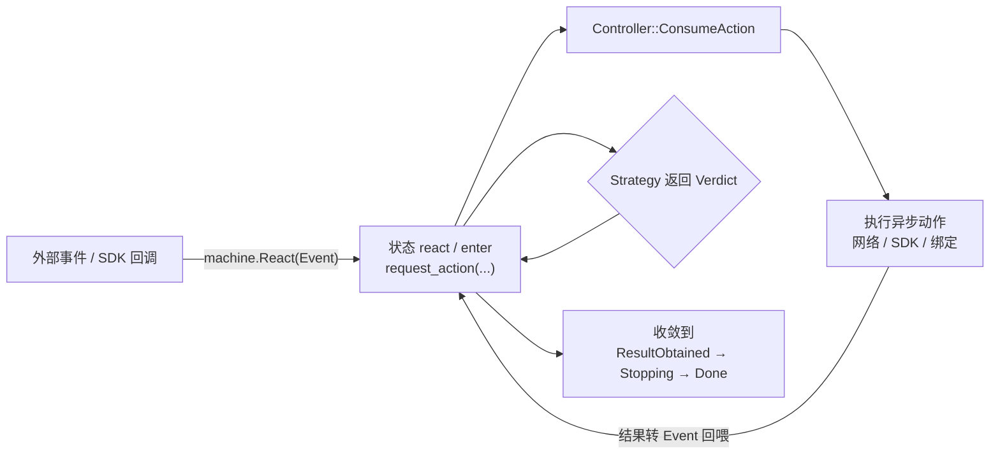
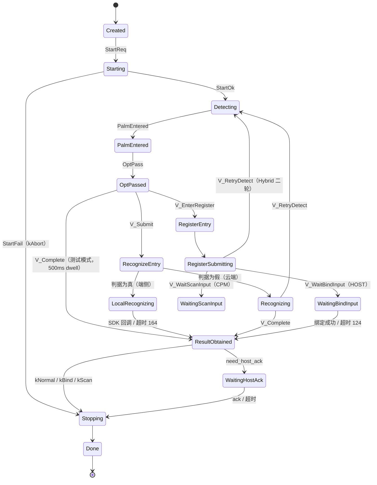
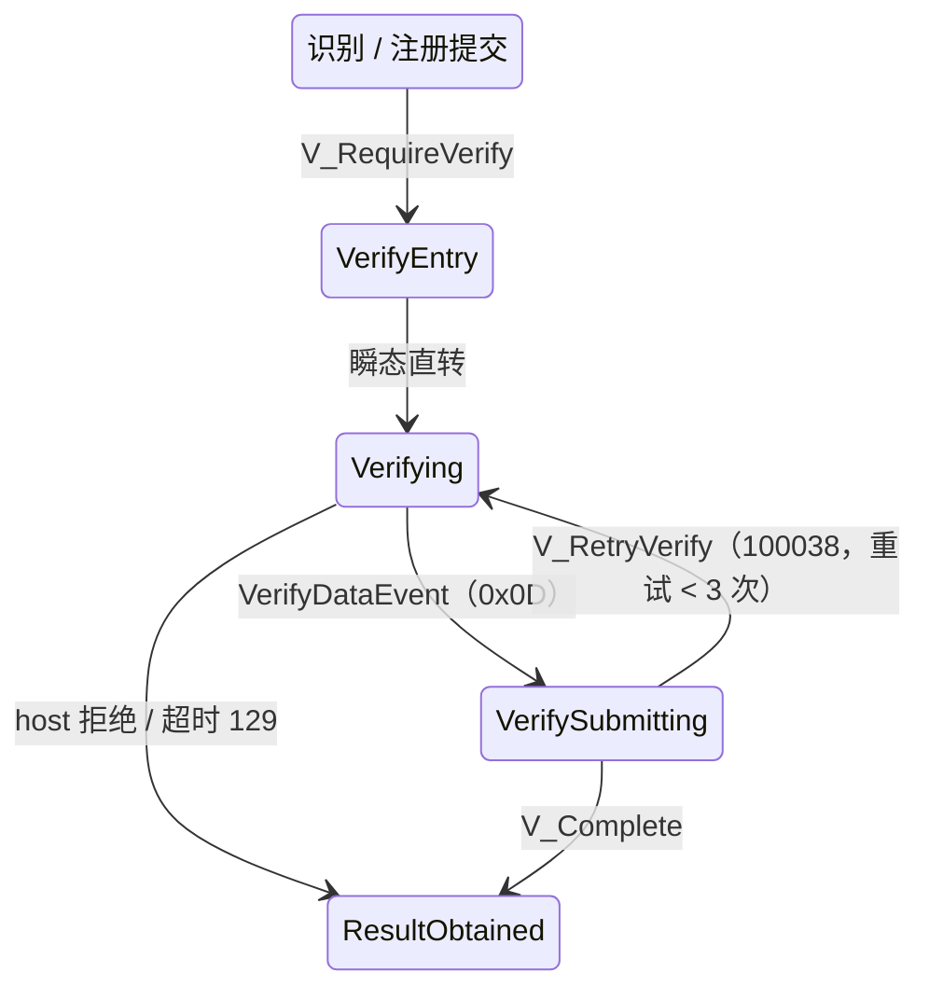
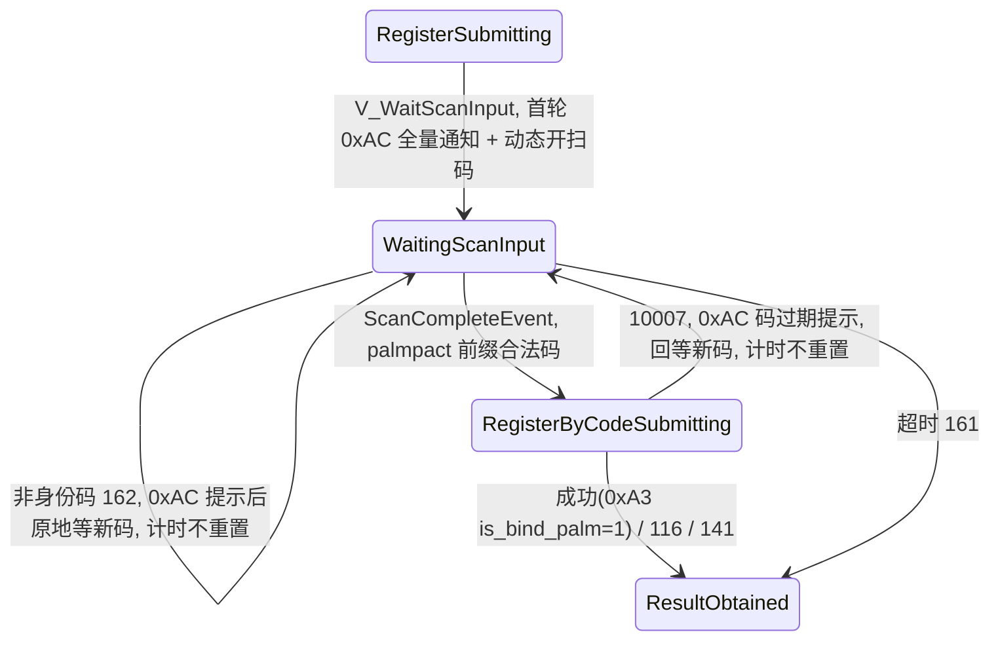

# 状态机方案设计说明

> 范围:只描述 `kPalmRunning` / `kDebugTesting` 期间的业务状态机(PalmFlowMachine),聚焦状态、Strategy、Action 三个核心因素。

## 设计目标

一轮刷掌会话的路径非常多:检测到掌后要走识别、注册、加验,识别还分端侧/云端,注册又分上位机回执和反扫码,模式有识别/注册/反扫码/混合四种。这些"下一步走哪条路"的判断如果写死在调度回调里,每加一种模式就要改一遍流程代码,分支嵌套不可维护。

PalmFlowMachine 把会话建模为状态机,并用 **Strategy** 把"选择分支"(按模式决策)与 **Action** 把"异步执行"(HTTP/SDK 调用)分离:新增模式只需新增一个 Strategy 子类,状态流转骨架不变。

## 架构角色

| 角色 | 职责 |
| --- | --- |
| `PalmSessionController` | 会话总调度器:启动/停止会话、喂事件、消费 Action |
| `PalmFlowMachine` | HFSM2 状态机封装:持有状态、事件、Action 队列、timer、FlowContext |
| Strategy | 模式策略层:输出 Verdict 决定走哪条状态分支 |

职责边界:

| 元素 | 规则 |
| --- | --- |
| State | 只负责编排(切状态、入队 Action),不做重 IO |
| Strategy | 只做同步决策,输出 Verdict,无副作用 |
| Verdict | 策略的决策结果,决定下一步走哪条状态分支 |
| Action | 真正执行异步动作,统一在 `Controller::ConsumeAction` 落地 |
| Event | 状态推进的输入,统一经 `machine.React(...)` 注入 |

## 运行闭环

## 状态结构

| 状态 | 所属 | 说明 |
| --- | --- | --- |
| `Created` | Root | 会话已创建,未启动 |
| `Starting` | Root | SDK 初始化、启停检测/扫码(`kRunOnStart`),成功 `StartOk` 进检测,失败 `StartFail` 进 Stopping |
| `Detecting` | RunningHead | 掌纹检测中,等待上掌 |
| `PalmEntered` | RunningHead | 已上掌 |
| `OptPassed` | RunningHead | 光学判定通过,入队 `kDecidePostOpt` 做模式决策 |
| `RecognizeEntry` | RecognizingHead | 瞬态入口:enter 空,update 按 `ShouldUseLocalIdentify` 分派端侧/云端 |
| `LocalRecognizing` | RecognizingHead | 端侧本地比对:广播 + 3s timer,等 SDK 回调,无 HTTP |
| `Recognizing` | RecognizingHead | 云端识别:入队 `kRecRequest` 发 `/recognize` |
| `RegisterEntry` | RegisteringHead | 注册入口(瞬态) |
| `RegisterSubmitting` | RegisteringHead | 注册探测提交 |
| `WaitingBindInput` | RegisteringHead | 未注册录掌等待:等上位机 BindPalm,失败原地重试,超时 124 收敛 |
| `WaitingScanInput` | RegisteringHead | 反扫码等待:动态开扫码等身份码,窗口计时 `bind_input_timeout` |
| `RegisterByCodeSubmitting` | RegisteringHead | 身份码注册提交:发 `/register-palm` |
| `VerifyEntry` | VerifyingHead | 加验瞬态入口 |
| `Verifying` | VerifyingHead | 等上位机 0x0D 加验数据,进入即发 0xAB 通知 |
| `VerifySubmitting` | VerifyingHead | 发 `/verify-palm` 加验请求 |
| `ResultObtained` | BizProcessHead | 统一结果出口:按 `completion_source` 上报后转 Stopping 或 WaitingHostAck |
| `WaitingHostAck` | BizProcessHead | HOST_ACK 等待,ack/超时后进 Stopping |
| `Stopping` / `Done` | Root | 停检测/扫码收尾;Done 表示一轮结束 |

### 主流程

- StopReq(kAbort) 从 RunningHead 任意子状态直接进 Stopping,不经 ResultObtained。
- 测试模式路径(`OptPassed → V_Complete`)同时服务两个场景:离线优选配置、debug 页刷掌检测——二者在 `ConsumeAction(kDecidePostOpt)` 内直接返回 `V_Complete`,跳过识别请求;过程含 500ms 可视 dwell。
- debug 扫码检测(is_scan_only)不进检测链:`Starting` 后不启动掌纹检测,走不到 `Detecting` / `OptPassed`。
- `WaitingBindInput` 失败重试期间 PendingEnrollData 保留(Controller 非破坏性读取,仅绑定成功或 Stopping 兜底时清除),上位机重试 BindPalm 时录掌数据仍可用。

### 加验子树

### 反扫码子树(CPM)

反扫码要点:

- `WaitingScanInput` 与 `WaitingBindInput` 平级互斥,按 `hybrid_enroll_method` 二选一;HOST 注册路径仍走 `WaitingBindInput`。
- 重试通知复用 0xAC(error_code 标识具体原因),不收敛;收敛只走 0xA3(掌库上限 116 / 服务端异常 141 / 超时 161)。
- 重入 `WaitingScanInput`(如码过期返回)**不重发**首轮全量 0xAC,避免冲掉失败提示浮层。
- 会话中途动态开扫码:`kStartScanInput` 复用 `StartCodeScan` 引用计数,每次扫码动作完成后 Stop,重新等待时再 Start。
- 成功回执走统一 Bind 结构(`kBindFinished` → 0xA3 `is_bind_palm=1`),与上位机 BindPalm 成功共用。

## Strategy(模式决策器)

Strategy 只做同步决策,按 `PalmModeByte` 由工厂选择策略:`0x01` Recognition / `0x02` HostEnrollment / `0x03` Hybrid / `0x05` CpmEnrollment。

### 模式命名映射

命名原则:对外契约(云端属性、wire 值、proto 值、SDK 枚举)不可变更只可新增;模组内部命名按语义统一——上位机注册 = HostEnrollment,反扫码注册 = CpmEnrollment。

| 层(载体) | 识别 | 上位机注册 | 反扫码注册 | 混合 |
|---|---|---|---|---|
| 云端属性字符串(`mode_after_palm_wake` 等) | `"RECOGNITION"` | `"HOST_ENROLLMENT"` | `"ENROLLMENT"` | `"HYBRID"` |
| 配置枚举 `PalmMode`(palm_behavior.h) | `kRecognition(2)` | `kHostEnrollment(0)` | `kCpmEnrollment(1)` | `kHybrid(3)` |
| wire 值 `kPalmMode*`(session.h,0x04/0x0E 回显) | `0x01` | `0x02` | `0x02`(共用) | `0x03` |
| 会话字节 `PalmModeByte`(session_profile.h) | `0x01` | `0x02` | `0x05` | `0x03`(kPalmTest=0x04) |
| 流程策略 | `RecognitionFlowStrategy` | `HostEnrollmentFlowStrategy` | `CpmEnrollmentFlowStrategy` | `HybridFlowStrategy` |
| 服务端 `recognize_mode`(palm_recognize.proto) | `RECOGNITION=2` | `ENROLLMENT_HOST=4` | `ENROLLMENT_CPM=1` | `HYBRID=3` |
| 上报 attr mode(recognition_metrics_reporter.h) | `"recognition"` | `"enrollment_host"` | `"enrollment_cpm"` | `"hybrid"` |
| SDK 枚举 `PalmMode.java`(对外,勿改) | `RECOGNITION(2)` | `HOST_ENROLLMENT(0)` | `ENROLLMENT(1)` | `HYBRID(3)` |

⚠️ wire `0x02` 为上位机注册与反扫码共用的回显值(协议兼容约束,不可拆分)。两套数值域勿混用:配置 JSON 数值 0~3 用 `PalmMode.fromByte`,StartPalm 回显 0x01~0x03 用 `PalmMode.fromWireByte`。

### 关键 Verdict

| Verdict | 去向 |
|---|---|
| `V_Submit` | RecognizeEntry(瞬态,按判据分派端侧/云端) |
| `V_EnterRegister` | RegisterEntry |
| `V_RequireVerify` | VerifyEntry(需要加验) |
| `V_RetryVerify` | 回 Verifying 重试 |
| `V_RetryDetect{switch_sdk_to_register}` | 回 Detecting(Hybrid 常见) |
| `V_WaitBindInput` | WaitingBindInput(未注册录掌等待,HOST) |
| `V_WaitScanInput` | WaitingScanInput(未注册反扫码等待,CPM) |
| `V_Complete{exit_code,...}` | ResultObtained 收敛 |

### 端侧 / 云端分派

`V_Submit` 后进入瞬态 `RecognizeEntry`,其 update 按 `ShouldUseLocalIdentify(ctx)` 二选一:特征同步已开(`IsFeatureSyncEnabled()`)**且** work_mode 为 `kIdentify` → 端侧 `LocalRecognizing`;任一不满足 → 云端 `Recognizing`。

⚠️ 仅核身(`kIdentify`)走端侧:支付、注册、Hybrid 注册轮等恒走云端(避免 SDK 产生无消费者的本地结果)。配置为端侧但特征同步未开启时同样回落云端。

### 各模式差异

| 模式 | 路径 |
|---|---|
| Recognition | `V_Submit` → 分派端侧/云端;`DecidePostRec` 可出 `V_RequireVerify / V_RetryVerify / V_Complete`(端侧命中直接 `V_Complete`) |
| HostEnrollment | `V_EnterRegister` → 注册后可 `V_WaitBindInput / V_RequireVerify / V_Complete` |
| CpmEnrollment | 同 HOST 进注册链;探测未注册后 `V_WaitScanInput` → `/register-palm` |
| Hybrid | 首轮 `V_Submit`;命中未注册(100025)→ `V_RetryDetect{switch_sdk_to_register}` 二轮进注册链;二轮探测维持 `recognize_mode=HYBRID(3)`,未注册去向按 `hybrid_enroll_method` 分叉 CPM/HOST |

## Action(异步执行单元)

状态只入队 Action,执行在 `PalmSessionController::ConsumeAction`:

| Action | 触发状态 | 执行内容 |
|---|---|---|
| `kRunOnStart` | `Starting.enter` | 等 SDK 初始化、按 scan 模式启停检测/扫码,回喂 `StartOkEvent` |
| `kRunOnStop` | `Stopping.enter` | 停检测/扫码、断开 SDK 信号,回喂 `StopOkEvent` |
| `kRecRequest` | `Recognizing.enter` / `Verifying.enter` / `VerifySubmitting.enter` | 发 `/recognize` 或 `/verify-palm`,回喂 `RecResponseEvent` |
| `kRegisterRequest` | `RegisterSubmitting.enter` | 发注册请求,回喂 `RegisterResponseEvent` |
| `kDecidePostOpt` / `kDecidePostRec` / `kDecidePostRegister` | 对应决策点 | 调 Strategy,回喂 Verdict 事件 |
| `kSwitchSdkToRegister` | `DispatchPostRec(V_RetryDetect)` | Hybrid 切 SDK 到 register 模式并通知上位机 |
| `kProcessBindPalm` | `WaitingBindInput.react` | 调 BindPalmFlow,回喂 `BindPalmResultEvent` |
| `kStartScanInput` | `WaitingScanInput.enter` | 会话中途动态开扫码 |
| `kRegisterByCodeRequest` | `RegisterByCodeSubmitting.enter` | 校验 `palmpact://` 前缀后发 `/register-palm`,回喂 `RegisterByCodeResultEvent` |
| (无 Action) | `LocalRecognizing.enter` | ⚠️ 端侧识别不入队 Action:广播 `kLocalRecognizing` + 3s timer,等 SDK `LocalIdentifyResultEvent` 回喂(超时 164),无 HTTP |

`kDebugTesting`(debug 页刷掌/扫码检测)与 `kPalmRunning` 共用本状态机和驱动循环(`ScheduleLoop` 双态等待);debug 请求判据用 0x0E wire 原始字段(`is_debug_test`),不读解析后的离线优选配置,两者不会混淆。

## FlowContext(会话内存)

| 字段 | 用途 |
|---|---|
| `profile` | 超时、重试、result_dwell 等会话参数快照 |
| `last_rec_resp` / `last_register_resp` | Strategy 决策输入 |
| `recognition_attempted` | Hybrid 首轮/二轮切换标记 |
| `verify_id / verify_method / verify_retry_count / verify_data` | 加验链路上下文 |
| `scan_code` | 最近一次扫码内容(反扫码与 scan_mode 共用) |
| `last_local_identify_result` | 端侧识别 SDK 回调结果(`LocalRecognizing` 的输入) |
| `completion_source` | `kNormal / kAbort / kScanFinished / kBindFinished`,决定 ResultObtained 如何上报 |

## 典型例子

### 例 1:识别成功

`OptPassed` 入队 `kDecidePostOpt`,Strategy 给 `V_Submit`;`RecognizeEntry.update` 按判据分派——端侧:等 SDK `LocalIdentifyResultEvent`,命中直接 `V_Complete`(无 HTTP,实测 155~200ms),未命中/超时按 164 收敛;云端:`kRecRequest` 发 `/recognize`,成功后 `kDecidePostRec` 给 `V_Complete`。最终 `ResultObtained → Stopping → Done`。

### 例 2:需要加验

`DecidePostRec` 返回 `V_RequireVerify` 进入 `Verifying`;收到 0x0D 数据后 `VerifySubmitting` 发 `/verify-palm`,可重试码(100038)走 `V_RetryVerify` 回 `Verifying`(上限 3 次),否则 `V_Complete` 收敛。

### 例 3:Hybrid 未注册转注册

首轮识别命中 100025(未注册),`DecidePostRec` 返回 `V_RetryDetect{switch_sdk_to_register}`,`kSwitchSdkToRegister` 切 SDK 模式后回 `Detecting`;二轮 `V_EnterRegister` 进注册链。

### 例 4:未注册录掌等待(HOST)

`V_WaitBindInput` 进入 `WaitingBindInput`;上位机 `BindPalmRequest` 触发 `kProcessBindPalm`,成功收敛 `ResultObtained`,失败留在本态等待重试(不限次,PendingEnrollData 保留),超时按 124 收敛。

### 例 5:反扫码录掌(CPM)

见「反扫码子树」:扫到合法码 → `/register-palm`;非身份码/码过期经 0xAC 提示原地重试(计时不停);成功走统一 Bind 回执,116/141/161 收敛结束。

## 代码锚点

| 内容 | 位置 |
|---|---|
| 状态/事件/Verdict 枚举 | `src/biz/comm/palm_flow/flow_events.h`(`FlowState` / 各 `*Event`) |
| Action 定义 | `src/biz/comm/palm_flow/flow_actions.h`(`FlowAction`) |
| 状态层级(HFSM2 树) | `src/biz/comm/palm_flow/palm_flow_fsm_def.h` |
| 状态行为实现 / 端侧分派判据 | `src/biz/comm/palm_flow/palm_flow_states.cpp`(`ShouldUseLocalIdentify` / 各 `*State::enter/react`) |
| Strategy 接口与各模式实现 | `src/biz/comm/palm_flow/palm_flow_strategy.h` / `palm_flow_strategy.cpp` |
| Action 执行入口 | `src/biz/comm/palm_session/palm_session_controller.cpp`(`ConsumeAction` / `ScheduleLoop`) |
| FlowState → SessionState 映射 | `src/biz/comm/palm_session/palm_session_controller.cpp`(`MapFlowStateToSessionState`) |
